# Lab0: Linux Crash Course (prepared for 2025)

!!! tip "为了让同学们习惯阅读英文文档，本次实验将全程使用英文。"

!!! tip

    本次实验大部分内容都不需要写入实验报告，答案直接附在问题后面。本次实验你只需要提供几张截图：

    - Task1.1: hash result
    - Task2.1: `nano` screenshot
    - Task3.2: SSH connection screenshot
    - Task4.2: SSH connection screenshot

## Tasks

!!! tip "You can skip this lab."

    If you are familiar with these topics, go to [Lab1](../Lab1-MiniCluster/index.md).

- Obtain a Linux Virtual Machine
    - Install a hypervisor on your computer
    - Create a new virtual machine in the hypervisor
    - Install a Linux distribution in the virtual machine
- Linux Basics
    - Command Line Interface (CLI)
    - Linux File System
    - Package Management
- Remote Access
    - Network Basics
    - SSH
- More on Linux
    - Users and Permissions
    - Environment Variables
- Git
    - Register a ZJU Git account
    - Configure Public Key
    - Clone a Repository

## Before You Start

- Read this [presentation](https://slides.tonycrane.cc/PracticalSkillsTutorial/2023-fall-ckc/lec1/) or watch this [video](https://www.bilibili.com/video/BV1ry4y1A7qo/).
- Make sure you can access GitHub, Google and Stack Overflow.

## Obtain a Linux Virtual Machine

### OS and Kernel

<figure markdown="span">
  <center>{ width=80% }</center>
  <figcaption>Computer Architecture</figcaption>
</figure>

An operating system (OS) is system software that manages computer hardware, software resources, and provides common services for computer programs. The operating system is a vital component of the system software in a computer system.

A kernel is a computer program that is the core of a computer's operating system, with complete control over everything in the system. It is the "lowest" level of the OS.

### Linux

Linux is a family of open-source Unix-like operating systems based on the Linux kernel, an operating system kernel first released on September 17, 1991, by Linus Torvalds. Linux is typically packaged in a Linux distribution.

Linux is a popular choice for developers and system administrators due to its flexibility and open-source nature. Linux is also widely used in the HPC field due to its high performance and scalability.

### Linux distributions

There are many Linux distributions available, each with its own strengths and weaknesses. Here are some popular choices:

- **Ubuntu**: A popular choice for beginners due to its ease of use and large community support.
- **Debian**: Known for its stability and security.
- **Fedora**: A community-driven Linux distribution sponsored by Red Hat.
- **Arch Linux**: A lightweight and flexible Linux distribution that follows the "rolling release" model.

In HPC and cloud computing, Debian is a popular choice due to its stability and security. We recommend using Debian for this course.

!!! question "Task 1.1: Download and verify the latest **textonly** version of Debian ISO image from [ZJU Mirrors](https://mirrors.zju.edu.cn/debian-cd/)"

    === "Step 1"

        Follow the link to the Debian CD image download page: [ZJU Mirrors](https://mirrors.zju.edu.cn/debian-cd/).

        ```text
        Index of /debian-cd/
        ../
        12.5.0/                                            19-Feb-2024 18:01                   -
        12.5.0-live/                                       10-Feb-2024 20:12                   -
        current/                                           19-Feb-2024 18:01                   -
        current-live/                                      10-Feb-2024 20:12                   -
        project/                                           23-May-2005 16:50                   -
        ls-lR.gz                                           28-May-2024 17:12               13276
        ```

        We need you to download the **textonly** version. Don't know how to find correct download link from the above webpage? Read this guide: [Your guide to Debian iso downloads - GitHub](https://github.com/slowpeek/debian-iso-guide).

    === "Step 2"


        !!! warning "For MacBook users with M series processors"

            You need to download the `arm64` version of Debian.

        The download link should look like this: [https://mirrors.zju.edu.cn/debian-cd/current/amd64/iso-cd/debian-12.5.0-amd64-netinst.iso](https://mirrors.zju.edu.cn/debian-cd/current/amd64/iso-cd/debian-12.5.0-amd64-netinst.iso).

        - What is the difference between `debian-12.5.0-amd64-netinst.iso` and the `debian-12.5.0-amd64-DVD-1.iso`?
        - What is the difference between the `amd64` and `arm64` versions?

        ??? success "Check your answer"

            - The `netinst` version is a small ISO image that contains only the necessary files to start the installation. The `DVD-1` version is a large ISO image that contains desktop environments, applications, and other software.
            - `amd64` is the 64-bit version for x86-64 processors, while `arm64` is the 64-bit version for ARM processors. For example, Windows laptops usually use x86-64 processors, while latest MacBooks use ARM processors.

    === "Step 3"

        Verify the integrity of the downloaded ISO image. You can use:

        - `sha256sum` on Linux: `sha256sum debian-12.5.0-amd64-netinst.iso`
        - `certutil` on Windows: `certutil -hashfile debian-12.5.0-amd64-netinst.iso SHA256`
        - `shasum` on macOS: `shasum -a 256 debian-12.5.0-amd64-netinst.iso`

        Show the result of your verification.

### Virtual Machine

A virtual machine (VM) is a software-based emulation of a computer. By running a VM on your computer, you can run multiple operating systems on the same hardware. This is useful for testing software, running legacy applications, and learning new operating systems.

<figure markdown="span">
  <center>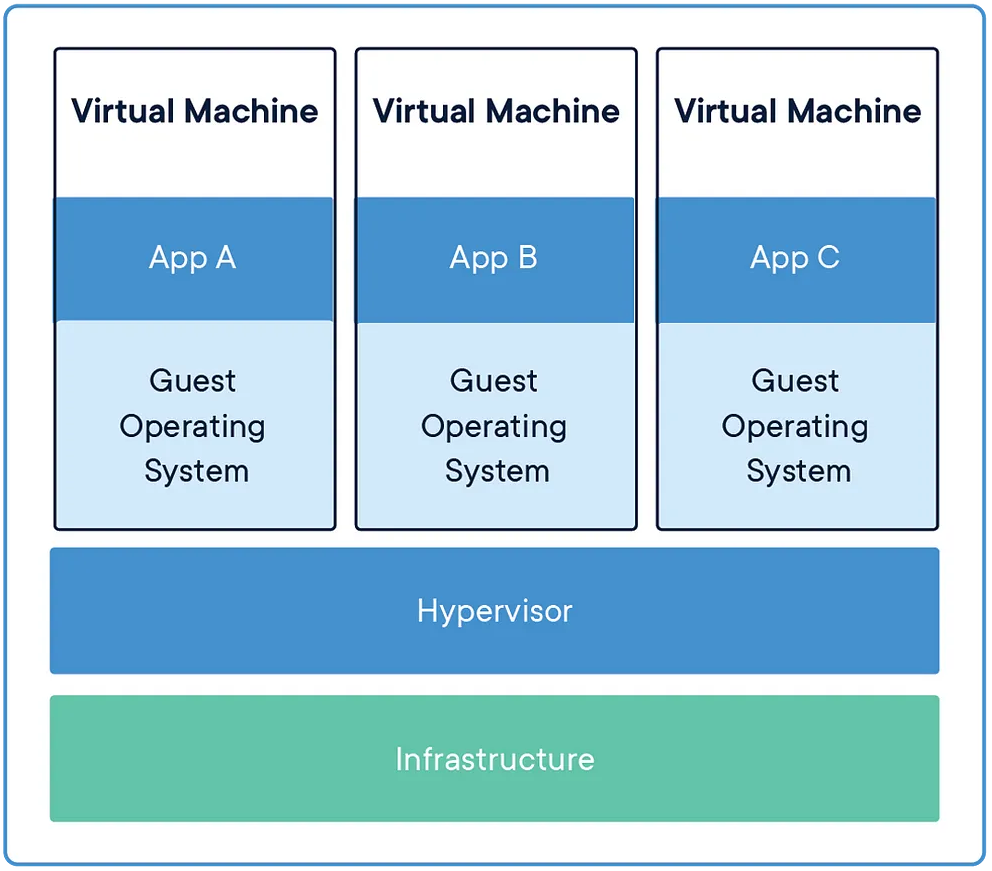{ width=80% align=center }</center>
  <figcaption>Virtual Machines</figcaption>
</figure>

Hypervisors are software that creates and runs virtual machines.

??? info "Two types of hypervisors"

    - **Type 1 hypervisor**: Runs directly on the host's hardware to control the hardware and to manage guest operating systems. Examples include VMware ESXi, Microsoft Hyper-V, and Xen.
    - **Type 2 hypervisor**: Runs on a conventional operating system just like other computer programs. Examples include VMware Workstation, Oracle VirtualBox, and Parallels Desktop.

    Usually, we use Type 2 hypervisors for personal use. There are many Type 2 hypervisors available, such as VMware Workstation, Oracle VirtualBox, and Parallels Desktop.

You can choose whatever hypervisor you like. In this course, we recommend using [VMware Workstation Pro](https://www.vmware.com/products/desktop-hypervisor.html) on Windows and Linux, or [VMware Fusion](https://www.vmware.com/products/fusion.html) on macOS. They are free for personal use since [May 13, 2024](https://blogs.vmware.com/workstation/2024/05/vmware-workstation-pro-now-available-free-for-personal-use.html)

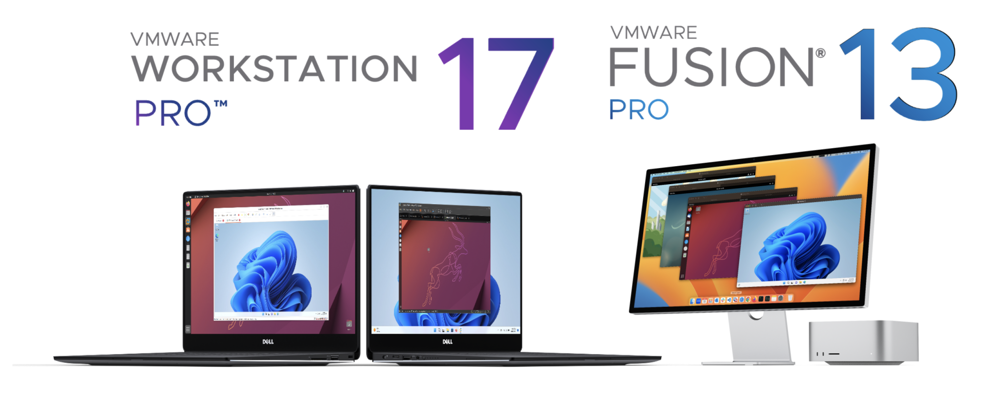

!!! question "Task 1.2: Download and install VMware Hypervisor"

    Watch this video to learn how to download and install VMware Workstation Pro: [VMware Workstation Pro is Now FREE (How to get it) - Youtube](https://www.youtube.com/watch?v=66qMLGCGP5s)

    - [VMware Workstation Pro](https://support.broadcom.com/group/ecx/productdownloads?subfamily=VMware%20Workstation%20Pro)
    - [VMware Fusion](https://support.broadcom.com/group/ecx/productdownloads?subfamily=VMware%20Fusion)

    （下载时的信息如地址等随便填就好，下载这些大公司的软件都是这么麻烦的😵）

!!! question "Task 1.3: Create a new virtual machine and install Debian"

    Here we use VMware Workstation Pro for demonstration.

    !!! warning "Please read the installation instructions carefully."

        If the following instructions don't mention a specific step, leave it as default.

    === "Step 1"

        Select the downloaded Debian ISO image as the installation media. Create a new virtual machine.

        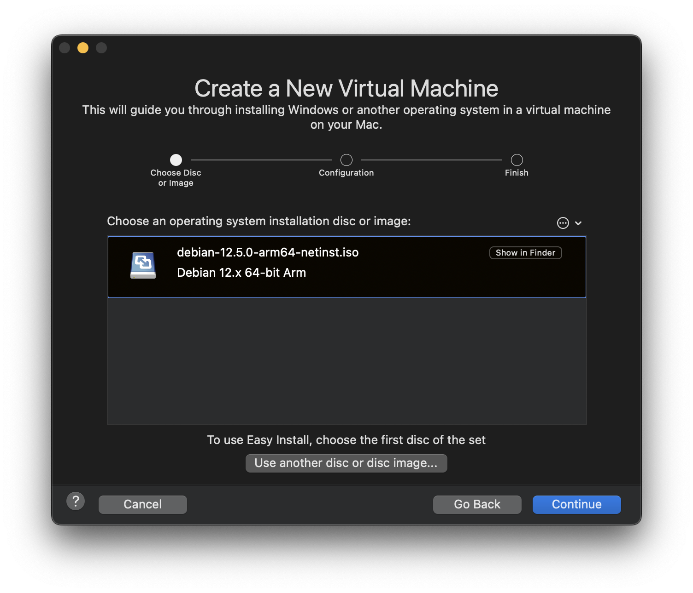

        Here is my configuration:

        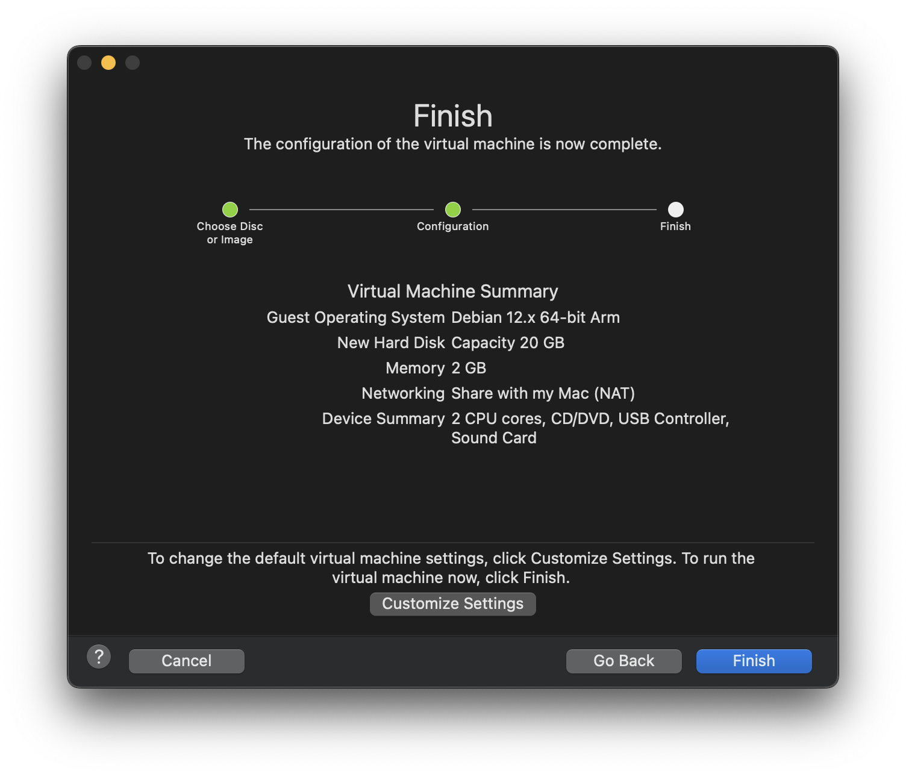

    === "Step 2"

        Run the virtual machine and install Debian.

        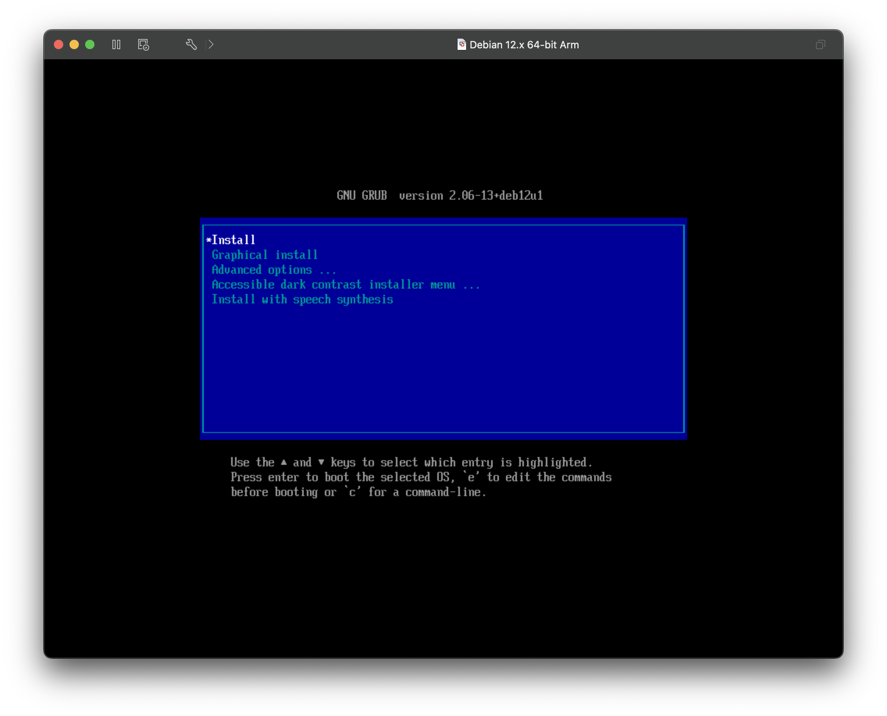

        Please select the **Install** option and choose English as the language.

        
    
    === "Step 3"

        You can change hostname, domain name, etc. as you like.

        Don't set a root password. Read the text on the screen carefully.

        > If you leave this empty, the root account will be disabled and the system's initial user will be given the power to become root using the `sudo` command.

        So, if you set a root password, you will need to add yourself to the `sudo` group later manually.

        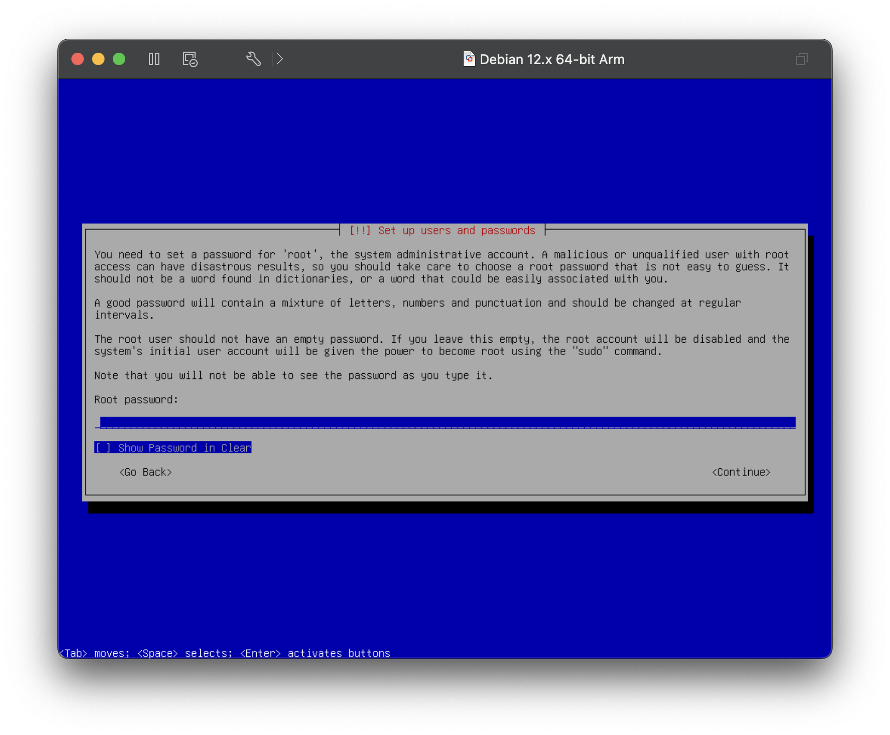

        Then set up your user account. Use the entire disk for the installation.

        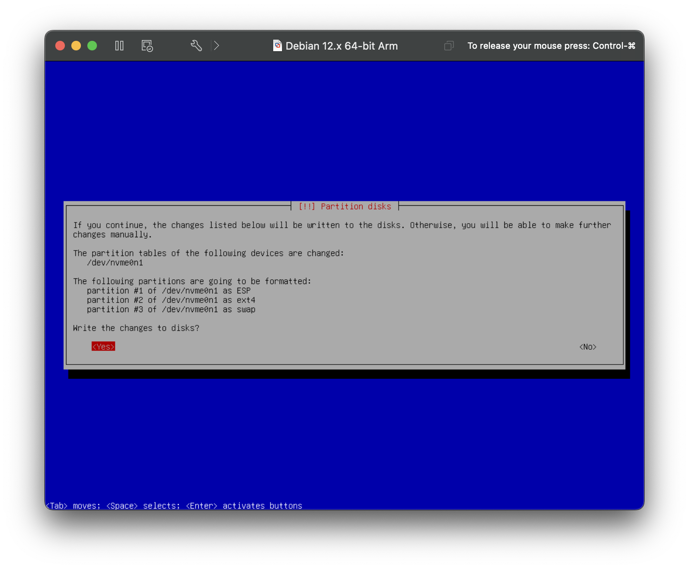

    === "Step 4"

        COnfigure the package manager. Choose `enter information manually` and set the mirror to `mirrors.zju.edu.cn`.

        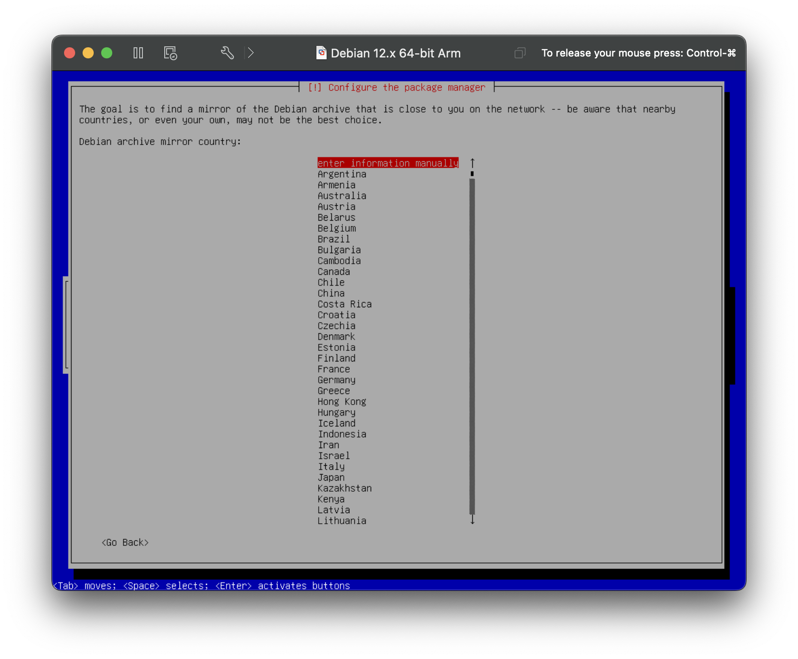

        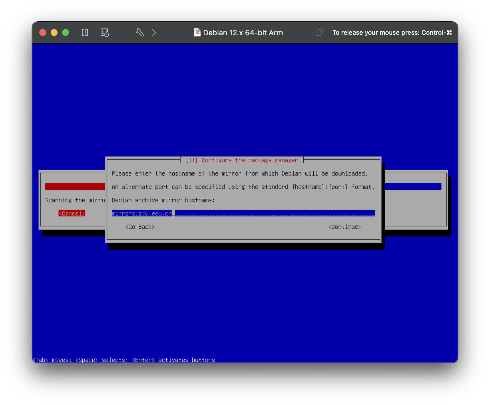

    === "Step 5"

        Installation finished. Usually you don't need to remove the installation media manually because the virtual machine will try to boot from the disk first.

        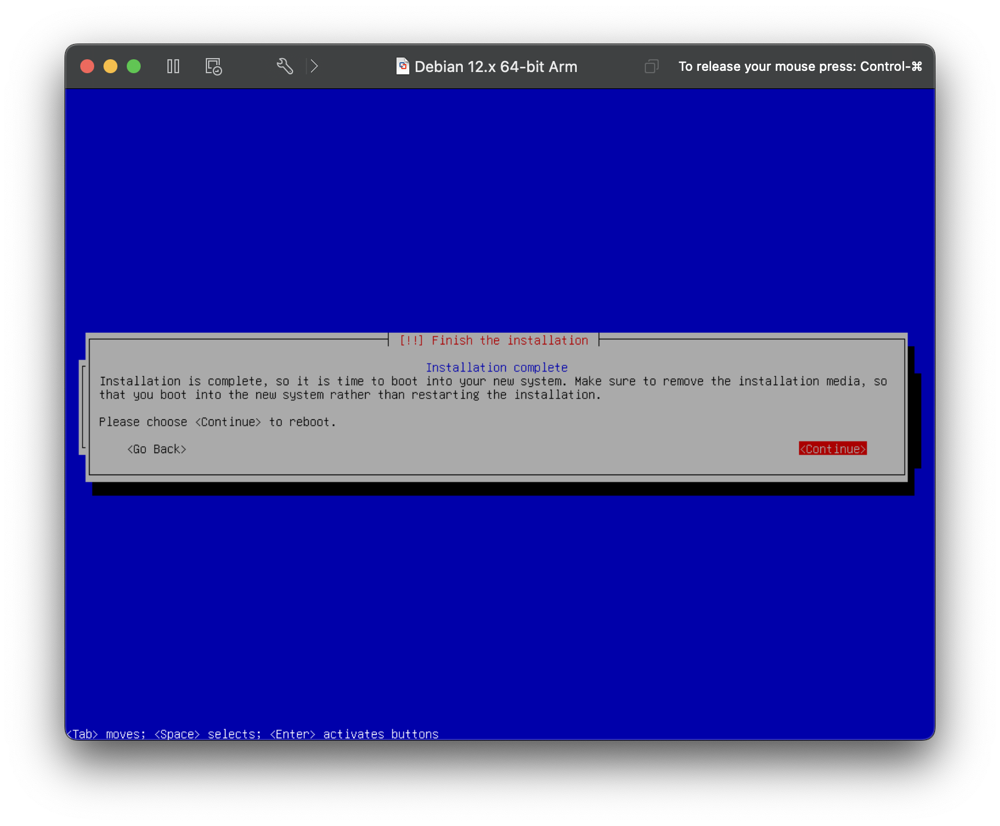

        After rebooting, you can log in with the user account you created.

        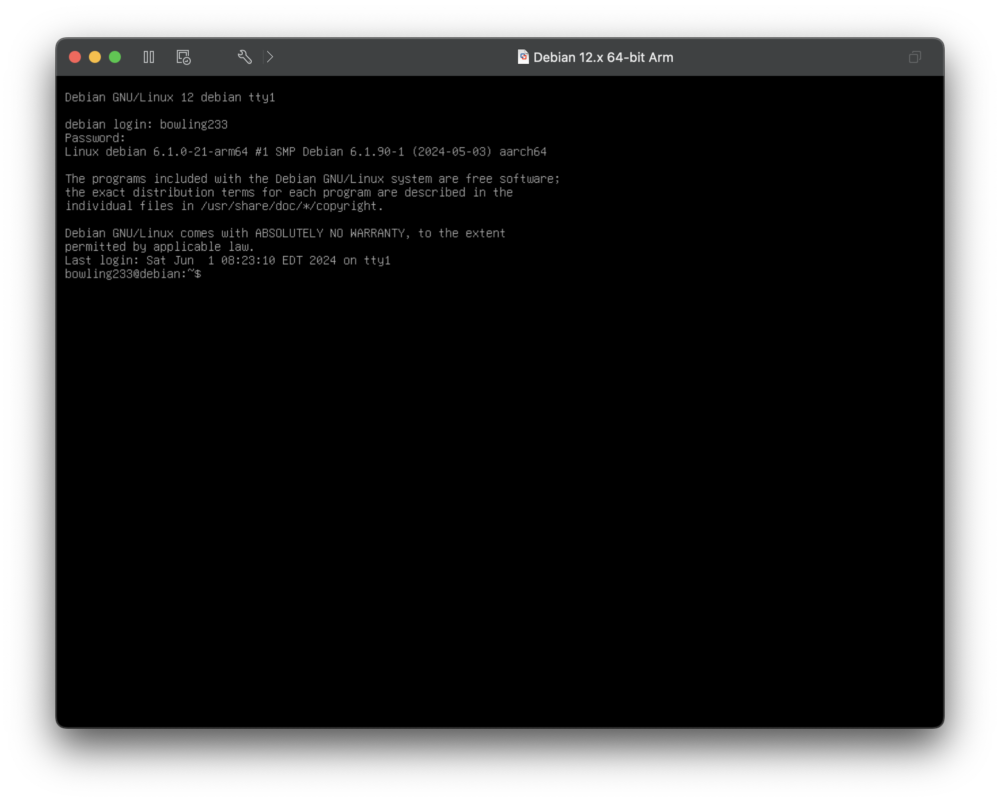

## Linux Basics

### Command Line Interface (CLI)

Read [The Linux command line for beginners - Ubuntu](https://ubuntu.com/tutorials/command-line-for-beginners#1-overview). Begin with section 1 and stop at section 5.

!!! question "Task 2.1: Answer the following questions"

    1. What is terminal, shell and prompt? Find definitions from the article.
    2. What commands did you learn from the article?
    3. Try to learn `nano`. Use it to create a file and write some text.

??? success "Check your answer"

    1. Answers:
        - Terminal: They would just send keystrokes to the server and display any data they received on the screen.
        - Shell: By wrapping the user’s commands this “shell” program, as it was known, could provide common capabilities to any of them, such as the ability to pass data from one command straight into another, or to use special wildcard characters to work with lots of similarly named files at once.
        - Prompt: That text is there to tell you the computer is ready to accept a command, it’s the computer’s way of prompting you.
    2. Examples:

        ```text
        cd pwd mkdir ls cat echo less mv rm rmdir
        ```
    3. Show your screenshot of using `nano`.

### Linux File System

Watch [Linux File System Explained! - Youtube](https://www.youtube.com/watch?v=bbmWOjuFmgA)

!!! question "Task 2.2: Answer the following questions"

    1. Where is your location when you first log in?
    2. Where are the homes for executable binaries?
    3. What is `/usr` stands for?
    4. What's in `/usr/local/bin`?
    5. Where are the configuration files stored?

??? success "Check your answer"

    1. `/home/username` 
    2. `/bin`, `/sbin`, `/usr/bin`, `/usr/local/bin`.
    3. `/usr` stands for "Unix System Resources".
    4. `/usr/local/bin` holds executables installed by the admin, usually after building them from source.
    5. `/etc`

### The Advanced Packaging Tool (APT)

Unlike Windows, where you need to download software from the internet and install it manually (this can be dangerous), Linux distributions have package managers that allow you to install software from a central repository.

For Debian-based distributions, the package manager is called `apt`. You can use `apt` to install, update, and remove software packages. For example, to install the `htop` package, you can run:

```bash
sudo apt update
sudo apt install htop
```

The first command updates the local package list from the repository, and the second command installs the `htop` package.

You can edit the `/etc/apt/sources.list` file to change the repository mirror. Read [SourceList - Debian Wiki](https://wiki.debian.org/SourcesList) to learn more about the `sources.list` file.

If you are finding a package, you can use [pkgs.org](https://pkgs.org/) to search for the package and find the repository.

??? note "[Why you need repository mirrors?](https://askubuntu.com/questions/913180/what-are-mirrors)"

    On the Internet, distance matters. In fact, it matters a lot. A long connection can cause high latency, slower connection speeds, and pretty much all the other classic issues that data has when it needs to travel across an ocean and half a continent. Therefore, we have these distributed mirrors. People connect to their physically nearest one (as it's usually the fastest -- there are some exceptions) for the lowest latency and highest download speed.

!!! question "Task 2.3: Answer the following questions"

    === "Question 1"

        One student encountered an error when running `sudo apt update`. The error message is:

        ```text
        Ign:1 cdrom://[Debian GNU/Linux 11.0.0 _Bullseye_ - Official amd64 DVD Binary-1 20210814-10:04] bullseye InRelease
        Err:2 cdrom://[Debian GNU/Linux 11.0.0 _Bullseye_ - Official amd64 DVD Binary-1 20210814-10:04] bullseye Release
        Please use apt-cdrom to make this CD-ROM recognized by APT. apt-get update cannot be used to add new CD-ROMs
        Hit:3 <http://security.debian.org/debian-security> bullseye-security InRelease
        Hit:4 <http://deb.debian.org/debian> bullseye InRelease
        Hit:5 <http://deb.debian.org/debian> bullseye-updates InRelease
        Reading package lists... Done
        E: The repository 'cdrom://[Debian GNU/Linux 11.0.0 _Bullseye_ - Official amd64 DVD Binary-1 20210814-10:04] bullseye Release' does not have a Release file.
        N: Updating from such a repository can't be done securely, and is therefore disabled by default.
        N: See apt-secure(8) manpage for repository creation and user configuration details.
        ```

        And here is the content of the `/etc/apt/sources.list` file:

        ```text title="/etc/apt/sources.list"
        deb cdrom:[Debian GNU/Linux 11.0.0 _Bullseye_ - Official amd64 DVD Binary-1 20210814-10:04] bullseye main
        ```

        What is the problem? How to solve it?

        ??? success "Check your answer"

            The problem is that the `cdrom` repository is not available. You can remove the `cdrom` repository from the `/etc/apt/sources.list` file and add the correct repository. Then run `sudo apt update` again.

    === "Question 2"

        One student can't install the `nvtop` package. The error message is:

        ```text
        Reading package lists... Done
        Building dependency tree... Done
        Reading state information... Done
        E: Unable to locate package nvtop
        ```

        And here is the content of the `/etc/apt/sources.list` file:

        ```text title="/etc/apt/sources.list"
        deb http://deb.debian.org/debian bullseye main
        deb http://deb.debian.org/debian bullseye-updates main
        deb http://security.debian.org/debian-security bullseye-security main
        ```

        What is the problem? How to solve it?

        !!! tip "Hint: use [pkgs.org](https://pkgs.org/) to search for the package's component."

        ??? success "Check your answer"

            The problem is that the `nvtop` package is not available in the `main` component of the repository. You can add the correct repository to the `/etc/apt/sources.list` file and run `sudo apt update` again.

    === "Question 3"

        One student can't install the `htop` package. The error message is:

        ```text
        Reading package lists... Done
        Building dependency tree... Done
        Reading state information... Done
        E: Unable to locate package htop
        ```

        And here is the content of the `/etc/apt/sources.list` file:

        ```text title="/etc/apt/sources.list"
        Types: deb
        URIs: <https://mirrors.zju.edu.cn/debian/>
        Suites: trixie trixie-updates trixie-backports
        Components: main contrib non-free non-free-firmware

        Types: deb
        URIs: <https://mirrors.zju.edu.cn/debian-security/>
        Suites: trixie-security
        Components: main contrib non-free non-free-firmware
        Signed-By: /usr/share/keyrings/debian-archive-keyring.gpg
        ```

        What is the problem? How to solve it?

## Access the Virtual Machine using SSH

### Network Basics

Do you know the following concepts?

- IP address
- MAC address
- Subnet mask
- Gateway
- Port
- Port forwarding

If you are not familiar with these concepts, watch the following video to learn more about network:

- [IP、MAC、DHCP 与 ARP - Bilibili](https://www.bilibili.com/video/BV1CQ4y1d728)
- [IP 与 NAT - Bilibili](https://www.bilibili.com/video/BV1DD4y127r4)

### Network in Virtual Machines

Watch this video to understand network in the virtual machines: [虚拟机网络模式 - Bilibili](https://www.bilibili.com/video/BV11M4y1J7zP).

!!! question "Task 3.1: Ping the virtual machine"

    === "Step 1"

        Check if the network mode of the virtual machine is set to `NAT`.

        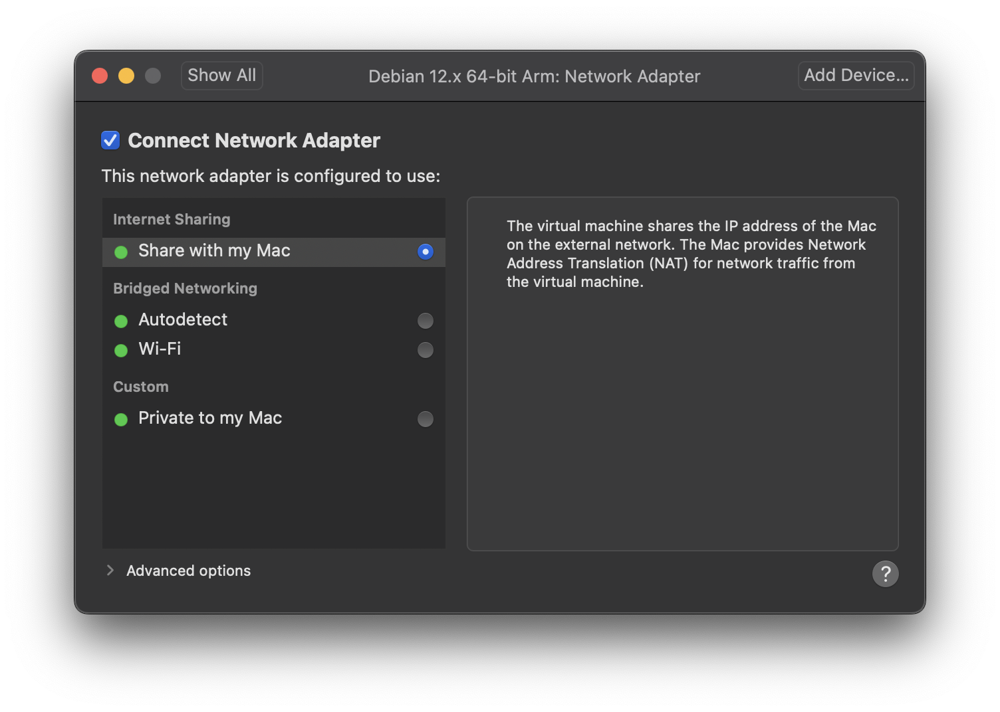

    === "Step 2"

        Start the virtual machine and log in. Use the `ip addr` command to find the IP address of the virtual machine.

        

        From the screenshot, the virtual machine has two network interfaces: `ens160` and `lo`. The latter is the loopback interface, and the former is the network interface used to connect to the network. We can see that the IP address of the virtual machine is `172.16.39.129`.

    === "Step 3"

        Open a terminal on your host machine and ping the virtual machine.

        ```bash
        ping IP_ADDRESS
        ```

        Replace `IP_ADDRESS` with the IP address of the virtual machine.

        The correct output should look like this:

        ```text
        PING 172.16.39.129 (172.16.39.129): 56 data bytes
        64 bytes from 172.16.39.129: icmp_seq=0 ttl=64 time=5.485 ms
        64 bytes from 172.16.39.129: icmp_seq=1 ttl=64 time=0.695 m
        ```

### SSH

Secure Shell (SSH) is a cryptographic network protocol for operating network services securely over an unsecured network. The best-known example application is for remote login to computer systems by users.

??? info "Asymmetric Encryption"

    SSH uses asymmetric encryption to secure the connection between the client and the server. In asymmetric encryption, two keys are used: a public key and a private key. The public key is used to encrypt the data, and the private key is used to decrypt the data.

    When you connect to an SSH server, the server sends its public key to the client. The client uses this public key to encrypt a random session key and sends it back to the server. The server uses its private key to decrypt the session key and establish a secure connection.

    The public key is shared with others, while the private key is kept secret.

    For more information, watch this video: [Asymmetric Encryption - Simply explained](https://www.youtube.com/watch?v=AQDCe585Lnc)

<figure markdown="span">
  <center>{ width=80% align=center }</center>
  <figcaption>SSH</figcaption>
</figure>

!!! question "Task 3.2: Connect to the virtual machine using SSH"

    === "Step 1"

        To use SSH, you need to install an SSH client on your computer. On Linux and macOS, the SSH client is usually pre-installed. On Windows, you can follow the instructions [Get started with OpenSSH for Windows - Microsoft](https://learn.microsoft.com/en-us/windows-server/administration/openssh/openssh_install_firstuse?tabs=gui#install-openssh-for-windows) to install the OpenSSH client.

    === "Step 2"

        You also need to install an SSH server on the virtual machine. On Debian-based distributions, you can install the `openssh-server` package:

        ```bash
        sudo apt update
        sudo apt install openssh-server
        ```

    === "Step 3"

        After installing the SSH server, you can use the `ssh` command to connect to the virtual machine:

        ```bash
        ssh username@IP_ADDRESS
        ```

        Replace `username` with your username on the virtual machine and `IP_ADDRESS` with the IP address of the virtual machine.

        It will ask you to enter the password of the user account. After entering the password, you will be logged in to the virtual machine.

        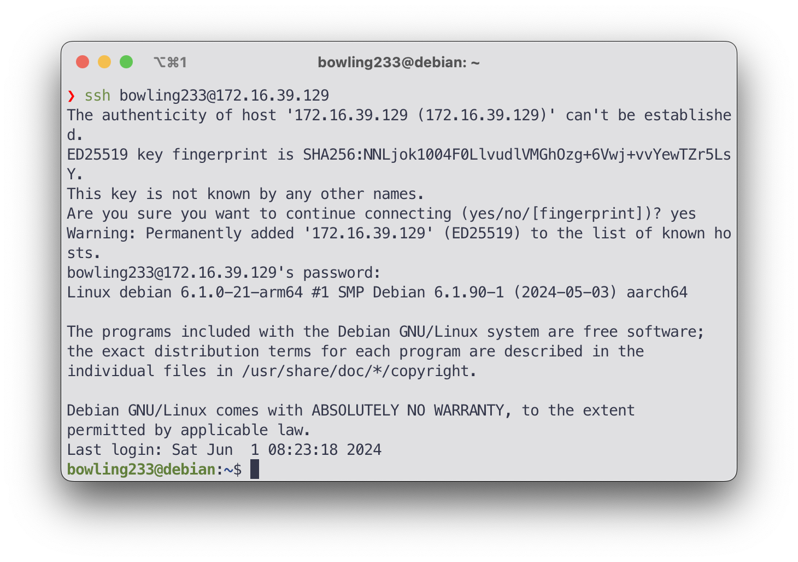

        Show the screenshot of your successful connection.

Now you can copy and paste commands to this terminal. You can also use the `scp` command to copy files between your computer and the virtual machine. You can also connect your VSCode to the virtual machine using the Remote-SSH extension, but don't rely on it too much.

## More on Linux

### Users and Permissions

Watch this video to learn about:

- Users and Groups: [Linux Crash Course - Managing Users](https://www.youtube.com/watch?v=19WOD84JFxA)
- Permissions: [Linux File Permissions in 5 Minutes | MUST Know!](https://www.youtube.com/watch?v=LnKoncbQBsM)

### Environment Variables

Read this article to learn about environment variables: [How to Set and List Environment Variables in Linux](https://linuxize.com/post/how-to-set-and-list-environment-variables-in-linux/)

## Git

Git is a distributed version control system that is widely used in software development. It allows multiple developers to work on the same project simultaneously and track changes to the codebase over time.

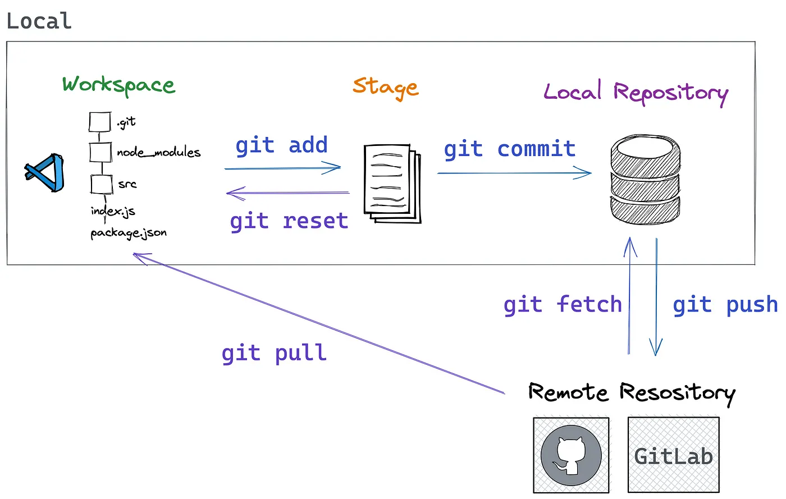

!!! warning "Do the following tasks on your **host machine**."

### Register a ZJU Git account

!!! question "Task 4.1: Go to [ZJU Git](https://git.zju.edu.cn) and register an account."

### Configure Public Key

!!! question "Task 4.2: Generate an SSH key and add it to your ZJU Git account."

    === "Step 1"

        Follow this guide to generate an SSH key: [Generating a new SSH key and adding it to the ssh-agent - GitHub](https://docs.github.com/en/github/authenticating-to-github/generating-a-new-ssh-key-and-adding-it-to-the-ssh-agent)

    === "Step 2"

        Add the public key to your ZJU Git account:

        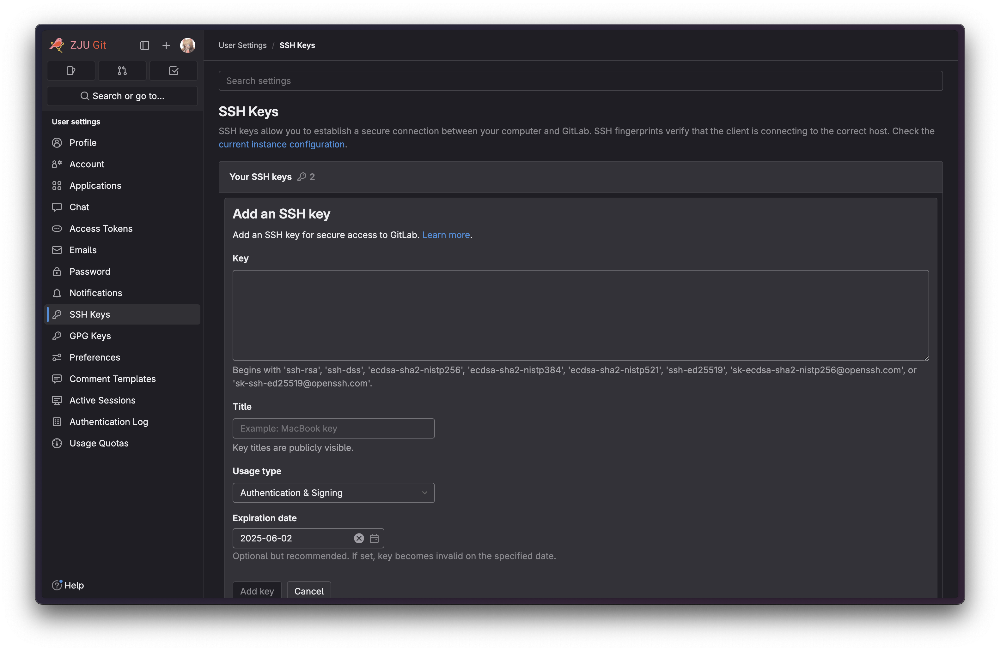

    === "Step 3"

        Test the SSH connection, it should look like this:

        ```bash
        $ ssh -T git@git.zju.edu.cn
        ssh -T git@git.zju.edu.cn
        Welcome to GitLab, @322010****!
        ```

        Show the screenshot of your successful connection.

!!! warning "This public key will be collected and **used to access the clusters** in the future."

## References

- [How do you explain an OS Kernel to a 5 year old?](https://medium.com/@anandthanu/how-do-you-explain-an-os-kernel-to-a-5-year-old-92a08755e014)
- [Virtual machines in Azure](https://medium.com/@syed.sohaib/virtual-machines-in-azure-7efdee4df802)
