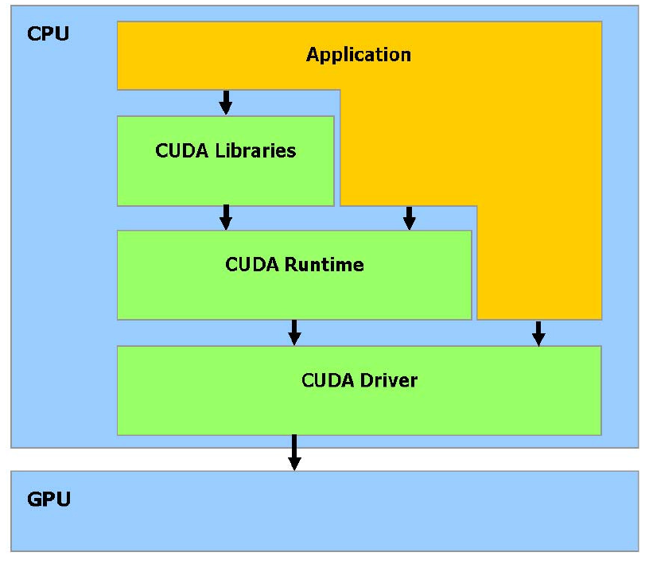

# 实验3：CUDA使用基础

## 实验简介

卷积（[Convolution](https://en.wikipedia.org/wiki/Convolution)）是一种基本的数学运算，想必大家在微积分、概率论与数理统计等数学基础课程中都一定程度上接触过。作为一种基本的数学计算，其在图像处理、机器学习等领域都有重要应用。

本次实验需要你使用 CUDA 完成一个 GPU 上的二维离散卷积。  

你可以自由选择使用 CUDA Runtime API 或者 CUDA Driver API 进行编程，但不能调用高性能计算的Library代替你自己实现卷积。本实验推荐采用 CUDA Runtime API，使用更加简单方便，相较Driver几乎不损失性能。



## 实验环境

请大家在我们提供的集群上创建一个开发环境为 TensorFlow / Pytorch 的容器（要求最后在实验报告中展示环境基本信息），容器中含有 Nvidia GeForce RTX 2080 Ti 及 nvcc v10.1，无需自行配置。

下图为某个可能的环境基本信息：


## 实验基础知识介绍

该部分简要介绍和实验相关的基础知识，为方便理解，不保证数学上的严谨性。

## 张量(tensor)

> 张量概念是矢量概念的推广，矢量是一阶张量。张量是一个可用来表示在一些矢量、标量和其他张量之间的线性关系的多线性函数。  
>
> 同构意义下，第零阶张量(r = 0)为标量(Scalar)，第一阶张量(r = 1)为向量 (Vector)，第二阶张量(r = 2)则为矩阵(Matrix)。  

实验中的卷积运算本实验涉及两个四维张量的运算。


## 卷积(convolution)

本实验只涉及离散运算，连续形式的卷积不做介绍，感兴趣的同学可以自行了解。

### 一维离散卷积

定义 $\left(f*g\right)\left(n\right)$ 为函数  $f$ 与  $g$ 的卷积

$$
\left(f*g\right)\left(n\right)=\Sigma_{t=-\infty}^{+\infty}f\left(t\right)g\left(n-t\right)
$$

函数 $f$ 和 $g$ 定义域可以不是所有整数，修改上式中 $t$ 的遍历范围可得到新的定义；另一种方式是定义超出定义域的函数值视为 0 ，可得到相同的结果。

需要注意的是，两个函数的卷积结果仍是函数。

可以形象地理解为沿着不断移动的 $x+y=n$ 直线，将两个函数卷成一个新的函数，每条直线对应新函数的一组对应关系。

### 二维离散卷积

二维离散卷积可以视为一维离散卷积的推广。

$$
\left(f*g\right)\left(n,m\right)=\Sigma_{i=-\infty}^{+\infty}\Sigma_{j=-\infty}^{+\infty}f\left(i,j\right)g\left(n-i,m-j\right)
$$

我们在实验中的定义卷积与数学上的定义存在差别，我们认为其在广义上属于二维离散卷积。

简化起见，考虑两个方阵 $f$ 和 $g$，$f$ 的大小为 $a*a$，$g$ 的大小为 $b*b$，我们将 $g$ 称为核（kernel）函数，且要求 $b$ 为奇数。$f$ 行列下标均从 0 开始，
$g$ 的行列下标则从 $-\lfloor b/2\rfloor$ 到 $+\lfloor b/2\rfloor$ （包括0） ，此时卷积的结果可以定义为: 
$$
\left(f*g\right)\left(n,m\right)=\Sigma_{i=-\lfloor b/2\rfloor}^{+\lfloor b/2\rfloor}\Sigma_{j=-\lfloor b/2\rfloor}^{+\lfloor b/2\rfloor}f\left(n+i,m+j\right)g\left(i,j\right)
$$

若 $f$ 的下标范围超出定义范围，本实验的方式是填充一个默认值 (0) 以解决问题，卷积结果与$f$大小相同。

## Bank

Bank的概念在不同种类的存储器中都有涉及，其是为了解决存储器并行访问的问题而提出的。以一个具有4个bank的存储器为例，我们往常在编程时认为逻辑上认为连续的内存在4个bank中的物理存储方式如下图所示：

```
Bank 0    Bank 1    Bank 2    Bank 3

MEM[0]    MEM[1]    MEM[2]    MEM[3]
MEM[4]    MEM[5]    MEM[6]    MEM[7]
MEM[8]    MEM[9]    MEM[10]   MEM[11]
...       ...       ...       ...
```

于是在同一时间我们访问诸如 `MEM[0], MEM[9], MEM[6], MEM[3]` 的存储空间就不会产生冲突，大大提高了程序的效率；否则，最差的情况下，若连续的访存序列均位于同一 bank，则效率等于串行的 4 次存储访问。

需要注意的是，若存储器的 bank 进行过针对性的优化，多个线程访问同一 bank 的同一位置可以通过同时向所有线程广播数据进行解决，同样不会产生 bank conflict 问题。


## 实验步骤

### 基准代码

在实际的卷积计算中，一次会进行多批(batch)的处理，比如一次处理多张图片(HxW大小)。以及同一个坐标具有多通道(channel)值，比如图片里的R、G、B三通道。`batch_size`和`in_channel`、`out_channel`定义于代码的开头。

代码中的注释和变量名遵循以下习惯：

- 输入输出张量的尺寸: `size`, `H`, `W`
- 输入、输出张量的批(batch)的大小: `batch_size`, `N`
- 输入张量的通道数: `in_channel`, `CI`
- 输出张量的通道数: `out_channel`, `CO`
- 卷积核的尺寸: `kernel`, `KH`, `KW`

我们看到，卷积运算中涉及的三个张量都是四维的，我们规定它们的形状分别为：

- Input: `N x H x W x CI`
- Kernel: `KH x KW x CI x CO`
- Output: `N x H x W x CO`


二维卷积计算的 CPU 版本已在 `conv_test.cu` 中的`conv2d_cpu_kernel`给出，用以验证正确性。即通过批、输入通道、输出通道、卷积核高、卷积核宽的五层循环轮流计算结果矩阵中每个位置的值。其中做了padding的0填充等处理。

基准代码为程序中的`conv2d_cuda_kernel`核函数，是未经优化的五层循环嵌套GPU实现，你可以在此基础上进行改进，亦或者重新自己实现。

```c++
__global__ void conv2d_cuda_kernel(const uint8_t *__restrict__ a, 
                                   const uint8_t *__restrict__ w, 
                                   uint8_t *__restrict__ b) 
{
  const int i = blockIdx.x * block_size + threadIdx.x;
  const int j = blockIdx.y * block_size + threadIdx.y;
  if (i < size && j < size) {
    for (int s = 0; s < batch_size; ++s) {
      for (int CO = 0; CO < out_channel; ++CO) {
        uint8_t conv = 0;
          int x = i - kernel / 2, y = j - kernel / 2;
          for (int k = 0; k < kernel; ++k) {
            for (int l = 0; l < kernel; ++l) {
              if (!(x < 0 || x >= size || y < 0 || y >= size)) {
                conv += a(s, x, y, CI) * w(k, l, CI, CO);
              }
              y++;
            }
            x++;
            y -= kernel;
          }
        }
        // Write back to b.
        b(s, i, j, CO) = conv;
      }
    }
  }
}
```

### Shared Memory

正如课上所讲，GPU 中有一块共享内存被同一线程块中的线程共享，在存储层级中，Shared Memory与L1 Cache同级，部分GPU架构中还可以手动分配L1 Cache与Shared Memory的大小；利用Shared Memory将线程块的密集访存加速能够获得极低的访存延迟且大大节省内存带宽。


### Blocking

可以对大矩阵进行分块计算，提高访存局部性。这一技术在 lab4 中会详细讲述。  

以下是矩阵乘法的分块示意图，卷积优化思路可以参考矩阵乘法分块思路。


### Virtual Thread Split

重新组织线程的编号方式与执行顺序(自由发挥)，尽可能的防止bank conflict，最大化利用显存带宽。

为了提高线程读写带宽，GPU 中的共享内存会被划分成若干个 bank，理想状况下，各个线程同一时间访问的 bank 应该是不同的。

### Cooperative Fetching

为了减少单个线程的内存访问量，可以让每个线程块中的线程合作访问有共同依赖的部分；共享内存是有限的，将访存重叠度高的线程安排在单个线程块中，从全局内存中加载访问更密集的数据到共享内存，都可以提升程序效率。

### Hint & Bonus

如果程序遇到难以解决的正确性问题，不妨考虑两个关键词： `sync` 和 `atomic`。

另外在我们本次实验提供的 GPU (RTX 2080Ti) 上，包含一个叫做 TensorCore 的硬件，它能够进一步加速卷积的计算， 在Cuda 9.0之后，你可以使用内嵌`PTX`汇编或者CUDA的C++扩展`nvcuda::wmma`的方式
来显式地调用Tensor Core来进行计算。

Tensor Core能在一个周期内完成一个小矩阵乘法，因而提高计算效率，但是Tensor Core对作矩阵乘法的两个矩阵的形状要求比较高(例如4x4x4，8x8x8等)，你需要合理地对矩阵进行切分和对Wrap中的线程合理分配来发挥出Tensor Core的计算性能。了解如何调用Tensor Core，可以查阅文档尾部的参考文献。

使用Tensor Core完成本次lab，你将会获得Bonus。


## 实验初始代码

详见 [starter_code](https://github.com/ZJUSCT/HPC101-Labs-2022/tree/main/docs/Lab3-Cuda/starter_code)。

## 实验任务与要求

利用以上技术(包括但不限于)，在基准程序的基础上实现卷积计算的 GPU 实现并优化之。

**只允许修改两个计时点(不含)之间的代码及 Makefile 文件**

**可以编写任意函数，但函数的调用栈需要能够回溯到两个计时点之间**

**若对不允许修改部分代码正确性有疑问请联系助教**

本实验的目的是让大家学习实践课程教授的 CUDA 优化知识，熟悉 GPU 编程与优化，掌握面对常见并行问题的调试技巧。**不允许使用cuDNN等算子库或者使用第三方工具自动生成的代码**。

> **Note**: 调试时为使错误可复现，可以将代码中的 `std::default_random_engine generator(r());` 改为 `std::default_random_engine generator;`，这样每次生成的随机矩阵都会是一致的。

## 评价标准

若参考互联网资料或者代码请在报告中注明出处。

**注意：参考和复制粘贴改变量名是完全两回事！！！**

1. 只要完成 CUDA 代码的一定优化且得到正确结果，就能取得大部分分数。
2. 如果优化结果优异，直接满分（**你有更好的想法，我们鼓励尝试**）。
3. 优化结果普通，我们将参考你对实验手册中提到的优化策略的尝试与努力（报告与代码）进行给分——若你已经尽力尝试了手册中所有的优化思路，你可以取得（95+）的分数。

请让我们看到你的尝试，即使代码不能运行或者结果错误也不要羞涩于提交（否则实在捞不起来）！

## 参考文献

- NVIDIA [Convolutional Layers User's Guide](https://docs.nvidia.com/deeplearning/performance/dl-performance-convolutional/)
- NVIDIA Developer Blog [Tips for Optimizing GPU Performance Using Tensor Cores](https://developer.nvidia.com/blogoptimizing-gpu-performance-tensor-cores/)
- `nvcuda::wmma` CUDA C++ Extension [NVIDIA CUDA C Programming Guide](https://docs.nvidia.com/cuda/cuda-c-programming-guide/index.html#wmma)
- [NVIDIA PTX ISA](https://docs.nvidia.com/cuda/parallel-thread-execution/index.html)
