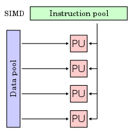
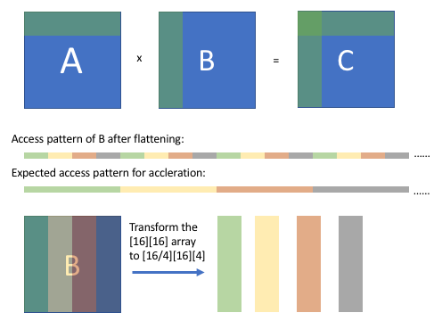

# 实验四：GEMM 通用矩阵乘法


## 1 实验简介

**BLAS**（英语：**Basic Linear Algebra Subprograms**，基础线性代数程序集）是一个[应用程序接口](https://zh.wikipedia.org/wiki/应用程序接口)（API）标准，用以规范发布基础线性代数操作的数值库（如矢量或矩阵乘法）。该程序集最初发布于 1979 年，并用于创建更大的数值程序包（如 [LAPACK](https://zh.wikipedia.org/wiki/LAPACK)）。[1] 在高性能计算领域，BLAS 被广泛使用，numpy 的底层也依赖于 BLAS。

通用矩阵乘法（[General matrix multiply](https://en.wikipedia.org/wiki/General_matrix_multiply), GEMM）是 BLAS 中经典的子程序之一。[2] 作为当今科学计算最常见的计算任务之一，GEMM 需要实现一个非常高效的矩阵乘法。优化 GEMM 也是 HPC 界非常基础的任务。

本次实验需要你使用 OpenMP、MPI 等 API 手工完成一个支持分布式计算高性能 GEMM 实现。


## 2 实验环境

### 2.1 AI Station

请大家在我们提供的集群上创建四个容器，每台容器包含四个 CPU 核心。大家需要配置好容器之间的网络通信以及 MPI 环境，操作方式与实验一相同，不过在本实验中出于方便起见，你可以直接使用包含 MPI 的 Docker 镜像，如之前实验中用过的 tensorflow 镜像。

### 2.2 Slurm

本实验额外提供了一个使用 `slurm` 管理的集群。集群的配置为四节点，每个节点有 48 个 CPU 核心

#### 2.2.1 登录

登录方式：`ssh <username>@clusters.zju.edu.cn -p 14514`

其中 `username` 为 `{你的姓名缩写}-summer` ，例：王小明的用户名为 `wxm-summer`。

对于部分缩写重名的同学，用户名略有不同，具体请查看 [username.txt](index.assets/username.txt)。

#### 2.2.2 编译

集群上已经安装好了 `Intel OneAPI` 套件，需要执行 `source /opt/intel/oneapi/setvars.sh` 加载环境，其中包含了 `IntelMPI`。

编译时请使用 `mpiicc` 或 `mpiicpc` 编译器。

#### 2.2.3 运行

在加载上述 `IntelMPI` 套件之后，可以使用下面几种方式运行程序（节点数和进程数请自行选择）：

* 使用 `srun` 把任务提交至任务队列
```bash
I_MPI_PMI_LIBRARY=/usr/lib/x86_64-linux-gnu/libpmi.so.0 srun -N 4 -n 4 ./your_program
```

* 使用 `salloc` 请求集群资源，待资源分配完毕后手动运行
```bash
salloc -N 4
# wait for a while
mpirun -ppn 1 ./your_program
```

单次任务的最大运行时间为 10 分钟。**在实验截止日期前一周，最大运行时间将会减少。**

#### 2.2.4 集群状态获取

可以通过 `sinfo` 获取当前集群的状态，通过 `squeue` 获取排队的任务信息。如果当前自己的任务正在运行，则你可以通过 `ssh` 连接到各个计算节点通过 `htop` 等命令观察运行情况。

### 2.3 集群选择

**为避免阻塞，请尽量先在 aistation 上完成编写与调试。**


## 3 实验基础知识介绍

### 3.1 程序局部性

> 此部分介绍参考自 [wiki](https://en.wikipedia.org/wiki/Locality_of_reference)

程序局部性指的是应用程序在访问内存的时候，倾向于访问内存中较为靠近的值。

一般来说，程序的局部性分为两种形式，一种是时间局部性，另一种是空间局部性。时间局部性指的是，程序在运行时，最近刚刚被引用过的一个内存位置容易再次被引用，比如在调取一个函数的时候，前不久才调取过的本地参数容易再度被调取使用。空间局部性指的是，最近引用过的内存位置以及其周边的内存位置容易再次被使用。空间局部性比较常见于循环中，比如在一个数列中，如果第 3 个元素在上一个循环中使用，则本次循环中极有可能会使用第 4 个元素。

局部性是出现在计算机系统中的一种可预测行为。系统的这种强访问局部性，可以被用来在处理器内核的指令流水线中进行性能优化，如缓存，内存预读取以及分支预测。

### 3.2 计算机层次存储结构

存储层次是在计算机体系结构下存储系统层次结构的排列顺序。每一层于下一层相比都拥有较高的速度和较低延迟性，以及较小的容量。


层次存储的设计核心目的就是要充分利用程序的局部性，如将最常访问的数据放置在较高的层级来保证访问速度；再比如按照顺序访问能够使得每次取来的整块数据都能够被利用，也使得预取的数据是有效的；如果你的内存充足，你甚至可以将硬盘上的数据提前拷贝到内存，来避免硬盘 I/O 带来的开销，等等。

因此，充分优化一个程序的局部性，能够使得其充分利用现代计算机硬件上各种加速设计，提高其运行效率。

### 3.3 并行计算

#### 3.3.1 SIMD



SIMD 是一种数据并行技术，它通过提供支持向量运算的指令，同时对一组数据执行相同的计算，从而实现空间上的并行，进而提高程序的并行度和吞吐量。当程序中出现大量完全一致的运算需要对一批数据进行处理时，你可以考虑使用 SIMD 对其进行并行。

#### 3.3.2 指令级并行


现代处理器一般都会使用流水线技术来同时执行多条指令的不同阶段，从而实现指令间的并行。传统流水线因为需要解决流水线中的各种冲突，不可避免的会在流水线中带来空泡，而由于现代处理器里其实还包含指令的乱序发射，出现空泡的几率已经大大降低，所以在编程时不太需要考虑这方面的问题。

#### 3.3.3 线程级并行

前面介绍的并行都是对于单个物理核心的场景，在现代计算机中，我们往往拥有多个物理核心，而线程作为调度的最小单位只能在一个核心上执行，因此我们需要开启多个线程来充分利用每一个核心。

线程的一个好处是内存共享，这意味着线程间的通信开销会小不少。因此在单机上我们往往采用多线程的并行模型。不过为了保证计算的正确性，你需要确保一些地方的操作是原子的，并维护好一些同步点。

#### 3.3.4 进程级并行

对于分布式的计算来说，仅仅使用线程并行已经不够了。我们需要在每个节点上开启不同的进程，来激发更多的并行能力。由于进程间的内存并不共享，我们需要进程间通信来进行数据的分享。

### 3.3 IO 与通信开销

如果程序有 IO 或者网络通信需求，而我们程序的根本需求其实是计算，所以想办法缩短这一部分的时间也是提高程序性能的重要手段：比如减少通信量，尽量将通信 / IO集中在一起，增加网络 / IO 的带宽等。


## 4 实验步骤

接下来我们讨论的优化技巧全部是针对两个稠密矩阵的乘法。我们给出以下形式化定义：

给定矩阵 $A, B, C$：

$$
\mathbf{A} =\begin{pmatrix}a_{11}&a_{12}&\cdots &a_{1n}\\a_{21}&a_{22}&\cdots &a_{2n}\\\vdots &\vdots &\ddots &\vdots \\a_{m1}&a_{m2}&\cdots &a_{mn}\\\end{pmatrix}, \quad
\mathbf {B} =\begin{pmatrix}b_{11}&b_{12}&\cdots &b_{1p}\\b_{21}&b_{22}&\cdots &b_{2p}\\\vdots &\vdots &\ddots &\vdots \\b_{n1}&b_{n2}&\cdots &b_{np}\\\end{pmatrix}, \quad
\mathbf {C} =\begin{pmatrix}c_{11}&c_{12}&\cdots &c_{1p}\\c_{21}&c_{22}&\cdots &c_{2p}\\\vdots &\vdots &\ddots &\vdots \\c_{m1}&c_{m2}&\cdots &c_{mp}\\\end{pmatrix}
$$

矩阵乘法 $C = AB$ 定义为对任意 $c_{ij}$ 有：

$$
 c_{ij}=a_{i1}b_{1j}+a_{i2}b_{2j}+\cdots +a_{in}b_{nj}=\sum _{k=1}^{n}a_{ik}b_{kj}
$$

为了简化问题，我们假设所有的矩阵都是 $N \times N$ 的方阵。 

### 4.1 单机优化

下面我们选择介绍一些单机上的优化技术。

#### 4.1.1 基准

最基础的矩阵乘法自然是三层循环，即对二维矩阵 $$C$$ 的每一项通过单层循环计算其结果。

```c++
for (int x = 0; x < N; x++) {
  for (int y = 0; y < N; y++) {
    C[(x * N) + y] = 0
    for (int k = 0; k < N; k++) {
      C[(x * N) + y] += A[(x * N) + k] * B[(k * N) + y]
    }
  }
}
```

#### 4.1.2 分块

基准代码尽可能多的使用了行遍历来提高内存的访问效率，但是即便如此，由于矩阵本身大小过大，导致部分按列访问的情况下，整体局部性还是不高。我们引入分块技术来进一步提高程序的局部性，降低 cache miss 的概率。

$$
A=\left(\begin{array}{ccc}
A_{0,0} & \cdots & A_{0, K-1} \\
\vdots & & \vdots \\
A_{M-1,0} & \cdots & A_{M-1, K-1}
\end{array}\right), \quad B=\left(\begin{array}{ccc}
B_{0,0} & \cdots & B_{0, N-1} \\
\vdots & & \vdots \\
B_{K-1,0} & \cdots & B_{K-1, N-1}
\end{array}\right), \quad C=\left(\begin{array}{ccc}
C_{0,0} & \cdots & C_{0, N-1} \\
\vdots & & \vdots \\
C_{M-1,0} & \cdots & C_{M-1, N-1}
\end{array}\right)
$$

此时对于每一个 $C$，我们都有：$C_{ij}=\sum _{k=0}^{N-1}A_{ik}B_{kj}$
大致代码实现如下：

```c++
for (int outerX = 0; outerX < N; outerX++) {
  for (int outerY = 0; outerY < N; outerY++) {
    // Clear C_ij matrix
    for (int innerX = 0; innerX < blockSize; innerX++) {
      for (int innerY = 0; innerY < blockSize; innerY++) {
        // TODO: Clear C_ij matrix
      }
    }
    for (int K = 0; K < N; K++) {
      // TODO: calculate C_ij = sum(A_ik * B_kj)
    }
  }
}
```

为了保证计算的正确性，你需要非常谨慎的处理循环层数、下标。

#### 4.1.3 向量化

对于循环的最内层，如果我们将其展开，往往会发现类似下面的模式：

```c++
c[i+0] = a[j+0] * b[someIdx0]
c[i+1] = a[j+1] * b[someIdx1]
c[i+2] = a[j+2] * b[someIdx2]
c[i+3] = a[j+3] * b[someIdx3]
...
```

这种规律、统一的计算非常适合使用 SIMD 指令进行计算。以计算 $C_i = A_i * B_i$ 为例，我们可以写出以下利用 AVX 指令的向量化代码：

```c++
__m256d a[N], b[N], c[N];
for (int i = 0; i < N; i++)
    c[i] = __mm256_mul_pd(a[i], b[i]);
```

这段代码能够在一条 CPU 指令内完成 4 个 double 的乘法，从而大幅提高系统的计算性能。

同样，为了保证计算的正确性，你需要非常谨慎的处理循环层数、地址。

由于向量化指令集在不同厂商、不同型号的 CPU 上可能都是不同的，手写向量化的成本非常的高，因此我们往往**直接使用编译器的自动向量化**。具体开启方法请查阅不同平台上相关编译器的编译选项。

#### 4.1.4 数组封装

数组封装是 GEMM 中的一个重要技术。简单来说就是即便使用了分块技术，B 中的访存顺序依然是不太连贯的——以 $16 \times 16$ 大小的矩阵为例，即便我们按照 $4 \times 4$ 进行分块，B 中的访存顺序仍然会是每 4 次线性访问遇到一次非线性访问，如下图上半部分所示。 



解决方案是：提前将 B 矩阵拆分成 4 个小矩阵，每个矩阵大小为 $16 \times 4$。拆分后的每个矩阵内部是连续存放的，这样所有的访存操作都是顺序的了，如图中下半部分所示。

#### 4.1.5 写入缓存

在之前体系结构概述的课程里，我们已经介绍过写入内存的时候，也是存在局部性的。虽然存在不同的缓存替换、写回策略，但是总体上顺序写入仍然是远远快于非线性的写入的。因此我们可以先创建一块写入缓存，用于按照计算顺序存放结果，再在计算全部结束后批量拷贝、调整到应有的顺序。

#### 4.1.6 线程级并行

在优化完局部性后，我们开始考虑使用线程级并行。这里我们使用 OpenMP 即可，具体方法课上已经介绍。请注意线程间的负载均衡，并平衡调度开销。

多线程里需要注意的一点是，由于 NUMA 的存在，跨片访问的开销将会非常的大，因此提高核的数据亲和性也非常重要，如将线程绑定到指定核心上，避免被 OS 调度到其他核心，以及一个核上的线程应当尽量只访问该核心所直连的内存区域。

### 4.2 分布式并行

单机优化完毕后，再考虑分布式系统的优化。我们使用 MPI 来处理线程间的通信，具体方法课上已经介绍。由于进程间内存空间是不共享的，计算所需的数据需要手工进行分发，你需要合理设计通信方式，避免过度的通信开销。另外，也不要忽略了同步开销。

> 更多优化技巧可以参阅手册末尾的参考资料


## 5 实验任务与要求

利用以上技术完成 GEMM 分布式实现，用于完成以下计算任务：

### 5.1 问题描述

输入矩阵 $A, B$，标量 $n$，计算矩阵连乘积：
$$
\prod_{k=0}^nA+kB = A (A + B) (A+2B)\dots(A+nB)
$$
其中矩阵 $A, B$ 为随机生成的 $10001 \times 10001$ `signed int` 32 矩阵。出于方便起见无需考虑溢出。

### 5.2 评测环境

`slurm` 集群，详见本手册第 2 节。

### 5.3 基准代码

我们将提供一份代码包（详见 [starter_code](https://github.com/ZJUSCT/HPC101-Labs-2022/tree/main/docs/Lab4-Gemm/code)），包含正确性检验以及性能计算，形式如下。

`hw.h`

```c++
// mat_A, mat_B and result point to memory at least 10001*10001*4B 
// n is the scalar and will be used to check your answer
void input(int* mat_A, int* mat_B);
void output(int* result, int n);
```

`hw_baseline.cpp`

```c++
#include "hw.h"

int matA[10001*10001];
int matB[10001*10001];

int main() {
  input(matA, matB);
  int n = 1; 
  // do calculation here
  output(matA, n);
}
```

你可以使用 `make` 构建二进制程序，并使用 `make run` 运行你的二进制程序。

### 5.4 评测方式

我们使用每秒计算量 （Operations Per Second）来评价你的程序性能，其计算⽅法如下：

$$
Ops = \frac{n}{T}C
$$

其中 $C=10001^3+2\cdot10001^2$ 为常量。

### 5.5 计分方式

作业满分 25 分。 

- 若答案错误或未能在 10 分钟内给出 $n = 1$ 时的结果，视情况给 0〜5 分
- 答案正确且⾄少在 10 分钟内给出 $n=1$ 时的结果，给 5 分
  - 剩余 20 分将按所有有效提交程序的每秒计算量 $Ops$ 排名给出，遵循正态分布

### 5.6 作业提交方式

请将最优的源代码、Makefile/CMkaeLists.txt、运行参数（包括 slurm 命令与参数）、$Ops$ 值打包提交到学在浙大。 截止后，我们将检查源代码的合法性（是否抄袭、使用了违禁库等）并重新编译测试。


## 6 注意事项

1. 独立完成本次实验，严禁抄袭，我们将会进行查重，一旦发现本次实验计 0 分。
2. 攻击平台、恶意浪费节点资源等干扰他人的行为，以作弊论处。
3. 只允许使用 OpenMP / OpenMPI / Intel MPI / Intel C Compiler / GNU Compiler Colletion 等， 不允许使用 Intel MKL / BLAS / LAPACK 等第三方工具库。若最终提交的代码使用禁止的库，以作弊论处。
4. 任何问题请联系群内助教。


## 7 Bonus

本部分选做，感兴趣的同学可以尝试着完成。

Bonus 部分完成即有加分（完成 Bonus 部分实验要求，且能够通过编译与测试），我们将根据完成质量提供 5-10 分的加分（与 Lab 4 权重相同）。

### 7.1 实验任务

Fortran 是世界上第一个被正式采用并流传至今的高级编程语言，它因较为容易学习而被大量用于科学计算领域的代码编写。其编译器往往会随 C/C++ 的编译器一同安装，且其编译流程和 C/C++ 类似，故其能和 C/C++ 程序进行混合编译。

你需要完成的任务是，将上述实验内容使用 Fortran 重新实现，并能够和 C/C++ 代码实现混合编译（即在 Fortran 代码中调用 `hw.h` 中的  `input/output` 函数，编译生成一个由两种语言编写的二进制程序），通过 `output` 函数的测试。

### 7.2 实验要求

1. 使用 Fortran 重新编写本实验，并实现混合编译
2. 测试实现的正确性和 $Ops$
3. 提交代码和简要的报告（可以附在 Lab 4 报告中）

你可以直接使用 Fortran 进行 Lab 4 的编写并参与排名，一起获得 Lab 4 及 Bonus 的分数。

你也可以同时提交使用 C/C++ 的实现和使用 Fortran 的实现，对比两种实现的结果，并注明使用哪个实现参与最终 Lab 4 的排名计算 Lab 4 的分数。此时建议将 Fortran 源码和 C/C++ 源码一并上交，并通过 Makefile/CMakeLists.txt 注明两种实现分别的构建与运行方式。


## 参考资料

1. [https://en.wikipedia.org/wiki/Basic_Linear_Algebra_Subprograms](https://en.wikipedia.org/wiki/Basic_Linear_Algebra_Subprograms)
2. [https://en.wikipedia.org/wiki/General_matrix_multiply](https://en.wikipedia.org/wiki/General_matrix_multiply)
3. [https://github.com/flame/how-to-optimize-gemm/wiki](https://github.com/flame/how-to-optimize-gemm/wiki)
4. [https://tvm.apache.org/docs/tutorials/optimize/opt_gemm.html](https://tvm.apache.org/docs/tutorials/optimize/opt_gemm.html)
5. Huang J, van. BLISlab: A Sandbox for Optimizing GEMM. arXiv.org. Published 2016. Accessed July 10, 2021. https://arxiv.org/abs/1609.00076
6. [计算机教育中缺失的一课 · the missing semester of your cs education (missing-semester-cn.github.io)](https://missing-semester-cn.github.io/)
7. [Introduction to Fortran (ourcodingclub.github.io)](https://ourcodingclub.github.io/tutorials/fortran-intro/)
8. [Quickstart](https://fortran-lang.org/learn/quickstart)[ tutorial - Fortran Programming Language (fortran-lang.org)](https://fortran-lang.org/learn/quickstart)
