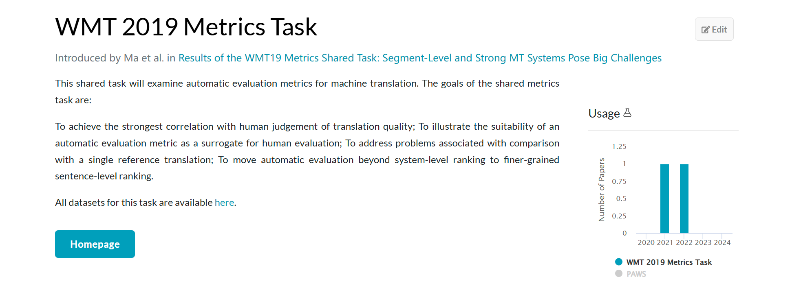
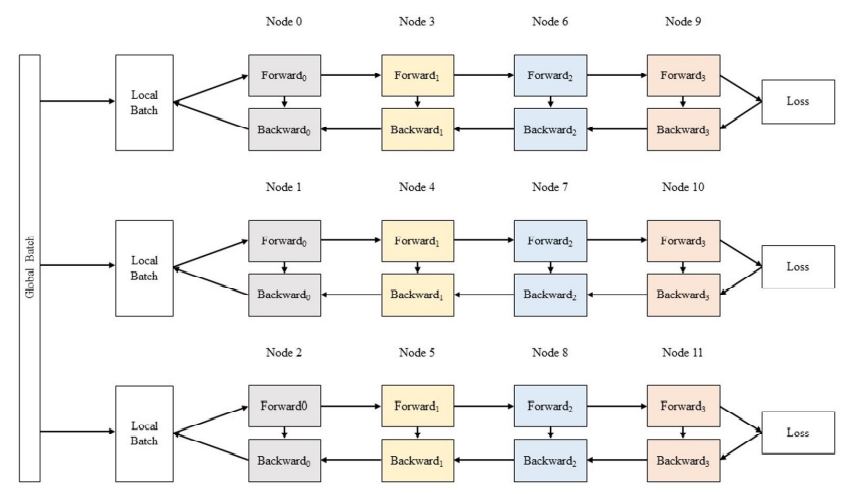

# 实验五：简单神经网络训练与加速

##  实验简介

**深度学习**（Deep Learning）是[机器学习](https://zh.wikipedia.org/wiki/机器学习)的分支，是一种以[人工神经网络](https://zh.wikipedia.org/wiki/人工神经网络)为架构，对数据进行表征学习的[算法](https://zh.wikipedia.org/wiki/算法)。深度学习能够取得如此卓越的成就，除了优越的算法、充足的数据，更离不开强劲的算力。近年来，深度学习相关的基础设施逐渐成熟，从网络设计时的训练、优化，到落地的推理加速，都有非常优秀的解决方案。其中，对于算力的需求最大的部分之一是网络的训练过程，它也因此成为 HPC 领域经常研究的话题。

**注意力机制**（Self-Attention）是深度学习中的一种网络结构，也是Transformer架构中的核心部分。

**Transformer** 是由Google在2017年提出的一种网络结构，相比于以往的RNN，它在处理长序列时的表现更好，随即便迅速成为NLP领域的研究热点，而基于Transformer的工作和应用层出不穷，包括当下最热门的大语言模型，比如DeepSeek, GPT-4o等等

> 本次实验我们将完成 Transformer 模型的训练，以及之后可能会有的Bonus。对于实验第一部分我们只需要完成训练即可得到对应分数，


## 实验环境

同 Lab3 和 Lab4，现有两张 A100 40G，一张 A100 80G 和两张 2080ti 显卡供大家使用

!!! warning "请在实验报告中指出所使用的显卡类型"

集群上安装了本实验需要用到的 torch 环境，使用 conda 管理，你可以直接使用这个环境(暂时还没有准备好x)
```bash
conda activate torch
```
或者自己新建一个环境。比如克隆基础 torch 环境
```bash
conda create -n mytorch --clone torch
```
或者新建一个 python 版本为 3.12 的空环境，并使用 `pip install -r requirements.txt` 安装所必须的包
```bash
conda create -n mytorch python=3.12
```

```sh
# requirements.txt
aiohttp==3.9.5
aiosignal==1.3.1
attrs==23.2.0
certifi==2024.7.4
charset-normalizer==3.3.2
click==8.1.7
datasets==2.20.0
dill==0.3.8
docutils==0.21.2
filelock==3.15.4
frozenlist==1.4.1
fsspec==2024.5.0
huggingface-hub==0.23.4
idna==3.7
Jinja2==3.1.4
joblib==1.4.2
MarkupSafe==2.1.5
mpmath==1.3.0
multidict==6.0.5
multiprocess==0.70.16
networkx==3.3
nltk==3.8.1
numpy==1.26.4
nvidia-cublas-cu12==12.1.3.1
nvidia-cuda-cupti-cu12==12.1.105
nvidia-cuda-nvrtc-cu12==12.1.105
nvidia-cuda-runtime-cu12==12.1.105
nvidia-cudnn-cu12==8.9.2.26
nvidia-cufft-cu12==11.0.2.54
nvidia-curand-cu12==10.3.2.106
nvidia-cusolver-cu12==11.4.5.107
nvidia-cusparse-cu12==12.1.0.106
nvidia-nccl-cu12==2.20.5
nvidia-nvjitlink-cu12==12.5.82
nvidia-nvtx-cu12==12.1.105
packaging==24.1
pandas==2.2.2
pillow==10.4.0
pyarrow==16.1.0
pyarrow-hotfix==0.6
python-dateutil==2.9.0.post0
pytz==2024.1
PyYAML==6.0.1
regex==2024.5.15
requests==2.32.3
safetensors==0.4.3
six==1.16.0
sympy==1.13.0
tokenizers==0.19.1
torch==2.3.1
torchaudio==2.3.1
torchvision==0.18.1
tqdm==4.66.4
transformers==4.42.3
triton==2.3.1
typing_extensions==4.12.2
tzdata==2024.1
urllib3==2.2.2
xxhash==3.4.1
yarl==1.9.4
```

注意基础 torch 环境无法被修改（安装新包），因此若你需要安装新包，需要新建一个环境，之后使用 conda 或者 pip 进行管理。

新建的环境会被存放在 `~/.conda/envs/` 目录下，你可以使用 `conda env list` 查看当前环境列表，使用 `conda activate mytorch` 切换到你的环境。

当你混合使用 conda 和 pip 时，注意 pip 是否为当前环境下的 pip，可以使用 `which pip` 查看。

你可以使用 `nvidia-smi` 查看显卡占用情况，设置 `CUDA_VISIBLE_DEVICES` 环境变量来指定使用哪张显卡。例如

```bash
CUDA_VISIBLE_DEVICES=1 python train.py
```
指定使用编号为 1 的显卡进行训练，此时只有编号为 1 的显卡对于你的程序可见。

## 实验基础知识介绍

### 网络模型

#### Attention 注意力机制

深度学习中的注意力机制（Attention）是一种模仿人类视觉和认知系统的方法，它允许神经网络在处理输入数据时集中注意力于相关的部分。通过引入注意力机制，神经网络能够自动地学习并选择性地关注输入中的重要信息，提高模型的性能和泛化能力，其核心计算可用公示来表示：

$$Attention(Q,K,V)=softmax(\dfrac{QK^T}{\sqrt{d}})V$$

而为了捕捉输入更多维度上的信息，便引入了MHA(Multi-head Attention)，通过将输入数据划分为多个不同的子空间，每个子空间对应一个注意力头，从而学习到输入的不同特性，其可用如下公式表示:

$$ \begin{array}{c}
Z_i=Attention(Q_i, K_i, V_i)=softmax(\dfrac{Q_iK_i^T}{\sqrt{d}})V_i  
\\
\Rightarrow Z = Concat(Z_1, Z_2, \cdots, Z_h)W^O 
\end{array}
$$

#### Transformer 结构


<div align="center">
  
</div>

有关于其更详细的结构可以在[原论文](https://arxiv.org/pdf/1706.03762)中找到。


### 数据集

#### WMT19 翻译数据集

WMT 数据集 (Workshop on Statistical Machine Translation) 是一个用于机器翻译任务的公开数据集系列，由 WMT 组织提供。这些数据集通常包含多种语言对的平行语料，用于训练和评估机器翻译模型。

为了减少训练时间，在本实验中，我们使用WMT 19 数据集中的 **zh-en** 的部分文件，来对模型进行训练和评估



## 实验步骤

### Transformer 训练

#### 数据准备

##### 数据集加载

为了防止占用空间过多，本次实验所用的数据集已经提前下载，切分并存放在`/opt/minidataset`目录下。

!!! warning "暂时只有M603的对应目录存有对应数据，请将目录拷贝到自己的用户目录中"

我们建议利用 huggingface的 `datasets` 库 提供的 `load_dataset` 方法加载数据集 (请不要将下载数据集到本地！), 之后你可以用 torch.utils.data.DataLoader 给你的模型加载数据。

```python
dataset = load_dataset(path=datasetDir)
```

##### 数据集预处理

在加载数据集后，会得到类似于`[{'zh': "今天天气怎么样", 'en': "What about weather today"},...]`的结构，为了将其转换成模型可训练的形式，我们需要用tokenizer将文本转换为数字，通常经过tokenize后，会得到如下参数：

```python
{
    'input_ids': [101, 7993, 170, 11303, 1200, 2443, 1110, 3014, 102],
    'token_type_ids': [0, 0, 0, 0, 0, 0, 0, 0, 0],
    'attention_mask': [1, 1, 1, 1, 1, 1, 1, 1, 1]
 }
```

其中 `input_ids` 是将原文本分词后产生的token映射的数字，`attention_mask` 和输入的 `input ids` 具有完全一样的shape，其中1 代表了这个id需要attention，0代表这个id不需要attention, 用于 padding 后去除那些 padding 值，本实验中应该不需要关注 `token_type_ids`.

在使用 DataLoader 前，你需要定义自己的 `Dataset` 类来处理上述生成的参数(例如将 list 转换为 torch.Tensor)，为此，你需要继承 `datasets.Dataset` 并至少需要重写其中的 __len__() 和 __getitem__() 函数.

Tokenizer 使用示例: 

```python
    from transformers import AutoTokenizer
    tokenizer = AutoTokenizer.from_pretrained('bert-base-uncased')
    input_texts = "Don't do LLM"
    tokens = tokenizer(input_texts, padding='max_length', truncation=True, max_length=128) #tokenize + encode
    print(tokenizer.decode(tokens))
```


#### 基本模型编写

##### 网络结构

`PyTorch` 提供了许多种定义模型的方式，最常用的一种是将网络结构以类保存，你应当首先继承 [torch.nn.Module](https://pytorch.org/docs/stable/generated/torch.nn.Module.html#torch.nn.Module)，并实现正向传播的 `forward` 函数，(为什么不用定义反向传播函数呢？因为你继承的 `nn.Module` 就是干这个事情的)。

下面为网络结构的一个 sample（但显然这样的网络并不能用于本次 Lab），本次实验中你需要自定义你的网络结构，以完成我们的任务：

```Python
import torch.nn as nn
import torch.nn.functional as F

class Model(nn.Module):
    def __init__(self):
        super(Model, self).__init__() # 利用参数初始化父类
        self.conv1 = nn.Conv2d(1, 20, 5)
        self.conv2 = nn.Conv2d(20, 20, 5)

    def forward(self, x):
        x = F.relu(self.conv1(x))
        return F.relu(self.conv2(x))
```

当然，你需要实例化你的模型，可以直接对模型打印以查看结构

```Python
model = Model()
print(model)
```

网络结构编写中一个很大的难点在于每一步的 tensor shape 需要匹配，请仔细检查你的代码来确保此部分的正确性。


##### 损失函数

常见的损失函数都被定义在了 `torch.nn`中，你可以在训练过程开始前将其实例化，并在训练时调用，例如：

```Python
criterion = torch.nn.CrossEntropyLoss()
```

##### 正向传播

正向传播是指对神经网络沿着从输入层到输出层的顺序，依次计算并存储模型的中间变量（包括输出）。
正向传播的过程在 `forward`中定义，对于模型实例，可以直接利用输入输出得到模型预测的结果。

```Python
y_pred = model(x)
```

##### 反向传播

反向传播（Backpropagation，BP）是“误差反向传播”的简称，是一种与最优化方法（如梯度下降法）结合使用的，用来训练人工神经网络的常见方法。该方法对网络中所有权重计算损失函数的梯度。这个梯度会反馈给最优化方法，用来更新权值以最小化损失函数。

在计算过模型的loss之后，可以利用 `loss.backward()` 计算反向传播的梯度，梯度会被直接储存在 `requires_grad=True` 的节点中，不过此时节点的权重暂时不会更新，因此可以做到梯度的累加。

##### 优化器

常用的优化器都被定义在了 `torch.optim` 中，为了使用优化器，你需要构建一个 optimizer 对象。这个对象能够保持当前参数状态并基于计算得到的梯度进行参数更新。你需要给它一个包含了需要优化的参数（必须都是 Variable 对象）的iterable。然后，你可以设置optimizer的参数选项，比如学习率，权重衰减，例如：

```Python
optimizer = optim.SGD(model.parameters(), lr=0.01, momentum=0.9)
optimizer = optim.Adam([var1, var2], lr=0.0001)
```

所有的optimizer都实现了step()方法，这个方法会更新所有的参数。或许你会在反向传播后用到它。

```Python
optimizer.step()
```

需要注意的是，在反向传播前，如果你不希望梯度累加，请使用下面的代码将梯度清零。

```Python
optimizer.zero_grad()
```

#### 训练过程

前文中已经定义了网络结构、损失函数、优化器，至此，一个较为完整的训练过程如下，需要注意的是，你的训练过程要不断从 `DataLoader` 中取出数据。

```Python
criterion = torch.nn.MSELoss(reduction='sum')
optimizer = torch.optim.SGD(model.parameters(), lr=1e-8, momentum=0.9)
for t in range(30000):
    # Forward pass: Compute predicted y by passing x to the model
    y_pred = model(x)

    # Compute and print loss
    loss = criterion(y_pred, y)

    # Zero gradients, perform a backward pass, and update the weights.
    optimizer.zero_grad()
    scheduler = get_linear_schedule_with_warmup(optimizer, num_warmup_steps=100, num_training_steps=1000)
    loss.backward()
    optimizer.step()
```

#### 测试过程

一般来说，神经网络会多次在训练集上进行训练，一次训练称之为一个 epoch。每个 epoch 结束后，我们会在测试集上进行测试，以评估模型的性能。在测试过程中，我们不需要计算梯度也不可以计算梯度（思考为什么），此时可以使用 `torch.no_grad` 来实现这一点。

对于模型输出的 output, 在评估时我们需要使用 `tokenizer.decode` 方法将其还原为对应的文本，而在还原之前我们需要使用 `argmax` 得到预测概率最大的词所对应的索引。

在本次实验中，使用 **BLEU(bilingual evaluation understudy)** 来对模型的翻译质量进行打分，请使用`nltk.translate.bleu_score.corpus_bleu`在给出的验证集上对结果进行评分，具体使用可参考[nltk.bleu_score annotation](https://www.nltk.org/_modules/nltk/translate/bleu_score.html)

示例代码如下: 

```python
    def evaluate(model, dataloader, tokenizer):
        model.eval()
        device = torch.device("cuda" if torch.cuda.is_available() else "cpu")
        model.to(device)
        
        references = []
        hypotheses = []
        
        with torch.no_grad():
            for batch in dataloader:
                # What to do!
                # 1. Load mask and inputs_id
                # 2. Forward pass
                # 3. Get the max index of the most predicted token in the vacab_size dimension
                # 4. Decode the token and append to the references and hypotheses separately
                    
        bleu_score = corpus_bleu(references, hypotheses)
        print(f'BLEU score: {bleu_score} * 10')
    return bleu_score
```

#### TensorBoard

TensorBoard 是常用的训练过程可视化工具。请参考 [PyTorch](https://pytorch.org/tutorials/recipes/recipes/tensorboard_with_pytorch.html) 的官方教程完成配置，需要在实验报告中展示模型损失过程中的Loss变化情况

#### Coding Guide

为了降低大家的实现难度，本次实验可以使用 `troch.nn.transformer` 作为 tranformer 模型的 Encoder + Decoder 部分，但请注意，`nn.transformer` 只实现了 transformer 模型中的一部分，我们仍然需要实现 Embedding, Positional Encoding 和最后的 Linear, Softmax(由于CrossEntropyLoss中含有softmax函数, 所以不用实现)

在使用 `troch.nn.transformer` 时请仔细查看各项参数含义...

Positional Encoding 可以参考其他实现，但需要给出你对代码的详细解释

`torch.nn.transformer` 的参数示例如下：

```python
    vocab_size = tokenizer.vocab_size
    d_model = 256
    nhead = 8
    num_encoder_layers = 3
    num_decoder_layers = 3
    dim_feedforward = 1024
    max_seq_length = 512
```


!!! tips "Tips"

- 本次实验不必过于关注模型在验证集上的BLEU分数，只要你的模型能够正常训练，你就可以通过本次实验。
- 本次实验中包括超参数、优化器在内的选择不限，本次实验的重点在于引导同学们实现 Transformer 模型的训练和评估，但请注意不要长时间占用显卡，如有恶意占用，被发现后会酌情进行扣分
- 除了利用继承 `nn.Module` 来建立网络，不推荐但可以使用 `nn.ModuleList`, `nn.ModuleDict`，推荐使用 `nn.Sequential`直接定义模型
- 此外你可以定义如下的 `device` 变量，以便你的模型在没有 GPU 环境下也可以测试：

    ```Python
    device = torch.device("cuda" if torch.cuda.is_available() else "cpu")

    model = Model().to(device)
    some_data = some_data.to(device)
    ```


<!-- - `nn.functional.relu`  （简记为 `F.relu` ）和 `nn.ReLU` 略有不同，区别在于前者作为一个函数调用，而后者作为一个层结构，必须添加到 `nn.Module` 容器中才能使用，两者实现的功能一样，在 `PyTorch` 中，`nn.X` 都有对应的函数版本 `F.X`。
- 除了利用继承 `nn.Module` 来建立网络，不推荐但可以使用 `nn.ModuleList`, `nn.ModuleDict`，推荐使用 `nn.Sequential`直接定义模型
- 你可以定义如下的 `device` 变量，以便你的模型在没有 GPU 环境下也可以测试：

    ```Python
    device = torch.device("cuda" if torch.cuda.is_available() else "cpu")

    model = Model().to(device)
    some_data = some_data.to(device)
    ```

- 你不必严格按照原版 LeNet-5 的网络结构来实现，包括超参数、优化器的选择不限，但是你需要保证你的网络结构是合理的，且能够完成我们的分类任务，最终的测试集准确率需要达到 98% 以上。（实际上原版 LeNet 可以轻松达到这个准确率，使用更加现代的结构和优化器，你可以达到更高的准确率）
- 不必过度关注准确率和 loss，只要你的模型能够正常训练，你就可以通过本次实验。 -->

<!-- - 相比于原生的 `PyTorch`，`PyTorch Lightning` 框架对其进行了更高层次的封装，很大程度上简化了模型定义、训练以及测试的步骤，使用 `PyTorch Lightning` 作为本次实验的加分项，官网链接已附在参考资料中。如果你能够在 TensorBoard 中将中间层可视化，你能得到更多的加分。 -->

<!-- ### 自定义算子

#### torch 算子编写
除了 `torch.nn` 中提供的算子，你可以自定义带有自动微分功能的算子。本实验中你需要编写一个 `MultiHeadAttention` 算子。你需要继承 `torch.autograd.Function` 并实现 `forward` 和 `backward` 函数。`forward` 函数接受输入并返回输出，`backward` 函数接受输入和梯度，并返回相对于输入的梯度。你可以在[这里](https://pytorch.org/docs/stable/notes/extending.html)找到更多关于自定义算子的信息。

关于 `GELU` 本身的信息请从参考资料中查找。你可以自行选择使用近似或者非近似的版本。

编写完自动微分算子后，你需要验证其正确性，可以直接和 `torch` 中的实现进行对比。

```python
import torch.nn.functional as F
loss_func = F.mse_loss()
A = torch.randn(100)
B = A.clone()
A.requires_grad = True
B.requires_grad = True
c = torch.randn(100)
a = F.gelu(A)
b = my_gelu(B)
loss1 = loss_func(a, c)
loss2 = loss_func(b, c) # loss1 should equal to loss2
loss1.backward()
loss2.backward()
gradA = A.grad
gradB = B.grad
err = loss_func(gradA, gradB) # err should equal to 0
```


#### 使用 C++ 

如果你尝试过寻找 `F.gelu` 的实现，你会发现它并不在 PyTorch 的 python 源码里。实际上它是用 C++/CUDA 实现的，你可以尝试寻找它的源码。这里你需要参照[这里](https://pytorch.org/tutorials/advanced/cpp_extension.html#jit-compiling-extensions)的教程，将你的算子用 C++ 重写，并在 python 中调用。

为了简单起见，你可以直接使用 torch 提供的 C++ tensor 数学函数（比如 `exp`）。

之后和上一小节相同，验证你实现的正确性。由于 GELU 本身比较简单，这里不涉及到使用 CUDA 编写算子。

最后，将你编写的算子用于 LeNet-5 的训练中，验证其是否能正常工作。 -->


<!-- ### 5 Bonus
此部分**选做**，感兴趣的同学可以尝试着完成。

#### 5.1 GPT
在自然语言处理（Natural language processing, NLP）中，早期使用的是循环神经网络（Recurrent Neural Network, **RNN**）。RNN 与 CNN 这样的前馈网络不同，RNN 中存在反馈和隐藏单元，使它可以「记住」之前读到的内容。为了解决深层网络中梯度消失或爆炸的问题，引入了长短期记忆（Long short-term memory, **LSTM**）。而为了解决传统 RNN 只能记住前面的问题，提出了双向的 LSTM。在此基础上引入的注意力机制（attention），使得网络能注意句子中重要位置的信息，例如允许在翻译中可以改变词语的顺序。

不久后，研究者发现只靠注意力机制而无需 RNN 或 CNN，就能达到较好的效果，这就是 Transformer 模型。与 RNN 不同的是，Transformer 模型能够一次性处理所有输入数据。注意力机制可以为输入序列中的任意位置提供上下文。这种架构允许更高的并行度，并以此减少训练时间。

以下为 Transformer 的结构：包含编码器和解码器，都由多个多头自注意力机制和全连接层堆叠而成，层间和层内存在归一化操作；输入由词嵌入向量加上位置信息得出。


Transformer 的详细结构可参考[原论文](https://arxiv.org/abs/1706.03762)。

2018 年，OpenAI 提出了生成预训练 Transformer 模型（Generative Pre-trained Transformer, **GPT**）。与先前基于监督式学习的 NLP 模型不同，GPT 在预训练生成阶段是无监督的（不需要标注），只在需要适应特定任务的**微调**（fine-tuning）时需要监督，降低了大规模 NLP 模型的门槛。GPT 的结构是 12 层仅包含解码器的 Transformer。一年后的 GPT-2 是对 GPT 的直接放大，参数量和数据集都增加了一个量级，参数量达到了 15 亿，取得了更好的效果和迁移学习能力。下一代的 GPT-3 达到了 1750 亿参数，生成的文章已经很难与人类写的区分出来。在一些领域，GPT-3 也**不再需要**专门的微调，而只需要提供例子等文本交互即可完成任务。大家可能熟悉的 GitHub Copilot 也是 GPT 的一个主要应用。GPT 系列模型的结构主要源于 Transformer 的 Encoder 部分。

本次实验要求训练一个 GPT-2/3 结构的模型，具体模型结构请参阅 [GPT-2](https://cdn.openai.com/better-language-models/language_models_are_unsupervised_multitask_learners.pdf) 和 [GPT-3](https://arxiv.org/abs/2005.14165) 的原论文。

#### 5.2 基准代码
为了方便起见，这里直接使用 Huffingface 提供的 GPTLMHead 模型，并采用随机输入进行训练。你也可以自行下载其他数据集进行预处理并训练，但是这不是本次实验的重点。
下面的代码里还提供了关于模型参数和计算量的计算公式，你可以参考这些公式来估计你的模型的大小和计算量。

```python
import torch
import torch.nn as nn
from transformers import GPT2Config, GPT2LMHeadModel

from torch.utils.data import DataLoader, TensorDataset
from torch.utils.data.sampler import RandomSampler
from torch.utils.data.distributed import DistributedSampler

class GPTLMModel(nn.Module):

    def __init__(self,
                 hidden_size=768,
                 num_layers=12,
                 num_attention_heads=12,
                 max_seq_len=1024,
                 vocab_size=50257,
                 checkpoint=False):
        super().__init__()
        self.checkpoint = checkpoint
        self.config = GPT2Config(n_embd=hidden_size,
                                 n_layer=num_layers,
                                 n_head=num_attention_heads,
                                 n_positions=max_seq_len,
                                 n_ctx=max_seq_len,
                                 vocab_size=vocab_size)
        self.model = GPT2LMHeadModel(self.config)
        if checkpoint:
            self.model.gradient_checkpointing_enable()

    def forward(self, input_ids, attention_mask):
        # Only return lm_logits
        return self.model(input_ids=input_ids, attention_mask=attention_mask, use_cache=not self.checkpoint)[0]

class GPTLMLoss(nn.Module):

    def __init__(self):
        super().__init__()
        self.loss_fn = nn.CrossEntropyLoss()

    def forward(self, logits, labels):
        shift_logits = logits[..., :-1, :].contiguous()
        shift_labels = labels[..., 1:].contiguous()
        # Flatten the tokens
        return self.loss_fn(shift_logits.view(-1, shift_logits.size(-1)), shift_labels.view(-1))


def get_dataloader(
    vocab_size: int = 50257,
    seq_length: int = 1024,
    batch_size: int = 8,
    data_size: int = 256,
    num_workers: int = 8,
    pin_memory: bool = True,
    use_distributed_sampler: bool = False
):
    ids = torch.randint(vocab_size, (data_size, seq_length))
    dataset = TensorDataset(ids)
    if use_distributed_sampler:
        sampler = DistributedSampler(dataset)
    else:
        sampler = RandomSampler(dataset)
    return DataLoader(
        dataset,
        batch_size=batch_size,
        num_workers=num_workers,
        pin_memory=pin_memory,
        sampler=sampler
    )


def get_tflops(model_numel, batch_size, seq_len, step_time):
    return model_numel * batch_size * seq_len * 8 / 1e12 / (step_time + 1e-12)

def get_model_size(model: nn.Module):
    total_numel = 0
    for module in model.modules():
        for p in module.parameters(recurse=False):
            total_numel += p.numel()
    return total_numel


```
#### 5.3 多卡训练

单张GPU的显存和算力是有限的，随着模型大小的增长，我们需要多张GPU一起参与训练以获得更大的显存和更高的算力。多卡训练模型时常见的并行策略有**张量并行（Tensor Parallelism）**、**流水线并行（Pipeline Parallelism）**和**数据并行（Data Parallelism）**。

* 张量并行将模型层内的参数切分到不同设备进行计算，如在 Transformer 中，注意和多层感知器(MLP)的张量在向前和向后计算时按行或列分割。
  
* 流水线并行将模型不同的层切分到不同设备进行计算，流水线中的每一设备接受上一节点的结果，并把自己的结果传递给下一设备。
  
* 数据并行则将全局批次大小（global batch size）按照流水线分组进行分割，每个流水线组都包含模型的一个副本，数据在组内按照局部批次规模送入模型副本，最后将各组得到的梯度进行加权平均得到总的梯度。
  

在 pytorch、tensorflow 等框架中都存在分布式训练的模块，为了减轻工作量，此部分也允许使用 huggingface accelerate 等模型库，以及其他的分布式训练加速框架，例如

- DeepSpeed
- PyTorch Lightning
- ColossalAI

PyTorch 自身也有一些分布式训练的工具。

#### 5.4 模型规模

你需要按照下列表格中给定的模型结构参数实现模型。尝试使用

- 分布式训练策略（DP/ZeRO，PP，TP）
- 混合精度训练
- Gradient Accumulation
- Gradient Checkpointing
- CPU/NVMe Offload


等技术对你的模型进行加速，并将其与单卡训练进行对比（包括训练速度、显存占用、模型计算量等）。
你可以自行选择合适的 batch size 和训练数据量，并不需要关注 loss ，只需要保证不同的加速策略下训练的总数据量相同即可。


| Model size | Hidden size | Attention-heads | Layers | Sequence length | Learning rate |
| :---: | :----------: | :--------------: | :----: | :-------------: | :-----------: |
| 1.6B |     1600     |        32        |   48   |      1024      | 5e-4 | -->


## 实验任务与要求

1. 使用 `PyTorch` 实现 Transformer 模型，并在 WMT19 数据集的子集上使用 GPU 进行训练，并在测试集上进行测试。
2. 你需要提交：
    1. 全部代码
    2. 实验报告，其中需要包含：
        1. 简要实验过程
        2. 贴上训练过程的 **GPU 占用率截图**（使用 `nvidia-smi` 查看）
        3. Tensorboard **模型的损失曲线等截图**
        4. 对于 Transformer，你需要写明测试集上的**BLEU**分数
    3. (Bonus部分) 后续可能更新
3. ***本次实验依然会进行查重，如果你参考了网络上的代码请在报告中列出，并体现出你的理解，否则一经查出视为抄袭***
    <!-- - 关于 `Attention` 部分，你可以参考 `PyTorch` 中的实现，但是你需要在报告中说明实现在 `PyTorch` 源码的哪个位置。 -->

## 参考资料

- `PyTorch` 框架 [https://pytorch.org/](https://pytorch.org/)
- `PyTorch` 扩展 [https://pytorch.org/docs/stable/notes/extending.html](https://pytorch.org/docs/stable/notes/extending.html)
- WMT19 数据集 [https://huggingface.co/datasets/wmt/wmt19](https://huggingface.co/datasets/wmt/wmt19)
- Trasnformer 介绍 [https://en.wikipedia.org/wiki/Transformer_(deep_learning_architecture)](https://en.wikipedia.org/wiki/Transformer_(deep_learning_architecture))
- Transformer 论文 [https://arxiv.org/abs/1706.03762](https://arxiv.org/abs/1706.03762)
- `torch.nn.Transformer` [https://pytorch.org/docs/stable/generated/torch.nn.Transformer.html](https://pytorch.org/docs/stable/generated/torch.nn.Transformer.html)
- Dive into Deep Learning [https://d2l.ai/](https://d2l.ai/)


