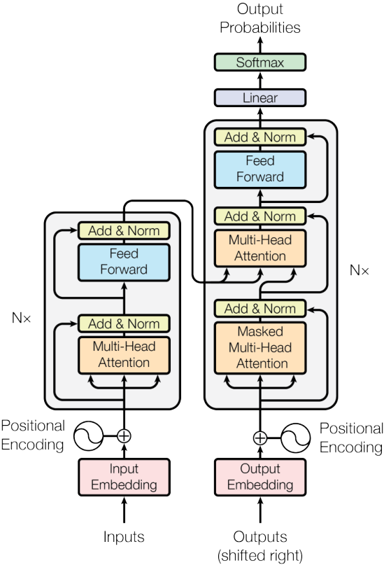
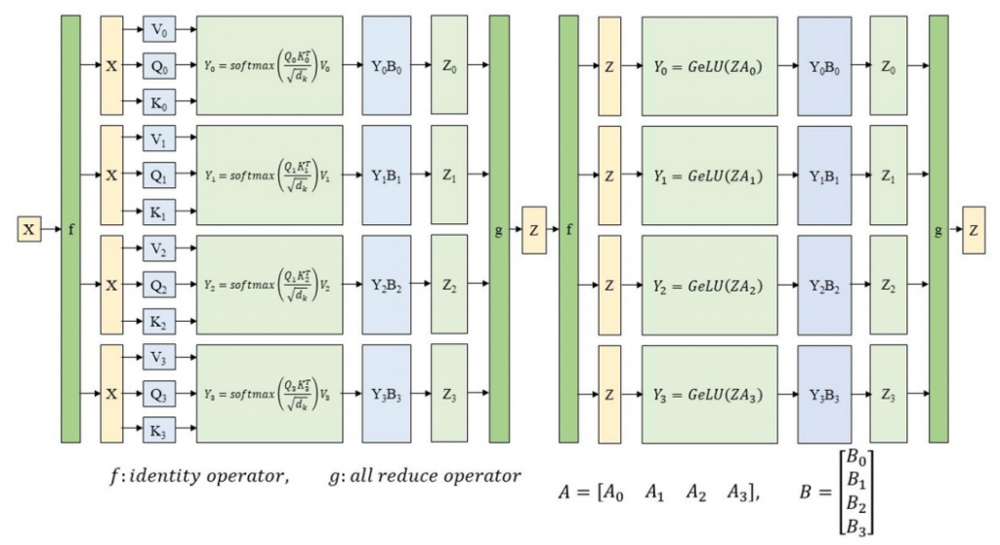
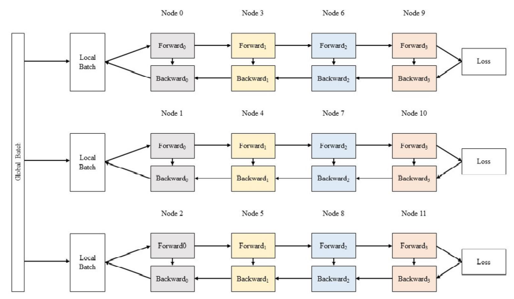

# 实验五：深度神经网络训练与加速

## 1 实验简介

**深度学习**（Deep Learning）是[机器学习](https://zh.wikipedia.org/wiki/机器学习)的分支，是一种以[人工神经网络](https://zh.wikipedia.org/wiki/人工神经网络)为架构，对数据进行表征学习的[算法](https://zh.wikipedia.org/wiki/算法)。深度学习能够取得如此卓越的成就，除了优越的算法、充足的数据，更离不开强劲的算力。近年来，深度学习相关的基础设施逐渐成熟，从网络设计时的训练、优化，到落地的推理加速，都有非常优秀的解决方案。其中，对于算力的需求最大的部分之一是网络的训练过程，它也因此成为 HPC 领域经常研究的话题。

**卷积神经网络**（Convolutional Neural Network, **CNN**）是一种[前馈神经网络](https://zh.wikipedia.org/wiki/前馈神经网络)，对于大型图像处理有出色表现。

**GPT**（Generative Pre-trained Transformer）是一系列自回归语言模型，目的是为了使用深度学习分类或产生人类可以理解的自然语言。GPT 系列由在旧金山的人工智能公司 OpenAI 训练与开发，模型设计基于谷歌开发的 transformer。

本次实验我们将完成 LeNet-5 和 GPT 模型的训练，并尝试使用各种优化技术加速训练过程。

> 考虑到部分同学此前对于深度学习并没有很多了解，本次实验的 LeNet-5 部分主要目的为引导大家熟悉深度学习的流程，因此只需要完成即可得到分数，而 GPT 部分主要目的是引导大家尝试对于大型网络的训练进行优化，因此我们会根据实现的模型规模和加速情况进行给分。

## 2 实验环境

请大家在我们提供的集群上创建一个开发环境为 PyTorch 的容器（要求最后在实验报告中展示环境基本信息）。容器中含有 Nvidia GeForce RTX 2080 Ti 及 PyTorch，无需自行配置。

## 3 实验基础知识介绍

### 3.1 网络模型

#### 3.1.1 CNN 卷积神经网络

卷积神经网络由一个或多个卷积层和顶端的全连通层（对应经典的神经网络）组成，同时也包括关联权重和池化层（pooling layer）。这一结构使得卷积神经网络能够利用输入数据的二维结构。与其他深度学习结构相比，卷积神经网络在图像和[语音识别](https://zh.wikipedia.org/wiki/语音识别)方面能够给出更好的结果。这一模型也可以使用[反向传播算法](https://zh.wikipedia.org/wiki/反向传播算法)进行训练。相比较其他深度、前馈神经网络，卷积神经网络需要考量的参数更少，使之成为一种颇具吸引力的深度学习结构。

#### 3.1.2 LeNet-5

LeNet-5是一个较简单的卷积神经网络。下图显示了其结构：输入的二维图像，先经过两次卷积层到池化层，再经过全连接层，最后输出每种分类预测得到的概率。


有关于其更详细的结构可以在[原论文](http://yann.lecun.com/exdb/publis/pdf/lecun-01a.pdf)中找到。

#### 3.1.3 GPT

在自然语言处理（Natural language processing, NLP）中，早期使用的是循环神经网络（Recurrent Neural Network, **RNN**）。RNN 与 CNN 这样的前馈网络不同，RNN 中存在反馈和隐藏单元，使它可以「记住」之前读到的内容。为了解决深层网络中梯度消失或爆炸的问题，引入了长短期记忆（Long short-term memory, **LSTM**）。而为了解决传统 RNN 只能记住前面的问题，提出了双向的 LSTM。在此基础上引入的注意力机制（attention），使得网络能注意句子中重要位置的信息，例如允许在翻译中可以改变词语的顺序。

不久后，研究者发现只靠注意力机制而无需 RNN 或 CNN，就能达到较好的效果，这就是 Transformer 模型。与 RNN 不同的是，Transformer 模型能够一次性处理所有输入数据。注意力机制可以为输入序列中的任意位置提供上下文。这种架构允许更高的并行度，并以此减少训练时间。

以下为 Transformer 的结构：包含编码器和解码器，都由多个多头自注意力机制和全连接层堆叠而成，层间和层内存在归一化操作；输入由词嵌入向量加上位置信息得出。



Transformer 的详细结构可参考[原论文](https://arxiv.org/abs/1706.03762)。

2018 年，OpenAI 提出了生成预训练 Transformer 模型（Generative Pre-trained Transformer, **GPT**）。与先前基于监督式学习的 NLP 模型不同，GPT 在预训练生成阶段是无监督的（不需要标注），只在需要适应特定任务的**微调**（fine-tuning）时需要监督，降低了大规模 NLP 模型的门槛。GPT 的结构是 12 层仅包含解码器的 Transformer。一年后的 GPT-2 是对 GPT 的直接放大，参数量和数据集都增加了一个量级，参数量达到了 15 亿，取得了更好的效果和迁移学习能力。下一代的 GPT-3 达到了 1750 亿参数，生成的文章已经很难与人类写的区分出来。在一些领域，GPT-3 也**不再需要**专门的微调，而只需要提供例子等文本交互即可完成任务。大家可能熟悉的 GitHub Copilot 也是 GPT 的一个主要应用。

可以查看 GPT-3 的[原论文](https://arxiv.org/abs/2005.14165)。

### 3.2 数据集

#### 3.2.1 MNIST 手写数字数据集

MNIST 数据集 (Mixed National Institute of Standards and Technology database) 是美国国家标准与技术研究院收集整理的大型手写数字数据库，包含 60,000 个示例的训练集以及 10,000 个示例的测试集。


MNIST 数据集下载：http://yann.lecun.com/exdb/mnist/index.html

#### 3.2.2 Web of Science 数据集

Web of Science 是一个付费的文献元数据库，通过校网可以免费使用。该数据集原先用于文本层次化分类，由于我们采用的是无监督学习的预训练，因此不关心它给出的标签，只要用目录下的 X 文本训练。元数据目录（包含摘要和关键词）也可以忽略。

数据集下载：https://data.mendeley.com/datasets/9rw3vkcfy4/6

## 4 实验步骤

### 4.1 LeNet-5 训练

#### 4.1.1 数据准备

我们建议利用 `torchvision` 提供的 `torchvision.datasets` 方法导入数据，`torchvision.datasets` 所提供的接口十分方便，之后你可以用 `torch.utils.data.DataLoader` 给你的模型加载数据。

此外，我们也欢迎你自定义你的 `Dataset` 类，这样做会给你带来额外的分数。为此，你需要继承 `torch.utils.data.Dataset` 并至少需要重写其中的 `__len__()` 和 `__getitem__()` 函数，[这里](https://pytorch.org/docs/stable/data.html)有官方对 `torch.utils.data` 类的介绍，它或许可以帮到你。

幸运的是，本次实验需要用到的 `MNIST` 数据集可用 `torchvision.datasets` 导入，下面对一些你可能会用到的参数简单加以说明

**注意：请在清楚参数含义后调用它们**

```Python
# MNIST
torchvision.datasets.MNIST(root, train=True, transform=None, target_transform=None, download=False)
```

一些重要的参数说明：

- root: 在 `MNIST`中是 `processed/training.pt` 和 `processed/test.pt` 的主目录
- train: `True` 代表训练集，`False` 代表测试集
- transform 和 target_transform: 分别是对图像和 label 的转换操作
- download: 若为 `True` 则下载数据集并放到 `root` 所指定的目录中，否则直接尝试从 `root` 目录中读取

你可以在[这里](https://pytorch.org/vision/0.8/datasets.html)获取更加详细的说明

#### 4.1.2 模型编写

##### 4.1.2.1 网络结构

`PyTorch` 提供了许多种定义模型的方式，最常用的一种是将网络结构以类保存，你应当首先继承 [torch.nn.Module](https://pytorch.org/docs/stable/generated/torch.nn.Module.html#torch.nn.Module)，并实现正向传播的 `forward` 函数，(为什么不用定义反向传播函数呢？因为你继承的 `nn.Module` 就是干这个事情的)。

下面为网络结构的一个 sample（但显然这样的网络并不能用于本次 Lab），本次实验中你需要自定义你的网络结构，以完成我们的分类任务：

```Python
import torch.nn as nn
import torch.nn.functional as F

class Model(nn.Module):
    def __init__(self):
        super(Model, self).__init__() # 利用参数初始化父类
        self.conv1 = nn.Conv2d(1, 20, 5)
        self.conv2 = nn.Conv2d(20, 20, 5)

    def forward(self, x):
        x = F.relu(self.conv1(x))
        return F.relu(self.conv2(x))
```

当然，你需要实例化你的模型，可以直接对模型打印以查看结构

```Python
model = Model()
print(model)
```

网络结构编写中一个很大的难点在于每一步的 tensor shape 需要匹配，请仔细检查你的代码来确保此部分的正确性。

##### 4.1.2.2 损失函数

常见的损失函数都被定义在了 `torch.nn`中，你可以在训练过程开始前将其实例化，并在训练时调用，例如：

```Python
criterion = torch.nn.CrossEntropyLoss()
```

##### 4.1.2.3 正向传播

正向传播是指对神经网络沿着从输入层到输出层的顺序，依次计算并存储模型的中间变量（包括输出）。
正向传播的过程在 `forward`中定义，对于模型实例，可以直接利用输入输出得到模型预测的结果。

```Python
y_pred = model(x)
```

##### 4.1.2.4 反向传播

反向传播（Backpropagation，BP）是“误差反向传播”的简称，是一种与最优化方法（如梯度下降法）结合使用的，用来训练人工神经网络的常见方法。该方法对网络中所有权重计算损失函数的梯度。这个梯度会反馈给最优化方法，用来更新权值以最小化损失函数。

在计算过模型的loss之后，可以利用 `loss.backward()` 计算反向传播的梯度，梯度会被直接储存在 `requires_grad=True` 的节点中，不过此时节点的权重暂时不会更新，因此可以做到梯度的累加。

##### 4.1.2.5 优化器

常用的优化器都被定义在了 `torch.optim` 中，为了使用优化器，你需要构建一个 optimizer 对象。这个对象能够保持当前参数状态并基于计算得到的梯度进行参数更新。你需要给它一个包含了需要优化的参数（必须都是 Variable 对象）的iterable。然后，你可以设置optimizer的参数选项，比如学习率，权重衰减，例如：

```Python
optimizer = optim.SGD(model.parameters(), lr=0.01, momentum=0.9)
optimizer = optim.Adam([var1, var2], lr=0.0001)
```

所有的optimizer都实现了step()方法，这个方法会更新所有的参数。或许你会在反向传播后用到它。

```Python
optimizer.step()
```

需要注意的是，在反向传播前，如果你不希望梯度累加，请使用下面的代码将梯度清零。

```Python
optimizer.zero_grad()
```

#### 4.1.3 训练过程

前文中已经定义了网络结构、损失函数、优化器，至此，一个较为完整的训练过程如下，需要注意的是，你的训练过程要不断从 `DataLoader` 中取出数据。

```Python
criterion = torch.nn.MSELoss(reduction='sum')
optimizer = torch.optim.SGD(model.parameters(), lr=1e-8, momentum=0.9)
for t in range(30000):
    # Forward pass: Compute predicted y by passing x to the model
    y_pred = model(x)

    # Compute and print loss
    loss = criterion(y_pred, y)

    # Zero gradients, perform a backward pass, and update the weights.
    optimizer.zero_grad()
    loss.backward()
    optimizer.step()
```

#### 4.1.4 TensorBoard

TensorBoard 是常用的训练过程可视化工具。请参考 [PyTorch](https://pytorch.org/tutorials/recipes/recipes/tensorboard_with_pytorch.html) 的官方教程完成配置。

#### 4.1.5 Tips

- `nn.functional.ReLU`  （简记为 `F.ReLU` ）和 `nn.ReLU` 略有不同，区别在于前者作为一个函数调用，如 4.3.1 中所示，而后者作为一个层结构，必须添加到 `nn.Module` 容器中才能使用，两者实现的功能一样，在 `PyTorch` 中，`nn.X` 都有对应的函数版本 `F.X`。
- 除了利用继承 `nn.Module` 来建立网络，不推荐但可以使用 `nn.ModuleList`, `nn.ModuleDict`，推荐使用 `nn.Sequential`直接定义模型
- 你可以定义如下的 `device` 变量，以便你的模型在没有 GPU 环境下也可以测试：

```Python
device = torch.device("cuda" if torch.cuda.is_available() else "cpu")

model = Model().to(device)
some_data = some_data.to(device)
```

- 相比于原生的 `PyTorch`，`PyTorch Lightning` 框架对其进行了更高层次的封装，很大程度上简化了模型定义、训练以及测试的步骤，使用 `PyTorch Lightning` 作为本次实验的加分项，官网链接已附在参考资料中。如果你能够在 TensorBoard 中将中间层可视化，你能得到更多的加分。

### 4.2 GPT 训练与加速

#### 4.2.1 文本数据预处理

预处理最主要的工作是分词（tokenize）。分词器将文本拆分成词，再转换成数字以供模型训练。由于句子长短不一，可能需要进行填充或截断，最后生成输入的张量。

分词的粒度，最自然的是按**单词划分**，例如英语中根据空格和标点符号划分，但生成的词表会很大，增加存储和计算复杂度；另一个极端是按**字母划分**，虽然词表会很小，但模型很难学到有意义的内容；因此现在一般使用**子词（subword）划分**，在词表中保留较短的常用词，生僻词则用常用词拼接而成。

常用的分词算法有字节对编码（Byte-Pair Encoding, **BPE**）、WordPiece、Unigram、SentencePiece 等，其中 GPT 用的是 BPE。BPE 从单个字母的词表开始，通过不断合并高频字母对，直到达到预定的词表大小。WordPiece 与 BPE 基本相同，合并策略有所区别。

具体原理介绍可参考 [https://huggingface.co/docs/transformers/tokenizer_summary](https://huggingface.co/docs/transformers/tokenizer_summary)，以及 [NLP BERT GPT等模型中 tokenizer 类别说明详解](https://cloud.tencent.com/developer/article/1865689)。

可以直接使用 [huggingface 的预训练分词器](https://huggingface.co/docs/transformers/preprocessing)中提供的 GPT-2 tokenizer，如选择自己训练 vocab 可以获得 bonus。

#### 4.2.2 基准代码构建与加速

请参考 3.1.3 中的模型结构描述完成基准代码的构建，并基于此进行训练加速。为了减轻工作量，此部分允许使用 huggingface transformer 等模型库，以及其他的分布式训练加速框架。但需要在报告里陈述你所采用的各项优化的原理、出发点和效果。

#### 4.2.3 多卡训练

单张GPU的显存和算力是有限的，随着模型大小的增长，我们需要多张GPU一起参与训练以获得更大的显存和更高的算力。多卡训练Transformer模型时常见的并行策略有**张量并行（Tensor Parallelism）**、**流水线并行（Pipeline Parallelism）**和**数据并行（Data Parallelism）**。

* 张量并行将模型层内的参数切分到不同设备进行计算,在Transformer中，注意和多层感知器(MLP)的张量在向前和向后计算时按行或列分割。
  
* 流水线并行将模型不同的层切分到不同设备进行计算，流水线中的每一设备接受上一节点的结果，并把自己的结果传递给下一设备。
  
* 数据并行则将全局批次大小（global batch size）按照流水线分组进行分割，每个流水线组都包含模型的一个副本，数据在组内按照局部批次规模送入模型副本，最后将各组得到的梯度进行加权平均得到总的梯度。
  

在pytorch、tensorflow等框架中都存在分布式训练的模块，为了减轻工作量，此部分也允许使用 huggingface accelerate 等模型库，以及其他的分布式训练加速框架。

#### 4.2.4 模型评分规模

对于以下的每个规模，你需要按照表格中给定的模型结构参数实现模型，并按照要求的 token 数量对模型进行训练。规定 token 数量训练结束后，若模型损失低于 7，认为模型训练成功，此时训练速度越快该测试点得分越高；否则认为模型训练失败，该测试点记零分。

1. 评分规模一

| Model size | Hidden size | Attention-heads | Layers | Sequence length | Tokens |
| :---: | :----------: | :--------------: | :----: | :-------------: | :-------------: |
| 117M |     768     |        12        |   12   |      1024      |      16M      |

2. 评分规模二

| Model size | Hidden size | Attention-heads | Layers | Sequence length |Tokens |
| :---: | :----------: | :--------------: | :----: | :-------------: |:-------------: |
| 307M |     1024     |        16        |   20   |      1024      |16M      |

3. 评分规模三

| Model size | Hidden size | Attention-heads | Layers | Sequence length |Tokens |
| :---: | :----------: | :--------------: | :----: | :-------------: |:-------------: |
| 566M |     1536     |        16        |   20   |      1024      |16M      |

4. 评分规模四

| Model size | Hidden size | Attention-heads | Layers | Sequence length |Tokens |
| :---: | :----------: | :--------------: | :----: | :-------------: |:-------------: |
| 1.2B |     1280     |        20        |   36   |      1024      |16M      |


## 5 实验任务与要求

1. 使用 `PyTorch` 实现最基本的卷积神经网络 LeNet-5，并在 MNIST 数据集上使用 GPU 进行训练，并对测试集进行测试。
2. 使用 `PyTorch` 及相关模型库实现类 GPT 网络，在 Web of Science 数据集上进行训练，并尝试对模型训练进行加速。
3. 你需要提交：

   1. 全部代码
   2. 实验报告，其中需要包含：
      1. 简要实验过程
      2. 贴上两个模型训练过程的 **GPU 占用率截图**（使用 `nvidia-smi` 查看）
      3. Tensorboard **两个模型的损失曲线、LeNet-5 的准确率曲线等截图**
      4. 对于 LeNet-5，你需要写明测试集上的**识别正确率**
      5. 对于 GPT，你需要写明每一个评分模型规模下训练完成的时间，最后的收敛情况，以及使用的加速策略
4. ***LeNet-5 部分不允许直接使用各种深度学习开发工具已训练好的 CNN 网络结构与参数。***
5. ***本次实验依然会进行查重，如果你参考了网络上的代码请在报告中列出，并体现出你的理解，否则一经查出视为抄袭***

## 参考资料

- `PyTorch` 框架 https://pytorch.org/
- `PyTorch Lightning` 框架 https://www.pytorchlightning.ai/
- MNIST 数据集 http://yann.lecun.com/exdb/mnist/index.html
- LeNet-5 网络结构 http://yann.lecun.com/exdb/lenet/
- GPT 网络介绍 https://en.wikipedia.org/wiki/GPT-2
