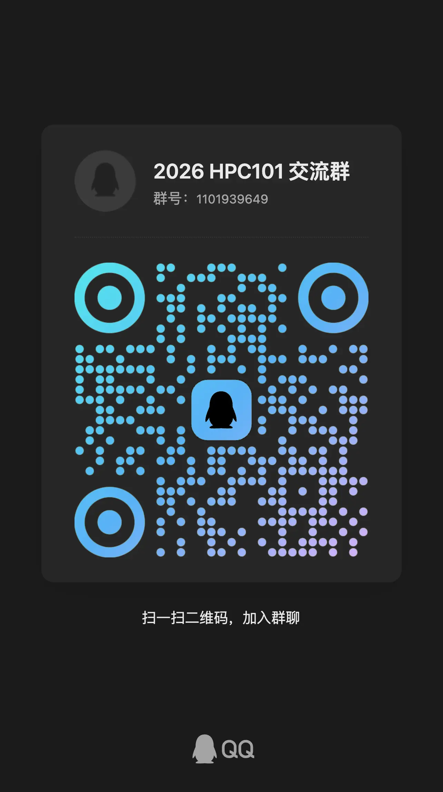

# 报名与选课

<!-- !!! quote inline end "欢迎扫码进入 2026 HPC101 课程交流群了解更多信息"

     -->
<!--
!!! warning "本课程不设置在选课系统中，有意的同学务必提前报名"

    本课程将在二轮选课后通过教学科直接将名单导入选课系统，不可以在选课系统中直接选课。

    有意选本课程的同学请不要在一轮二轮选课时选择其他“课程综合实践Ⅰ”课程，以免系统中出现冲突。

    被筛选的的同学仍可以参与其他课程的补选，我们会和教学科一起帮助你选课，不必担心没有课上。

请填写这份钉钉问卷：[HPC101 2026 报名表](https://alidocs.dingtalk.com/notable/share/form/v01meonarbWwEaraqXx_dv19yqvsgs3oebp3pcjys_1qX0QQ0)，务必仔细阅读问卷填写说明，确保填写的信息准确无误。问卷内容包括：

- **个人信息**：学号等信息由钉钉自动收集。
- **联系方式**：QQ、电话号码等。
- **个人简介（填写文本框）**：
    - **计科专业同学**：请简要介绍自己的技术栈、编程能力和经验、对 HPC 的了解程度等。
    - **非计科专业同学**：请简要介绍自己的专业背景、编程能力、对 HPC 的了解程度等。
- **实验报告（PDF 文件）**：

    - **建议**完成 [Lab 0 Linux Crash Course](lab/Lab0-LinuxCrashCourse/index.md) 并提交实验报告。
    - **必须**完成 [Lab 1 MiniCluster](lab/Lab1-MiniCluster/index.md) 并提交实验报告。

    !!! tip

        - 如果实验遇到困难，请及时在课程交流群内提问或私戳助教。
        - 如果因为时间安排等原因无法全部完成，可以提交部分完成的实验报告。

    我们会优先考虑实验完成度高的同学，而且实验本身是作为短学期的一次作业使用的。欢迎大家踊跃报名！

!!! warning "截止时间"

    报名截止时间为 2026 年 6 月 9 日 12:00:00。请务必在截止时间前提交报名表。
    我们会在 2026 年 6 月 9 日 23:00:00 前通知大家报名结果。 -->

!!! danger "截止时间"

    报名已结束

## FAQ

!!! question "感觉自己编程基础比较弱，适合选这门课吗？"

    大一期间，同学们一般都已经修过 **C 语言课程**（如《C 程序设计》和《数据结构基础》），具备一定的 C 语言基础。在超算短学期中，我们将接触的几种并行编程框架（如 **CUDA、MPI 和 OpenMP**）都是基于 C/C++ 语言的。只要你在这些课程的学习情况不是太差，就已经具备了修读本课程的**基础编程能力**。

!!! question "担心自己和“大神”差距很大怎么办？"

    不必担心。内容和形式对于大家来说都是**全新的**，几乎没有同学在大一及之前就接触过并行编程。大家基本都处于**同一起跑线**，主要差异在于编程语言的熟练程度，这会影响学习速度，但不会影响最终的学习成果。以往的经验来看，无论是否有 OI 基础，大家都能跟上进度。短学期的时间安排较为宽松（但请不要因此放松），大约**两周高密度学习**，之后有**两个月时间逐步消化并完成各个 Lab**，最后组队完成 Project。这样的安排也与超算竞赛的形式类似：与 CTF、ACM 等短时竞赛不同，**HPC 竞赛通常持续数月甚至半年**，有充足时间自主安排、深入研究、团队合作。我们也鼓励大家在学习过程中**多交流、互相帮助**。

!!! question "课程有名额限制吗？"

    教学科没有明确的名额限制，但我们会根据报名情况进行筛选。

!!! question "硕博可以选吗？"

    可以，同样由教学科导入系统。

!!! question "其他专业可以选吗？如何替换本专业培养方案的课程？"

    可以，一般是算作个性化学分。如果需要替换本专业培养方案的课程，请联系教学科确认。

    替换流程一般为：课程结束后在教务系统上免修申请（拿到学分后随时可申请），一般是学期初审核。

!!! question "可以旁听吗？"

    如果你因为时间冲突等原因无法选课，但仍然希望旁听课程内容，可以：

    - 在智云课堂上旁听该课程。
    - 通过课程仓库获取课程资料，我们会将实验文档、部分课件和代码等资料同步到本仓库。
    - 欢迎加入课程交流群，我们会在群内同步课程消息。

    如需申请集群账户以便进行实验和练习，请同样填写报名表，并选择“旁听”选项。由于集群计算资源有限，我们将同样根据报名情况进行筛选。

    我们为旁听同学提供实验环境，但不负责批改旁听同学实验报告。关于 OJ 评测等，与正常选课的同学共享 DDL，Lab 截止后可能无法继续提供环境支持。
