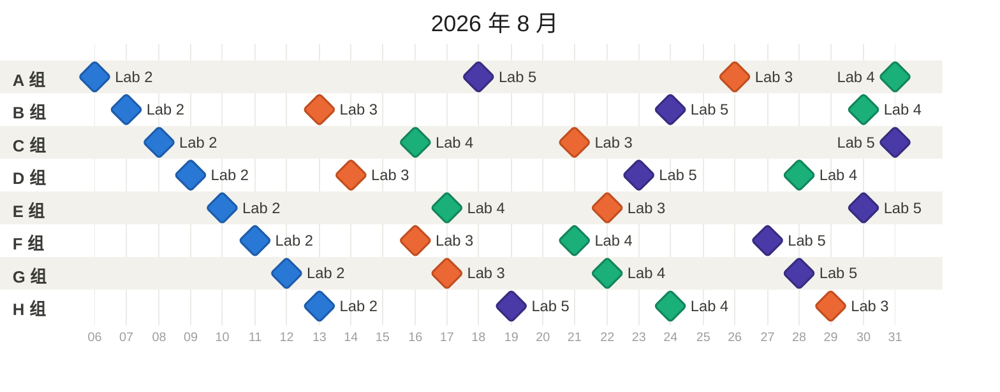
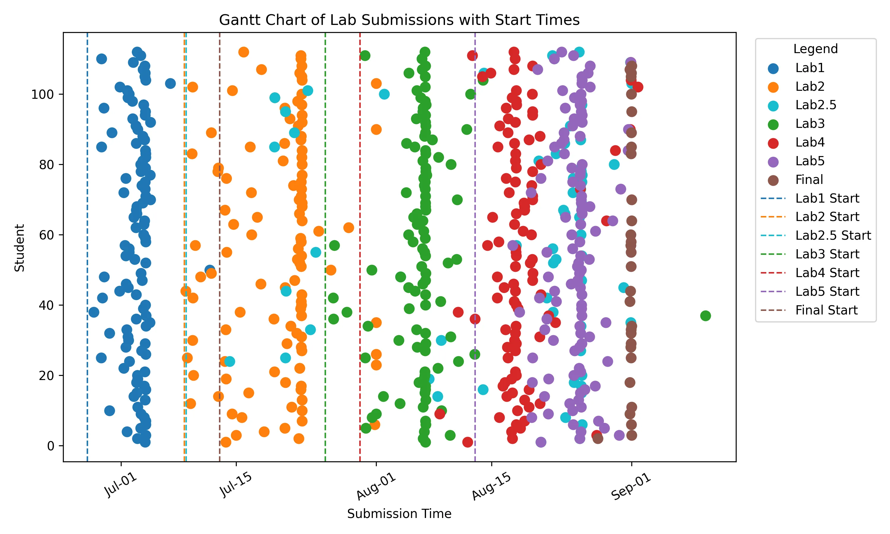
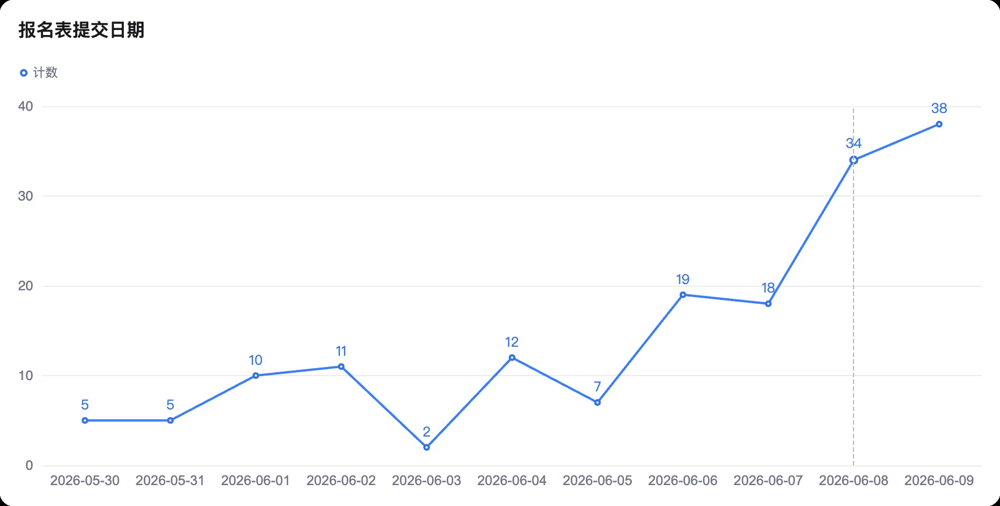

# 欢迎来到 HPC 101 超算短学期

## 课程信息

HPC 101 是浙江大学超算队开设的一门短学期课程，旨在帮助同学走进 Linux 和 HPC (高性能计算) 的世界，了解 HPC 领域的基本概念、超算的体系结构、编程技术等。

课程的正式名称是“课程综合实践 Ⅰ”，课程代码为 CS1030M，学分为 2.5 学分。

HPC 101 可以用来申请替代计算机学院非计科专业的短学期课程。

### 课程安排

- 上课时间：一般上午 8:30 开始，下午 14:00 开始，课时 3 个小时，没课的时间不用到教室
- 上课地点：紫金港北 3-312

| 时间              | 内容               | 讲师        |
| ---------------- | ------------------ | --------- |
| 2026-07-05 08:30 | 超算概述 | 陈建海老师 |
| 2026-07-06 14:00 | 集群软硬件及运维基础 | 胡笠桁/徐晨 |
| 2026-07-07 14:00 | HPC 中的计算机系统 - 1 | 刘烨 |
| 2026-07-08 14:00 | HPC 中的计算机系统 - 2 | 何水兵老师/宋浩喆 |
| 2026-07-10 14:00 | 向量化并行计算基础 | 陈宏哲 |
| 2026-07-11 14:00 | 高性能网络基础 | 朱宝林 |
| 2026-07-12 08:30 | OpenMP/MPI 并行计算基础 | 黄钰 |
| 2026-07-12 14:00 | 性能分析技术基础 Profiling | 郝星星 |
| 2026-07-13 08:30 | 高性能计算高级话题 | 王则可老师 |
| 2026-07-13 14:00 | CUDA 编程基础 | 王则可老师/陈楷骐 |
| 2026-07-14 08:30 | 华为 CANN |  |
| 2026-07-14 14:00 | 华为 HCCL |  |
| 2026-07-16 08:30 | 机器学习基础 | 赵彬彬老师 |
| 2026-07-16 14:00 | 机器学习基础 | 周俊康 |
| 2026-07-17 08:30 | 机器学习高级话题 | 庄博涵老师 |
| 2026-07-17 14:00 | 机器学习高级话题 | 张寅老师 |

### 课程实验

课程目前开放了 5 个实验，具体要求详见各实验文档：

- [Lab 1: 简单集群搭建](./lab/Lab1-MiniCluster/index.md)
- [Lab 2: MoE 的向量化计算](./lab/Lab2-Vectorization/index.md)
- [Lab 3: GDN Prefill 前向优化](./lab/Lab3-GDN-Prefill/index.md)
- [Lab 4: AMSS-NCKU 数值相对论程序优化](./lab/Lab4-AMSS-NCKU/index.md)
- [Lab 5: Gemma4 端到端推理优化](./lab/Lab5-Gemma4/index.md)

Lab 2 至 Lab 5 按分组（A–H 组）错开截止时间，**截止时间均为当日 23:59:59**。请在下图中找到自己的分组，确认各实验的 DDL（时间轴为 2026 年 8 月的日期，菱形颜色按实验区分）：

!!! note "分组 DDL 的编排规则"

    各组的 DDL 是按实验工作量加权（Lab 2 至 Lab 5 规模难度递增）排布的，使每组加权后的整体时间待遇基本一致。同组相邻两个实验的 DDL 至少间隔 5 天，同时考虑了Lab的资源使用特征以错开集群负载高峰。  
    分组是随机的，如果有特殊情况（如请假，有其他安排等），请在**DDL前**和助教联系。



Lab2 - Lab5 需在 [**课程平台**](https://platform.s.zjusct.io/assignments) 以及 **学在浙大** 提交，课程平台上会显示你的分组和截止时间，以及具体需要提交的文件。请将**报告PDF**同步提交到学在浙大。

!!! tip "Bonus 分数计算"

    每个实验会设置 Bonus 任务，Bonus 分数会添加在该实验的分数中。

!!! warning "迟交政策"

    在各实验的截止时间后再提交作业，将会在正常评分的基础上，扣除相应分数。具体扣分规则如下：

    按照每天5%的扣分率计算，时间细化到每小时，不足一小时按一小时计算，即每小时扣除0.2083%的分数。

    迟交将会对你的成绩不利，请务必按时提交作业。如果有特殊情况，请提前联系助教，事后再联系的不予认可。

    如果迟交导致的扣分达到100%或不提交，则该实验的作业成绩记为0分。

如果在做 Lab 过程中遇到问题或有其他疑问，欢迎在交流群内提问或私聊助教，我们会尽力解答。

## 公告（实时更新）

### [课程平台](./guide/index.md)

### New API 问题

本课程为同学提供一定额度的 LLM API 访问，请在使用前仔细阅读以下网络访问说明：

- **Web 控制台（获取 API Key）**：[newapi.s.zjusct.io](https://newapi.s.zjusct.io/)，使用 [ZJU Git](https://git.zju.edu.cn/) 账号登录，在「令牌管理（Token Management）」中创建令牌。
- **API 调用地址（仅限 API 调用，不可作为网页在浏览器中访问）**：
    - OpenAI 协议：`https://clusters.zju.edu.cn/newapi/v1`
    - Anthropic 协议：`https://clusters.zju.edu.cn/newapi`
- **可用模型**：
    - 每人每日限额 ¥2000
    - `hpc101-openai` 分组的 API Key 可以使用 `gpt-5.5` 模型（50 倍计价），该模型**仅能配合 Codex 使用**，其他 Agent 的兼容性不做保证。
    - `hpc101` 分组的 API Key 可以使用 `glm-5.2` 模型（1 倍计价，仅在夜间（20:00-07:00）可用）
    - 额度和倍率后续可能根据使用情况调整。

!!! tip "如果遇到问题，请带上 New API Web 控制台的「使用日志（Usage Logs）」中的错误请求截图发送到课程交流群询问"

!!! tip "示例配置"

    注意，示例配置均为 YOLO 模式（为 Agent 开放所有权限），比较危险，你可能需要根据自己的需求对 Agent 的权限进行限制。

    === "Codex"

        ```toml title="~/.codex/config.toml"
        model = gpt-5.5
        model_provider = "zjusct"
        model_reasoning_effort = "medium"
        disable_response_storage = true

        approval_policy = "never"
        sandbox_mode = "danger-full-access"

        [sandbox_workspace_write]
        network_access = true

        [model_providers.zjusct]
        name = "zjusct"
        base_url = https://clusters.zju.edu.cn/newapi/v1
        wire_api = "responses"
        ```

        ```json title="~/.codex/auth.json"
        {
            "OPENAI_API_KEY": "<your-api-key>"
        }
        ```


    === "OpenCode"

        ```jsonc title="~/.config/opencode/opencode.jsonc"
        {
            "$schema": "https://opencode.ai/config.json",
            "model": "zjusct/glm-5.2",
            "permission": {
                "external_directory": "allow",
            },
            "provider": {
                "zjusct": {
                    "npm": "@ai-sdk/openai-compatible",
                    "name": "ZJUSCT New API",
                    "options": {
                        "baseURL": "https://clusters.zju.edu.cn/newapi/v1",
                        "apiKey": "<your-api-key>"
                    },
                    "models": {
                        "glm-5.2": {},
                    }
                }
            }
        }
        ```

### 网络问题

课程服务分布在两个域名下，**可达性取决于你所在的网络**：

| 域名 | 公网可访问 | 说明 |
| ---- | :--------: | ---- |
| `clusters.zju.edu.cn` | 是 | 公网可访问。该域名采用 **DNS 分离解析（split-horizon DNS）**，在校园网内外会解析到不同的地址，但均可正常访问。 |
| `*.s.zjusct.io`、`*.clusters.zjusct.io` | 否 | **仅校园网内可访问**。例如用于获取 API Key 的 `newapi.s.zjusct.io`。 |

因此，请特别注意你的**网络与代理（proxy）配置，尤其是 DNS**：

- **在校园网内**（如连接 ZJUWLAN 或紫金港有线网络）时，请确保使用**校园 DNS**（即校园网通过 DHCP 自动下发的 DNS 服务器），而不要手动改用公共 DNS（如 `8.8.8.8`、`114.114.114.114`），否则部分校内服务域名可能解析错误。**使用 VPN / 代理时**，请注意其 DNS 解析行为。若代理把域名解析到了非校园地址，或使用公共 DNS 解析校园内网域名，会导致访问失败。
- **在校外**时，可直接调用 `clusters.zju.edu.cn` 的 API 地址；但用于获取 API Key 的 Web 控制台（`newapi.s.zjusct.io`）只能通过校园网（或 VPN）访问。

## 导言：Hello HPC World

第一次听到 HPC 这个词，你是不是觉得很陌生？没关系，我第一次听到时也是一头雾水。几乎没有学生在学习这门课程之前了解过 HPC，这是一个相对陌生的领域。在这门课程中，我们会一步步地带你走进 HPC 的世界，带你了解这个领域的基础知识和技术，带你感受到 HPC 的魅力。

!!! quote inline end ""

    

    最快的超级计算机 Frontier 每秒能提供 $10^{18}$ 次浮点运算，相当于 $10^6$ 张 4090 显卡。

### HPC 是什么？

HPC 是 High Performance Compute 的缩写，意思是高性能计算，通常是指通过**聚合计算能力**来提供比传统计算机或服务器更强大的计算性能，处理海量多维数据集（大数据），并以极高的速度解决复杂问题。HPC 系统的运行速度通常要比最快的商用台式机、笔记本电脑或服务器系统快一百万倍以上。

标准计算系统主要使用**串行计算**来解决问题，它将工作负载分成一系列任务，然后在同一处理器上依次执行这些任务。相比之下，HPC 则利用以下技术来提高计算速度：

- **大规模并行计算**。并行计算是在多个计算机服务器或处理器上同时运行多个任务。大规模并行计算则是使用数万到数百万个处理器或处理器核心的并行计算。
- **计算机集群**（也称为 HPC 集群）。HPC 集群由多个联网的高速计算机服务器组成，并有一个集中式调度器来管理并行计算工作负载。这些计算机被称为节点，可能会使用高性能多核 CPU，如今更有可能使用 GPU（图形处理单元），它们非常适合处理严格的数学计算、机器学习模型和图形密集型任务。单个 HPC 集群可能包括 100,000 个或更多节点。
- **高性能组件**：HPC 集群中的所有其他计算资源（网络、内存、存储和文件系统）都是高速、高吞吐量、低延迟组件，可以与节点同步，优化集群的计算能力和性能。

下图展示了一个典型的 HPC 集群架构：


HPC 提供的超高性能，使得它在很多领域都有着广泛的应用。随着 AI 技术的发展，**HPC 应用也已成为 AI 应用的代名词**，尤其是机器学习和深度学习应用。HPC 应用正在推动以下领域的持续创新：

- 科学研究。HPC 在科学研究中的应用包括气候建模、天气预报、宇宙学、地震学、生物学、物理学、化学、材料科学和地球科学。这些学科需要处理大量数据、进行复杂的模拟和建模，以及进行大规模的数据分析。
- 医疗保健、基因组学和生命科学。人类基因组测序的首次尝试耗时长达 13 年；而如今，HPC 系统可以在不到一天的时间内完成这项工作。在医疗保健和生命科学领域，HPC 的其他应用还包括药物发现和设计、癌症快速诊断和分子建模。
- 金融服务。除了自动交易和欺诈检测，HPC 还支持蒙特卡罗模拟和其他风险分析方法的应用。
- 政府和国防。在这一领域，两个日益增长的 HPC 用例是天气预报和气候建模，这两个用例都涉及处理大量的历史气象数据和气候相关数据点每日数百万次的变化。其他政府和国防应用包括能源研究和情报工作。
- 能源。能源相关 HPC 应用包括地震数据处理、油藏模拟和建模、地理空间分析、风场模拟和地形测绘。

### 在这个短学期课程中，你会学到什么？

在这门课中，你能够学习到的知识和技能大致如下：

<div class="grid cards" markdown style="grid-template-columns: 1fr">

- :construction_site:{ .lg .middle } **前置知识：计算机体系结构**

    ***

    要学习并行程序设计，首先要理解现有的硬件（如 CPU、GPU 等）是如何工作的、为并行做了哪些优化。并行化的目的之一，是为了最大化利用现有的硬件资源，对大量数据进行快速操作。对于 CPU，我们会了解指令集、存储器层次结构和局部性原理，知道 Cache 一致性问题的原因和解决办法，掌握 SIMD（Single Instruction Multiple Data）并行方法。对于 GPU（以 NVIDIA 为主），我们会了解流处理器（Stream Processor，SP）、CUDA Core（甚至是 Tensor Core）的组织方式，掌握 CUDA 编程的基本方法。上面只提及了最重要的知识，你应该能体会到内容非常之多且陌生，这些内容大概会用 4 天的时间完成讲授。在这门短学期课程中，我们只需要对这些知识有基本的了解即可。一定程度上，对硬件的理解越深入，并行编程技术也会越好，所以这是值得在日后深入学习的模块。

- :computer:{ .lg .middle } **核心技术：并行编程技术**

    ***

    在本课程中，我们将学习三种经典的并行编程技术：OpenMP/MPI 和 CUDA。前者两者主要用于 CPU，后者用于 GPU（当然二者可以结合使用，不过课程中不会涉及）。表面上，学习一些 API 就能写并行程序了，但性能并不会得到很大的提升。基于对现有硬件的理解进行针对性的优化是非常重要的一环。

    在基本的 API 之外，我们还将学习并行算法，深入体会不同算法的特点，以及如何根据硬件特性进行选择。并行编程的难点在于数据的并行化和任务的并行化，这需要对算法有深入的理解。因此你也需要经常阅读经典例程、他人的优化思路和效果，学习并积累经验。对 CUDA 来说，多看例程尤为重要。CUDA 提供了多层次的 API，我们使用的主要是 CUDART（CUDA RunTime API）。它与具体的 CUDA 硬件无关，但你仍然需要考虑数据会如何被存储在具体的硬件上、如何优化存取、运算和线程调度。比如，在 2080Ti 上调优过的程序，在 A100 上的性能表现可能会大打折扣。

- :penguin:{ .lg .middle } **辅助技术：Linux 相关**

    ***

    本课程全程使用 Linux 环境。如果你对 Linux 系统有过一定了解和经验，或是曾经用服务器搭建过网站并持续使用等，那么你的实验流程会十分舒适。不过没有基础也不必担心，集群使用 Slurm 和 Lmod 进行管理，配置环境和运行任务都非常方便。我们也会在课程中讲解如何使用这些工具，以及如何在集群上提交任务。如果出现问题，你可以随时询问运维人员，他们会很乐意帮助你解决问题。

- :robot:{ .lg .middle } **附加技术：科学计算、AI 相关**

    ***

    在第 2 个 Lab，你会接触科学计算中关键的工具：NumPy。在最后一个 Lab，你将会揭开大模型的面纱，自己编写一个 Transformer，并进行训练和推理。课程会花约 2 天时间讲授 AI 基础。这次实验，或许是你第一次真正理解那些神秘的 AI 究竟是怎么用实际的代码构建起来的。

</div>

### 修读建议

!!! quote inline end ""

    

阅读完上面的介绍，相信你已经初步了解了自己将要学习哪些内容。再回顾一下计算机系的培养方案，你会看见这些内容贯穿了整个计算机专业的学习。因此，有同学在 98 上评论“没有 ICS（计算机系统概论）的话，这门课就是最有用的”，这句话是相当正确的。HPC101 是一门非常有挑战性的课程，知识量大且难，注重实践操作，但也是一门非常有趣的课程。如果你对计算机体系结构、并行编程、AI 等方面有浓厚的兴趣，那么这门课程将会是你的一次深度学习之旅。

或许在进入计算机专业以来，你已经多次听到「CS 人的基本素养就是自学能力」这样的言论。这句话在 HPC101 中将会得到最好的体现。HPC 领域的知识广阔，我们难以在 14 \* 2 个课时里向你讲授所有内容。事实上，这些课时只够上导论，能够让你对相关知识有一个基本的了解就已经达到了目的。因此，你注定要在课后花费一定时间和精力去深入学习，在 Lab 中尝试应用并真正理解。我们会提供一些资源和参考资料，帮助你更好地学习。希望你能够在课程中坚持**自发地学习**，收获满满的知识和技能。我们也非常鼓励你在学习过程中多多提问，多多交流，这样你会学得更快更好。

### 资源推荐

- [thu-cs-lab/HPC-Lab-Docs 清华大学高性能计算导论实验文档](https://lab.cs.tsinghua.edu.cn/hpc/doc/)：作为国内超算课程建设的标杆，清华大学的 HPC 课程已经开设多年，积累了丰富的经验和资料。
- [Linux 101 - USTC](https://101.lug.ustc.edu.cn/)：中科大拥有国内高校最大的 Linux User Group，其开设的 Linux 入门课程内容丰富，适合初学者。
- [《并行程序设计导论》](https://book.douban.com/subject/20374756/)（An Introduction to Parallel Programming）
    - 很薄，介绍了 OpenMPI 和 OpenMP（Pthreads 我们不学，也基本不会接触到）。讲解的内容浅显易懂，适合快速入门。
- Python 编程三剑客：从上至下，书籍难度逐渐递增。如果你对自己的编程能力不太自信，选择第一本书。如果你编程能力好，但没接触过 Python，可以选择第二本。如果你对 Python 有一定了解，非常推荐你直接从第三本开始做一些简单的项目。
    - [《Python 编程 : 从入门到实践（第 3 版）》](https://book.douban.com/subject/36365320/)（Python Crash Course）
        - 项目推荐：数据可视化、Web 应用程序
    - [《Python 编程快速上手：让繁琐工作自动化》](https://book.douban.com/subject/35387685/)（Automate the Boring Stuff with Python, 2nd Edition: Practical Programming for Total Beginners）
        - 项目推荐：从 Web 抓取信息，处理 CSV 文件和 JSON 数据，保持时间、计划任务和启动程序
    - [《Python 极客项目编程》](https://book.douban.com/subject/27050630/)（Python Playground: Geeky Projects for the Curious Programmer）
        - 项目推荐：模拟生命、图片之乐
- [《Programming Massively Parallel Processors: A Hands-on Approach, 4th Edition》](https://www.oreilly.com/library/view/programming-massively-parallel/9780323984638/)
    - CUDA 编程目前仍在活跃发展中，因此没有合适的中文书籍。要想学习到最新的 CUDA 技术，只能看英文书籍，而且要看最新版，超过 5 年的书籍均可能过时。

## 历史

本节记录 HPC 101 超算短学期课程的历史版本、重要里程碑和一些统计数据。

- 课程规模：

    | 年份 | 课程规模                       |
    | ---- | ------------------------------ |
    | 2026 | 112 |
    | 2025 | 109（本）+ 3（研）+ 7（旁听） |
    | 2024 | 41                             |
    | 2023 | 36                             |
    | 2022 | 29                             |

- Lab 提交时间分布（绘制 Python 脚本位于 [index.assets/statistics/submission.py](index.assets/statistics/submission.py)）：

    | 年份 | 分布                                                             |
    | ---- | ---------------------------------------------------------------- |
    | 2025 |  |
    | 2024 |  |

- 报名表提交时间分布：

    | 年份 | 分布                                                               |
    | ---- | ------------------------------------------------------------------ |
    | 2026 |  |
    | 2025 |  |
