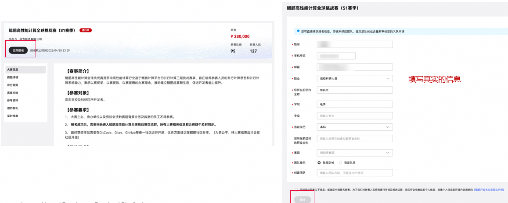

# Final Project 大作业

!!! tip 重要通知
    大作业截止日期另行通知，请务必在截止日期前提交。答辩目前定于 **9 月 2 日**，具体安排后续通知。

## 导言

本次大作业为参加[鲲鹏高性能计算全球挑战赛（S2赛季）](https://www.hikunpeng.com/developer/contests/details/bbb369de3db64a8eac4c84731f65fd53?module=045f13ddf1b74c4e800f18110be31382)。比赛包含三道独立赛题，分别考察**卷积计算（CONV）**、**三角方程组求解（TRSM）**和**复数矩阵乘法（ZGEMM）**的优化能力。三道题目均在鲲鹏 920F 平台上运行，要求在保证数值正确性的前提下最大化性能（GFLOPS）。

三道赛题**均需完成**。每道题目的源码包可从以下链接下载：

| 赛题 | 源码下载 |
|------|---------|
| CONV（卷积优化） | [conv.zip](https://public-download.obs.cn-east-2.myhuaweicloud.com/kunpeng/conv.zip) |
| TRSM（三角求解优化） | [trsm.zip](https://public-download.obs.cn-east-2.myhuaweicloud.com/kunpeng/trsm.zip) |
| ZGEMM（复数矩阵乘法优化） | [zgemm.zip](https://public-download.obs.cn-east-2.myhuaweicloud.com/kunpeng/zgemm.zip) |

本次大作业需要各组就优化内容进行**答辩**，答辩目前定于 **9 月 2 日**，形式暂定为线上讲解，包括 7 分钟 PPT 展示、3 分钟提问，具体安排后续通知。

## 算力资源获取

鲲鹏挑战赛使用国家超级计算深圳中心（深超算）的鲲鹏 920F 集群。获取算力资源需要完成以下三个步骤：

### 步骤一：报名参赛

前往[鲲鹏高性能计算全球挑战赛 S2 赛季报名页面](https://www.hikunpeng.com/developer/contests/details/bbb369de3db64a8eac4c84731f65fd53?module=73f97ae0254849a0ae55e8d6c32c1c29)，点击报名并填写资料（需填写**真实的姓名与学校**）。



### 步骤二：开通集群账号

签署 [VPN 账号安全使用承诺书](files/用户模板-VPN账号安全使用承诺书.docx)（注意需要**手写签名**后提供 PDF 版本），连同真实姓名与手机号码一并发送至邮箱 `chenhuiyi6@h-partners.com`。账号开通后会以邮箱形式反馈账号密码。

### 步骤三：登录集群

下载并安装 [aTrust 客户端](https://vpn.nsccsz.cn/portal/#/login)，根据 [外部用户访问深圳超算力指引](files/外部用户访问深圳超算力指引.docx) 登录后即可访问集群。

## 实验要求

### 提交要求

请在截止日期前将大作业的所有提交内容压缩为 zip 格式，提交到学在浙大上，每个小组仅需组长提交一份，提交时请确保压缩包内包含以下内容：

- 每道赛题的文件夹下：
    - 一份 `README.md` 文件，说明如何编译和运行代码；
    - 修改后的源文件（`conv2d.c` / `trsm.c` / `zgemm.c`）和运行脚本；
    - 最终运行结果截图或命令行输出。
- 一份 20 页以内的实验报告 PDF（请不要复制粘贴具体代码，可以结合伪代码说明），应至少包含以下内容：
    - 成员姓名和学号；
    - 优化方法和思路；
    - 最终运行结果截图；
    - 每一步优化的加速效果和分析。
- 一份答辩 PPT。

提交的目录结构应如下所示：

```text
project
├── CONV
│   ├── README.md
│   ├── conv2d.c
│   └── other necessary files
├── TRSM
│   ├── README.md
│   ├── trsm.c
│   └── other necessary files
├── ZGEMM
│   ├── README.md
│   ├── zgemm.c
│   └── other necessary files
├── report.pdf
└── presentation.pptx
```

## 题目一：CONV —— 二维卷积优化

### 题目介绍

卷积计算在深度学习和信号处理中广泛应用。给定输入图像（`float` 精度）和卷积核，通过卷积核在输入图像上滑动计算加权求和，得到输出特征图。

基线实现为朴素四重循环，仅在外层循环使用 OpenMP 并行化：

```c
void conv2d(const float* input, int inputHeight, int inputWidth,
            const float* kernel, int kernelHeight, int kernelWidth, float* output)
```

输出尺寸为 `(inputHeight - kernelHeight + 1) × (inputWidth - kernelWidth + 1)`，每个输出元素的计算量为 `kernelHeight × kernelWidth × 2` 次浮点运算。

### 实验任务

在本实验中，正确但未经优化的基准代码已经提供，您将被要求对其进行优化以提高性能。下载 [conv.zip](https://public-download.obs.cn-east-2.myhuaweicloud.com/kunpeng/conv.zip) 获取源码。本实验只需要修改 `conv2d.c`，`bench_conv.c` 不可修改。

#### 测试用例

| 用例 | 图像尺寸 | 卷积核尺寸 |
|------|----------|-----------|
| 1 | 4096 × 6144 | 39 × 39 |
| 2 | 6144 × 4096 | 41 × 41 |
| 3 | 4256 × 6390 | 55 × 55 |
| 4 | 6390 × 4256 | 81 × 81 |

运行方式：

```bash
OMP_NUM_THREADS=38 numactl -N 1 ./conv2d_test 4096 6144 39 39 1
OMP_NUM_THREADS=38 numactl -N 1 ./conv2d_test 6144 4096 41 41 1
OMP_NUM_THREADS=38 numactl -N 1 ./conv2d_test 4256 6390 55 55 1
OMP_NUM_THREADS=38 numactl -N 1 ./conv2d_test 6390 4256 81 81 1
```

参数依次为 `rows cols kernel_rows kernel_cols test_runs`。正确性容差为 `1e-5`。

## 题目二：TRSM —— 三角方程组求解优化

### 题目介绍

三角方程组求解（TRSM）是线性代数中的基本操作，广泛用于矩阵分解、最小二乘求解等场景。给定下三角矩阵 $L$ 和右侧矩阵 $B$，求解 $LX = B$。

基线实现为逐列前代法，OpenMP 在列维度上并行：

```c
void l_trsm(int m, int n, const double* L, int lda, double* B, int ldb)
```

其中 $L$ 为 $m \times m$ 的下三角矩阵，$B$ 为 $m \times n$ 的右侧矩阵，均为 `double` 精度。该函数的浮点运算量为 $m^2 \times n$。

### 实验任务

在本实验中，您将被要求优化 `l_trsm` 函数的性能。下载 [trsm.zip](https://public-download.obs.cn-east-2.myhuaweicloud.com/kunpeng/trsm.zip) 获取源码。本实验只需要修改 `trsm.c`，`bench_trsm.c` 不可修改。编译时需要链接 `-lkblas`。

#### 测试用例

| 用例 | M | N |
|------|-----|------|
| 1 | 512 | 19968 |
| 2 | 2432 | 17024 |
| 3 | 17024 | 512 |

运行方式：

```bash
OMP_NUM_THREADS=38 numactl -N 1 ./trsm_test 512 19968 1
OMP_NUM_THREADS=38 numactl -N 1 ./trsm_test 2432 17024 1
OMP_NUM_THREADS=38 numactl -N 1 ./trsm_test 17024 512 1
```

参数依次为 `m n test_runs`。正确性容差为 `1e-12`。

## 题目三：ZGEMM —— 复数矩阵乘法优化

### 题目介绍

复数矩阵乘法在量子计算、信号处理等领域有重要应用。计算 $C = \alpha \cdot A \times B + \beta \cdot C$，其中 $A$ 为 $M \times K$，$B$ 为 $K \times N$，$C$ 为 $M \times N$，均为 `double _Complex` 精度。

基线实现为标准三重循环，支持行主序/列主序和转置选项。竞赛测试仅使用行主序、无转置（`CblasRowMajor, CblasNoTrans, CblasNoTrans`）：

```c
void cblas_zgemm(const enum CBLAS_ORDER Order, const enum CBLAS_TRANSPOSE TransA,
                 const enum CBLAS_TRANSPOSE TransB, const int M, const int N,
                 const int K, const void* alpha, const void* A, const int lda,
                 const void* B, const int ldb, const void* beta, void* C, const int ldc)
```

复数矩阵乘法的浮点运算量为 $8 \times M \times N \times K$。

### 实验任务

在本实验中，您将被要求优化 `cblas_zgemm` 函数的性能。下载 [zgemm.zip](https://public-download.obs.cn-east-2.myhuaweicloud.com/kunpeng/zgemm.zip) 获取源码。本实验只需要修改 `zgemm.c`，`bench_zgemm.c` 不可修改。

#### 测试用例

| 用例 | M | N | K |
|------|------|------|-----|
| 1 | 7427 | 7427 | 256 |
| 2 | 14848 | 14848 | 256 |
| 3 | 37360 | 8192 | 512 |

运行方式：

```bash
OMP_NUM_THREADS=38 numactl -N 1 ./zgemm_test 7427 7427 256 1
OMP_NUM_THREADS=38 numactl -N 1 ./zgemm_test 14848 14848 256 1
OMP_NUM_THREADS=38 numactl -N 1 ./zgemm_test 37360 8192 512 1
```

参数依次为 `M N K test_runs`。正确性容差为 `1e-10`。

## 评分方式

大作业评分将参考各赛题的最终性能（GFLOPS）和优化思路等因素综合评定，不唯性能指标论。