# 实验二：MoE 的向量化计算


!!! info "实验信息"

    负责助教：郝星星, 胡哲文

## 实验目的

从 Mixtral 到 DeepSeek-V3、Qwen、GLM，**MoE（Mixture of Experts，混合专家）**已经成为大模型的主流架构。本次实验将带你实现并优化一个 DeepSeek-V3 风格的量化 MoE 层前向计算，在这个过程中：

- 理解 MoE 的计算模式：路由、专家分发、加权合并
- 理解量化推理（W8A8）中整数与浮点混合的计算流水线
- 掌握向量化优化的通用方法：识别热点、数据重排、提高算术强度
- Bonus：在 RISC-V 平台上实现 MoE 算子（待更新）

## 知识讲解：MoE 是什么

### 从稠密 FFN 到稀疏专家

Transformer 中参数量最大的组件是 FFN（前馈网络）。MoE 的想法是：与其让所有 token 共享一个大 FFN，不如准备 $E$ 个“专家”FFN，让每个 token 只经过其中得分最高的 $K$ 个（$K \ll E$）。这样，总参数量可以显著增长，而每个 token 只激活少量专家，从而在一定程度上分离模型容量与激活层的大小，也就是单 token 计算量和其占用的内存；当然，与此同时，路由和分发会带来额外控制开销。

本实验采用 [DeepSeek-V3](https://arxiv.org/abs/2412.19437) 的 MoE 架构，它与早期 MoE（如 Mixtral 的 8 专家选 2）相比有几个标志性设计：

- **更细粒度的专家**：专家数量更多、单个专家更小（V3 是 256 个路由专家选 8 个）。同样的总参数量下，专家组合的可能性大大增加；
- **共享专家**：一个所有 token 都必须经过的专家，负责学习通用知识，让路由专家专注于特化知识；

本实验的目标即为在 CPU 上实现 DeepSeek-V3 的 MoE 前向计算，并在保证正确性的前提下尽可能优化其性能。

我们可以简单的从参数量和前向计算量理解这种设计。一个 SwiGLU 专家包含两个 $D\to H$ 投影和一个 $H\to D$ 投影，因此忽略偏置时的权重数为

$$
P_{expert}=HD+HD+DH=3DH.
$$

代入 $D=256,H=128$，每个专家有

$$
3\times256\times128=98\,304
$$

个权重。17 个专家一共包含 $1\,671\,168$ 个专家权重，但每个 token 只激活 4 个路由专家和 1 个共享专家，对应的专家矩阵乘加数约为

$$
(K+1)\times3DH
=5\times98\,304
=491\,520\ \text{MACs}
$$

这与相同参数量的单个稠密 SwiGLU FFN 相比，计算量显著降低。若稠密 FFN 具有相同的总参数量，其中间维度需要取为

$$
H_{\mathrm{dense}}=17H=2176.
$$

此时每个 token 都必须经过全部参数，对应的矩阵乘加数为

$$
3DH_{\mathrm{dense}}
=17\times3DH
=1\,671\,168\ \text{MACs}.
$$

相比之下，MoE 每个 token 只计算 5 个激活专家，因此其专家计算量仅为稠密 FFN 的

$$
\frac{(K+1)3DH}{17\cdot3DH}
=\frac{5}{17}
\approx29.4\%.
$$

也就是说，在总专家参数量相同的情况下，MoE 将每个 token 的专家计算量降低了约 $70.6\%$，理论上约为稠密 FFN 的 $1/3.4$。这体现了 MoE 的核心优势：保留较大的总参数容量，同时只激活其中一小部分参与当前 token 的计算。

### 单层 MoE 的前向流程

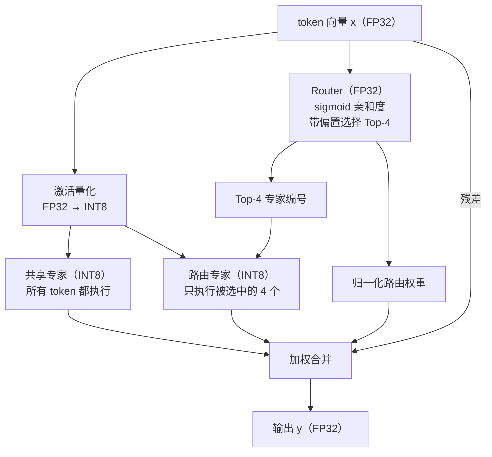

对每个 token $x_t \in \mathbb{R}^{D}$，先计算路由 logit 和原始亲和度：

$$
z_{t,e}=r_e^\top x_t,\qquad
s_{t,e}=\sigma(z_{t,e})=\frac{1}{1+e^{-z_{t,e}}},
\qquad e=1,\ldots,E.
$$

再定义被选中的专家集合

$$
\mathcal S_t
=\operatorname{TopK}_{e\in\{1,\ldots,E\}}
\bigl(s_{t,e}+b_e\bigr),
\qquad |\mathcal S_t|=K.
$$

路由权重只对 $\mathcal S_t$ 中的原始亲和度进行归一化：

$$
g_{t,e}=
\begin{cases}
\displaystyle
\frac{s_{t,e}}{\sum_{j\in\mathcal S_t}s_{t,j}},
& e\in\mathcal S_t,\\[8pt]
0,&e\notin\mathcal S_t.
\end{cases}
$$

共享专家和每个被选中的路由专家都是 SwiGLU 结构：

$$
\operatorname{FFN}_e(x)
=W_d^{(e)}\left(
\operatorname{SiLU}\!\left(W_g^{(e)}x\right)
\odot W_u^{(e)}x
\right),
\qquad
\operatorname{SiLU}(v)=\frac{v}{1+e^{-v}}.
$$

其中 $\odot$ 表示逐元素相乘

最后合并：

$$
y_t=x_t+\operatorname{FFN}_{shared}(x_t)
+\sum_{e\in\mathcal S_t}g_{t,e}\operatorname{FFN}_e(x_t).
$$

### 量化推理：W8A8

真实的推理引擎很少用 fp32 存储和计算专家权重：int8 量化能把内存占用和带宽需求降到 1/4，同时精度损失在可接受范围内。而现代 SIMD 指令集处理 int8 的吞吐量也远高于 fp32，尤其在 Intel 引入 AMX 矩阵加速单元之后。本实验采用简化的 **W8A8**（权重、激活都量化到 int8）：

$$
x_q = \mathrm{round}\left(\frac{x}{s_x}\right), \quad s_x = \frac{\max_i |x_i|}{127}
$$

- 激活使用 per-token scale，每个 token 向量单独计算 $s_x$
- 每个权重矩阵一个 scale

int8 $\times$ int8 的结果在 int32 中累加，随后乘以 scale 反量化回 fp32：

$$
W x \approx (W_q x_q) \cdot s_W s_x
$$

??? example "举例：一个三维 W8A8 点积"

    考虑一个输入向量和权重矩阵中的一行：

    $$
    x=
    \begin{bmatrix}1.00\\-0.49\\0.25\end{bmatrix},
    \qquad
    w=
    \begin{bmatrix}0.40\\-0.80\\1.20\end{bmatrix}.
    $$

    输入的 per-token 缩放因子为 $s_x=1/127$，因此

    $$
    x_q=\operatorname{round}
    \begin{bmatrix}127\\-62.23\\31.75\end{bmatrix}
    =\begin{bmatrix}127\\-62\\32\end{bmatrix}.
    $$

    假设这一行权重所在矩阵的最大绝对值也是 $1.20$，则该矩阵的缩放因子为 $s_W=1.20/127$，对应的量化权重为

    $$
    w_q=\operatorname{round}
    \begin{bmatrix}42.33\\-84.67\\127\end{bmatrix}
    =\begin{bmatrix}42\\-85\\127\end{bmatrix}.
    $$

    整数点积在 INT32 中计算：

    $$
    \begin{aligned}
    a_{int}
    &=w_q^\top x_q\\
    &=42\times127+(-85)\times(-62)+127\times32\\
    &=14\,668.
    \end{aligned}
    $$

    反量化后得到

    $$
    \hat y=a_{int}s_Ws_x
    =14\,668\times\frac{1.20}{127}\times\frac{1}{127}
    \approx1.09130.
    $$

    原始 FP32 点积为

    $$
    y=w^\top x
    =0.40\times1.00+(-0.80)\times(-0.49)+1.20\times0.25
    =1.092.
    $$

    两者相差约 $6.99\times10^{-4}$。（已足够小）

## 知识讲解：x86-64 SIMD 优化

如果需要快速复习 SIMD，可以查看[课程 PPT](./doc/向量化计算.pdf)。
或者⽤最直⽩、最不绕弯⼦的⽅式告诉你：SIMD就是让原本一条只能干一个事情的指令变成一次可以干一堆相似的事情。那么聪明的你马上就会想到：☝🏼🤓这样不就可以让计算机一个单位时间干更多的事情了吗？没错这就是最简单的通过指令级并行的方式进行加速的方式，超算，亦如反掌！！！下面我们将介绍用于lab2实验的机器上所支持的SIMD指令，带大家理解具体的SIMD指令是怎么工作，以及可以如何由程序员来手动调用从而主动实现代码性能优化的。

### AVX 向量指令扩展

x86 架构下 Intel 和 AMD 两家的处理器提供了诸如 SSE，AVX 等 SIMD 指令集，一条指令可以同时操作多个数据进行运算，大大提高了现代处理器的数据吞吐量。

现代编译器在高优化等级下，具有自动向量化的功能，对于结构清晰，循环边界清晰的程序，编译器的自动向量化已经可以达到很优秀的程度了。然而，编译器的优化始终是保守的，很多情况下编译器无法完成使用 SIMD 指令进行向量化的工作，为了追求性能，高性能计算领域经常需要手写 SIMD 代码进行代码优化。

显然直接手写汇编指令过于困难，在 C 语言环境下，Intel 提供了一整套关于 SIMD 指令的函数封装接口和指令相关行为的参照手册，可以在[Intel Intrinsics Guide](https://www.intel.com/content/www/us/en/docs/intrinsics-guide/index.html)中找到。笔者是比较推荐使用ai来辅助你理解不同指令的实际功能的，你甚至可以直接用它帮助你快速的找到可以用AVX指令来替换优化的代码位置的，这一点可以放心。当然如果你感兴趣，也推荐你去理解阅读相关技术文档做深入的理解。

使用这些函数 API 需要 include 对应的头文件，不同 SIMD 指令集需要的头文件不同，具体需要参考 Intel 相关文档。

```c
#include <smmintrin.h>
#include <emmintrin.h>
#include <immintrin.h>
```

另外深入到这个级别的优化已经开始需要考虑具体处理器的体系结构细节了，如某个架构下某条指令的实现延时和吞吐量是多少，处理器提供了多少向量寄存器，访存的对齐等等。这种时候编译器具体产生的汇编代码能比 C 语言代码提供更多的信息，你能了解到自己使用了多少寄存器，编译器是否生成了预期外的代码等等。

??? example "示例：编译器如何自动生成 AVX-512 指令"

    下面的例子使用循环完成 16 个 32-bit 整数的对应元素相加。代码中的 `__restrict` 告诉编译器两个数组不会重叠；而 16 个 `int` 恰好可以装满一个 512-bit 的 ZMM 寄存器(后面会详细介绍)。

    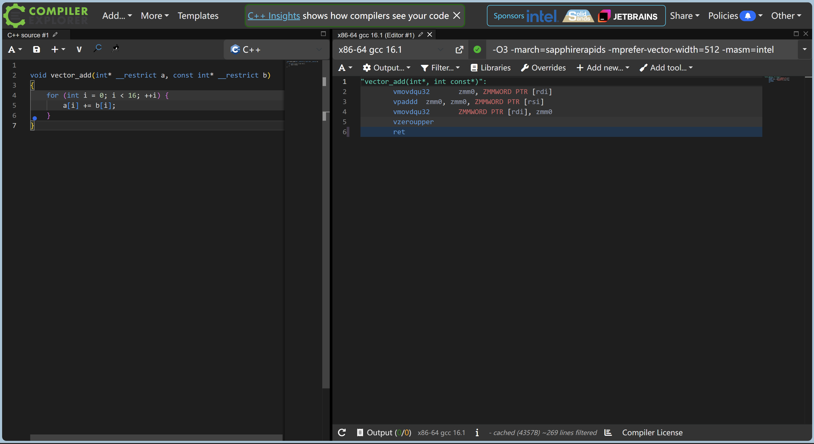

    在 `-O3 -march=sapphirerapids -mprefer-vector-width=512` 等编译选项下，编译器自动消除了原来的循环：`vmovdqu32` 将 16 个整数加载到 ZMM 寄存器，`vpaddd` 并行完成 16 次整数加法，随后另一条 `vmovdqu32` 将结果写回内存。可以看到，对于结构清晰、没有数据依赖的循环，现代编译器能够自动生成高效的 SIMD 指令。

    你可以在 [Compiler Explorer](https://godbolt.org/) 中修改代码和编译选项，实时观察生成的汇编。需要注意的是，当编译器无法确认指针是否重叠、循环之间是否存在数据依赖，或认为向量化收益不足时，它可能会选择更保守的实现。你也可以用它来观察编译器是不是实现了你想要的优化

### AVX-512

[AVX-512](https://www.intel.com/content/www/us/en/docs/intrinsics-guide/index.html) (Advanced Vector Extensions 512-bit) 是 x86 架构中目前的 SIMD 指令集，通过 512 位宽寄存器和增强指令集为高性能计算提供突破性加速。在矩阵乘法等线性代数运算中，能发挥巨大作用：

- **并行计算优势**：AVX 的 512 位寄存器能单周期处理 16 个 32 位浮点数（FP32），相比标量运算提升 16 倍吞吐量
- **内存访问优化**：`vmovaps` 等指令支持对齐内存加载，减少数据搬运开销
- **融合运算能力**：`vfmadd` 等融合乘加指令在单周期完成乘法和累加操作

可以来看一下 SIMD 指令集的演进：

| 指令集        | 推出年份  | 寄存器宽度   | 寄存器数量   | 峰值吞吐增益（FP32）   |
|--------------|----------|------------|------------|----------------------|
| MMX          | 1996     | 64-bit     | 8          | 2x (INT8)            |
| SSE          | 1999     | 128-bit    | 8          | 4x (FP32)            |
| AVX/AVX2     | 2011/2013| 256-bit    | 16         | 8x (FP32)            |
| AVX-512      | 2016     | 512-bit    | 32         | 16x (FP32)           |
| AMX          | 2021     | 1024-bit   | 8 (TILE)   | 专用矩阵加速         |

AVX-512 VNNI (Vector Neural Network Instructions) 专为卷积神经网络设计，提供了整数与低精度浮点数的运算加速指令。在本次实验中，我们对 8-bit 相乘、32-bit 累加的操作，除了使用传统的数据类型转换指令，还可以借助 AVX-512 VNNI 指令直接一步到位，减少操作次数。

!!! info "实验平台上的 AVX-512"

    本实验的主线目标平台为 [Intel Sapphire Rapids（第四代 Xeon Scalable）](https://www.intel.com/content/www/us/en/developer/articles/technical/fourth-generation-xeon-scalable-family-overview.html) CPU。在 64-bit 模式下，每个逻辑处理器可以使用 32 个 512-bit ZMM 寄存器（`zmm0`–`zmm31`），合计可以暂存 2 KiB 向量数据；此外还有 8 个掩码寄存器（`k0`–`k7`），用于选择向量中参与运算的元素。这些是指令能够直接访问的架构寄存器。指令执行时，CPU 会通过寄存器重命名将它们映射到内部的物理寄存器，从而让多条没有数据依赖的指令并行推进。

    Sapphire Rapids 的多类 AVX-512 指令都具有并行执行能力。FMA、常见的浮点加法和乘法、整数加法以及位运算的峰值吞吐率都可达到每周期两条 512-bit 指令，也就是 0.5 cycles/instruction。以 FMA 为例，一条 FP32 FMA 同时处理 16 个元素，并为每个元素完成一次乘法和一次加法，因此理论峰值为每核心每周期 64 次 FP32 浮点运算。相关能力可参考 [Intel AVX-512 概览](https://www.intel.com/content/www/us/en/products/details/processors/xeon/features/advanced-vector-extensions-512.html)。

    访存指令也有独立的并行通路：当数据已经位于 L1 Cache 中时，每个核心的理想吞吐率可达每周期两条 512-bit 加载指令，或每周期一条 512-bit 存储指令。乱序执行会把加载、计算和存储安排到不同的执行端口上，使它们在时间上相互重叠。数据重排和除法等指令使用的专用资源较少，吞吐率通常低于上述常见指令。分析具体指令时，可以查询 [Intel Intrinsics Guide](https://www.intel.com/content/www/us/en/docs/intrinsics-guide/index.html) 中的延迟和吞吐率数据。

    或许合适的指令重排可能可以更好的利用这个硬件特性？你可以思考一下有没有必要，如果有必要什么时候是很必要的, 想明白也可以写进自己的优化思路哦。

### AMX 高级矩阵扩展

AMX 是 Intel 推出的一种矩阵扩展。它使用最大为 1024 Bytes 的二维 Tile 寄存器保存矩阵分块，并通过专用的 TMUL 单元完成矩阵乘加。与逐条处理向量的 AVX-512 相比，AMX 可以在寄存器中复用更大的数据块，减少重复加载和存储，同时让一条指令驱动多周期的矩阵计算。Sapphire Rapids 上的 AMX 支持 INT8 和 BF16 输入，并将乘加结果累加到 INT32 或 FP32 中，因此特别适合大语言模型和深度学习中的低精度矩阵运算。

#### 硬件结构

AMX 的硬件结构由两大部分组成：Tile 和 Accelerator。

- Tile 是存储数据的 tmm 寄存器，每个 1024 Byte (1KB) 大小，目前共有 8 个（不过从官方文档的更新来看，最新的芯片应该支持 16 个 Tile 了）
- Accelerator 是对这些数据进行的运算，目前只有一个 TMUL，用来实现 $C[M][N] += A[M][K] * B[K][N]$。

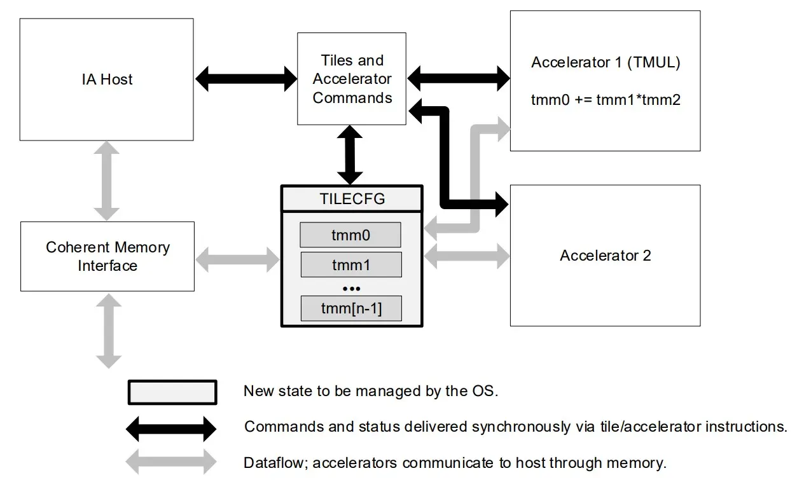

#### Tile Config 配置

AMX 运算由 Tile Config (TILECFG) 来控制，它的格式如下：

```text
format of memory payload. each field is a byte.
0: palette_id
1: startRow (8b)
2-15: reserved (must be zero)
16-17: tile0.colsb -- bytes_per_row
18-19: tile1.colsb
20-21: tile2.colsb
...
46-47: tile15.colsb
48: tile0.rows
49: tile1.rows
50: tile2.rows
...
63: tile15.rows
```

#### AMX 矩阵乘法详解

AMX 的 TMUL 是每个核心内专用的矩阵乘加单元，直接读取和写入 Tile 寄存器。以 Sapphire Rapids 上的满尺寸 Tile 点积指令为例，一条指令发射后，结果约在 52 个周期后可用；TMUL 流水线每隔 16 个周期可以启动一条新的、没有数据依赖的 Tile 点积指令。因此，程序可以交错执行多组独立的矩阵累加，以隐藏单条指令的延迟并接近 TMUL 的峰值吞吐率。

本实验的专家权重和量化激活都是有符号 INT8，因此对应的核心指令是 `TDPBSSD`（intrinsic 为 `_tile_dpbssd`）。它完成的仍然是普通矩阵乘加：

$$
C_{M\times N}^{\mathrm{int32}}
\mathrel{+}=
A_{M\times K}^{\mathrm{int8}}
B_{K\times N}^{\mathrm{int8}}.
$$

TMUL 每次取连续的 4 个 INT8 元素做点积，并将结果累加到一个 INT32 元素中。对于第 $m$ 行、第 $n$ 列和第 $k$ 组输入，它计算：

$$
C_{m,n}\mathrel{+}=
\sum_{r=0}^{3}A_{m,4k+r}B_{4k+r,n}.
$$

因此，逻辑矩阵 $B$ 需要按照 TMUL 读取四元素点积的顺序进行打包：

$$
B_{\mathrm{pack}}[k][4n+r]=B[4k+r][n],\qquad r=0,1,2,3.
$$

下面用一组完整的 Tile 展示从逻辑矩阵乘法到 TMUL 执行的过程。令 $M=16$、$K=64$、$N=16$：$A$ 是 $16\times64$ 的 INT8 矩阵，$B$ 是 $64\times16$ 的 INT8 矩阵，$C$ 是 $16\times16$ 的 INT32 矩阵，三者恰好各占 1 KiB。

<div class="amx-tile-flow">
  <figure class="amx-tile-flow__panel">
    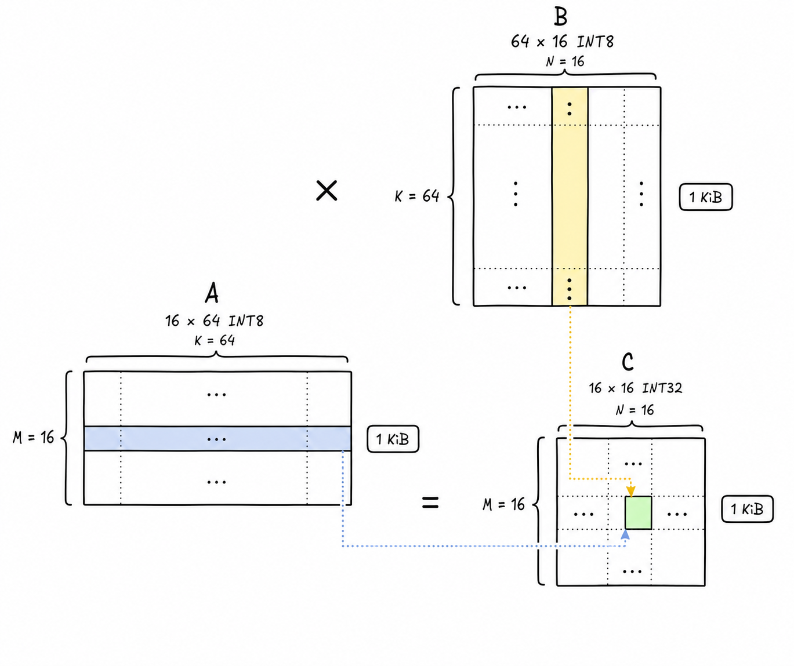
    <figcaption>
      <strong>1. 逻辑矩阵乘法</strong>
      <span>A（16×64，INT8）× B（64×16，INT8）= C（16×16，INT32）。</span>
    </figcaption>
  </figure>

  <div class="amx-tile-flow__arrow" aria-hidden="true">→</div>

  <figure class="amx-tile-flow__panel">
    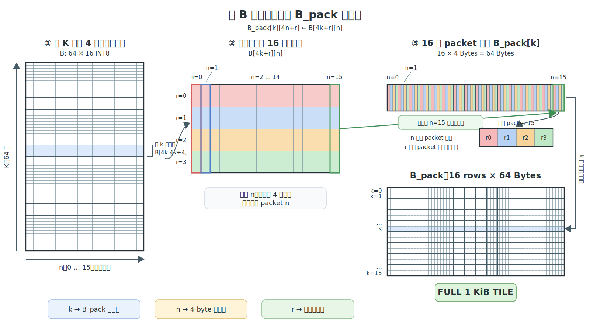
    <figcaption>
      <strong>2. 打包 B 矩阵</strong>
      <span>沿 K 维每 4 行切出一个条带；条带中每一列形成一个 4-byte 小组，16 个小组组成 B<sub>pack</sub> 的一行。</span>
    </figcaption>
  </figure>

  <div class="amx-tile-flow__arrow" aria-hidden="true">→</div>

  <figure class="amx-tile-flow__panel">
    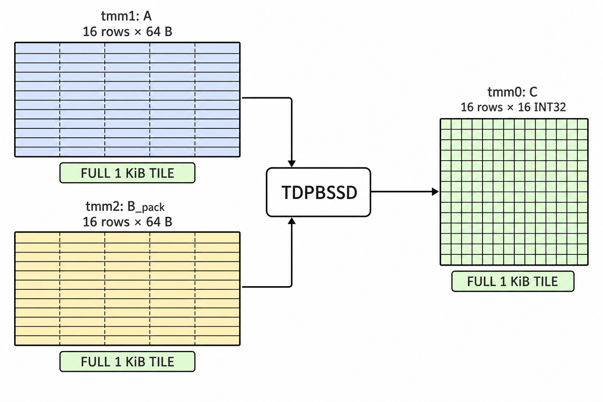
    <figcaption>
      <strong>3. 执行 Tile 点积</strong>
      <span>A、B<sub>pack</sub> 和 C 分别装入一个 Tile，由 <code>_tile_dpbssd</code> 完成 INT32 累加。</span>
    </figcaption>
  </figure>
</div>

逻辑矩阵 $B$ 虽然也是 1 KiB，但它有 64 行，不能直接装入一个最多容纳 16 行的 Tile。第 $k$ 个四行条带 $B[4k:4k+4,:]$ 对应 $B_{\mathrm{pack}}$ 的第 $k$ 行：固定输出列 $n$ 后，该列上的 4 个 INT8 组成一个 4-byte 小组；令 $n$ 从 0 遍历到 15，得到一行 64 Bytes；令 $k$ 从 0 遍历到 15，得到完整的 16 行 Tile。点击任一子图可以查看原始尺寸。


进一步的，对于已经初步了解cache的工作逻辑的大家，很容易发现，这一个重排后的矩阵和一般的矩阵存储的物理排布顺序是不一致的，写代码的时候麻烦是一回事，这种跳跃的读取容易带来很不好的缓存行为，会降低缓存命中率，带来运行速度的下降。
故而如果这一个需要重排的tile对应的矩阵如果不是运行时变化的，那么在计算前对其进行整体的重排，以保证完全连续的访问就变得尤为重要，这就是为什么我要让你实现`preprocess`这一个预打包函数的原因：你可以在这里重新排布/打包权重。


!!! hit

    或许有人到这里就会问：“猪脚猪脚！我们前面介绍的MoE的一个token和expert的计算过程不是一个矩阵向量的计算过程吗？但是你刚刚讲的AMX指令是用在矩阵矩阵的乘法上的欸，这都对不上啊咋搞！” 恭喜你能独立想到这一步很能说明你的观察很敏锐。但是你刚刚脑内构建的MoE计算的过程是以一个token的视角来想的，或许你可以尝试从一个expert的角度的视角来想想呢？就提示到这~

## 知识讲解：OpenMP 多线程并行

前面的 AVX-512 和 AMX 都是在**一个 CPU 核心内**提高数据并行度。当一个计算节点提供多个 CPU 核心时，还可以把相互独立的任务交给多个线程同时执行，这就是线程级并行（TLP）。

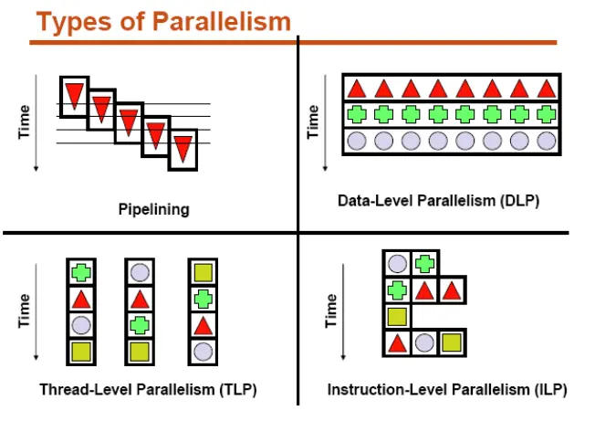

OpenMP 是一套基于编译指令的共享内存并行编程模型。程序仍然使用普通的 C/C++ 编写，编译器看到 `#pragma omp ...` 后，负责生成线程创建、任务分配和同步代码。最常见的写法是：

```cpp
#pragma omp parallel for
for (int i = 0; i < n; ++i) {
    output[i] = compute(input[i]);
}
```

进入这段循环时，OpenMP 创建一个线程组，将不同的循环迭代分给各个线程。所有线程完成自己的迭代后，再继续执行后面的代码。实验提供的 CMake 配置已经为 `student/moe_opt.cpp` 启用 OpenMP，因此可以直接使用这些编译指令。只有调用 `omp_get_thread_num()` 等运行库函数时，才需要额外包含 `<omp.h>`。

### 变量作用域与归约

OpenMP 并行区域中的变量分为共享变量和线程私有变量：

- 在并行区域外定义的输入和输出指针默认由线程共享；
- 循环变量以及循环体内声明的普通局部变量默认线程私有；
- `static` 变量和全局缓冲区仍然是共享的，不能直接当作每个线程的临时空间；
- 可以用 `private`、`firstprivate` 和 `reduction` 显式描述变量的使用方式。

当多个线程需要共同计算一个和、最大值或最小值时，可以使用 `reduction`。OpenMP 会先为每个线程保存局部结果，最后再进行合并：

```cpp
float sum = 0.0f;
#pragma omp parallel for reduction(+:sum)
for (int i = 0; i < n; ++i) {
    sum += values[i];
}
```

浮点加法不满足结合律，因此并行归约的求和顺序可能与串行版本不同。这里产生的舍入误差通常可以接受，但仍应通过实验提供的正确性检查确认结果。

### 调度方式与负载均衡

`schedule` 子句决定循环迭代如何分配给线程：

| 调度方式 | 特点 |
| --- | --- |
| `schedule(static)` | 提前连续分块，调度开销最低，访存连续 |
| `schedule(dynamic, chunk)` | 线程完成一块后再领取下一块 |
| `schedule(guided)` | 开始分配大块，随后逐渐减小块大小 |

动态调度并非总是更快。若各次迭代耗时相近，`static` 通常具有更低的运行时开销和更连续的内存访问。可以用 `schedule(runtime)` 配合 `OMP_SCHEDULE` 环境变量，在不重新编译的情况下比较不同策略。

### 复用并行区域

连续使用多个 `parallel for` 会多次进入和退出并行区域。如果几个循环属于同一段计算流程，可以用
一个 `parallel` 区域包住它们，再用 `omp for` 分配每个循环的迭代：

```cpp
#pragma omp parallel
{
    #pragma omp for schedule(static)
    for (int i = 0; i < count; ++i) {
        temporary[i] = normalize(input[i]);
    }

    // 此处存在隐式 barrier，第二个循环可以安全读取 temporary。
    #pragma omp for schedule(static)
    for (int i = 0; i < count; ++i) {
        output[i] = transform(temporary[i]);
    }
}
```

每个 `omp for` 末尾默认包含一个隐式 barrier。只有后续代码不依赖该循环的完整结果时，才能添加
`nowait` 去掉这次同步；否则某些线程可能在所需数据尚未写完时就开始读取。

更完整的指令与子句列表可以查阅 [OpenMP 6.0 Reference Guide](https://www.openmp.org/wp-content/uploads/OpenMP-RefGuide-6.0-OMP60SC24-web.pdf)。

### MoE 中的任务划分

OpenMP 只负责“把循环迭代分给线程”，哪些迭代能够同时执行仍然需要由你判断。在本实验中，你可以从三个粒度考虑任务划分，并根据实际情况选择具体使用哪一种划分：

| 并行对象 | 适用情况 | 需要注意的问题 |
| --- | --- | --- |
| token | 不同 token 的前向计算相互独立 | $N=1$ 时没有并行度；大 batch 通常最适合这种划分 |
| expert | 已经按专家聚集 token，希望每个线程处理若干专家 | 路由不均衡会导致每个专家的 token 数不同，需要考虑动态调度 |
| 投影矩阵的行或 Tile | token 很少，但单次投影足够大 | 粒度较细，线程调度和同步开销可能超过计算时间 |


## 代码框架

**实验代码位于文档仓库的 `src/lab2/` 目录下。**

```text
src/lab2
├── CMakeLists.txt
├── main.cpp              # driver（评测时替换为原版）
├── include
│   └── moe.h             # 问题规模、权重结构体、接口声明
├── src                   # 框架代码（评测时替换为原版）
│   ├── moe_ref.cpp       # 标量参考实现（正确性基准）
│   └── data.cpp          # 数据初始化与正确性检查
└── student               # ★ 你的代码（只有这个目录会被收取）
    └── moe_opt.cpp       # preprocess + moe_forward_optimized
```

本实验的 token 数 $N$ 通过 `num_tokens` 参数传入。嵌入维度 $D = d_{model}$、隐藏层维度 $H = d_{ff}$、专家数 $E$ 和每个 token 选取的专家数 $K$（Top-$K$）由 driver 在计时前写入结构体 `MoEWeights`，`preprocess` 与 `moe_forward_optimized` 从中动态读取。

`moe.h` 同时给出各维度的上界（便于静态分配缓冲区），并保证 $D$、$H$ 均为 64 的倍数：

| 常量 | 含义 | 上界 |
| ---- | ---- | ---- |
| `MAX_NUM_TOKENS`  | token 数 $N$ | 1024 |
| `MAX_D_MODEL`     | 隐藏维 $D$   | 1024 |
| `MAX_D_FF`        | 专家中间维 $H$ | 512 |
| `MAX_NUM_EXPERTS` | 路由专家数 $E$ | 512 |
| `MAX_TOP_K`       | 选取专家数 $K$ | 4 |

!!! danger "修改范围限制"

    **你只能修改 `student/moe_opt.cpp`**。评测时，`student/` 之外的所有文件
    （driver、头文件、参考实现、CMakeLists）都会被替换为原版——所以就算你在别处改了什么，
    评测时也不会生效。你可以在自己的文件里自由添加辅助函数、头文件引用、全局缓冲区等，
    只要实现声明在 `moe.h` 中的接口函数即可。

`student/moe_opt.cpp` 需要实现两个函数：

```cpp
// 计时开始前调用一次。你可以在这里对权重做重排/预打包
void preprocess(MoEWeights& w) {}

void moe_forward_optimized(const float* x, const MoEWeights& w, float* y,
                           int num_tokens) {
    moe_forward_ref(x, w, y, num_tokens);
}
```

!!! warning "preprocess 不要原地修改 `w` 的权重"

    `preprocess` 的正确用法是**读** `w` 中的原始权重，把重排/打包后的结果**写到你自己的缓冲区**
    （例如全局变量），随后 `moe_forward_optimized` 从新分配的缓冲区中读取。**不要把重排结果写回 `w.w_gate` 等数组、
    也不要在原地覆盖它们**。

```bash
cd src/lab2
cmake -B build
cmake --build build
./build/lab2 128 256 128 16 4      # N D H E K（S3 场景的形状，见下文）
./build/lab2 1 1024 512 16 4 2000  # 可选第 6 个参数指定迭代次数
./build/lab2 128 256 128 16 4 2000 --benchmark  # 测试模式，跳过 baseline 循环
```

!!! note "正确性如何判定"

    int8 矩阵乘本身是精确的，但它周围的 fp32 环节（SiLU、缩放、求和顺序）在向量化改写后
    难免有 ulp 级差异——这种差异一旦落在重量化$\mathrm{round}(h / s_h)$ 的舍入边界上，
    就会让一个 int8 值差 $\pm 1$，再经 down 投影摊到整行输出上。因此 `check_result`
    不做逐元素比对，而是检查**每个 token 的相对 L2 误差**（$< 2\times10^{-2}$）和**全局相对
    RMSE**（$< 2\times10^{-3}$）。

## 任务：优化 MoE 前向

在 `student/moe_opt.cpp` 中重写整个前向计算，使其在保证正确性的前提下尽可能快。评分依据端到端加速比（`Speedup`）。

### 评测场景

评测会在四个场景上进行：

| 编号 | $N$ | $D$ | $H$ | $E$ | $K$ |
| ---- | --- | --- | --- | --- | --- |
| S1   | 1 | 256 | 128 | 16  | 4 |
| S2   | 1 | 1024 | 512 | 16 | 4 |
| S3   | 128 | 256 | 128 | 16 | 4 |
| S4   | 1024 | 512 | 128 | 512 | 2 |

!!! tip "优化思路提示"

    动手写 SIMD 之前，先想清楚算法层面的问题：

    - Baseline 的访存模式好吗？参考实现逐 token 计算，每个 token 都要完整读一遍它所选专家的
      全部权重，这显然不是个好主意。
    - 数据布局：`preprocess` 允许你把权重重排成对向量指令友好的布局。
    - 编译器在 `-O2` 下已经会做一定程度的自动向量化。看看编译器生成的汇编（`objdump -d` 或
      [Compiler Explorer](https://godbolt.org/)），确认你的手写优化真的比自动向量化强。
    - 本实验主线目标平台为 Intel Sapphire Rapids。如果你追求较高的性能，一定要使用 **Intel AMX** 矩阵加速单元。

### 性能优化的好伙伴：Profiler 工具

!!! warning "容器内的 VTune Profiler 使用限制"

    - **能用的**：`vtune -collect hotspots`（软件采样）。能看到热点函数、调用栈等，本节的流程围绕它展开。
    - **不能用的😭**：依赖硬件事件采样的分析类型（Microarchitecture Exploration、Memory Access、`-knob sampling-mode=hw` 等）。
        - 替代：微架构层面的指标（Top-down、IPC）用 `perf stat` 。

!!! tip
    集群新版镜像 `devbox:4` (老容器需升级) 已预装 VTune 与 perf。若在脚本等非登录 shell 中找不到 `vtune`，可先 `source /etc/profile.d/vtune.sh`。

第一次使用 VTune 时，可以先阅读 Intel 官方的
[Linux 性能分析快速入门](https://www.intel.com/content/www/us/en/docs/vtune-profiler/tutorial-common-bottlenecks-linux/2025-0/overview.html)，
跟随示例了解一次完整的“采样—定位—分析”流程。

集群不提供图形桌面，可以采用“**集群命令行采样，本地 GUI 分析**”的方式。~~（当然你也可以在容器里安装图形界面, 这或许更加方便）~~
在实验目录中执行例如：

```bash
vtune -collect hotspots -result-dir vtune-hotspots -- \
  ./build/lab2 128 256 128 16 4 2000 --benchmark
```

`--benchmark` 让 driver 跳过基线循环、只跑 `preprocess` 和你的优化实现（正确性检查保留）。
profiling 时都应带上它：否则统计里混着基线循环，而且你的实现越快，基线的占比反而越大。

采样结束后，在本地终端下载**完整的结果目录**（不要只复制其中的 `.vtune` 文件）。为了正常查看
源码和汇编，建议同时下载采样时使用的可执行文件,示例命令如下：

```bash
scp -r <username>@<cluster>:<path-to-repo>/lab2/vtune-hotspots .
scp <username>@<cluster>:<path-to-repo>/lab2/build/lab2 .
```

随后在本地启动 VTune Profiler GUI，具体安装路径选择 **Open > Result...**，打开结果目录中的 `.vtune` 文件。
如果源码或汇编视图无法正确显示，请确认本地保留了与采样时一致的源码和可执行文件，并在
**Binary/Symbol Search** 中补充相应路径。

开始优化时，不必急于逐个尝试各种优化技巧，可以先使用性能采样工具定位瓶颈，再提出并验证优化假设，
通常会更有效。（除了更快的定位瓶颈之外，一个你做的代码改动不论是正优化还是负优化，有一个可解释的指标会给你在优化过程中较强的正反馈，同时也不会让你陷入对着代码穷举各种优化方式的那种“炼丹”的痛苦。 ~~或许结合ai还会有更加奇妙的火花？~~ 如果你是想认真学习并实践体系结构知识的人这块可以让你学爽，~~可解释性一直都是很美妙的不是吗~~）
在 Intel CPU 上，可以把 VTune 与 perf 组合起来，大致按下面的顺序使用：（注意以下有很多体系结构的专有名词，在没上过专业课的情况下要理解它们确实会比较痛苦，但是结合ai可以较快的帮你搞懂它们意思，最后构建起一个现代处理器的抽象模型, 这样之后就会顺畅许多）

1. **先找热点。** 使用 **Hotspots**（热点分析：按采样结果找出最耗时的代码）查看 Bottom-up
    （从最耗时的函数向上追溯调用者）、调用栈和源码视图，确认端到端时间主要花在了哪些阶段。~~(但是其实这个程序你一眼就可以看懂， 你也可以马上定位到瓶颈在哪，所以这一步在这一个lab当中其实不那么重要)~~
   以参考实现为例，热点几乎全部落在 `expert_ffn` 上，行级视图会进一步把时间归到 gate/up/down 三条 int8 内积循环，而后面所有向量化的功夫都花在这几行上。
2. **再解释热点。** 可以先把 CPU 流水线粗略分成前端和后端：前端负责取出并解码指令，再把工作交给
    后端；后端等待操作数就绪，调用执行单元完成计算并提交结果。VTune 中做这件事的分析类型是 **Microarchitecture Exploration**，但它依赖的
    硬件事件采样在容器内不可用；好在 perf 内建了同一套 **Top-down** 方法：

    ```bash
    perf stat --topdown -- ./build/lab2 128 256 128 16 4 60 --benchmark
    perf stat --topdown --td-level 2 -- ./build/lab2 128 256 128 16 4 60 --benchmark
    ```

    Top-down 会把流水线中的工作分成四类：
    **Front-End Bound**（前端受限：取指、解码或供给指令的速度跟不上），**Bad Speculation**
    （错误推测：分支预测错误等原因使已经执行的工作被丢弃），**Back-End Bound**（后端受限：执行资源
    忙碌或所需数据尚未到达），以及 **Retiring**（有效退休：指令完成并提交了有效结果，占比高通常是
    好现象，但不等于已经达到峰值）。可配合 [Intel 官方中文 Top-down 图解](https://www.intel.cn/content/www/cn/zh/docs/vtune-profiler/cookbook/2023-0/top-down-microarchitecture-analysis-method.html) 继续阅读。

    **Back-End Bound** 较高时，`--td-level 2` 可以进一步区分 **Core Bound**（核心执行资源受限，例如执行端口争用或
    较长的数据依赖链）和 **Memory Bound**（内存层次受限，执行单元在等待数据）。内存层次由近到远
    包括 **L1D**（每个核心最近、容量最小的一级数据缓存）、**L2**（容量更大但稍慢的二级缓存）、
    **LLC**（Last-Level Cache，通常由多个核心共享的末级缓存；本平台上是 L3）和 **DRAM**
    （主内存，容量最大但访问延迟显著高于缓存）。这些 Bound 指标表示停顿主要与哪个层级相关，
    并不自动意味着该层带宽已经打满，具体含义可参看 [VTune Memory Access 指标说明](https://www.intel.com/content/www/us/en/docs/vtune-profiler/user-guide/2024-0/memory-access-analysis.html)。

    以初始框架 S3 为例进行测试：Retiring 75%、Back-End Bound 20%
    （其中 Core Bound 20%、Memory Bound 仅 0.4%）、Front-End Bound 3.5%、Bad Speculation 0.8%，IPC ≈ 4.7。Memory Bound 几乎为零，说明参考实现**并不卡访存**；IPC 高达 4.7，流水线也没有空转——它只是在高效地执行海量标量指令，
    每条指令只完成一次 8-bit 乘加。瓶颈是**指令总数**本身，所以优化方向是提高单条指令完成的工作量。向量化生效后再测一次，你会看到 Retiring 下降、Memory Bound 上升，也就是瓶颈发生了变化。
    另外注意 `perf stat` 统计的是**整个进程**，所以同样要带上 `--benchmark`。

3. **检查并行效率。** 对多线程实现，把 hotspots 结果按线程分组即可看出负载是否均衡，报告中的
    **Spin Time** 列直接给出各线程忙等的时间；再对比墙钟时间与 CPU 总时间，可以估算并行效率。
    需要警惕的问题包括：串行区、负载不均、spin/wait（忙等或阻塞等待）、同步竞争、伪共享
    （线程修改同一缓存行中的不同数据，仍引发缓存行来回迁移）、缓存行争用（多个核心争抢同一缓存行
    的所有权）以及 NUMA（非一致内存访问：访问其他 CPU 节点的内存通常更慢）。

采样时应让被测部分运行时间足够长(目前的程序运行一次的时间很短，但是vtune运行的方式是随机的对运行时程序取快照, 并通过采样的时候运行所在函数来粗略的估计不同函数的运行时间占比, 所以为了能够采准要么让采样频率高一点，要么就运行的次数多一点, 后者相对更加方便一点), 并保持输入、线程数和绑核方式一致。Profiler 用于定位和解释瓶颈，最终性能仍应以实验规定的 driver 计时结果为准。更详细的操作可参考 Intel 官方的 [Hotspots 使用指南](https://www.intel.com/content/www/us/en/docs/vtune-profiler/user-guide/2025-4/basic-hotspots-analysis.html)，更深入的分析方法与常见案例可查阅 [VTune Performance Analysis Cookbook](https://www.intel.com/content/www/us/en/docs/vtune-profiler/cookbook/2025-4/overview.html)。

!!! tip "优化后期：评估剩余优化空间"

    当主要热点已经稳定后，建议为热点建立一份简要的性能上限分析。首先估算运算量、数据搬运量和算术
    强度，再借助**Roofline**（屋顶线模型：将程序性能与计算、带宽上限放在同一张图中；参见 [Intel Roofline 简介](https://www.intel.com/content/www/us/en/developer/articles/guide/intel-advisor-roofline.html)），
    判断当前实现更接近计算上限，还是 L1D、L2、LLC 或 DRAM 中某一级的带宽上限。比较时应保持工作负载、
    线程数和绑核方式一致。

    分析 CPU 流水线时，可以同时记录**IPC**（Instructions Per Cycle，平均每周期退休的指令数）、
    Front-End Bound、Core Bound、处理器频率和有效操作吞吐（每秒实际完成的 MAC 或其他目标运算数）。
    这些指标分别反映指令推进效率、前端供给情况和核心执行资源的利用情况，需要结合热点代码一起解释。
    对多线程实现，还应绘制线程数与加速比的关系，并检查核心利用率、串行区、同步等待、负载不均、缓存
    一致性开销、NUMA 访问和全核运行时的频率变化。分析的目标是解释当前性能与硬件上限之间的差距，
    并据此选择下一步优化对象，而不是单独追求某一项指标。（~~ai或许比我们更擅长做这种迭代优化，但是一下找到应该优化的点的直觉或许是ai所没有的, 优化过程中就可以积累这个直觉~~）

## Bonus 任务：在 RISC-V 上实现 MoE 算子

Bonus 实验以 RISC-V 的 V (Vector) 和进迭时空的 IME 矩阵扩展为例，向同学们介绍与 AVX, AMX 不同的向量 / 矩阵扩展设计思路。旨在让感兴趣的同学了解开放指令集架构 RISC-V 的生态，学习能够适配不同向量单元长度的向量扩展的设计，进而对向量化加速有更深入的理解。

!!! tip "Sponsor Segue"

    本实验所使用的集群节点为 [进迭时空](https://www.spacemit.com/) 为短学期课程建设提供的 [Muse Pi Pro 开发板](https://www.spacemit.com/spacemit-muse-pi-pro/)。

    <div style="display: flex; width: 100%; align-items: center;">
        <div style="width: 56%; text-align: center; padding: 0 10px;">
            
        </div>
        <div style="width: 44%; text-align: center; padding: 0 10px;">
            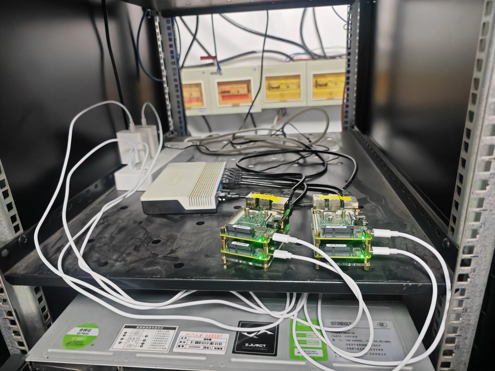
        </div>
    </div>


### 知识讲解：RISC-V 指令集

<div style="display: flex; width: 100%; align-items: center; justify-content: center;">
    <div style="width: 50%; text-align: center; padding: 0 10px;">
        
    </div>
</div>

RISC-V 是一个开源的、基于精简指令集（RISC）原则的指令集架构（ISA）。RISC-V 诞生于 2010 年，并逐渐发展成为一个全球性的开放协作项目，被认为是继 x86 和 ARM 之后，全球三大主流指令集架构之一。与后者不同的是，RISC-V 属于开放的、非盈利性质的 [RISC-V 国际基金会](https://community.riscv.org)。这样的初衷是确保 RISC-V 生态不受某家公司或某个国家的影响。

RISC-V 的主要特点和优势包括：

- **开源和开放**：
    RISC-V 是一种开放的 ISA，这意味着任何人都可以免费使用、修改和分发它，无需支付许可费用，这促进了创新和合作
- **模块化和可扩展**：
    RISC-V 的设计是模块化的，允许用户根据需求定制指令集，支持不同位宽的处理器（32 位、64 位、128 位等）
- **简洁高效**：
    RISC-V 采用了精简指令集原则，指令集相对简单，易于实现和理解，有助于提高能效和降低功耗。因此目前有越来越多的低功耗 MCU 采用 RISC-V 指令集。
- **全球社区支持**：
    RISC-V 得到了全球范围内的广泛社区支持，有来自学术界和产业界的众多贡献者参与其中。

RISC-V 采用模块化指令设计，它包含基础指令集和扩展指令集两部分。其中基础指令集是最小的指令子集，只要配上相应的特权态 (privileged) 指令集，它就能够保证运行起一个操作系统。在完成基础指令集的基础上，开发者可以选择所需要的扩展指令集模块用以完成自己的需求，例如乘除法扩展指令集 "M"，浮点指令集"F"，向量指令集 "V" 等。

对于 32 位的 RV32I 而言，RISC-V 最基础的整数指令集只有 40 条指令，而 64 位的 RV64I 也只是增加了一些 64 位数据的访存指令。下面是 [riscv-card](https://github.com/jameslzhu/riscv-card) 汇总的 RV32I 基础整数指令集的指令定义与功能（**这部分仅需简单了解**，因此中间有关指令编码的 Opcode, Funct3 和 Funct7 三列可以忽略）

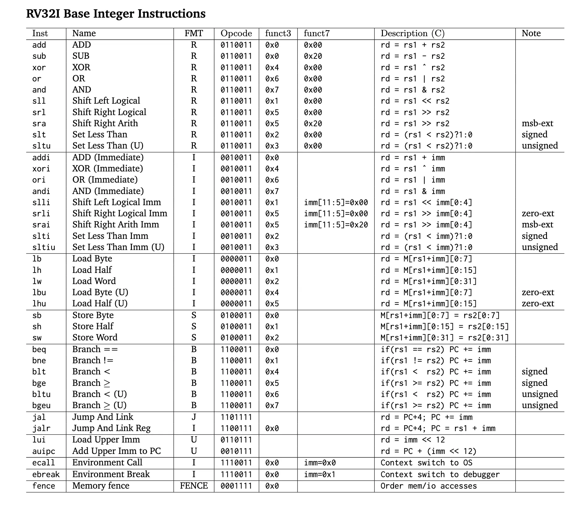

与 x86-64 对比而言，精简指令集 (RISC: Reduced Instruction Set Computer) 往往使用定长的、简单的指令，而复杂指令集往往使用变长的、复杂的指令。

比如 x86-64 的内存访存指令 `mov` 的操作数既可以是寄存器，也可以是内存地址，且这个内存地址的偏移量可以经过很复杂的计算。而这需要 RISC-V 中的 `ld`, `sd`, `mv` 以及算数指令等多条指令配合才能实现相同的功能。

```asm
# x86-64
mov rax, qword ptr [rbx + rcx * 8 + 0x20]

# RISC-V (rax: x1, rbx: x2, rcx: x3)
slli  t0, x3, 3          # t0 = (x3 << 3) = x3 * 8
add   t0, t0, x2         # t0 = x2 + x3 * 8
ld    x1, 0x20(t0)       # x1 = *(t0 + 0x20) = *(x2 + x3 * 8 + 0x20)
```

又比如，x86-64 的一条指令长度可以是 1-16 个字节，这需要更多的电路设计来完成指令解码。而 RISC-V 中的指令长度是固定的，为 4 字节 (C 扩展中的指令为 2 字节)，这降低了 CPU 设计的复杂度。

### 知识讲解：RISC-V Vector 向量化扩展

RISC-V 的 V 扩展 (RVV) 是 RISC-V 的向量化指令扩展，其设计思路采用向量机的形式。

从设计上来讲，RVV 及 ARMv9 的向量扩展 SVE，与 x86-64 的 AVX 要求 CPU 必须包含指定长度的向量单元 (128, 256, 512 位) 不同，为了适应不同硬件，RISC-V V 扩展允许硬件厂商根据硬件设计，选择支持不同的向量单元长度。只要程序员编码的逻辑正确，相同的程序便可以运行在不同向量单元长度的硬件上，扩展了程序的兼容性和灵活性。在本次实验里，我们就会学习如何通过编程实现这一点。

相比之下，Intel 因为自家的能效核心不支持 512 位的向量操作，不得不[放弃在 12 代酷睿 CPU 上支持 AVX-512 指令集扩展](https://www.techpowerup.com/290460/intel-to-disable-rudimentary-avx-512-support-on-alder-lake-processors)，即使同一颗 CPU 的性能核心支持 AVX-512.

RVV 的 1.0 标准在 2021 年 11 月正式被批准 (Ratified)，且未来的改动需要保持对该正式版标准的兼容性。本次实验所使用的 Muse Pi Pro 是目前为数不多的支持 RVV 1.0 标准的开发板。当然，随着未来 RISC-V 生态的发展，更多支持 RVV 1.0 标准的高性能芯片也会逐渐推出。

#### 基本概念

##### 硬件参数：ELEN 与 VLEN

对于每个支持向量扩展的硬件线程 (hart / hardware thread) 都有如下的两个硬件参数：

- ELEN: 单条指令能处理的最大向量位宽，ELEN $\ge 8$
- VLEN: 一个向量寄存器的位宽
    - RVV 定义了 32 个向量寄存器 `v0` - `v31`，每个寄存器宽度为 VLEN.

ELEN 和 VLEN 都必须满足是 $2$ 的幂次，目前的标准中要求 VLEN $\ge$ ELEN, 也就是单条指令处理的数据位宽不能超过单个向量寄存器的位宽。

!!! example "举个例子"

    本次实验所使用的 Muse Pi Pro 拥有 256 位向量运算单元，且单个数据的最大位宽是 64-bit，那么:

    - ELEN = 64
    - VLEN = 256

    上面两个参数是由硬件决定的，在不修改配置的情况下，可以认为是固定的参数。

##### 运行参数：SEW 与 LMUL

在上面的例子中，通过计算可以得知，Muse Pi Pro 上一个向量寄存器可以存储 4 个 64-bit 数据，或者 8 个 32-bit 数据，再或者 32 个 8-bit 数据，以此类推。

那么在程序实际运行的时候，是什么在控制一条指令到底操作什么数据类型 (如 `int8`, `int32`)，以及操作多少个数据呢？这就要提到 SEW 和 LMUL 两个运行时参数了，它们的功能是：

- SEW: 指定单个向量元素的位宽 (Selected Element Width)
- LMUL: 指定单个指令操作向量长度的倍数，也可以理解为向量寄存器个数 (Length Multiplier)

这两个参数在使用 Intrinsic 编程时，可以由编译器自动设置，而手写汇编时，则需要我们手动进行设置，后面我们都会介绍。

!!! example "举个例子"

    在本次实验中，我们需要对 8-bit 整数进行操作，那么就需要在程序中设置 SEW = 8.

    如果我们希望一条指令只操作 1 个向量寄存器，那么 `LMUL = 1`。我们还可以设置 `LMUL = 2, 4, 8` 等，让一条指令操作更多的向量寄存器。在这种情况下，指令中所编码的那个向量寄存器，以及其后面一共 `LMUL` 个寄存器都会被视为一个整体，进行相同的操作。

    如果 `SEW = 8, LMUL = 4`，那么一条指令将会操作 4 个向量寄存器的数据，每个寄存器可以存储 32 个 8-bit 整数，那么一共便可操作 128 个 8-bit 整数。

    如果你还是没有理解的话，可以参考下面这张图: ([图源](https://fprox.substack.com/p/risc-v-vector-register-groups))

    <center>

    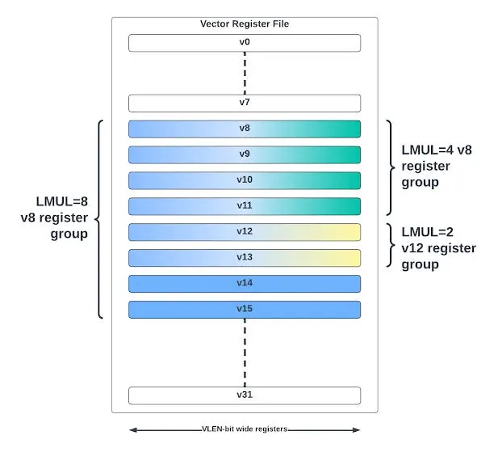

    </center>

    !!! danger "常见误区"

        1. 受限于数据访存的带宽、后端有限的运算资源等等制约因素，并非将 LMUL 设置得越大越好，需要具体问题具体分析。一般而言，如果操作很简单，提高 LMUL 可以更好地利用访存带宽，实现一定的加速。
        1. 调整 LMUL 并没有改变单个向量寄存器的位宽，也没有改变硬件上向量运算单元的位宽，它只是改变了单条指令操作的向量寄存器个数，需要注意分辨。

#### 编程方式

##### Intrinsic

Intrinsics 是由编译器提供的内建函数，我们可以通过类似函数调用的方式，直接调用底层 RVV 指令，而且还无需考虑寄存器分配的问题。与汇编相比，intrinsics 可读性更高，易于维护，同时仍能获得接近手写汇编的性能。使用 intrinsics 可以更方便地进行向量化编程，而不需要深入底层汇编语言。

使用 RISC-V 的 Intrinsic 需要添加头文件 `#include <riscv_vector.h>`.

下面是一个使用 Intrinsic 进行 RVV 编程的例子：

```c
// test.cpp
#include <stdio.h>
#include <riscv_vector.h>

float c[8];

int main() {
    size_t vl = __riscv_vsetvlmax_e32m1();
    // Initialize two vector registers
    vfloat32m1_t vec_a = __riscv_vfmv_v_f_f32m1(2.0f, vl);
    vfloat32m1_t vec_b = __riscv_vfmv_v_f_f32m1(1.0f, vl);

    // Calculate vec_c = vec_b + 2.0 * vec_a
    vfloat32m1_t vec_c = __riscv_vfmacc_vf_f32m1(vec_b, 2.0f, vec_a, vl);
    // Store the result to c array
    __riscv_vse32_v_f32m1(c, vec_c, vl);

    for (int i = 0; i < 8; i++) {
        printf("%f ", c[i]);
    }
    printf("\n");

    return 0;
}
```

```bash
$ clang test.cpp -o test -march=rv64gcv # 需指定 rv64gcv 架构以启用 RVV 特性
$ srun -N 1 -p riscv ./test
5.000000 5.000000 5.000000 5.000000 5.000000 5.000000 5.000000 5.000000
```

相信大家有了 AVX 的编程经验，上面的代码并不是很难理解。它首先初始化了两个向量寄存器，`vec_a = [2.0, 2.0, ..., 2.0]`, `vec_b = [1.0, 1.0, ..., 1.0]`，然后使用 `__riscv_vfmacc_vf_f32m1` 计算了 `vec_c = vec_b + 2.0 * vec_a`，最后将结果存储到 `c` 数组中。可以看到结果是正确的，为 `[5.0, 5.0, ..., 5.0]`。

RISC-V V Intrinsic 相关资料：

- [RISC-V Intrinsic](https://github.com/riscv-non-isa/rvv-intrinsic-doc/releases/download/v1.0-ratified/v-intrinsic-spec.pdf):
    官方文档，足足有 4027 页，阅读难度较大，不太建议阅读
- [Intrinsic Viewer](https://dzaima.github.io/intrinsics-viewer/#riscv): 社区制作的 Intrinsic 查询工具，将 Intrinsic 按照操作进行了详细的分类，单击一条 Intrinsic 可以给出其对应操作的伪代码，完成「任务一」必看

上面的 [Intrinsic Viewer](https://dzaima.github.io/intrinsics-viewer/#riscv) 是非常重要的资料，它可以帮助我们快速找到想要实现的操作对应的 Intrinsic 指令。在这里，不妨进行一个小测试，请找到两个 float32 类型向量寄存器对应元素相乘的 Intrinsic 指令。

???- success "Check your answer"

    答案是 `__riscv_vfmul_vv_f32m1`

    首先，因为他是浮点数操作，所以选中左侧菜单栏中的 `Float`, 又因为其涉及乘法，再选中 `Multiply` 选项，这样便可以找到这个 Intrinsic

    Intrinsic 函数名的格式如下图所示: ([图源](https://fprox.substack.com/p/risc-v-vector-programming-in-c-with))

    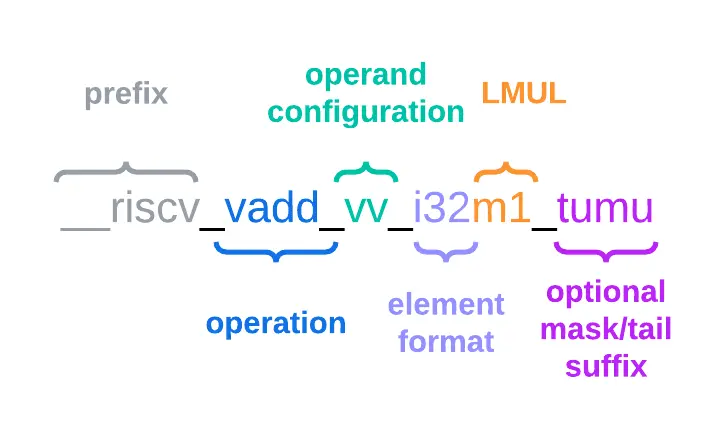

##### 数据类型

在上面的示例代码，以及找 Intrinsic 的过程中，你可能会对 `vfloat32m1_t` 这样的类型比较困惑，这是 RVV Intrinsic 中代表向量寄存器的数据类型。这样的类型都以 `v` 开头，以 `_t` 结尾。

中间部分最开始是单个数据的类型，比如 `int8`, `uint8`, `int32`, `float32` 等。接下来的 `m1` 或者 `m2`, `m4`, `m8` 等，就对应着我们之前介绍的 LMUL 参数。

对特定类型的向量操作时，编译器会自动设置不同的 LMUL.

!!! example "举个例子"

    要定义代表着一个存储 8-bit 无符号整数的向量寄存器，我们可以使用 `vuint8m1_t` 类型。

    如果我们希望指代两个存储 32-bit 有符号整数的向量寄存器，则使用 `vint32m2_t` 类型。

##### vsetvl 系列指令

在之前的介绍中，我们提到 RVV 可以自动适应不同的向量长度，那么它是如何实现的呢？这一机制，与 `vsetvl` 系列的指令密切相关。

进行 RVV 向量操作时，CPU 内部会有一个寄存器 `vl` 来记录接下来的指令要处理的元素个数。它的最大值取决于 VLEN、SEW 和 LMUL 三个参数。

比如，如果 `VLEN = 256, SEW = 8, LMUL = 1`，那么 `vl` 的最大值就是 32，因为一个寄存器最多只能存储 32 个 8-bit 整数。如果 vl $< 32$，
那么接下来的操作中，只有前 `vl` 个元素会被处理。

而 `vsetvl` 指令可以根据 SEW、LMUL 以及还有多少个数据待处理，结合 `VLEN` 自动更新 `vl` 的值。我们以下面这张图为例，假如我们要用 for 循环
来处理一个长度为 N 的数组，那么会发生下面的过程：

```c
size_t vl = __riscv_vsetvlmax_e32m1(); // SEW = 32, LMUL = 1
for (size_t i = 0; i < N; i += vl) {
    vl = __riscv_vsetvl_e32m1(N - i);
    // process vl elements
}
```


- 如果剩余待处理的元素 `N - i` 大于一次可以操作的元素个数，通过 `vl = __riscv_vsetvl_e32m1(N - i)` 可以将 `vl` 设置为其最大值，将其全部处理。
- 如果遇到了数组的末尾，剩余元素不足 `vlmax` 时，通过同样的 `vl = __riscv_vsetvl_e32m1(N - i)` 可以将 `vl` 设置为剩余元素个数，而忽略掉多余的元素。

这样一来，通过程序运行时使用 `vsetvl` 系列指令动态设置 `vl` 的值，即使机器的 `VLEN` 不同，数组总长度不同，都可以正确地处理。

!!! danger "注意事项"

    `vsetvl` 不仅会修改 `vl` 的值，也会设置 SEW 和 LMUL:

    - 比如操作 32 位数据，LMUL = 1 时，调用的是 `__riscv_vsetvl_e32m1` 函数
    - 在进行不同数据位宽的操作前，一定要正确调用 `vsetvl` 来更新 SEW 和 LMUL，否则可能会遇到 Illegal Instruction 错误
        - 使用 Intrinsic 编程时，只需注意在循环的时候使用 `vsetvl` 即可，其余情况编译器会自动处理 SEW 和 LMUL 的变化
        - 在手写汇编时，则需特别注意这一点，在需要的地方插入 `vsetvl` 指令

##### 常见操作

你**可能**需要使用的操作在 [Intrinsic Viewer](https://dzaima.github.io/intrinsics-viewer/#riscv) 的分类如下：

- 访存操作：
    - `Memory` -> `Load`
    - `Memory` -> `Store`
- 整数运算操作：
    - `Integer` -> `Multiply`
    - `Fold`: 对于向量点积，你可能会需要将向量寄存器全部元素进行求和的操作，这类操作归类于 `Fold`
- 类型转换：
    - `Conversion` -> `Integer widen`
- 元素位移操作：
    - `Permutation`: 请自行探索 `Shuffle` 和 `Slide` 等操作

!!! tip "提示"

    1. 并不是上面所有的操作都必须用到，只是为了方便大家通过各种方法实现任务而提供参考
    1. 对于输入为 int8，结果用 int32 累加的情况，可以考虑使用对应的 `Widening` 的操作

#### Self Check

为了让同学能够更加清楚地理解为什么要讲上面这些概念，以及 RVV 设计中的巧妙之处，请在学习完上面的内容之后，思考一个问题:

**内存中的数据，会存储自己的类型吗？**

???- success "Check your answer"

    答案是否定的。(注: 仅讨论 C/C++ 这类编译型语言) 内存并不会“自带标签”告诉你“我是一个整数”或者“我是一个浮点数”，它只是无差别地保存了一堆比特位。**数据具有怎样的含义，取决于你怎样看它**。意思是说，真正决定数据类型的，是你的代码中如何定访问和操作这块数据:

    - 先从访存来讲:

        内存中一段 64-bit 的数据，它既可以是 1 个 64-bit 整数，也可以是 2 个 `float` 类型的浮点数，或者是 8 个 `char` 字符，以此类推。

        但是，对于 CPU 和内存控制器来说，它们只知道这是一块 64-bit 的数据。因此你使用 uint64m1, float32m1, 还是 int8m1 对应的 load / store，它们实际上进行的操作是相同的，就是加载 `vlen` 个比特的数据到向量寄存器。

        不过，它们进行 Strided 和 Segment 类的访存操作时行为又有所不同: 比如 uint8m1 的 Strided Load 是每 8-bit 跨一段内存，而 uint64m1 的 Strided Load 就是每 64-bit 跨一段内存。

    - 再看对数据的操作:

        对于寄存器中的数据，使用整数指令进行操作，它就会被当作整数进行运算，如果使用浮点指令进行操作，它就会被当作浮点数来进行运算。使用 操作 8-bit 数据的指令，那么它就会当成 8-bit 元素的向量进行运算，使用操作 64-bit 数据的指令，那么它就会当成 64-bit 元素的向量进行运算。

        看似上面是一段废话，但其实想表达的是，我们只需要 (数据类型，操作类型) 这个二元组，就能确定一个具体的数据操作。而前面这个「数据类型」，则由 (SEW, LMUL) 来唯一确定。

        在 RVV 的设计中，「数据类型」和「操作」是解耦的。RISC-V 并没有为每个二元组都定义一条指令，比如所有的浮点乘法指令都是 `vfmul.vv`，而具体处理的是多少位的浮点数、处理多少个向量，则由 `vsetvl` 设置的 SEW 和 LMUL 来决定。

### 知识讲解：SpaceMiT IME 矩阵扩展

#### SpaceMiT IME 简介

之前我们提到，RISC-V 是开放的，提供了自定义的指令编码区域，允许厂商自行扩展指令集（当然，你也可以使用模拟器 / FPGA 等工具自己设计一些奇奇怪怪的东西）。

SpaceMiT IME (Integrated Matrix Extension) 是进迭时空提出的矩阵扩展，可以对低精度的矩阵乘法和卷积操作进行加速。在宣传中，IME 的整数运算效率可以达到 RVV 的 4 倍。

!!! tip "选用 SpaceMiT IME 的原因"

    仍需注意的是，SpaceMiT IME 是进迭时空推出的厂商指令扩展，**并未进入 RISC-V 官方标准**。

    不同的硬件厂商，如阿里平头哥、SiFive 等，也推出了各种不同的 RISC-V 矩阵扩展。在本次实验中，我们只是借助 SpaceMiT IME 来学习区别于 AMX 的另一种矩阵扩展实现方式，进而理解矩阵扩展的设计思路和局限性，而这与某一厂商的具体扩展无关。

    对矩阵扩展设计有兴趣的同学，推荐阅读 [RISC-V 矩阵扩展：IME TG Option A-G](https://zhuanlan.zhihu.com/p/29671629963) 和 [HPC 与 AI 的未来](https://zhuanlan.zhihu.com/p/1907460273876480763) 两篇好文。

SpaceMiT IME 在实现上复用了 RVV 的寄存器以节省资源 (这也是 IME 中 Integrated 的含义)，因此我们无需像 AMX 那样进行对 tile 的额外设置，只需要使用 RVV 的向量寄存器即可。

#### vmadot 详解

SpaceMiT IME 指令集提供了 `vmadot` 系列的指令，用于加速矩阵乘法运算。与 RVV 不同的是，IME 会把 RVV 寄存器中的数据**理解成一个小矩阵**，并通过额外的运算单元实现矩阵乘法的加速，最终的结果也会存储到一个向量寄存器中。

SpaceMiT IME 指令集手册具体可参考 [SpaceMiT IME Extension Spec](https://github.com/space-mit/riscv-ime-extension-spec/releases/download/v0429/spacemit-ime-asciidoc.pdf)，而接下来我们仅介绍实验需要用到的部分。进行 8-bit 整数矩阵乘法时，可以调用下面的指令进行加速：

```asm
vmadotus vd, vs1, vs2 ; us 表示 vs1 是无符号整数，vs2 是有符号整数
                      ; 可以理解为 C += A * B, 其中 A, B, C 都是矩阵
                      ;          vd  vs1 vs2
```

对于 Muse Pi Pro 来说，VLEN = 256，根据文档，`M = 4, N = 4, K = 8`，vs1 和 vs2 中的数据会被理解成 `(4, 8)` 和 `(8, 4)` 的 8-bit 整数矩阵，示意图如下 (请忽略图中的编号)：

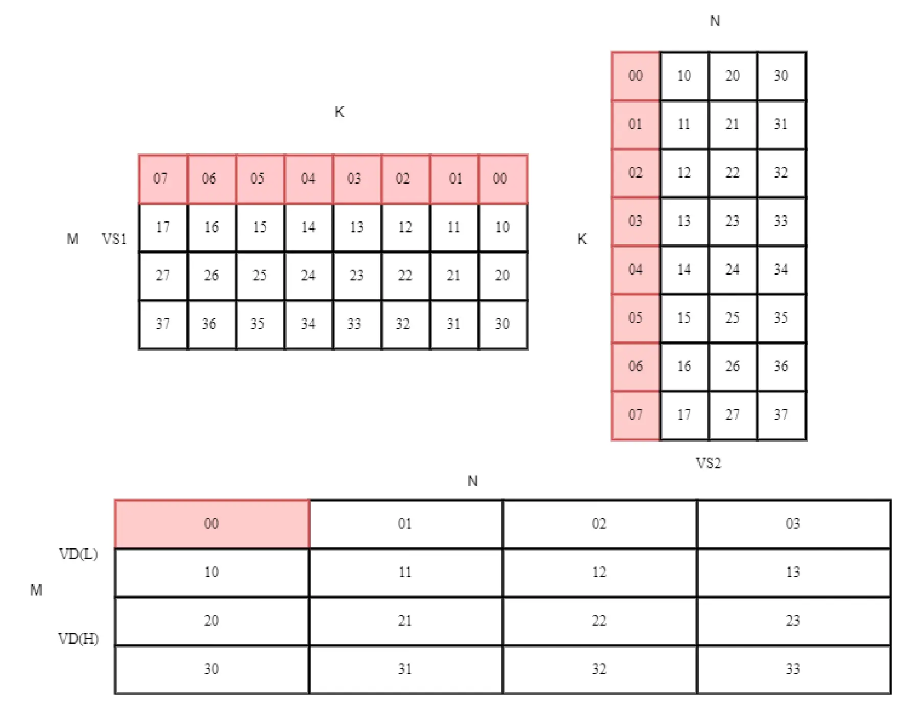

`vmadot` 可以用一条指令进行 16 次点积和累加运算，这条指令的 Throughput 是 RVV 对应指令的 4 倍。动画展示如下，每一帧代表 A 和 B 对应的一行元素进行内积操作，累加到 C 的对应元素：

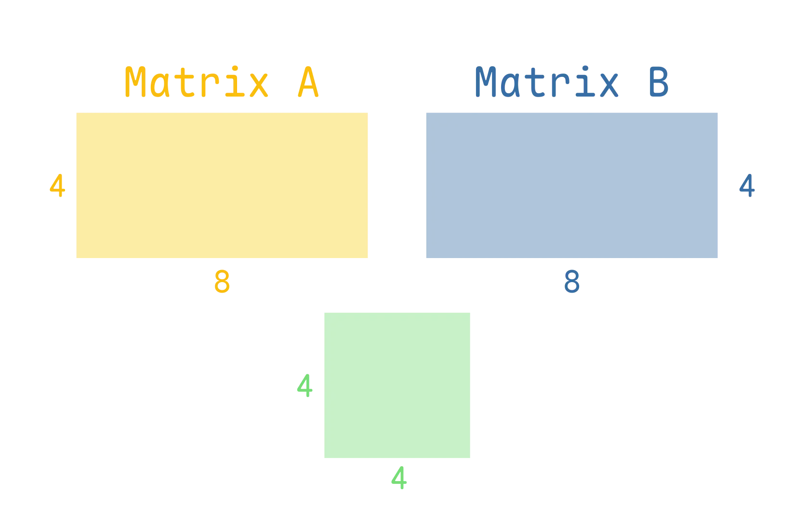

`vmadotus` 指令将会逐行进行内积，并将结果累加在 32-bit 整数中，最后得到一个 `(4, 4)` 的 32-bit 整数矩阵。

#### 分块矩阵乘法

想要利用 `vmadot` 指令，我们需要对原先的矩阵分块进行处理，如下图所示:

<div style="display: flex; justify-content: center; align-items: center;">
    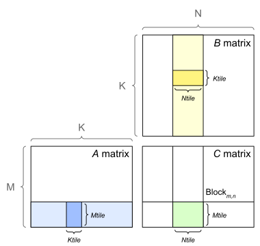
</div>
<div style="display: flex; justify-content: center; align-items: center;">
    注: 我们的例子中，Ktile = 8, Mtile = Ntile = 4
</div>

上图中，C 矩阵中的一块结果 (用绿色标记)，是 A 和 B 中对应分块矩阵 (用蓝色和黄色标记) 进行矩阵乘法再求和得到的。这也是说，我们每次需要从 A 和 B 矩阵中**各取一块小矩阵**，使用 `vmadot` 进行矩阵乘法，最后将结果累加，得到正确的结果。

!!! info "提示"

    为了实现「加载一小个分块矩阵到寄存器」的操作，你**可能**会需要使用:

    -  `Memory` -> `Load` 中 `Strided` 的操作
    -  加载数据和操作数据时，可以设置不同的 SEW 和 LMUL。如果你不理解这里，请完成 [Self Check](#self-check)

    <center>
        <div style="display: flex; justify-content: center; align-items: center;">
            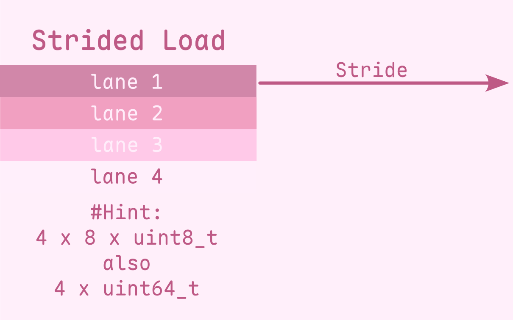
        </div>
    </center>

    注: 加粗的 **可能** 的含义是: 「使用上面的操作」是「正确完成实验任务」的 **非充分、非必要** 条件，Strided 访存未必是性能最佳的，请务必结合自己的思考(~~例如做重排~~)。


## 思考题

1. 以场景 S3（$N=128,\ D=256,\ H=128,\ E=16,\ K=4$）为例，估算参考实现一次前向的
   总访存量（专家权重被读了多少遍？）和总乘加次数，计算算术强度（MACs/byte）。
   按专家分组之后这两个数字分别变成多少？由此说明这个负载是访存瓶颈还是计算瓶颈，
   以及分组为什么能加速。
2. 为什么激活用 per-token scale，而权重每个矩阵一个 scale 就够了？
   如果让一批 128 个 token 共享同一个激活 scale，会发生什么？
3. 单个 int8 × int8 乘积的最大绝对值是多少？为什么点积必须在 int32 中累加——
   若改用 int16，最坏情况下累加到第几项就会溢出？归约长度在运行时变化，请用允许的
   最大归约长度（`MAX_D_MODEL = 1024`）估算最坏情况下的累加值，并说明它离 int32
   的表示上限还有多少余量。

## 实验任务与要求

### 主线任务

完成 `student/moe_opt.cpp` 中 MoE 前向的优化，并在 x86-64 平台上通过正确性检查。实现需要支持
[评测场景](#评测场景)中的全部形状，不能把 $N$、$D$、$H$、$E$ 或 $K$ 写成固定值。

请按照 [登录平台](../../guide/index.md) 申请 DevPod 和 [提交计算任务](../../guide/submit.md) 提交任务，例如：

!!! danger "注意事项"

    对于 `lab2` 和 `lab2rv` 分区，任务默认分配 1 个核心，若需要使用更多核心，请在提交任务时使用 `-c` 参数指定。
    在 x86 分区，本实验最多使用 8 个核心 16 个线程 (`-c 16`)，在 RISC-V 分区，本实验最多使用 4 个核心 4 个线程 (`-c 4`)。  
    在评测时，我们会分配8核16线程。


```bash
# 申请 x86-5418Y 预设的 DevPod

# 在 DevPod 中下载
git clone https://github.com/zjusct/hpc101
cd hpc101/src/lab2

# 编译
cmake -B build
cmake --build build -j

# 运行
hpc submit -p lab2 ./build/lab2 1 256 128 16 4 100
hpc submit -p lab2 ./build/lab2 1 1024 512 16 4 100
hpc submit -p lab2 ./build/lab2 128 256 128 16 4 100
hpc submit -p lab2 -c 16 ./build/lab2 1024 512 128 512 2 100 # 使用 16 个线程运行

# 使用 VTune 进行性能分析
hpc submit -p lab2 vtune -collect hotspots ./build/lab2 128 256 128 16 4 100 --benchmark

# 使用 perf 进行性能分析
hpc submit -p lab2  perf stat --topdown -- ./build/lab2 128 256 128 16 4 60 --benchmark

hpc submit -p lab2 "taskset -cp 1"
hpc submit -p lab2 -c 16 "taskset -cp 1" # 查看 CPU 亲和性
```


### Bonus：在 RISC-V 上继续优化 MoE 前向

Bonus 延续前面的主线任务：输入、权重、路由规则、量化方式和输出都不变，只把 `moe_forward_optimized` 的目标平台换成 RISC-V。你可以上文提到的 RISC-V 向量扩展和 SpaceMiT IME 矩阵扩展对你的代码进行优化。  
对应的，只需要将计算任务提交到 `lab2rv` 分区即可。

!!! tip "注意架构"

    如果你在x86平台上做完主线任务之后直接 `hpc submit -p lab2rv ./build/lab2 1 256 128 16 4 100`, 会出现以下报错
    ```
    sh: 1: ./build/lab2: Exec format error
    ```
    这是因为 x86-64 平台编译的可执行文件无法在 RISC-V 平台上运行。请使用 `riscv-K1` 预设的 DevPod 进行编译。


!!! info "OJ 评分指标"

    OJ 总体采用分段曲线进行评分。

    本次课程为大家提供了 AI 编程辅助工具。我们鼓励合理使用 AI 辅助学习与编程，但不鼓励完全依赖 AI 而忽略独立思考。因此，我们将通过简单手段获得的优化效果设定为 60 分及格线；在此基础上，进一步优化所得分数将沿非线性曲线增长至 100 分。此外，我们还设置了边际收益更高的 20 分打榜奖励区间，鼓励有能力的同学继续探索更高性能。

    下面给出不同优化阶段对应的得分曲线：

    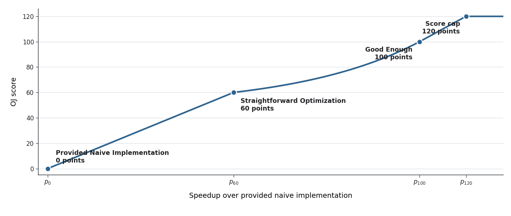

    横轴表示相对于我们提供的 naive 实现的加速比（speedup），纵轴表示得分。所有测试用例均采用形状相同的评分曲线，但各评分 turning points 对应的加速比阈值会分别设置。最终得分为四个测试用例得分的算术平均值，基本任务和bonus任务分数分开计算。

    各任务的 60 分和 100 分 checkpoint 如下：

    | 任务 | Checkpoint | S1 | S2 | S3 | S4 |
    | --- | ---: | ---: | ---: | ---: | ---: |
    | 基本任务 | 60 分 | 18.0 | 39.0 | 71.0 | 68.0 |
    | 基本任务 | 100 分 | 22.0 | 53.0 | 133.0 | 123.0 |
    | Bonus 任务 | 60 分 | 11.0 | 12.0 | 62.0 | 17.0 |
    | Bonus 任务 | 100 分 | 15.0 | 17.0 | 104.0 | 25.0 |

    具体的分段曲线定义如下：

    $$
    S(p)=
    \begin{cases}
    0, & p \le p_0, \\[2pt]
    60u_0, & p_0 < p \le p_{60}, \\[2pt]
    60+40\dfrac{e^{1.5u_1}-1}{e^{1.5}-1},
        & p_{60} < p \le p_{100}, \\[8pt]
    100+20u_2,
        & p_{100} < p < p_{100}+\dfrac{1}{4}(p_{100}-p_{60}), \\[8pt]
    120,
        & p \ge p_{100}+\dfrac{1}{4}(p_{100}-p_{60}),
    \end{cases}
    $$

    其中：

    $$
    u_0=\frac{p-p_0}{p_{60}-p_0},\qquad
    u_1=\frac{p-p_{60}}{p_{100}-p_{60}},\qquad
    u_2=\frac{p-p_{100}}{\frac{1}{4}(p_{100}-p_{60})}.
    $$


!!! danger "提交方式"

    主线任务与 RISC-V Bonus 的提交入口和测评方式仍在完善，开放后会更新本文档并在群内通知。

## 参考资料

- [Mixture of Experts Explained](https://huggingface.co/blog/moe)
- [DeepSeek-V3 Technical Report](https://arxiv.org/abs/2412.19437)
- [DeepSeekMoE: Towards Ultimate Expert Specialization](https://arxiv.org/abs/2401.06066)
- [Auxiliary-Loss-Free Load Balancing](https://arxiv.org/abs/2408.15664)
- [Optimizing DGEMM on Intel CPUs with AVX512F](https://github.com/yzhaiustc/Optimizing-DGEMM-on-Intel-CPUs-with-AVX512F)
- [Intel Intrinsics Guide](https://www.intel.com/content/www/us/en/docs/intrinsics-guide/index.html)
- [Code Sample: Intel Advanced Matrix Extensions (Intel AMX) - Intrinsics Functions](https://www.intel.com/content/www/us/en/developer/articles/code-sample/advanced-matrix-extensions-intrinsics-functions.html)
- [Intel AMX-TMUL Code Samples](https://github.com/intel/AMX-TMUL-Code-Samples)
- [Intel 64 and IA-32 Architectures Optimization Reference Manual](https://www.intel.com/content/www/us/en/developer/articles/technical/intel-sdm.html)
- [What Every Programmer Should Know About Memory](https://people.freebsd.org/~lstewart/articles/cpumemory.pdf)
