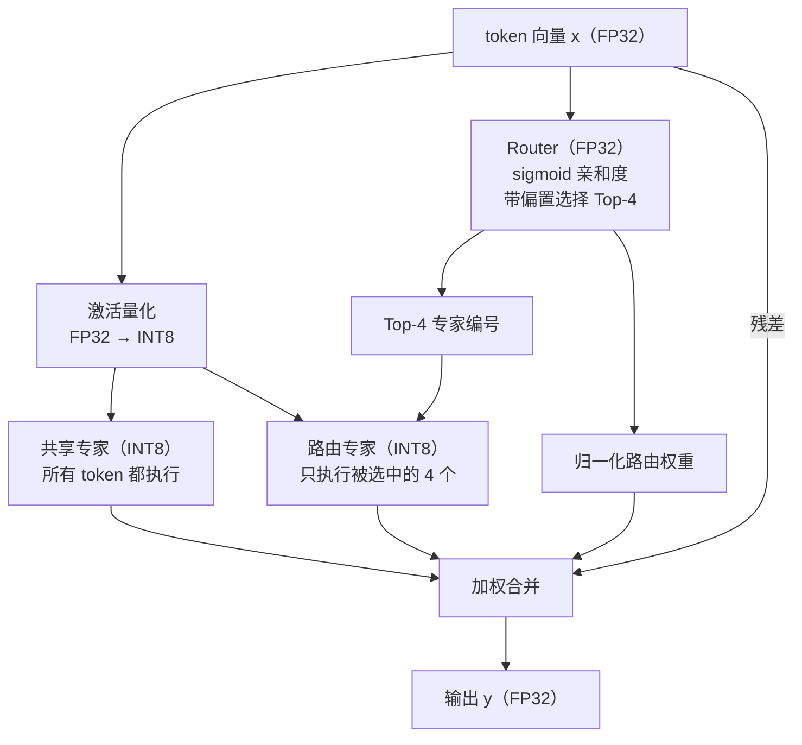

# 实验二：MoE 的向量化计算

## 实验目的

从 Mixtral 到 DeepSeek-V3、Qwen、GLM，**MoE（Mixture of Experts，混合专家）**已经成为大模型的主流架构。本次实验将带你实现并优化一个 DeepSeek-V3 风格的量化 MoE 层前向计算，在这个过程中：

- 理解 MoE 的计算模式：路由、专家分发、加权合并
- 理解量化推理（W8A8）中整数与浮点混合的计算流水线
- 掌握向量化优化的通用方法：识别热点、数据重排、提高算术强度
- Bonus：在 RISC-V 平台上实现 MoE 算子（待更新）

## 知识讲解：MoE 是什么

### 从稠密 FFN 到稀疏专家

Transformer 中参数量最大的组件是 FFN（前馈网络）。MoE 的想法是：与其让所有 token 共享一个大 FFN，不如准备 $E$ 个“专家”FFN，让每个 token 只经过其中得分最高的 $K$ 个（$K \ll E$）。这样，总参数量可以显著增长，而每个 token 只激活少量专家，从而在一定程度上分离模型容量与激活层的大小，也就是单 token 计算量和其占用的内存；当然，与此同时，路由和分发会带来额外控制开销。

本实验采用 [DeepSeek-V3](https://arxiv.org/abs/2412.19437) 的 MoE 架构，它与早期 MoE（如 Mixtral 的 8 专家选 2）相比有几个标志性设计：

- **更细粒度的专家**：专家数量更多、单个专家更小（V3 是 256 个路由专家选 8 个）。同样的总参数量下，专家组合的可能性大大增加；
- **共享专家**：一个所有 token 都必须经过的专家，负责学习通用知识，让路由专家专注于特化知识；

本实验的目标即为在 CPU 上实现 DeepSeek-V3 的 MoE 前向计算，并在保证正确性的前提下尽可能优化其性能。

我们可以简单的从参数量和前向计算量理解这种设计。一个 SwiGLU 专家包含两个 $D\to H$ 投影和一个 $H\to D$ 投影，因此忽略偏置时的权重数为

$$
P_{expert}=HD+HD+DH=3DH.
$$

代入 $D=256,H=128$，每个专家有

$$
3\times256\times128=98\,304
$$

个权重。17 个专家一共包含 $1\,671\,168$ 个专家权重，但每个 token 只激活 4 个路由专家和 1 个共享专家，对应的专家矩阵乘加数约为

$$
(K+1)\times3DH
=5\times98\,304
=491\,520\ \text{MACs}
$$

这与相同参数量的单个稠密 SwiGLU FFN 相比，计算量显著降低。若稠密 FFN 具有相同的总参数量，其中间维度需要取为

$$
H_{\mathrm{dense}}=17H=2176.
$$

此时每个 token 都必须经过全部参数，对应的矩阵乘加数为

$$
3DH_{\mathrm{dense}}
=17\times3DH
=1\,671\,168\ \text{MACs}.
$$

相比之下，MoE 每个 token 只计算 5 个激活专家，因此其专家计算量仅为稠密 FFN 的

$$
\frac{(K+1)3DH}{17\cdot3DH}
=\frac{5}{17}
\approx29.4\%.
$$

也就是说，在总专家参数量相同的情况下，MoE 将每个 token 的专家计算量降低了约 $70.6\%$，理论上约为稠密 FFN 的 $1/3.4$。这体现了 MoE 的核心优势：保留较大的总参数容量，同时只激活其中一小部分参与当前 token 的计算。

### 单层 MoE 的前向流程



对每个 token $x_t \in \mathbb{R}^{D}$，先计算路由 logit 和原始亲和度：

$$
z_{t,e}=r_e^\top x_t,\qquad
s_{t,e}=\sigma(z_{t,e})=\frac{1}{1+e^{-z_{t,e}}},
\qquad e=1,\ldots,E.
$$

再定义被选中的专家集合

$$
\mathcal S_t
=\operatorname{TopK}_{e\in\{1,\ldots,E\}}
\bigl(s_{t,e}+b_e\bigr),
\qquad |\mathcal S_t|=K.
$$

路由权重只对 $\mathcal S_t$ 中的原始亲和度进行归一化：

$$
g_{t,e}=
\begin{cases}
\displaystyle
\frac{s_{t,e}}{\sum_{j\in\mathcal S_t}s_{t,j}},
& e\in\mathcal S_t,\\[8pt]
0,&e\notin\mathcal S_t.
\end{cases}
$$

共享专家和每个被选中的路由专家都是 SwiGLU 结构：

$$
\operatorname{FFN}_e(x)
=W_d^{(e)}\left(
\operatorname{SiLU}\!\left(W_g^{(e)}x\right)
\odot W_u^{(e)}x
\right),
\qquad
\operatorname{SiLU}(v)=\frac{v}{1+e^{-v}}.
$$

其中 $\odot$ 表示逐元素相乘

最后合并：

$$
y_t=x_t+\operatorname{FFN}_{shared}(x_t)
+\sum_{e\in\mathcal S_t}g_{t,e}\operatorname{FFN}_e(x_t).
$$

### 量化推理：W8A8

真实的推理引擎很少用 fp32 存储和计算专家权重：int8 量化能把内存占用和带宽需求降到 1/4，同时精度损失在可接受范围内。而现代 SIMD 指令集处理 int8 的吞吐量也远高于 fp32，尤其在 Intel 引入 AMX 矩阵加速单元之后。本实验采用简化的 **W8A8**（权重、激活都量化到 int8）：

$$
x_q = \mathrm{round}\left(\frac{x}{s_x}\right), \quad s_x = \frac{\max_i |x_i|}{127}
$$

- 激活使用 per-token scale，每个 token 向量单独计算 $s_x$
- 每个权重矩阵一个 scale

int8 $\times$ int8 的结果在 int32 中累加，随后乘以 scale 反量化回 fp32：

$$
W x \approx (W_q x_q) \cdot s_W s_x
$$

#### 举例：一个三维 W8A8 点积

考虑一个输入向量和权重矩阵中的一行：

$$
x=
\begin{bmatrix}1.00\\-0.49\\0.25\end{bmatrix},
\qquad
w=
\begin{bmatrix}0.40\\-0.80\\1.20\end{bmatrix}.
$$

输入的 per-token 缩放因子为 $s_x=1/127$，因此

$$
x_q=\operatorname{round}
\begin{bmatrix}127\\-62.23\\31.75\end{bmatrix}
=\begin{bmatrix}127\\-62\\32\end{bmatrix}.
$$

假设这一行权重所在矩阵的最大绝对值也是 $1.20$，则该矩阵的缩放因子为 $s_W=1.20/127$，对应的量化权重为

$$
w_q=\operatorname{round}
\begin{bmatrix}42.33\\-84.67\\127\end{bmatrix}
=\begin{bmatrix}42\\-85\\127\end{bmatrix}.
$$

整数点积在 INT32 中计算：

$$
\begin{aligned}
a_{int}
&=w_q^\top x_q\\
&=42\times127+(-85)\times(-62)+127\times32\\
&=14\,668.
\end{aligned}
$$

反量化后得到

$$
\hat y=a_{int}s_Ws_x
=14\,668\times\frac{1.20}{127}\times\frac{1}{127}
\approx1.09130.
$$

原始 FP32 点积为

$$
y=w^\top x
=0.40\times1.00+(-0.80)\times(-0.49)+1.20\times0.25
=1.092.
$$

两者相差约 $6.99\times10^{-4}$。（已足够小）

## 代码框架

**实验代码位于文档仓库的 `src/lab2/` 目录下。**

```text
src/lab2
├── CMakeLists.txt
├── main.cpp              # driver（评测时替换为原版）
├── include
│   └── moe.h             # 问题规模、权重结构体、接口声明
├── src                   # 框架代码（评测时替换为原版）
│   ├── moe_ref.cpp       # 标量参考实现（正确性基准）
│   └── data.cpp          # 数据初始化与正确性检查
└── student               # ★ 你的代码（只有这个目录会被收取）
    └── moe_opt.cpp       # preprocess + moe_forward_optimized
```

本实验的 token 数 $N$ 通过 `num_tokens` 参数传入。嵌入维度 $D = d_{model}$、隐藏层维度 $H = d_{ff}$、专家数 $E$ 和每个 token 选取的专家数 $K$（Top-$K$）由 driver 在计时前写入结构体 `MoEWeights`，`preprocess` 与 `moe_forward_optimized` 从中动态读取。

`moe.h` 同时给出各维度的上界（便于静态分配缓冲区），并保证 $D$、$H$ 均为 64 的倍数：

| 常量 | 含义 | 上界 |
| ---- | ---- | ---- |
| `MAX_NUM_TOKENS`  | token 数 $N$ | 1024 |
| `MAX_D_MODEL`     | 隐藏维 $D$   | 1024 |
| `MAX_D_FF`        | 专家中间维 $H$ | 512 |
| `MAX_NUM_EXPERTS` | 路由专家数 $E$ | 512 |
| `MAX_TOP_K`       | 选取专家数 $K$ | 4 |

!!! danger "修改范围限制"

    **你只能修改 `student/moe_opt.cpp`**。评测时，`student/` 之外的所有文件
    （driver、头文件、参考实现、CMakeLists）都会被替换为原版——所以就算你在别处改了什么，
    评测时也不会生效。你可以在自己的文件里自由添加辅助函数、头文件引用、全局缓冲区等，
    只要实现声明在 `moe.h` 中的接口函数即可。

`student/moe_opt.cpp` 需要实现两个函数：

```cpp
// 计时开始前调用一次。你可以在这里对权重做重排/预打包
void preprocess(MoEWeights& w) {}

void moe_forward_optimized(const float* x, const MoEWeights& w, float* y,
                           int num_tokens) {
    moe_forward_ref(x, w, y, num_tokens);
}
```

构建与运行：

```bash
cd src/lab2
cmake -B build
cmake --build build
./build/lab2 128 256 128 16 4      # N D H E K（S3 场景的形状，见下文）
./build/lab2 1 1024 512 16 4 2000  # 可选第 6 个参数指定迭代次数
```

!!! note "正确性如何判定"

    int8 矩阵乘本身是精确的，但它周围的 fp32 环节（SiLU、缩放、求和顺序）在向量化改写后
    难免有 ulp 级差异——这种差异一旦落在重量化$\mathrm{round}(h / s_h)$ 的舍入边界上，
    就会让一个 int8 值差 $\pm 1$，再经 down 投影摊到整行输出上。因此 `check_result`
    不做逐元素比对，而是检查**每个 token 的相对 L2 误差**（$< 2\times10^{-2}$）和**全局相对
    RMSE**（$< 2\times10^{-3}$）。

## 任务：优化 MoE 前向

在 `student/moe_opt.cpp` 中重写整个前向计算，使其在保证正确性的前提下尽可能快。评分依据端到端加速比（`Speedup`）。

### 评测场景

评测会在四个场景上进行：

| 编号 | $N$ | $D$ | $H$ | $E$ | $K$ |
| ---- | --- | --- | --- | --- | --- |
| S1   | 1 | 256 | 128 | 16  | 4 |
| S2   | 1 | 1024 | 512 | 16 | 4 |
| S3   | 128 | 256 | 128 | 16 | 4 |
| S4   | 1024 | 512 | 128 | 512 | 2 |

!!! tip "优化思路提示"

    动手写 SIMD 之前，先想清楚算法层面的问题：

    - Baseline 的访存模式好吗？参考实现逐 token 计算，每个 token 都要完整读一遍它所选专家的
      全部权重，这显然不是个好主意。
    - 数据布局：`preprocess` 允许你把权重重排成对向量指令友好的布局。
    - 编译器在 `-O2` 下已经会做一定程度的自动向量化。看看编译器生成的汇编（`objdump -d` 或
      [Compiler Explorer](https://godbolt.org/)），确认你的手写优化真的比自动向量化强。
    - 本实验主线目标平台为 Intel Sapphire Rapids。如果你追求较高的性能，一定要使用 **Intel AMX** 矩阵加速单元。

### 性能优化的好伙伴：Profiler 工具

!!! danger "VTUNE 目前可能无法在容器内运行"

    在我们完成调试后，会进一步更新本文档。

第一次使用 VTune 时，可以先阅读 Intel 官方的
[Linux 性能分析快速入门](https://www.intel.com/content/www/us/en/docs/vtune-profiler/tutorial-common-bottlenecks-linux/2025-0/overview.html)，
跟随示例了解一次完整的“采样—定位—分析”流程。

集群不提供图形桌面，可以采用“**集群命令行采样，本地 GUI 分析**”的方式。
按照集群说明进入计算节点并加载 VTune 环境后，在实验目录中执行例如：

```bash
vtune -collect hotspots -result-dir vtune-hotspots -- \
  ./build/lab2 128 256 128 16 4 2000
```

采样结束后，在本地终端下载**完整的结果目录**（不要只复制其中的 `.vtune` 文件）。为了正常查看
源码和汇编，建议同时下载采样时使用的可执行文件,示例命令如下：

```bash
scp -r <username>@<cluster>:<path-to-repo>/lab2/vtune-hotspots .
scp <username>@<cluster>:<path-to-repo>/lab2/build/lab2 .
```

随后在本地启动 VTune Profiler GUI，选择 **Open > Result...**，打开结果目录中的 `.vtune` 文件。
如果源码或汇编视图无法正确显示，请确认本地保留了与采样时一致的源码和可执行文件，并在
**Binary/Symbol Search** 中补充相应路径。

开始优化时，不必急于逐个尝试各种优化技巧，可以先使用性能采样工具定位瓶颈，再提出并验证优化假设，
通常会更有效。（除了更快的定位瓶颈之外，一个你做的代码改动不论是正优化还是负优化，有一个可解释的指标会给你在优化过程中较强的正反馈，同时也不会让你陷入对着代码穷举各种优化方式的那种“炼丹”的痛苦。 ~~或许结合ai还会有更加奇妙的火花？~~ 如果你是想认真学习并实践体系结构知识的人这块可以让你学爽，~~可解释性一直都是很美妙的不是吗~~）
面向intel cpu架构比较合适的优化工具 Intel VTune Profiler 可以大致按下面的顺序使用：（注意以下有很多体系结构的专有名词，在没上过专业课的情况下要理解它们确实会比较痛苦，但是结合ai可以较快的帮你搞懂它们意思，最后构建起一个现代处理器的抽象模型, 这样之后就会顺畅许多）

1. **先找热点。** 使用 **Hotspots**（热点分析：按采样结果找出最耗时的代码）查看 Bottom-up
    （从最耗时的函数向上追溯调用者）、调用栈和源码视图，确认端到端时间主要花在了哪些阶段。~~(但是其实这个程序你一眼就可以看懂， 你也可以马上定位到瓶颈在哪，所以这一步在这一个lab当中其实不那么重要)~~
2. **再解释热点。** 可以先把 CPU 流水线粗略分成前端和后端：前端负责取出并解码指令，再把工作交给
    后端；后端等待操作数就绪，调用执行单元完成计算并提交结果。使用 **Microarchitecture Exploration**
    （微架构探索：通过硬件计数器分析流水线利用率）时，Top-down 会把流水线中的工作分成四类：
    **Front-End Bound**（前端受限：取指、解码或供给指令的速度跟不上），**Bad Speculation**
    （错误推测：分支预测错误等原因使已经执行的工作被丢弃），**Back-End Bound**（后端受限：执行资源
    忙碌或所需数据尚未到达），以及 **Retiring**（有效退休：指令完成并提交了有效结果，占比高通常是
    好现象，但不等于已经达到峰值）。可配合 [Intel 官方中文 Top-down 图解](https://www.intel.cn/content/www/cn/zh/docs/vtune-profiler/cookbook/2023-0/top-down-microarchitecture-analysis-method.html) 继续阅读。

    **Back-End Bound** 较高时，可以继续区分 **Core Bound**（核心执行资源受限，例如执行端口争用或
    较长的数据依赖链）和 **Memory Bound**（内存层次受限，执行单元在等待数据）。内存层次由近到远
    包括 **L1D**（每个核心最近、容量最小的一级数据缓存）、**L2**（容量更大但稍慢的二级缓存）、
    **LLC**（Last-Level Cache，通常由多个核心共享的末级缓存；本平台上是 L3）和 **DRAM**
    （主内存，容量最大但访问延迟显著高于缓存）。这些 Bound 指标表示停顿主要与哪个层级相关，
    并不自动意味着该层带宽已经打满，具体含义可参看 [VTune Memory Access 指标说明](https://www.intel.com/content/www/us/en/docs/vtune-profiler/user-guide/2024-0/memory-access-analysis.html)。

3. **检查并行效率。** 对多线程实现，结合 **Threading**（线程并行分析）和 **Memory Access**
    （内存访问分析）观察并行度、串行区、负载不均、spin/wait（忙等或阻塞等待）、同步竞争、伪共享
    （线程修改同一缓存行中的不同数据，仍引发缓存行来回迁移）、缓存行争用（多个核心争抢同一缓存行
    的所有权）以及 NUMA（非一致内存访问：访问其他 CPU 节点的内存通常更慢）。

采样时应让被测部分运行时间足够长(目前的程序运行一次的时间很短，但是vtune运行的方式是随机的对运行时程序取快照, 并通过采样的时候运行所在函数来粗略的估计不同函数的运行时间占比, 所以为了能够采准要么让采样频率高一点，要么就运行的次数多一点, 后者相对更加方便一点), 并保持输入、线程数和绑核方式一致。Profiler 用于定位和解释瓶颈，最终性能仍应以实验规定的 driver 计时结果为准。更详细的操作可参考 Intel 官方的 [Hotspots 使用指南](https://www.intel.com/content/www/us/en/docs/vtune-profiler/user-guide/2025-4/basic-hotspots-analysis.html)，更深入的分析方法与常见案例可查阅 [VTune Performance Analysis Cookbook](https://www.intel.com/content/www/us/en/docs/vtune-profiler/cookbook/2025-4/overview.html)。

!!! tip "优化后期：评估剩余优化空间"

    当主要热点已经稳定后，建议为热点建立一份简要的性能上限分析。首先估算运算量、数据搬运量和算术
    强度，再借助**Roofline**（屋顶线模型：将程序性能与计算、带宽上限放在同一张图中；参见 [Intel Roofline 简介](https://www.intel.com/content/www/us/en/developer/articles/guide/intel-advisor-roofline.html)），
    判断当前实现更接近计算上限，还是 L1D、L2、LLC 或 DRAM 中某一级的带宽上限。比较时应保持工作负载、
    线程数和绑核方式一致。

    分析 CPU 流水线时，可以同时记录**IPC**（Instructions Per Cycle，平均每周期退休的指令数）、
    Front-End Bound、Core Bound、处理器频率和有效操作吞吐（每秒实际完成的 MAC 或其他目标运算数）。
    这些指标分别反映指令推进效率、前端供给情况和核心执行资源的利用情况，需要结合热点代码一起解释。
    对多线程实现，还应绘制线程数与加速比的关系，并检查核心利用率、串行区、同步等待、负载不均、缓存
    一致性开销、NUMA 访问和全核运行时的频率变化。分析的目标是解释当前性能与硬件上限之间的差距，
    并据此选择下一步优化对象，而不是单独追求某一项指标。（~~ai或许比我们更擅长做这种迭代优化，但是一下找到应该优化的点的直觉或许是ai所没有的, 优化过程中就可以积累这个直觉~~）

## Bonus 任务：在 RISC-V 上实现 MoE 算子

!!! danger "RISC-V 平台还没准备好😭"

    我们正在尽快搭建 risc-v 平台，完成后会发布具体任务并会群里通知。

## 思考题

1. 以场景 S3（$N=128,\ D=256,\ H=128,\ E=16,\ K=4$）为例，估算参考实现一次前向的
   总访存量（专家权重被读了多少遍？）和总乘加次数，计算算术强度（MACs/byte）。
   按专家分组之后这两个数字分别变成多少？由此说明这个负载是访存瓶颈还是计算瓶颈，
   以及分组为什么能加速。
2. 为什么激活用 per-token scale，而权重每个矩阵一个 scale 就够了？
   如果让一批 128 个 token 共享同一个激活 scale，会发生什么？
3. 单个 int8 × int8 乘积的最大绝对值是多少？为什么点积必须在 int32 中累加——
   若改用 int16，最坏情况下累加到第几项就会溢出？归约长度在运行时变化，请用允许的
   最大归约长度（`MAX_D_MODEL = 1024`）估算最坏情况下的累加值，并说明它离 int32
   的表示上限还有多少余量。

## 实验任务与要求

1. 完成 `student/moe_opt.cpp` 中 MoE 前向的优化

!!! danger "提交方式"

    我们还在完善课程平台和自动评测系统😭，完成后会更新本文档并本在群内通知。

## 参考资料

- [Mixture of Experts Explained](https://huggingface.co/blog/moe)
- [DeepSeek-V3 Technical Report](https://arxiv.org/abs/2412.19437)
- [DeepSeekMoE: Towards Ultimate Expert Specialization](https://arxiv.org/abs/2401.06066)
- [Auxiliary-Loss-Free Load Balancing](https://arxiv.org/abs/2408.15664)
- [Optimizing DGEMM on Intel CPUs with AVX512F](https://github.com/yzhaiustc/Optimizing-DGEMM-on-Intel-CPUs-with-AVX512F)
- [Intel Intrinsics Guide](https://www.intel.com/content/www/us/en/docs/intrinsics-guide/index.html)
- [Code Sample: Intel Advanced Matrix Extensions (Intel AMX) - Intrinsics Functions](https://www.intel.com/content/www/us/en/developer/articles/code-sample/advanced-matrix-extensions-intrinsics-functions.html)
- [Intel AMX-TMUL Code Samples](https://github.com/intel/AMX-TMUL-Code-Samples)
- [Intel 64 and IA-32 Architectures Optimization Reference Manual](https://www.intel.com/content/www/us/en/developer/articles/technical/intel-sdm.html)
- [What Every Programmer Should Know About Memory](https://people.freebsd.org/~lstewart/articles/cpumemory.pdf)
