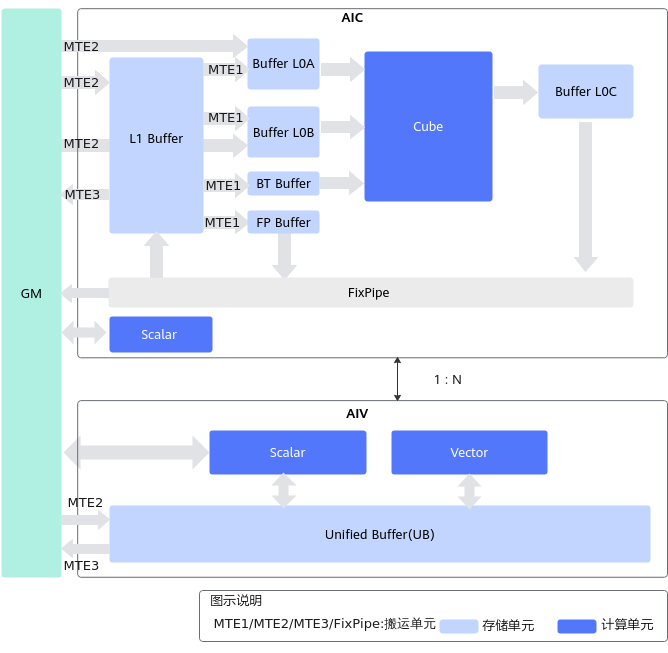
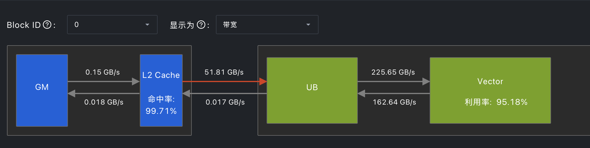
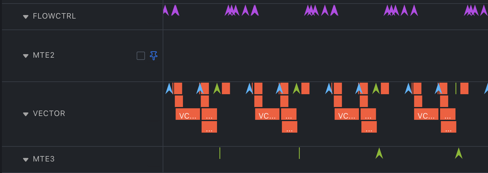
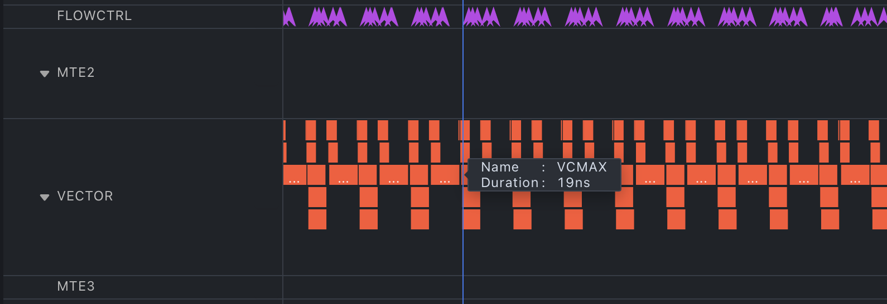
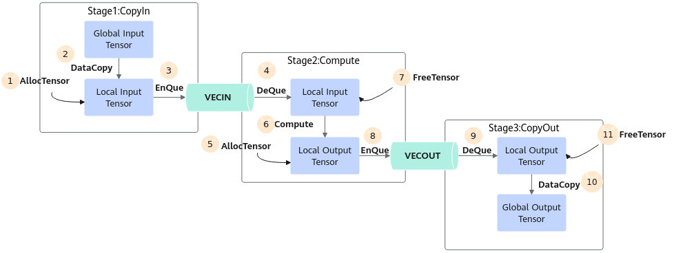
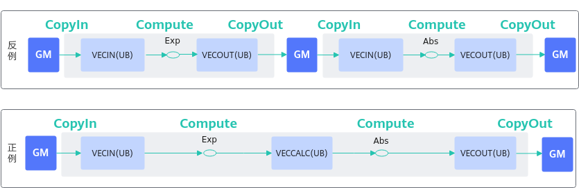
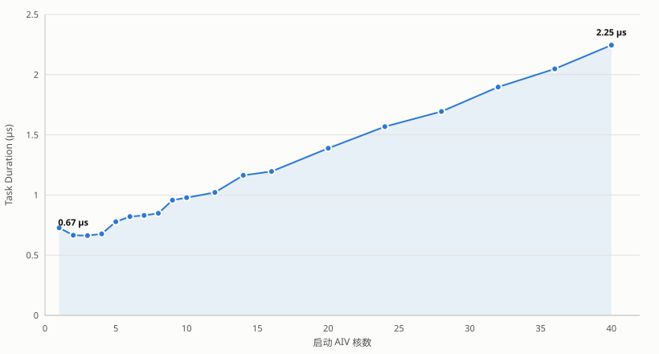
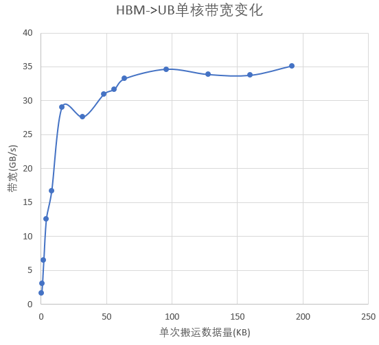
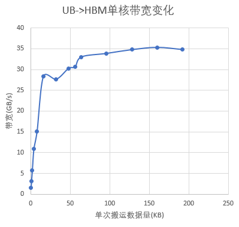
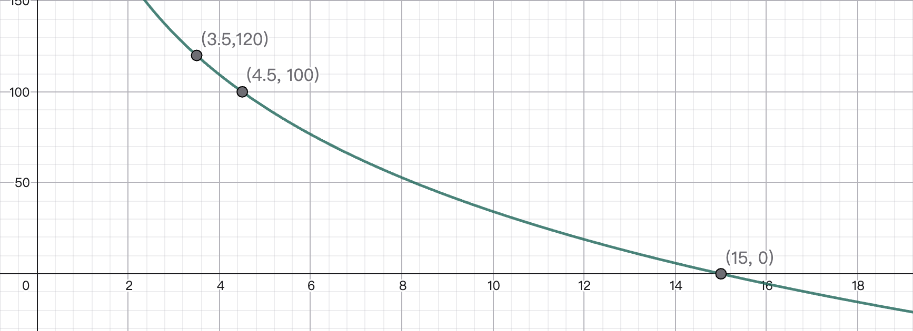

# Lab 3.5：昇腾算子开发与优化

!!! info "实验信息"

    负责助教：刘天洋，徐晨，周冠一，胡笠桁，胡哲文

    !!! tip "Bonus 实验"

        这是一个 **Bonus 实验**，不强制要求同学们完成。欢迎学有余力、对国产计算硬件感兴趣的同学挑战。

    !!! note "硬件资源赞助"

        本实验的昇腾 NPU 计算资源由 **华为技术有限公司** 赞助。在此致以诚挚谢意。

## 实验目的

在其他实验中，我们了解了 x86-64、ARM 以及 RISC-V 等架构的 CPU 和 NVIDIA GPU 的硬件架构，并尝试写出更充分利用硬件特性的程序以优化运行效率。本次实验将把视野扩展到国产计算生态的代表硬件 **昇腾（Ascend）NPU**：你需要在昇腾 910B4 NPU 上实现一个简单的 `fused_add_rmsnorm` 算子，在保证功能正确的前提下，尽可能地提高性能。

完成本实验后，你应当能够：

- 了解昇腾 910 架构 NPU 的基础架构与计算单元组织；
- 了解国产计算生态基本情况，至少掌握 AscendC / TileLang / Triton 中一种程序的基本开发能力；
- 能够比较昇腾 NPU 与 NVIDIA GPU 在设计理念上的异同；
- 掌握华为昇腾 NPU 上常见的算子优化手段，并理解这些手段背后对应着硬件的哪些特性；
- 使用 `msprof` 等工具对算子进行性能分析，并据此定位瓶颈、指导优化方向。

!!! note "前置课程"

    7 月 14 日「华为 CANN」课程覆盖了本实验的相关内容。
    
    如果你对相关知识点不熟悉，也可以回顾课程内容。或参考文末的参考资料。

## 背景知识

### FusedAddRmsNorm

`FusedAddRmsNorm`，顾名思义，是把「残差加法（Add）」和「RMSNorm」融合在一起的一个算子。

先来看 [RMSNorm](https://arxiv.org/abs/1910.07467)，这是一种对向量做均方根归一化的方法。对一个长度为 $H$ 的向量 $x$，它先用均方根做缩放，再乘以可学习权重 $w$：

$$
\operatorname{RMSNorm}(x) = \frac{x}{\sqrt{\dfrac{1}{H}\sum_{i=1}^{H}x_i^2 + \varepsilon}} \odot w,
$$

其中 $w$ 是与 $x$ 逐元素相乘的可学习缩放权重，$\varepsilon$ 是为数值稳定加入的小常数。RMSNorm 直接用均方根做缩放，计算较轻，在 Transformer 等模型中被广泛用作归一化层。

而在 Transformer 前向中，RMSNorm 之前往往紧跟一个残差加法（residual add），把上一路的输入累加到残差流上。这其实就是一个矢量加法。`fused_add_rmsnorm` 就是把这两步**融合成一个算子**，避免残差结果在全局显存中多写一次再读回。融合后的计算为：

$$
\begin{aligned}
R &= x + \mathit{residual}, \\
\mathit{rms} &= \sqrt{\dfrac{1}{H}\sum_{i=1}^{H}R_i^2 + \varepsilon}, \\
y &= \dfrac{R}{\mathit{rms}} \odot w.
\end{aligned}
$$

即该算子同时输出两部分：

- `residual_out` $= R = x + \mathit{residual}$，供后续残差流继续使用；
- `y` $= \operatorname{RMSNorm}(R)$，作为本层的归一化输出。

### 昇腾 910 NPU

#### 昇腾 NPU 与达芬奇架构

昇腾（Ascend）NPU 是华为自研的 AI 加速器，其核心 IP 是 **达芬奇（Da Vinci）架构**。达芬奇架构采用 **Cube + Vector + Scalar** 三种计算单元的异构组合：

- **Cube 单元**：承担矩阵乘法（GEMM）类运算，一个周期可完成一次 $M\times K\times N$ 的矩阵乘（具体维度由代际决定），类似 CPU 上的 AMX / SME 扩展；
- **Vector 单元**：承担向量与元素级运算（Cast、Add、Mul、Reduce、Sqrt 等），类似 CPU 上的 AVX / SVE 向量化扩展。但宽度较宽（一次处理 256B）；
- **Scalar 单元**：承担标量运算、地址计算与控制流。

Cube + Vector + Scalar 三个物理单元在一个 **AI Core** 内部并行执行，配合多级片上存储（UB / L1 / L0A / L0B / L0C）完成计算。多个 AI Core 组成一颗 NPU，通过 HBM 全局显存共享数据。

#### AI Core 与 AIC / AIV 分离架构

在 910B 系列上（包括 A2 推理和训练系列），AI Core 采用了 **AIC / AIV 分离**的设计：

- **AIC（AI Cube）**：一个 AIC 核内置 Cube 单元、L1、L0A/L0B/L0C 等存储，主要承担矩阵乘类指令；
- **AIV（AI Vector）**：一个 AIV 核内置 Vector 单元、UB（Unified Buffer）等存储，主要承担向量与元素级指令；
- AIC 与 AIV 在物理上分离，通过片内总线通信；它们之间以及 AI Core 之间通过全局显存（Global Memory, GM / HBM）协作。

<figure markdown="span">
  <div markdown="span" style="background: #ffffff; padding: 8px;">
    
  </div>
  <figcaption><a href="https://www.hiascend.com/document/detail/zh/CANNCommunityEdition/80RC2alpha002/devguide/opdevg/ascendcopdevg/atlas_ascendc_10_0008.html">AI Core 分离架构示意</a></figcaption>
</figure>

每个核内还有多级片上存储：AIV 侧的 **UB（Unified Buffer，向量计算的快速访存区）**、AIC 侧的 L1、L0A/L0B/L0C 等。多个 AI Core 之间相互独立，通过 tiling 把数据切分到各核上并行执行。

!!! note "AI Core 耦合架构"

    事实上，AI Core 也存在耦合架构，即可以直接在 AIV 的 UB 与 AIC 的 L1 Buffer / Buffer L0C 之间搬运数据而不需要经过全局内存。这种架构常见于边缘推理系列（如昇腾 310B 系列等）。

#### AIV 内部结构

!!! warning "本实验不涉及 AI Cube"

    由于算子本身不涉及矩阵乘法相关的运算，同时 AIC 算子的编写门槛较高，我们不会对 AIC 相关的开发框架和硬件特性做展开，感兴趣的同学可以自行了解。

每个 AIV 核内关键资源如下（on Ascend 910B4 NPU）：

| 资源 | 容量/规格 | 用途 |
| --- | --- | --- |
| **UB（Unified Buffer）** | 192 KiB / AIV | 向量计算的快速访存区，所有 Vector 指令的操作数必须在 UB 上 |
| **Vector 单元** | 256B(VLEN) | 执行 Cast/Add/Mul/Reduce 等向量指令 |
| **MTE2 搬运单元** | — | GM → UB 的数据搬入 |
| **MTE3 搬运单元** | — | UB → GM 的数据搬出 |
| **Scalar 单元（S）** | — | 标量运算、地址计算、控制流 |

!!! note "数据搬运与流水"

    AIV 上有 MTE2（GM→UB）、V（Vector 计算）、MTE3（UB→GM）三条独立的流水线。在本次实验中，同学们需要了解以下两种同步机制：

    1. **`TQue` 队列语义自动同步**：当你用 `inQueX.AllocTensor` → `DataCopy` → `inQueX.EnQue` 发射数据搬入 UB 指令后，再 `inQueX.DeQue` 取出来给 Vector 用时，**`EnQue` / `DeQue` 内部会自动插入 MTE2→V 的同步事件**——你不需要手动 `SetFlag/WaitFlag<HardEvent::MTE2_V>`。同理，输出端 `outQueY.EnQue` → `outQueY.DeQue` 也会自动处理 V→MTE3 的同步。这一机制主要保证内存搬运和向量计算流水线之间的依赖被正常处理。

    2. **`PipeBarrier<PIPE_*>` 显式屏障**：这一屏障用于保证某一条流水线内部的同步关系，常用的是 `PIPE_V`。Ascend NPU 的 V 流水线被设计为直接操作内存。Ascend NPU 不保证 V 流水线内部的 RAW 依赖能够被自动、正确地处理。开发者需要在存在 RAW 依赖的指令之间显式调用 PipeBarrier<PIPE_V>()，以确保本核此前发出的所有 V 指令均已执行完成。
    为了减少频繁插入屏障带来的编程负担，bisheng 编译器提供了 --cce-auto-sync 选项。启用后，编译器会根据可见的 LocalTensor 读写依赖自动插入必要的屏障。不过，当代码中涉及指针运算、容器传递或手工地址操作时，编译器的依赖分析可能失效，此时就需要同学们手动插入屏障。

    更多有关同步的信息，感兴趣的同学可以参考 [Ascend C API列表](https://www.hiascend.com/document/detail/zh/CANNCommunityEdition/latest/API/ascendcopapi/atlasascendc_api_07_0003.html).

### 算子开发路径

本实验框架支持 Ascend C、TileLang 和 Triton 三种算子开发路径。总体而言，Ascend C 更接近昇腾硬件，开发者需要显式处理数据切分、片上存储、数据搬运和计算流水；TileLang 与 Triton 则提供了更高层的 DSL 编程模型，由编译器承担更多底层实现工作。

- **Ascend C** Ascend C 是昇腾原生的 C/C++ 算子编程语言与 API 体系。它通过 DataCopy、Cast、Add、Mul、BlockReduceSum 等接口屏蔽部分指令级细节，同时保留对核间切分、片上存储、数据搬运、队列、同步和流水的细粒度控制，适合需要深入调优硬件性能的场景。一个完整的 Ascend C 自定义算子通常由三部分组成：

    - **算子原型（Op 定义）**：声明算子的输入、输出与属性，注册推理 shape 与数据类型的推导函数，以及 tiling 函数。其中 OpDef 类与注册宏等骨架可由 CANN 的 `msopgen` 工具从算子信息 JSON 自动生成，但 tiling 函数中的切分逻辑仍需开发者手写；
    - **Host 侧 tiling**：在 Host 上根据输入 shape、数据类型和平台信息，计算切分参数，决定每个核处理多少数据、UB 如何分配，并把 tiling 数据传给 kernel（类比于 CUDA 中设置 grid/block 维度并准备 kernel 参数的 host 侧代码，但额外承担了数据分区与 UB 规划）；
    - **Kernel 实现**：在 AI Core 上执行真正的计算，负责 GM↔UB 搬运、UB 内计算、结果写回（类比于 CUDA 中的 kernel 函数）。

- **TileLang** 在 Lab 3 中已登场，是一种面向高性能计算的 DSL。它把 tiling、shared memory、pipeline 等概念直接暴露为语言原语，同样可编译到昇腾 NPU 后端（见 [tilelang-ascend](https://github.com/tile-ai/tilelang-ascend)）。相较 Ascend C，它省去了手写 host tiling 与 GM↔UB 搬运的样板代码，但在某些细节上对硬件的控制力可能弱于原生路径。

- **Triton** 是基于 block 的算子编程模型，通过 [triton-ascend](https://github.com/triton-ascend/triton-ascend) 后端可编译到昇腾 NPU。它以 `tl.program_id` 切分任务、以 block 为单位组织计算，写法接近你在 GPU 上的经验，便于把已有的 GPU kernel 快速迁移过来。

三种路径最终编译出的都是跑在 Ascend NPU 上的机器码，性能上限由硬件决定。路径之间的差异在于「你能在多大程度上接近硬件」。

!!! warning "多种实现路径"

    我们提供了 AscendC、TileLang、Triton 三种实现路径的代码框架。你只需要选择一种路径实现即可，**多种实现不会带来进一步加分！**

    同时，为了使大家接触和了解国产计算生态，我们**鼓励大家在本实验中使用 AscendC 完成你的算子**。代码框架中我们只针对 AscendC 路径提供基线实现，实验文档也会以 AscendC 算子开发为主。

    但是同样需要注意，使用 AscendC 路径**不会自动给你带来额外加分**。

## 性能分析 Profiling

性能优化离不开测量。只有从 profiling 结果找到根据并针对性分析，才能找到更合理有效的优化方向。

对标 NVIDIA 的 Nsight System，Nsight Compute 等性能分析工具，华为也提供了 MindStudio 一族工具，命令行主要体现为 `msprof` 类指令，而桌面图形化版可以前往对应位置[下载 MindStudio Insight](https://www.hiascend.com/document/detail/zh/mindstudio/latest/GUI_baseddevelopmenttool/MindStudioInsight/docs/zh/user_guide/overview.md)。

本实验主要涉及以下两个 Profile 指令：

### `msprof op`：分析算子的宏观特点

`msprof op` 对目标算子进行板端采集。主要的性能分析结果集中在宏观指标，包括算子运行时间，NPU 上各个单元（如 Vector 等）的利用率，UB 等不同层级缓存间的带宽，L2 Cache 的命中率，不同 AI Core 任务量是否均匀等。

!!! tip "一个简单的例子"

    运行以下指令即可进行一次标准的算子性能数据采集：

    ```bash
    # 采集默认的计算、访存、流水线和资源冲突指标
    msprof op \
        --kernel-name="fused_add_rms_norm" \
        --launch-count=1 \
        --aic-metrics=Default \
        --output=./op_prof \
        python3 checker/test_op.py 2
    ```

    将生成目录中的 `visualize_data.bin` 导入 MindStudio Insight 可以查看图形化结果。

分析结果时可以考虑检查以下问题：

- `Block Dim` 与各核工作量是否符合 tiling 设计，是否存在空闲核、明显拖尾或负载不均匀；
- Vector 等运算单元的利用率是否较高；
- UB 高速缓存的利用带宽是否够高，次一级的 L2 Cache 命中率是否足够。

!!! note "如何读取分析的数据"

    利用率表示该运算单元处于活跃状态的比例，不一定等同于『有效工作』的比例。多条流水线可以重叠，因此不同单元之间的利用率没有明显关系；单个指标较高或较低也不足以单独证明瓶颈。

!!! example "`msprof op` 结果可视化示例"

    以下图片展示了一个 AIV 部分的 Profile 结果，可以看到不同层级缓存之间利用的带宽，Vector 单元的利用率，以及 L2 Cache 的命中率等。

    <figure markdown="span">
      
      <figcaption>`msprof op` 在 MindStudio Insight 中的可视化结果。</figcaption>
    </figure>

### `msprof op simulator`：观察指令流水与同步

Simulator 在 CPU 上模拟指定 SoC 的指令执行，适合检查指令发射顺序、流水线空泡、`SetFlag/WaitFlag` 等同步事件和资源冲突。主要生成的结果是一个流水图（也叫 Timeline）。

它不是真实 NPU 计时工具：仿真耗时不能与 `Task Duration(us)` 比较，缓存、带宽竞争和运行时调度也应以板端结果为准。

!!! tip "一个简单的例子"

    运行以下指令即可进行一次标准的算子模拟数据采集：

    ```bash
    msprof op simulator \
        --soc-version=Ascend910B4 \
        --kernel-name="fused_add_rms_norm" \
        --launch-count=1 \
        --output=./op_sim \
        python3 checker/test_op.py 2
    ```

    由于是 CPU 侧模拟算子在 NPU 上的行为，所以我们需要显示指定 -soc-version 为 Ascend 910B4。

!!! warning "不要尝试模拟真实数据规模"

    由于是 CPU 模拟，实际上 `msprof op simulator` 的性能非常糟糕，考虑到我们通过这个指令得到的结果主要是用来分析不同单元流水线之间的运转情况，模拟时请**设置较小的数据规模**，以便在合适的时间和资源使用下完成模拟。

!!! example "`msprof op simulator` 流水线示例"

    以下两张流水图表明了同一个计算功能在不同实现下的模拟流水图，其中上三角形是各种同步 flag。你应该可以明显看到右图中的 Vector 利用率相比于左图有明显提升（少了很多空泡和停顿）。

    <div style="display: grid; grid-template-columns: 1518fr 1590fr; gap: 1rem; align-items: center;">
      <figure style="margin: 0;">
        
        <figcaption style="text-align: center;">优化前：Vector 流水存在较多空泡与同步停顿</figcaption>
      </figure>
      <figure style="margin: 0;">
        
        <figcaption style="text-align: center;">优化后：Vector 流水更连续，同步空泡明显减少</figcaption>
      </figure>
    </div>

    不同流水线之间的 Timeline 还可以展示是否产生了流水线重叠执行（即同一时间不同硬件单元同时工作），详见思考题。

### 从现象提出可验证的假设

Profiler 给出的是证据，而不是自动生成的优化结论。可以按“现象—假设—实验”的方式推进：

| 观测现象 | 可优先检查 | 下一步实验 |
| --- | --- | --- |
| MTE2/MTE3 时间较长，Vector 经常等待 | 搬运粒度过小、重复读写 GM、未形成流水 | 合并搬运或复用 UB 数据，通过流水开启双缓冲技术 |
| Vector 流水长时间连续工作 | 指令数量、规约层数、类型转换或高代价指令 | 优化计算逻辑，实现更高性能的同样计算功能等 |
| 各流水线都存在大段空泡 | 过宽的屏障、Scalar 依赖、tile 太少 | 用 simulator 对齐空泡与同步事件，再收窄同步范围 |
| 部分核明显更早结束 | 多核切分不均或尾块集中 | 调整 Tiling 和 NPU 侧 Init 时的工作分配 |
| Roofline 接近带宽上限 | 算子可能受 GM 带宽约束 | 优先减少 GM 往返，而不是继续增加 Vector 指令并行度 |

每次只改变一个主要因素，先跑完整正确性测试，再重复计时。只有当对应指标与端到端耗时同时朝预期方向变化时，才能较有把握地解释优化收益。

## Ascend C 简介

Ascend C 通过 C++ 模板与 intrinsic 暴露 AIV 上的存储、搬运与计算指令。下面只列出本实验会接触到的核心概念，作为阅读 baseline 代码和继续编写 Ascend C 代码的参考。

### Tensor 编程模型

在 Ascend C 的编程模型中，主要操作的数据被视作一个 Tensor。

!!! tip "你也可以操作单个数据"

    Ascend C 也提供了单个数据的 API（如 `GetValue` 和 `SetValue`）。但这两个 API 的性能通常比较糟糕。

- **UB 与 LocalTensor**。Vector 指令的操作数必须位于 AIV 内的 UB（Unified Buffer）上。Ascend C 以 `LocalTensor<T>` 表示一段 UB 上的逻辑数据视图，承载实际数据类型 `T`（如 `half`、`float`）与长度信息，本身不直接分配内存，需从 `TBuf` 或 `TQue` 中获取。`GlobalTensor<T>` 则是 GM 上的对应视图，用于 `DataCopy` 等搬运 API 的源/目的。

- **TPosition**。`TPosition` 是一个枚举，标识缓冲区在存储层级中的物理位置，常见的三种取值如下：

    - `VECIN`：与 MTE2 流水衔接的输入侧 UB，通常作为搬入队列位置；
    - `VECOUT`：与 MTE3 流水衔接的输出侧 UB，通常作为搬出队列位置；
    - `VECCALC`：纯 Vector 侧的 UB，不参与 `TQue` 的跨流水线同步，常用于常驻或中转数据。

- **TBuf**。`TBuf<TPosition>` 是 UB 上的静态缓冲区，由 `TPipe::InitBuffer` 在 kernel 启动前按字节大小分配，生命周期与 kernel 一致。它直接持有 `LocalTensor`，不参与任何同步事件的插入，适合存放常驻数据（如 weight）或临时中转缓冲（如平方缓冲、规约暂存）。

- **TQue 与流水**。`TQue<TPosition, BUFFER_NUM>` 在 `TBuf` 之上提供队列语义，用 `AllocTensor → EnQue → DeQue → FreeTensor` 描述一段 LocalTensor 在流水阶段间的所有权与同步事件转移。`BUFFER_NUM` 控制队列深度，设为 2 即为相邻 tile 的搬入与计算提供交叠空间。

### 内存搬运类 API

`DataCopy` 用于 GM↔UB 间对齐、连续或规则分段的数据搬运；

`DataCopyPad` 进一步支持非 32B 对齐的尾块，可通过 `isPad`、`leftPadding`/`rightPadding`、`paddingValue` 控制尾部的填充值，避免越界读写或破坏对齐。`DataCopyExtParams` 以 `blockCount` / `blockLen` / `srcStride` / `dstStride` 描述多段搬运的几何。

### Vector 计算 API

Vector 侧的元素级与逐元素运算包括 `Cast`（类型转换，可指定 `RoundMode`）、`Add`、`Mul`、`Div`、`Sqrt`、`Rsqrt` 等，通常以 `dst, src0, src1, maskCount` 形式调用；`Duplicate<T>` 用标量广播填充一段 LocalTensor。所有调用都按 32B 对齐（FP16 16 元素、FP32 8 元素）操作，非对齐尾数由 mask 或 `DataCopyPad` 处理。

沿一维规约的指令以 `Reduce<op>` 为主。可以指定规约长度等参数，规约操作包括求和，取极值等。同时 AscendC 提供了更底层的 `BlockReduce<op>` 与 `WholeReduce<op>` 操作，用来减小 `Reduce<op>` 的开销。感兴趣的同学可以进一步了解这些 API 的使用方法。

!!! tip "查阅官方 API 参考"

    上述 API 的支持数据类型、对齐、mask、repeat、临时空间与同步的要求，以及功能和使用方法的详细描述，都在 Ascend C 官方 API 文档里有所说明，实际编写算子时，请及时查阅相关 API 文档。详见 [Ascend C API 列表](https://www.hiascend.com/document/detail/zh/CANNCommunityEdition/latest/API/ascendcopapi/atlasascendc_api_07_0003.html)。


## 编写高性能的 Ascend C 算子

!!! warning "不要照抄优化思路！"

    以下给出的是可能有效的优化方向，而不是必须实现的。请始终以性能结果和 profiling 结果为准。

### 让搬运与计算形成流水

AIV 的 MTE2、Vector 和 MTE3 可以分别执行搬入、计算和搬出。由于这三个单元本身是相互独立的，因此如果在同一时间重叠不同单元的执行将能够大幅掩盖时间，获得加速。Ascend C 的编程模型中倡导把一个 tile 的处理拆成 `CopyIn → Compute → CopyOut` 三段式，明确生命生产者和消费者关系，并用 `TQue` 在阶段间传递 LocalTensor 的所有权与同步事件。这样的编写范式能够更好的让编译器识别依赖关系，并且**自动**开启流水。

<figure markdown="span">
  <div markdown="span" style="background: #ffffff; padding: 8px;">
    
  </div>
  <figcaption>Ascend C 三段流水编程范式。<a href="https://www.hiascend.com/zh/developer/techArticles/20240819-1">图源：昇腾社区</a></figcaption>
</figure>

将队列的 buffer 数设为 2（或者更多），可以为相邻 tile 交叠提供空间：当一份数据参与 Vector 计算时，另一份数据才有机会同时搬入或搬出。这个也被称作 Double Buffering 技术。

!!! note "不一定更快"

    Double Buffer 并不总是保证自动加速，同时其是否生效还需要满足相邻阶段之间没有不必要的全局同步等条件。

### 让中间结果留在 UB

融合算子的主要价值，是让前一阶段的输出直接成为后一阶段的 UB 输入，而不是每经过一步就写回 GM。官方示例中的反例执行两次 GM 往返，正例则在 `VECCALC` 中保留中间值。

<figure markdown="span">
  <div markdown="span" style="background: #ffffff; padding: 8px;">
    
  </div>
  <figcaption>连续 Vector 计算的中间结果应尽量在 UB 内衔接。<a href="https://www.hiascend.com/zh/developer/techArticles/20240823-1">图源：昇腾社区</a></figcaption>
</figure>

对本算子而言，$R=x+\mathit{residual}$ 随后还要用于输出 `residual_out`、平方和规约以及计算 $y$。只要 UB 容量允许，就应保留可复用的 $R$，并把写回 `residual_out` 的副本交给输出队列，避免为后续计算再次读取 GM。`weight` 在所有行上相同，也可以按核或按 tile 复用。与此同时，应统计所有常驻 buffer 与双缓冲队列的总占用，避免为了复用而挤压 tile 大小或导致 UB 超限。

### 根据 shape 设计 Tiling

多核和单核 tiling 需要一起设计：

- 运行时通过平台接口查询 AIV 核数与 UB 容量，不把某个环境中的数值写死到策略中；
- 各行相互独立时，优先沿独立维（如 $B$）切分。使用商和余数分配大小核，使各核行数最多相差 1，避免简单向上取整造成尾部空闲核；
- 当独立维很小时，盲目启动全部 AIV 没有收益。沿其他维（如 $H$）切分虽然能增加并行度，却会引入跨核规约或额外 pass，需要根据实测决定是否值得；
- tile 大小既要满足 UB 预算，也要让每核有足够多的 tile 支撑流水。最大的 tile 不一定最快，最小的 tile 也会增加循环和搬运启动开销。

??? example "从启动开销的角度思考为什么不一定需要启动全部 AIV"

    在 NPU 中，每个核在被启动时都要单独付一次初始化开销（加载配置、建立执行上下文、准备片上资源等），且这部分几乎无法通过流水、搬运或规约优化消除——它只和「启动了多少个核」有关。下面是用一个 body 几乎为空的算子，只改变 `<<<blocks>>>` 下发 AIV 数目，用 `msprof op` 测得的 Task Duration，可以近似认为是启动开销：

    <figure markdown="span">
      
      <figcaption>空 kernel 的运行时间和启用 AIV 数目的关系</figcaption>
    </figure>

    它随启动核数近似线性增长（约 2 核 0.67 µs → 40 核 2.25 µs），本身处在微秒量级，在大算子里几乎被 profiling 波动淹没；但当算子整体只有几微秒、单核计算量又很小时就占比可观。因此计算量过小的任务要选择「够用就好」的核数，而不是无脑写满全部 AIV。

公开评测 shape 中既有 $B=1$，也有 $H$ 非 32B 对齐的情况。一个只对 $[256,1024]$ 快、但在小 $B$ 或尾块上出错的 tiling 不是有效实现。

### 提高搬运效率

MTE 搬运存在固定启动成本，单次搬运过小时难以充分利用带宽。

??? example "单次搬运量与有效带宽的关系"

    以下是昇腾社区对于不同搬运量带宽利用率的一个测试，可以看到小的数据搬运并不能很好的利用带宽。相关结果数据并不一定适用于我们的 910B4 NPU 上，只是表明一个相关趋势。

    <div style="display: grid; grid-template-columns: 1.0974fr 1.0528fr; align-items: start; gap: 1rem;">
      <figure style="margin: 0; min-width: 0;">
        
        <figcaption style="text-align: center;">HBM → UB</figcaption>
      </figure>
      <figure style="margin: 0; min-width: 0;">
        
        <figcaption style="text-align: center;">UB → HBM</figcaption>
      </figure>
    </div>

    <p style="text-align: center; margin-top: 0.5rem;"><a href="https://www.hiascend.com/zh/developer/techArticles/20240906-1">图源：昇腾社区</a></p>

若 UB 预算和数据布局允许，可以尝试用一次 `DataCopy` 搬运多行，或用 `blockCount`、`blockLen` 与 stride 参数表达规则的多段搬运，减少逐行发射指令的开销。与此同时需要注意：

- GM 起始地址、每行 stride 和 UB 地址的对齐会共同影响搬运效率；
- 非对齐尾块应使用 `DataCopyPad` 或等价 mask 正确处理，不能为了对齐越界读写；
- 合并搬运会增加 UB 占用，并可能减少每核 tile 数，应与 Double Buffer 一起重新评估；

### 选择合适的规约实现与精度

高效的归约操作是本实验中这个算子能够获得高性能的关键一环。Ascend C API 中提供的 `Reduce<op>` 类算子可能存在较多的同步 Flag 设置和边界检测情况，实际上可能并不能获得很好的性能。因此，Ascend C API 同时提供了更加底层的 `BlockReduce<op>` 操作和 `WholeReduce<op>` 操作。两者在单次执行速度和吞吐效率上各有优劣，但是合作起来就可能获得比原生 `Reduce<op>` 更好的规约性能和运算单元利用率。

同时，本实验的输入输出是 FP16，但这并不意味着平方和也适合在 FP16 中累加。使用 FP32 作为中间结果通常更稳健，但会占用更多 UB，也可能增加 Cast 和 Vector 计算开销。可以尝试减少重复 Cast、缩短 FP32 数据的存活范围；

!!! danger "禁止一味地使用低精度来获得更高性能"

    任何低精度或近似方案都必须通过我们最后的精度校验！

??? tip "拓展阅读"

      - [Ascend C 算子性能优化实用技巧 01：流水优化](https://www.hiascend.com/zh/developer/techArticles/20240819-1)
      - [Ascend C 算子性能优化实用技巧 02：内存优化](https://www.hiascend.com/zh/developer/techArticles/20240823-1)
      - [Ascend C 算子性能优化实用技巧 03：搬运优化](https://www.hiascend.com/zh/developer/techArticles/20240906-1)
      - [Ascend C 算子性能优化实用技巧 04：Tiling 优化](https://www.hiascend.com/zh/developer/techArticles/20240920-1)
      - [Ascend C 算子性能优化实用技巧 05：API 使用优化](https://www.hiascend.com/developer/techArticles/20241107-1)

## 实验任务

你的任务是在昇腾 910B4 NPU 上实现并优化 `FusedAddRmsNorm` 算子。你可以从 **Ascend C、Triton-Ascend、TileLang-Ascend** 中任选一种开发路径；只需完成一种实现，尝试多种路径不会带来额外加分。

实现需要同时满足以下要求：

- 保持给定的输入、输出和属性接口；
- 通过公开与隐藏测试的正确性检查；
- 在指定评测配置下尽可能优化 kernel 性能；

### 接口与计算语义

设 $B$ 为行数，$H$ 为隐藏层宽度：

| 张量 | 参数类型 | 形状 | 数据类型 | 含义 |
| --- |  ---  | --- | --- | --- |
| `x` | 输入 | $[B,H]$ | FP16 | 输入 |
| `residual` | 输入 | $[B,H]$ | FP16 | 残差 |
| `weight` | 输入| $[H]$ | FP16 | RMSNorm 缩放权重 |
| `eps` | 输入| 标量 | FP16 | 防止除零的微小偏移 |
| `y` | 输出|$[B,H]$ | FP16 | 归一化结果 |
| `residual_out` |输出| $[B,H]$ | FP16 | 残差加法结果 |

对每一行 $b\in[0,B)$，算子计算：

$$
\begin{aligned}
R_b &= x_b + \mathit{residual}_b, \\
\mathit{rms}_b &= \sqrt{\dfrac{1}{H}\sum_{i=0}^{H-1}R_{b,i}^{\,2} + \varepsilon}, \\
y_b &= \dfrac{R_b}{\mathit{rms}_b} \odot w, \\
\mathit{residual\_out}_b &= R_b.
\end{aligned}
$$

三个开发路径对 checker 暴露的入口均为 `fused_add_rmsnorm(x, residual, weight, eps)`，其中 `eps` 默认为 $10^{-6}$。

??? note "关于 `enable_pdl` 属性"

    Ascend C 的底层算子定义中还保留了一个布尔属性 `enable_pdl`，用于与 FlashInfer 原始签名保持一致。FlashInfer 中该属性控制是否启用 NVIDIA CUDA 12.3+ 引入的 **Programmatic Dependent Launch（PDL，程序化依赖启动）**——允许后一个 kernel 在前一个 kernel 完全结束前就开始发射与初始化，以掩盖 kernel launch 延迟。

    在昇腾 NPU 上不存在对等的硬件机制，因此本实验中该属性不产生任何实际效果：PyTorch 扩展胶水层会固定向算子传入 `false`，Triton 与 TileLang 路径也无需暴露该属性。你不需要在实现中处理它，也不应期望通过它获得性能收益。

!!! warning "本实验采用非原地接口"

    FlashInfer 原始接口会原地修改输入，而本实验规定 `x` 和 `residual` 为只读输入，并返回独立的 `y` 与 `residual_out`。请勿改变这一约定。

### 修改范围与限制

你可以修改所选路径目录下的实现，并在该目录内增加必要的辅助文件：

| 开发路径 | 可修改目录 |
| --- | --- |
| Ascend C | `src/ascendc/` |
| Triton-Ascend | `src/triton/` |
| TileLang-Ascend | `src/tilelang/` |

允许自行设计 kernel、tiling、核数、片上存储布局和针对不同 shape 的实现分支。禁止：

- 修改 `checker/`、`env.sh`、输入生成、golden 或计时逻辑；
- 调用已有 RMSNorm、FusedAddRmsNorm 或等价高层算子代替被测计算；
- 硬编码测试数据、隐藏 shape 或输出结果；
- 利用评测程序漏洞绕过计算或正确性检查；
- 依赖课程环境中未提供的额外软件包或自建工具链。

可以参考开源实现，但需要在报告中注明来源，并说明自己的实现与修改。

## 代码框架

实验代码位于仓库的 `src/lab3p5/`：

```text
src/lab3p5/
├── env.sh                         # 加载课程 CANN 与 Python 环境
├── README.md                      # 代码框架使用与提交说明
├── checker/
│   ├── build.sh                   # 构建并安装 Ascend C 算子
│   ├── run.sh                     # 正确性检查
│   ├── profile.sh                 # 固定性能 case 的 msprof 采集
│   ├── test_op.py                 # 输入生成、FP32 golden 与逐元素比较
│   ├── case_specs.py              # 公开测试配置
│   └── get_time.py                # 解析 op_summary 中的 kernel 时间
└── src/
    ├── __init__.py
    ├── ascendc/
    │   ├── op_host/
    │   │   ├── CMakeLists.txt
    │   │   └── fused_add_rms_norm.cpp      # 算子注册与 Host tiling
    │   ├── op_kernel/
    │   │   ├── CMakeLists.txt
    │   │   ├── fused_add_rms_norm.cpp      # Device kernel
    │   │   └── fused_add_rms_norm_tiling.h # Tiling 数据结构
    │   ├── extension/custom_op.cpp         # PyTorch 扩展胶水
    │   ├── common/pytorch_npu_helper.hpp   # PyTorch NPU 辅助头文件
    │   ├── CMakeLists.txt / CMakePresets.json
    │   ├── build_op.sh                     # 构建 Ascend C 算子与 wheel
    │   └── setup.py
    ├── triton/
    │   ├── __init__.py
    │   └── fused_add_rmsnorm.py            # Triton kernel 与 launcher
    └── tilelang/
        ├── __init__.py
        └── fused_add_rmsnorm.py            # TileLang kernel 与 launcher
```

### 选择开发路径

| 路径 | 建议先阅读 | 运行方式 |
| --- | --- | --- |
| Ascend C | `src/ascendc/op_host/fused_add_rms_norm.cpp`、`src/ascendc/op_kernel/fused_add_rms_norm.cpp` | 直接运行 checker；脚本会在当前任务中按需构建并安装算子 |
| Triton-Ascend | `src/triton/fused_add_rmsnorm.py` | 提交任务时设置环境变量 `LANG=triton` |
| TileLang-Ascend | `src/tilelang/fused_add_rmsnorm.py` | 提交任务时设置环境变量 `LANG=tilelang` |

Ascend C 路径提供了一个以正确性为主的 baseline：Host 侧读取 shape 和属性并生成 tiling；Device 侧按行分配工作，FP16 数据进入 UB 后主要使用 FP32 计算，再转换为 FP16 输出。它已经展示了 `TQue`、`TBuf`、数据搬运、Vector 计算和规约的基本组织方式，但同步、流水和 tiling 仍有优化空间。

本文不逐项复述 Ascend C API。使用接口前，请直接查阅对应 CANN 版本的 [Ascend C API 参考](https://www.hiascend.com/document/detail/zh/CANNCommunityEdition/latest/API/ascendcopapi/atlasascendc_api_07_0003.html)，尤其注意支持的数据类型、对齐、mask、repeat、临时空间和同步要求。

### 构建与自测

所有命令都应在 `src/lab3p5/` 下执行。NPU 任务通过 `hpc submit` 提交到 `lab3p5` 分区；`run.sh` 和 `profile.sh` 会自行加载 `env.sh`，一般不需要在提交任务前手动 `source`。

```bash
# 正确性：运行全部公开 case
hpc submit -p lab3p5 bash checker/run.sh
hpc submit -p lab3p5 -e LANG=triton bash checker/run.sh
hpc submit -p lab3p5 -e LANG=tilelang bash checker/run.sh

# 正确性：只运行一个公开 case；编号从 1 开始
hpc submit -p lab3p5 bash checker/run.sh 2

# 性能：固定 shape 性能测试（256×1024），不接受 case 参数
hpc submit -p lab3p5 bash checker/profile.sh
hpc submit -p lab3p5 -e LANG=triton bash checker/profile.sh
hpc submit -p lab3p5 -e LANG=tilelang bash checker/profile.sh
```

`checker/run.sh` **只负责正确性检查**；`checker/profile.sh` **只采集 student 算子的性能**，使用 `msprof op --warm-up=10` 并输出一次 `Task Duration(us)`。进行性能测试前，应先用 `run.sh` 验证正确性。

Ascend C 路径下，每次改动代码后需要自己进行编译，编译脚本已经写好为 `checker/build.sh`，在 Devpod 内即可进行。TileLang 和 Triton 路径会自动触发编译，不需要同学们手动进行。

## 如何获取计算资源

我们通过[实验平台](https://platform.s.zjusct.io)提供 **arm64-910b** DevPod，容器拉取的镜像中已经配有本实验所需的 CANN 工具链和 Triton/Tilelang 包环境，一般不需要自行安装工具链。更详细的平台和文件同步说明见[集群使用](https://hpc101.zjusct.io/guide/)。你需要做的包括：

1. 登录实验平台；
2. 创建预设为 `arm-910b` 的 DevPod；
3. 在 DevPod 中获取课程仓库并进入 `src/lab3p5/`；
4. 执行 `source ./env.sh` 后开始构建和测试。
5. 在需要在 NPU 上执行算子时使用 `hpc submit -p lab3p5 <your commands>` 即可提交至分配有一张 910B4 NPU 的计算分区执行你的命令。

!!! warning "家目录不共享！"

    华为为我们提供的 Ascend 910B4 8 卡裸金属机器地理上分布于华北-乌兰察布地区。距离超算队在杭州的集群和其他硬件资源有一定的地理距离。由于 NFS 对于时延有较高要求，本平台的家目录不会与其他硬件资源的家目录共享。

!!! danger "请注意区分 Devpod"

    在创建 Devpod 时，Lab 4 任务一所需的鲲鹏环境对应的 Devpod 预设为 `arm64-920b`，而 Lab3.5 的预设 Devpod 为 `arm64-910b`，两者环境和家目录均不互通，**请注意区分**。

## 评分方式

评测包括**正确性**和**性能**两部分。只有通过正确性检查的实现才会进入性能计分。

### 正确性验证

我们提供多个 Case 测试你的算子。公开 case 由 `checker/case_specs.py` 定义。下表同时给出代码中的 case 索引和命令行编号：

| case 索引 | 命令行编号 | $B\times H$ | 说明 |
| --- | --- | --- | --- |
| 0 | 1 | $32\times4096$ | 小规模、对齐 |
| 1 | 2 | $256\times1024$ | 性能评测配置 |
| 2 | 3 | $1\times4096$ | 单行 |
| 3 | 4 | $1997\times3037$ | 行数与尾部均不对齐 |
| 4 | 5 | $2048\times4096$ | 大规模、对齐 |

输入由固定 seed 在运行时**随机**生成。正式评测还会使用不同 shape 的隐藏 case（保证数据范围大致一致），因此不能只针对公开配置硬编码实现。

Golden 在 FP32 下完成残差加法、平方和、均值、开方、除法和权重缩放，最后转换为 FP16。`y` 与 `residual_out` 均需逐元素通过检查。

对参考值 $g_i$ 和输出值 $o_i$，元素在满足下列任一条件时通过（相对精度或绝对精度小于给定阈值）：

$$
|o_i-g_i|\le 10^{-3}
\quad\text{或}\quad
\frac{|o_i-g_i|}{\max(|g_i|,10^{-12})}\le 10^{-3}.
$$

整个张量要求错误元素比例为 0。一个更快但未通过全部正确性检查的实现不会获得性能分数。

### 性能评分

为了方便 OJ 等实现，性能测试只涉及单个 Shape，评测配置为：

- **Shape**：$[256,1024]$；
- **输入输出类型**：FP16；
- **`eps`**：$10^{-6}$；
- **指标**：被测 kernel 的 `Task Duration(us)`（来自 `msprof op` 的结果，热身 10 次）。

基于我们的基线和优化结果，目前的评分曲线如下（对数曲线）：

<figure markdown="span">
  
  <figcaption>性能评分曲线（横轴为 kernel 耗时，纵轴为得分）。</figcaption>
</figure>

我们提供的 Ascend C 基线性能为起始评分点，满分 120 分，超出的 20 分将作为 Bonus。

## 实验报告要求

实验报告提交 PDF，重点说明你如何从测量得到优化决策，不需要重复大段背景知识或 API 文档。报告至少应包含：

- 使用的开发路径、测试环境、软件版本和运行命令；
- 算子的计算过程、数据依赖和初始实现；
- baseline 的正确性、性能数据和 profiling 证据；
- 每项主要优化针对的瓶颈、关键修改及其收益；
- 最终正确性结果和性能结果；
- 尝试过但未采用的方案及原因；
- [思考题](#思考题)作答；
- 参考过的资料或开源实现。

较长的代码、完整 profiler 输出和构建日志不必全部放入正文，只需保留能够支持结论的部分。

!!! tip "失败尝试也值得记录"

    没有带来加速的尝试可以帮助说明原先的瓶颈判断、优化的副作用，或不同指标之间的取舍。

!!! danger "关于 AI 使用"

    本实验允许使用 AI Agent 辅助开发和理解资料，但最终报告应由你自行组织和核实，禁止使用 AI 生成。

## 思考题

!!! tip "这里可能没有标准答案"

    部分思考题可能没有一个标准的正确答案。我们更希望看到你在实验过程中遇到的实际情况以及你个人的思考和理解，即使可能存在错误。

1. 对 $[256,1024]$、FP16 配置，估算算子必须进行的 GM 读写量和主要浮点操作数。说明你的计数口径，计算算术强度，并结合 `msprof` 结果判断实现更接近计算瓶颈还是访存瓶颈。
2. 你的算子是否开启了 Double Buffer 流水？请你通过 `msprof op simulator` 的结果向我们证明。如果你开启了双缓冲流水，请说明你是显示编写了依赖还是让编译器自动识别开启的？
3. （Bonus）我们讲到了 `TQue` 相关的概念，结合你对相关文献的阅读和实际的编程以及 Profiling 体验，`TQue` 本身是否是一个真实存在的队列？我们在 `EnQue` 和 `DeQue` 时相关的 LocalTensor 是否发生了在队列之间的拷贝或移动？
5. （Bonus）今年第一季度，华为正式推出了新一代 NPU Ascend 950PR，引入了很多新的变化。请阅读相关资料，向我们展示一下相比 910 系列，950PR 带来了哪些新的硬件特性？你也可以比较昇腾 NPU（910B 系列）与 NVIDIA GPU 在硬件设计理念，开发语言等方面的异同。或者搜索一下一代代昇腾 NPU 和 NVIDIA GPU 的迭代过程，你有什么发现？
6. （Bonus）今年是我们首次将 NVIDIA GPU 以外的其他异构计算平台引入到课程和实验中，欢迎你给我们分享你的体验，对于昇腾 NPU 的使用体验或者相关开发语言（Ascend C、Triton-ascend、TileLang-ascend）的使用体验等（锐评也可以，不会扣分的！）。

## 提交要求

需要提交：

1. **实现代码**：所选开发路径对应的完整目录；
2. **实验报告**：单独的 PDF 文件。

请在课程平台对应的 Lab 3.5 任务中分别上传代码目录和报告 PDF；具体文件名与上传入口以任务开放时的页面说明为准。

代码上传规则如下：

| 开发路径 | 上传目录 | 平台放置位置 |
| --- | --- | --- |
| Ascend C | `src/ascendc/` | `src/ascendc/` |
| Triton-Ascend | `src/triton/` | `src/triton/` |
| TileLang-Ascend | `src/tilelang/` | `src/tilelang/` |

新增辅助文件必须位于所选路径目录内，并保证代码能在课程提供的干净环境中构建和运行。

请勿提交：

- `checker/`、`env.sh` 或对这些文件的修改；
- `build_out/`、`dist/`、wheel、custom OPP 安装目录等构建产物；
- `PROF*`、`op_prof/`、`op_sim/`、`prof_out/` 等 profiling 原始目录；
- 测试数据、缓存或其他与实现无关的大文件。

## 参考资料

### 算法与参考实现

- [Root Mean Square Layer Normalization](https://arxiv.org/abs/1910.07467)
- [FlashInfer: Kernel Library for LLM Serving](https://github.com/flashinfer-ai/flashinfer)
- [FlashInfer `fused_add_rmsnorm` 文档](https://docs.flashinfer.ai/generated/flashinfer.norm.fused_add_rmsnorm.html)

### Ascend C 与性能分析

- [Ascend C 开发文档](https://www.hiascend.com/document/detail/zh/canncommercial/80RC31alpha001/devguide/ascendc)
- [Ascend C API 参考](https://www.hiascend.com/document/detail/zh/CANNCommunityEdition/latest/API/ascendcopapi/atlasascendc_api_07_0003.html)
- [Ascend C 最佳实践](https://www.hiascend.com/document/detail/zh/CANNCommunityEdition/850alpha002/opdevg/ascendcbestP/atlas_ascendc_best_practices_10_0031.html)
- [msProf 算子调优工具](https://www.hiascend.com/document/detail/en/canncommercial/850/devaids/optool/atlasopdev_16_0082.html)
- [CANN 软件下载与文档](https://www.hiascend.com/software/cann)

### 其他开发路径

- [Triton 文档](https://triton-lang.org/)
- [triton-ascend](https://github.com/triton-ascend/triton-ascend)
- [TileLang 文档](https://tilelang.com/)
- [tilelang-ascend](https://github.com/tile-ai/tilelang-ascend)
