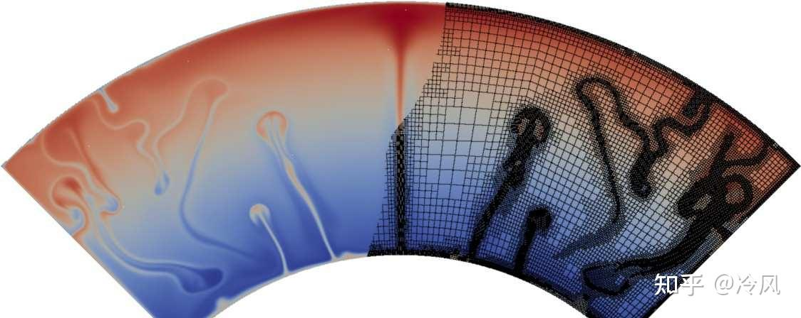
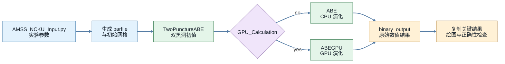
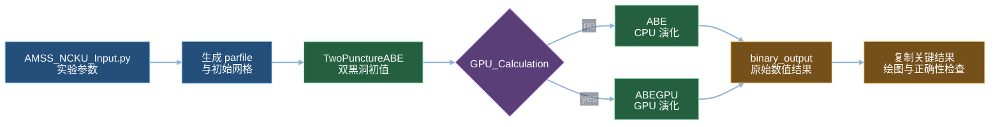
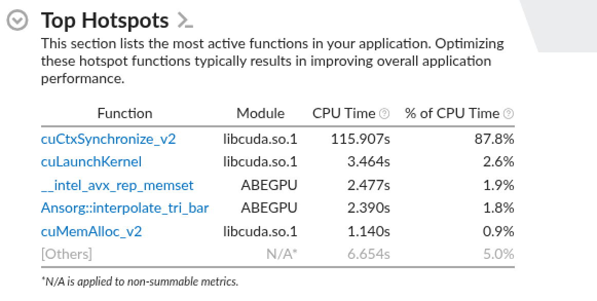
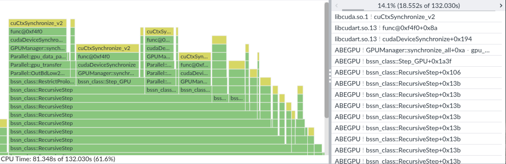
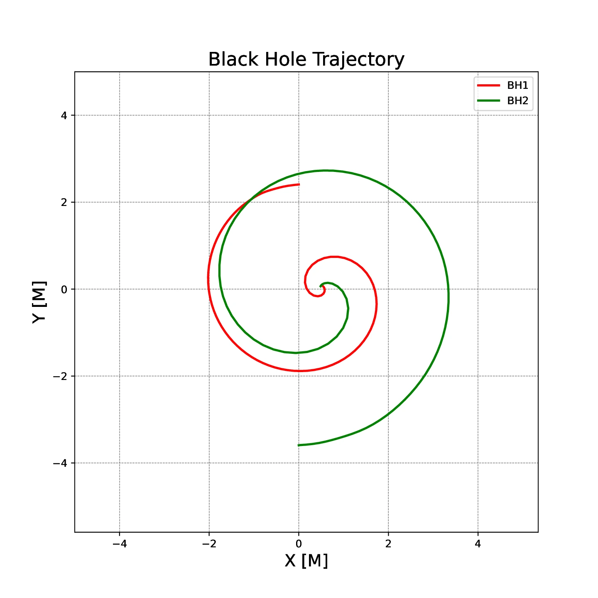
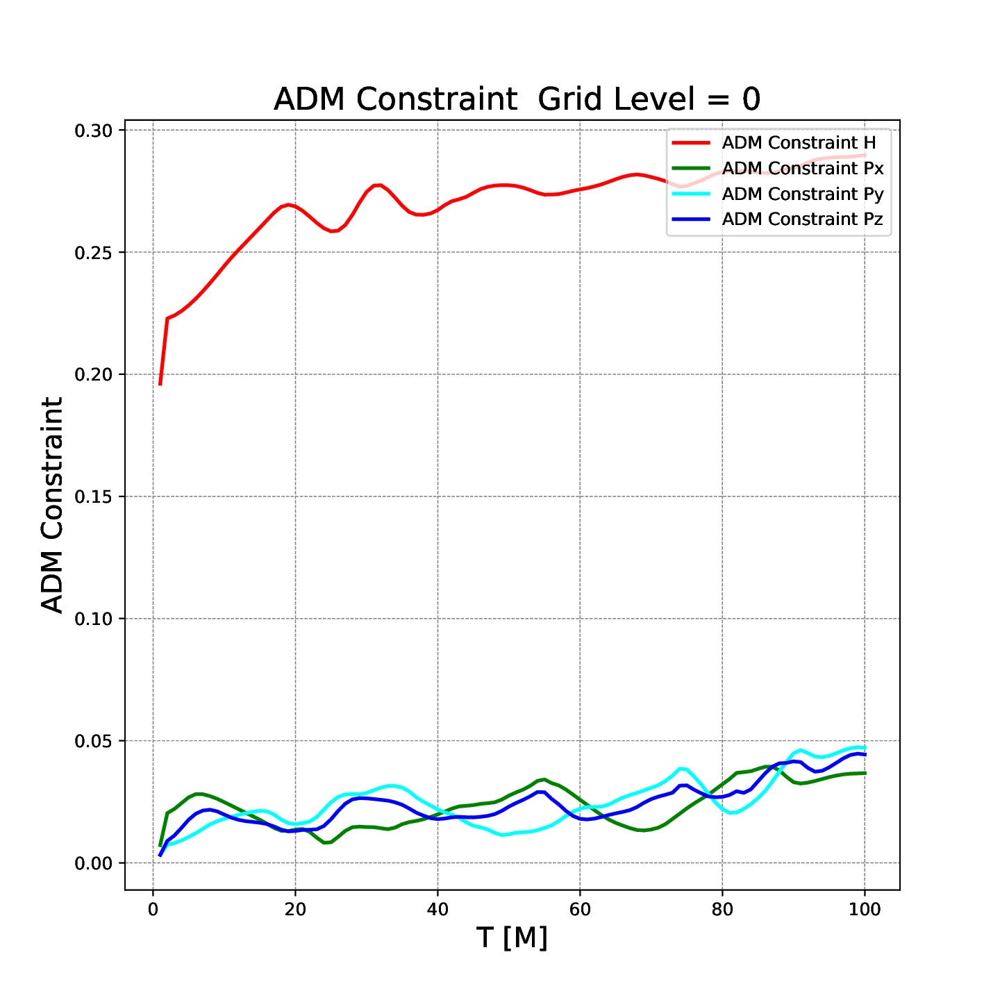
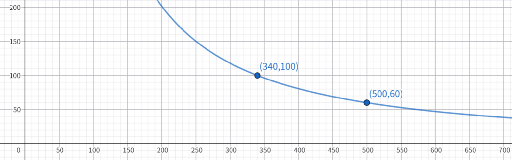

# 实验四：AMSS-NCKU 数值相对论程序优化

!!! info "实验信息"

    **负责助教**：

    - **任务一（CPU）**：黄钰，胡笠桁，井淳
    - **任务二（GPU）**：刘天洋，胡笠桁，徐晨
  
!!! warning "文档状态"

    由于 GPU 计算资源尚未敲定，因此本实验文档中有关 GPU 的部分可能仍有调整，目前版本仅做参考。

## 实验目的

前几个实验中，我们主要围绕较小、较清晰的计算 kernel 进行优化，比如向量化、CUDA 编程、模型推理等。
本次实验会有更大挑战。你将接近真实的科学计算工作流，面对一个经过裁剪但仍然较大的数值相对论程序
**AMSS-NCKU**，在不改变物理问题和数值结果的前提下，分析并优化它在 CPU 和 GPU 上的运行性能。

完成本实验后，你应当能够：

- 了解一个真实科学计算程序从参数生成、初值求解、时间演化到结果后处理的基本流程；
- 使用性能分析工具找出大型程序中的热点并做针对性优化；
- 在多进程、多线程、向量化和访存局部性等优化手段之间合理取舍；
- 在 GPU 上分析 kernel 性能、数据搬运和并行粒度，并尝试优化一个综合的 GPU 程序；
- 用数值正确性约束自己的优化，避免为了速度破坏科学计算结果。

## 背景介绍

### AMSS-NCKU 是什么

AMSS-NCKU 是**中国首个自主研发**的数值相对论计算程序，用于数值求解爱因斯坦场方程，模拟黑洞等强引力系统的时空演化，并从模拟结果中提取引力波信号。
它由中国科学院数学与系统科学研究院（AMSS）和成功大学（NCKU）等单位的研究者长期开发。

<figure markdown="span">
  
  <figcaption>双黑洞并合示意图。<a href="https://mp.weixin.qq.com/s/5F24M9nuCbNM0d0hqeb0Sg">图源</a>。</figcaption>
</figure>

在数值相对论中，双黑洞和多黑洞系统是典型的强非线性问题：黑洞附近需要很高的空间分辨率，远处又要保留足够大的计算区域来传播和提取引力波。
AMSS-NCKU 使用有限差分方法和自适应网格细化（AMR）技术来处理这种多尺度结构。AMR 不会在整个计算区域使用同样精细的网格，而是在黑洞附近等需要高分辨率的区域逐级加密，在远区保留较粗的网格。不同层级之间需要进行 prolongation、restriction 和 ghost zone 数据交换，这些操作也会成为后续并行与访存优化需要关注的部分。

<figure markdown="span">
  
  <figcaption>自适应网格细化通过局部加密同时覆盖不同空间尺度。<a href="https://zhuanlan.zhihu.com/p/557345775">图源</a>。</figcaption>
</figure>

程序首先通过 TwoPuncture 方法生成双黑洞初始数据，然后在网格上推进 BSSN 等演化方程，周期性输出黑洞轨迹、约束量、ADM 量和引力波相关数据。

AMSS-NCKU 代码中，核心计算跨越 C++、Fortran、CUDA、MPI 和 Python。C++ 负责网格、patch 管理、通信和整体控制，Fortran 保留了大量 CPU 数值 kernel，CUDA 版本提供 GPU 计算路径，Python 脚本则负责生成输入、启动程序、整理输出和画图。
原始项目后来还加入了更友好的 Python 操作接口，用于自动化初始化、运行和可视化流程。

AMSS-NCKU 也被用作 [ASC26 世界大学生超级计算机竞赛](https://www.asc-events.net/StudentChallenge/ASC26/preliminary.php) 的赛题之一。
不过在本实验里，你不需要完整复现竞赛题目；我们会使用裁剪后的课程版本，保留一组固定的双黑洞配置、CPU/GPU 两套演化路径，以及必要的初值生成和后处理脚本。
你要优化的不是某一个孤立 kernel 或代码片段，而是一条完整的科学计算流水线：输入参数生成、TwoPuncture 初值求解、BSSN 时间演化、MPI 通信、CPU/GPU kernel、结果整理和可视化。
因此，本实验会关注端到端时间；在报告中，你也应当解释你的优化如何影响整个程序，而不是只报告某个局部函数的加速。

!!! info "代码来源与致谢"

    本实验基于 AMSS-NCKU 原始程序构建，并根据 HPC101 课程需求进行了针对性调整。原始仓库为
    [xiaoqu0000/NR-amssncku](https://github.com/xiaoqu0000/NR-amssncku)，使用
    [LGPL-2.1](https://github.com/xiaoqu0000/NR-amssncku/blob/main/LICENSE) 许可证。
    本课程在使用和裁剪 AMSS-NCKU 作为教学实验前，已经征得目前项目的主要维护者**乔琛凯（重庆理工大学）**老师的许可。

    实验源码中的 C++ / Fortran 代码和整体计算框架著作权归原作者团队所有。为了适配本实验，浙江大学超算队（ZJUSCT）在原始框架上进行了裁剪，并实现/改造了 GPU 相关代码、CMake 构建脚本、运行脚本和测试用例等。除非特别说明，文档和实验框架中的这些课程适配部分由 ZJUSCT 维护。

### 测试用例：GW250118

本次实验以近两年的真实引力波事件 **GW250118** 作为测试用例的物理背景。
更准确地说，这里参考的是 GWTC-5.0 中的 `GW250118_055802`，即 2025 年 1 月 18 日 05:58:02 UTC 探测到的一个双黑洞并合候选事件。
根据 [GWOSC 的公开事件页面](https://gwosc.org/eventapi/html/GWTC-5.0/GW250118_055802/v1/)，该事件的主、次黑洞质量约为 $10.3 M_\odot$ 和 $6.9 M_\odot$，网络信噪比约为 10.5，光度距离约为 940 Mpc，天体物理概率大于 0.99。

本实验使用的是一个以该事件为背景、经过裁剪和调整的双黑洞测试用例。数值相对论程序会使用无量纲变量，课程测试还缩小了网格、演化时间和输出规模，因此它并不试图严格复现 GW250118 的观测结果。你在 `AMSS_NCKU_Input.py` 中看到的参数也经过了简化，以适配课程提供的硬件资源。

!!! note "关于黑洞演化时间"

    本实验的优化任务设计 CPU 和 GPU 两个平台。由于 CPU 单步演化的时间可能远大于 GPU 演化，因此在硬件资源有限的情况下我们无法支撑你在 CPU 平台上完整模拟整个引力波事件。目前演化时间的选择逻辑如下：

    ```python
    Final_Evolution_Time     = 100.0 if GPU_Calculation == "yes" else 40.0  ## final evolution time t1
    ```

    也就是说，在 CPU 平台你只会模拟不到一半的时间，完整的演化将在 GPU 任务中实现。

### 流程简介

!!! note "本实验的固定数值设定"

    当前框架使用 `Ansorg-TwoPuncture` 初值方法和 vacuum `BSSN` 演化方程；网格为 `Patch` 结构、cell-centered 布局，并使用 equatorial symmetry；空间离散采用 4th order finite difference，时间推进采用 Runge-Kutta 积分方法。

程序的大致流程如下。初值生成完成后，程序根据 `GPU_Calculation` 选择 CPU 或 GPU 演化路径；两条路径产生相同类型的数值结果，并进入统一的整理与后处理流程。

<style>
.lab4-flowchart {
  display: grid;
  align-items: start;
}

.lab4-flowchart__diagram {
  grid-area: 1 / 1;
  min-width: 0;
  transition: opacity 0.15s ease;
}

.lab4-flowchart__diagram--light {
  visibility: visible;
  opacity: 1;
}

.lab4-flowchart__diagram--dark {
  visibility: hidden;
  opacity: 0;
  pointer-events: none;
}

[data-md-color-scheme="default"] .lab4-flowchart__diagram--light {
  visibility: visible;
  opacity: 1;
  pointer-events: auto;
}

[data-md-color-scheme="default"] .lab4-flowchart__diagram--dark {
  visibility: hidden;
  opacity: 0;
  pointer-events: none;
}

[data-md-color-scheme="slate"] .lab4-flowchart__diagram--light {
  visibility: hidden;
  opacity: 0;
  pointer-events: none;
}

[data-md-color-scheme="slate"] .lab4-flowchart__diagram--dark {
  visibility: visible;
  opacity: 1;
  pointer-events: auto;
}
</style>

<div class="lab4-flowchart" markdown="1">
<div class="lab4-flowchart__diagram lab4-flowchart__diagram--light" markdown="1">



</div>
<div class="lab4-flowchart__diagram lab4-flowchart__diagram--dark" markdown="1">



</div>
</div>

`TwoPunctureABE` 负责生成初始数据，`ABE` 是 CPU 版本主演化程序，`ABEGPU` 是 GPU 版本主演化程序。原始演化结果写入 `binary_output/`，随后由 Python driver 复制关键数据并尝试生成结果图。

!!! note "本实验不考察相对论物理推导"

    你不需要理解 BSSN 方程的完整物理推导，也不需要修改物理模型。
    本实验关注的是：面对一个由 C++、Fortran、CUDA、MPI 和 Python 共同组成的科学计算程序，如何跑通、验证、定位热点并持续优化。

## 代码框架

**实验代码位于仓库根目录下的 `src/lab4/`。**

```text
src/lab4
├── compile.sh                          # 构建入口：生成 ABE / ABEGPU / TwoPunctureABE
├── run.sh                              # 运行入口：设置环境并调用 Python driver
├── check.sh                            # 正确性比对：验证和真值的演化精度
├── CMakeLists.txt                      # CMake 构建配置
├── AMSS_NCKU_Input.py                  # 主要输入参数：CPU/GPU 开关、MPI/OMP 设置、物理参数
├── AMSS_NCKU_Program.py                # 运行 driver：生成输入、运行程序、整理输出、画图
├── README.md                           # 课程版本简要说明
├── golden/                             # 正确性比对：真值仿真结果
├── scripts/                            # Python 辅助脚本
│   ├── setup.py                        # 生成 AMSS-NCKU 和 TwoPuncture 的输入文件
│   ├── numerical_grid.py               # 网格参数生成
│   ├── generate_TwoPuncture_input.py   # 生成 TwoPuncture 输入
│   ├── renew_puncture_parameter.py     # 更新 puncture 参数
│   ├── makefile_and_run.py             # 构建并运行主演化程序
│   ├── check_result.py                 # 结果正确性检查
│   ├── plot_xiaoqu.py                  # 轨迹、约束、ADM 量等绘图
│   └── plot_GW_strain_amplitude_xiaoqu.py  # 引力波应变绘图
└── src/
    ├── *.C, *.cpp, *.h                 # C++ 主程序、网格、MPI 通信、监控、I/O 等
    ├── *.f90                           # CPU Fortran 数值 kernel
    └── *_gpu.cu                        # GPU CUDA kernel
```

构建后会生成三个可执行文件：

| 可执行文件 | 作用 |
| ---------- | ---- |
| `build/TwoPunctureABE` | 生成双黑洞初始数据 |
| `build/ABE` | CPU 版本 BSSN 演化 |
| `build/ABEGPU` | GPU 版本 BSSN 演化 |

### 关键源文件

CPU 版本中，值得重点阅读和分析的文件包括：

- `src/bssn_rhs.f90`：BSSN 方程右端项计算；
- `src/diff_new.f90`、`src/lopsidediff.f90`：有限差分；
- `src/kodiss.f90`：Kreiss-Oliger dissipation；
- `src/rungekutta4_rout.f90`：时间推进；
- `src/prolongrestrict_cell.f90`：网格层级间 prolong / restrict；
- `src/Parallel.C`、`src/MPatch.C`：MPI 通信和 patch 管理。

GPU 版本中，值得重点阅读和分析的文件包括：

- `src/bssn_rhs_gpu.cu`：GPU 版本 BSSN 右端项；
- `src/diff_new_gpu.cu`、`src/lopsidediff_gpu.cu`：GPU 差分 kernel；
- `src/kodiss_gpu.cu`：GPU dissipation；
- `src/rungekutta4_rout_gpu.cu`：GPU 时间推进；
- `src/prolongrestrict_cell_gpu.cu`：GPU prolong / restrict；
- `src/MPatch_gpu.cu`、`src/Parallel_GPU.cpp`：GPU 数据管理和通信相关逻辑；
- `src/bssn_step_gpu.C`：host 侧 GPU 演化调度，包括 kernel 发射、Runge-Kutta 子步、同步和 ghost exchange；
- `src/surface_integral_gpu.cu`、`src/getnp4_gpu.cu`、`src/fadmquantites_bssn_gpu.cu`：分析量计算。

!!! warning "不要只盯着文件名猜热点"

    上面的列表只是阅读入口。真正应当优化哪里，需要以 profiling 结果为准。
    大型科学计算程序里，最慢的地方可能来自数值 kernel，也可能来自通信、内存分配、I/O、host-device 拷贝或负载不均衡。

!!! tip "读不懂也没关系"

    你不需要理解每个文件对应的完整物理公式，但应当弄清关键数据如何流动、主要函数如何调用，以及计算与通信发生在什么位置。

### 构建与运行

进入实验代码目录后：

-   构建程序：
    ```bash
    ./compile.sh
    ```

    该脚本会调用 CMake，默认构建：

    ```text
    build/TwoPunctureABE
    build/ABE
    build/ABEGPU
    ```

-   运行程序：

    ```bash
    ./run.sh
    ```

    `run.sh` 会加载运行环境、设置栈大小、检查可执行文件是否存在，然后调用 `AMSS_NCKU_Program.py`。
    Python driver 会依次完成：

    1. 读取 `AMSS_NCKU_Input.py`；
    2. 生成 AMSS-NCKU 和 TwoPuncture 的输入文件；
    3. 运行 `TwoPunctureABE` 生成初值；
    4. 根据 `GPU_Calculation` 运行 `ABE` 或 `ABEGPU`；
    5. 整理输出文件并生成轨迹、约束、ADM 量和引力波相关图像。

#### CPU / GPU 模式切换

在 `AMSS_NCKU_Input.py` 中：

```python
GPU_Calculation  = "no"
```

表示运行 CPU 版本 `ABE`。如果改成 `yes` 则表示运行 GPU 版本 `ABEGPU`。

同时可以调整：

```python
MPI_processes    = ...
OMP_threads      = ...
```

`MPI_processes` 表示 MPI rank 数。`OMP_threads` 会被导出为 `OMP_NUM_THREADS`，但当前 baseline 尚未包含 OpenMP 并行区域，CMake 也没有启用 OpenMP，因此仅修改该参数不会产生实际的 OpenMP 并行。只有在加入 OpenMP 指令并启用相应编译、链接选项后，它才表示每个 MPI rank 使用的 OpenMP 线程数。

实际评测平台上应当如何配置 MPI rank 和 OpenMP thread，需要结合节点核心数、NUMA 拓扑、绑定策略和程序负载来决定。

!!! tip "关于 MPI 进程数设置"

    CPU 的 ABE 演化可以通过 MPI 调整并行度，而对于 GPU 上的 ABEGPU 演化，基础评测主要采用单卡 V100，我们建议你先将 MPI 进程数设置成 1。

#### TwoPuncture 缓存

调试时，反复运行 `TwoPunctureABE` 会浪费时间。若 TwoPuncture 输入没有改变，可以使用：

```bash
./run.sh --twop-cache
```

该选项会在 `twopuncture_cache/` 下缓存 `Ansorg.psid` 和 `puncture_parameters_new.txt`，并根据生成的 TwoPuncture 输入内容选择对应缓存，方便快速调试主演化程序。

!!! warning "缓存只用于调试"

    正式计时不会使用该选项。若修改了影响初值的输入，应确认程序生成了新的缓存条目；提交时也不要包含 `twopuncture_cache/`。

#### 输出目录

输出目录由 `AMSS_NCKU_Input.py` 中的 `File_directory` 控制。例如：

```python
File_directory   = "GW250118"
Output_directory = "binary_output"
```

运行完成后，主要输出位于：

```text
GW250118/AMSS_NCKU_output/
GW250118/AMSS_NCKU_output/binary_output/
GW250118/figure/
```

演化程序首先将原始结果写入 `AMSS_NCKU_output/binary_output/`。运行结束后，driver 会把以下关键文件复制到 `AMSS_NCKU_output/`，便于检查和提交：

| 文件 | 含义 |
| ---- | ---- |
| `bssn_BH.dat` | 黑洞位置等信息 |
| `bssn_ADMQs.dat` | ADM 质量、动量、角动量等 |
| `bssn_psi4.dat` | 引力波 Weyl 标量 `Psi4` |
| `bssn_constraint.dat` | 约束误差 |
| `Error.log` | 运行日志和错误信息 |

绘图脚本会尝试将结果图写入 `figure/`。绘图失败时，driver 会输出警告，但已经生成的数值结果仍会保留；因此应以 `.dat` 文件和正确性检查为准，而不能只依赖图片判断运行是否成功。

## 如何获取计算资源

今年我们创建了一个平台来统一管理所有实验的计算资源和任务提交。使用方法请左转 [集群使用](https://hpc101.zjusct.io/guide/)。

### 关于实验环境

由于本实验环境配置较为复杂，且涉及不同架构平台，我们为大家打包了一个同时兼容于任务一和任务二的完整镜像。在你申请相关计算资源时，平台会自动拉取该镜像并创建容器。镜像中包含了我们认为比较主要的工具和库，包括但不限于：

- Common（共同拥有）：build-essentials, GNU Compilers, Perf, OpenMPI;
- arm64-920B（任务一，华为鲲鹏 920B）：Arm Compiler for Linux;
- x86_64-V100（任务二，NVIDIA V100）：Intel oneAPI, Intel VTune, Intel MPI, CUDA, HPC-X, NCCL;

代码框架目前应该能够直接适配我们打包好的环境，进入本实验的容器后可以直接运行基线。

### 容器环境创建

任务一的鲲鹏 CPU 资源，请选择平台中的 `arm64-920B` devpod 预设创建。任务二暂未开放。

!!! warning "GPU 还没来😭"

    由于资源协调等原因，GPU 部分尚未在平台开放。请耐心等待我们通知。

### 开发与运行

进入 lab4 的代码根目录后，你可以直接在开发容器进行开发、简单调试和编译等工作。本实验对应的分区（partition）是 `lab4`。

!!! warning "devpod 仅用于开发"

    devpod 是持久化的开发容器，适合编辑、编译和短时间调试，但**不要在 devpod 中直接运行完整的演化任务**。正式计时和性能评测必须通过 `hpc submit` 提交到 `lab4` 分区，在计算节点上执行。

如果你需要提交一个完整的计算任务，请运行：

```bash
hpc submit -p lab4 -c 1 run.sh
```

即可提交运行脚本。

也可以通过提交交互式任务前往计算节点进行调试：

```bash
hpc submit -p lab4 --interactive bash
```

### 跨架构注意事项

!!! danger "不同架构的家目录不共享"

    `arm64-920B`（任务一）和 `x86_64-V100`（任务二）是两套独立架构的节点，**家目录不共享**。在一种架构下生成的代码、构建产物、输入文件或缓存，不会出现在另一种架构的家目录中。

    如果需要在两种架构之间同步代码，请使用 git 仓库或手动拷贝，不要依赖家目录。

## 性能分析：从 Profiling 开始

面对 AMSS-NCKU 这样的大型程序，正确的优化流程通常是：

1. 跑通 baseline；
2. 记录 baseline 时间；
3. 使用 profiler 找热点；
4. 做一个小而明确的优化；
5. 验证正确性；
6. 重新计时并记录收益；
7. 重复上述过程。

!!! tip "报告中应展示 profiling 证据，而不仅是最终加速比。"

### CPU Profile

本实验涉及两套不同的 CPU 环境：CPU 优化路径运行在华为鲲鹏 920B （ARM 架构）上，GPU 优化路径的主机端则运行在 V100 节点配套的 x86 CPU 上。两者可以使用的 profiler 和分析目的不尽相同。

#### Kunpeng 920B：使用 perf 分析 CPU 优化路径

`TwoPunctureABE + ABE` 在华为鲲鹏 920B 上评测。可以使用 `perf` 和平台提供的通用 Linux 工具分析 CPU 计算与 MPI 行为；加入 OpenMP 后，也可以观察线程并行效果。

AMSS-NCKU 的调用链跨越 Python driver、TwoPuncture 和 MPI 主演化程序。应先对**完整 baseline** 采样，确认端到端时间分布，再对热点阶段或代表性 MPI rank 做更细的分析。只分析一个预先猜测的函数，可能会漏掉初始化、通信、线程等待和 I/O 开销。

!!! tip "perf 使用示例"
    可以先用 `perf stat` 查看完整运行的硬件计数器，再用 `perf record` 采集热点和调用栈：

    ```bash
    perf stat -d ./run.sh
    perf record --call-graph dwarf -- ./run.sh
    perf report
    ```

`run.sh` 会继续启动 Python、TwoPuncture 和 `mpirun` 子进程。采样后应确认报告确实包含 `TwoPunctureABE` 和 `ABE`；若受权限、MPI 启动方式或采样开销限制，也可以直接对实际的 `mpirun ... ./ABE` 命令采样，并在报告中写明覆盖范围、rank 数、线程数和绑核配置。建议在编译选项中加入 `-g` 参数，使热点能够对应到函数、源文件和代码行。

重点观察：

- 哪些函数和调用路径占用最多时间；
- 程序是计算瓶颈、访存瓶颈还是通信/同步瓶颈；
- IPC、cache miss、TLB miss、branch miss 是否异常；
- MPI rank 之间是否负载均衡；
- 加入 OpenMP 后，线程是否有效并行；

!!! tip "从 Sampling 到 Tracing"

    `perf stat` 统计硬件和软件事件，`perf record` 则按采样频率记录热点及调用栈。火焰图通常需要对采样得到的调用栈进一步处理，它不是 `perf` 自动生成的原始结果。

    Tracing（追踪）记录带时间戳的事件或插桩区间，可以重建线程、进程和设备活动的先后关系，适合分析同步、等待和负载不均衡。VTune、Nsight Systems 和 Perfetto 等工具都可以用于不同形式的 tracing。更细的采集通常意味着更高开销；可以根据分析目标选择系统级事件、运行时事件或手工插桩，而不必记录所有函数。

#### V100 节点主机端：使用 Intel VTune 分析完整调用链和热点函数

`TwoPunctureABE + ABEGPU` 运行在单卡 NVIDIA V100 节点上，其主机端为 x86 CPU。VTune 用于观察这个 GPU 程序的主机端热点、调用栈、线程活动和 MPI 相关等待，帮助判断时间消耗在 Python/TwoPuncture、主机端控制逻辑、MPI 调用，还是 CUDA runtime/API。这里的目标是理解整个程序的主机侧执行过程，而不是用 VTune 分析 CUDA kernel 内部指标。

若在各 rank 内分别启动 VTune，必须使用不同的结果目录。采集完成后，可以将结果下载到本地，用 VTune GUI 查看 Summary、Bottom-up、Flame Graph 和 Threads。

VTune 重点回答：

- 完整调用链中哪些主机函数占用时间最多；
- MPI、CUDA API 和线程等待分别占多少时间；
- CPU 是否及时向 GPU 提交工作；
- 是否存在主机端串行路径、负载不均衡或过长的同步等待。

!!! example "ABEGPU 的 VTune Hotspots 示例"

    Top Hotspots 可以快速定位占用主机时间最多的函数；Bottom-up 视图则用于沿调用树追踪这些开销来自哪些演化阶段。

    <div style="display: grid; grid-template-columns: minmax(0, 1.9829fr) minmax(0, 3.0791fr); gap: 1rem; align-items: start;">
      <figure style="margin: 0;">
        
        <figcaption>Top Hotspots</figcaption>
      </figure>
      <figure style="margin: 0;">
        
        <figcaption>Bottom-up：BSSN 递归演化路径及其 CUDA 同步调用</figcaption>
      </figure>
    </div>

!!! warning "主机端同步时间不等于 GPU kernel 时间"

    `cuCtxSynchronize_v2` 占用大量 host CPU time，说明主机线程长时间停留在同步调用中；它并不能直接证明某个 CUDA kernel 执行了同样长的时间。请结合 Nsight Systems 对齐 CPU–GPU 时间线，再用 Nsight Compute 分析具体 kernel。

### GPU Profile

GPU kernel、数据传输以及 CPU–GPU 时间线需要使用 NVIDIA Nsight 工具分析。Nsight Systems 面向全程序时间线，Nsight Compute 面向单个热点 kernel；它们与 CPU Profile 中的 VTune 互相补充。

#### 使用 Nsight Systems 分析 CPU、MPI 与 GPU 时间线

Nsight Systems 用于把主机端活动和 GPU 活动放在同一条时间线上，观察：

- kernel 执行时间和发射顺序；
- host-device 拷贝；
- CPU 等待 GPU 或 GPU 等待 CPU 的时间；
- MPI、CUDA API 与 GPU 计算是否串行阻塞；
- kernel 发射是否过于碎片化；
- GPU 是否存在明显空闲区间。

#### 使用 Nsight Compute 分析热点 kernel

在 VTune 和 Nsight Systems 定位出值得深入的 CUDA kernel 后，再使用 Nsight Compute 分析：

- SM occupancy；
- global memory throughput；
- memory coalescing；
- register pressure；
- shared memory 使用；
- warp divergence；
- achieved occupancy 和理论 occupancy 的差距。

!!! warning "不要只看单个 kernel 的加速"

    本实验的 GPU 优化中，整个程序不仅包含大量 GPU kernel，也包含较为复杂的主机端控制和通信逻辑。一个 kernel 变快不代表端到端变快。
    
    如果引入了额外拷贝、同步或更多 kernel launch，整体运行时间可能反而上升。

## 共享优化阶段：TwoPuncture 初值求解

`TwoPunctureABE` 负责生成双黑洞初始数据，是 CPU 和 GPU 两条运行路径都会经过的前置阶段。

!!! warning "TwoPuncture 不独立评分"

    `TwoPunctureABE` 是 CPU 和 GPU 两个任务共享的前置阶段，不作为独立任务评分。正式计时时，它会分别与 `ABE` 和 `ABEGPU` 组合，计入任务一和任务二的端到端时间。

!!! tip "优化提示不是必做清单"

    下面列出的方向来自我们对当前框架的实际优化经验。你不需要复现所有手段，也不应当在没有 profile 证据时盲目套用。
    更合理的做法是：先找出你当前版本的瓶颈，再选择一两个能解释清楚的方向深入优化。

### 编译优化

编译优化不只包括增加编译选项，也包括为目标平台选择更合适的完整工具链。

#### 编译选项

可以尝试：

- `-O2`、`-O3` 等优化等级；
- `-march`、`-mtune` 或对应编译器的目标架构选项；
- 自动向量化；
- OpenMP 编译和运行时选项；

架构选项必须与实际评测节点支持的指令集匹配。`-Ofast`、GCC/Clang 的 `-ffast-math` 或其他编译器对应的 fast-math 选项可能重排浮点表达式，改变求解器收敛过程或数值结果；使用后必须重新完成端到端正确性验证。

!!! note "关于编译参数"

    当前 `CMakeLists.txt` 中的 `AMSS_OPT` 只作用于 C++ 和 Fortran，CUDA 架构与 NVCC 参数需要单独设置。课程 GPU 目标为 V100，其 compute capability 为 7.0（`sm_70`）；但当前 `CMakeLists.txt` 将 `CMAKE_CUDA_ARCHITECTURES` 固定为 `80`，对应 A100。为 V100 构建前，应将该值改为 `70`，或先把它改造成可由命令行覆盖的 CMake cache 变量；由于当前赋值是无条件的，仅向 `compile.sh` 追加 `-DCMAKE_CUDA_ARCHITECTURES=70` 仍可能被覆盖。请从 CMake 配置和实际编译命令中确认最终目标架构。

#### 编译器与工具链

不同编译器对 Fortran、自动向量化、数学函数和目标架构的优化能力不同，可以在相应平台上比较：

| 目标平台 | 工具链 | 常见 C++ / Fortran 编译器 |
| -------- | ------ | ------------------------- |
| x86 / Arm | GNU | `g++` / `gfortran` |
| x86 / Arm | LLVM | `clang++` / `flang-new` |
| x86 | Intel oneAPI | `icpx` / `ifx` |
| Arm | Arm Compiler for Linux | `armclang++` / `armflang` |
| 华为鲲鹏（Arm） | 毕昇 | BiSheng C++ / Fortran 编译器，命令名以平台环境为准 |

AMSS-NCKU 混合了 C++、Fortran、MPI 和 CUDA，不能只替换其中一个编译器就默认工具链兼容。尝试时需要注意：

- `mpicxx`、`mpifort` 是 MPI wrapper，不代表固定的编译器家族；先用 wrapper 的 show/config 选项确认其后端编译器；
- C++、Fortran 编译器及 MPI wrapper 应成套选择，避免混用不兼容的 C++ 标准库、Fortran ABI/运行时、OpenMP runtime 或 MPI 实现；当前 CMake 还显式链接了 `gfortran`，切换 Fortran 编译器时需同步处理对应 runtime；
- GPU 版本还需确认 NVCC 支持所选 host compiler；`CUDACXX` 和 CUDA 编译参数不由 `AMSS_OPT` 控制；
- CMake 会缓存编译器，比较不同工具链时应使用不同的 `BUILD_DIR`，不要复用已有的 `CMakeCache.txt`。

当前 CMake 项目实际启用了 C++、Fortran 和 CUDA，未启用 C 语言。因此应重点通过 `CXX`、`FC`、`CUDACXX` 和 CMake 参数选择工具链；`compile.sh` 中的 `CC` 设置目前不会影响现有构建目标。

比较结果时应固定 MPI rank、OpenMP thread、绑核方式和输入，并记录编译器版本、MPI 实现、完整编译选项、正确性及端到端时间。

### 初值求解优化

`TwoPunctureABE` 负责求解双黑洞初始数据。它不是最终演化程序，但在端到端运行时间中可能占有明显比例，尤其是在反复调试和正式评测都需要重新生成初值时。

可以重点关注：

- 对计算密集循环使用 OpenMP 并行化；
- 检查求解器预条件子，尝试更适合当前 case 的预条件策略；
- 替换或调整数学库，避免低效的标量数学函数成为热点；
- 删除高频路径上的动态内存分配和释放；
- 将碎片化的 OpenMP 并行区聚合，减少反复 fork-join 的开销；
- 对固定大小或固定结构的数据，预先分配并复用缓冲区。

!!! danger "收敛速度与数值稳定性"

    请注意：求解器收敛速度、数值稳定性和单步计算性能会相互影响。

    如果更换预条件子或调整求解流程，迭代收敛需要的步数可能大幅变化，单步更慢的迭代也可能因为更少的迭代次数而最终胜出。

### TwoPuncture GPU 化（Bonus）

`TwoPunctureABE` 当前主要作为 CPU 初值求解阶段出现。你也可以尝试将其中明确的计算热点迁移到 GPU 上，作为 bonus 方向探索。

如果尝试，需要说明哪些计算被迁移到了 GPU、host-device 数据如何组织、是否改变了求解器收敛行为，以及最终初值和后续演化结果是否仍然通过正确性检查。

## 任务一：ABE CPU 演化优化

任务一的目标是在保证结果正确的前提下，优化 `TwoPunctureABE + ABE` 在 CPU 平台上的端到端运行时间。
其中 `TwoPunctureABE` 是两个任务共享的初值求解阶段，`ABE` 负责 CPU 版本 BSSN 时间演化；两者的计算模式不同，优化策略也不完全相同。

!!! note "共享阶段也计入任务一"

    前一节的 TwoPuncture 优化会直接影响任务一的端到端时间，其中的编译、OpenMP 和访存优化思路也可能适用于 `ABE`。

### ABE 并行结构优化

AMSS-NCKU 的 baseline 已使用 MPI 进行进程级并行，但尚未包含 OpenMP 并行区域。你需要探索：

- 在固定资源下使用多少 MPI rank；
- 是否值得为热点循环或其他独立任务加入 OpenMP；
- 是否需要绑核以稳定进程和线程性能；
- 是否存在 NUMA 远端访问带来的延迟；
- rank 数增大后通信时间是否成为瓶颈。

`AMSS_NCKU_Input.py` 中的 `MPI_processes` 会控制实际启动的 MPI rank 数；`OMP_threads` 当前只通过环境变量传递提示。若要使用 OpenMP，还需要加入正确的并行区域，并在 CMake 中启用对应语言的 OpenMP 编译和链接支持。此后才能讨论 MPI rank 与每 rank 线程数的组合，实际有效并行度仍会受到串行部分、通信、负载均衡和绑定策略影响。

这些参数会通过 `run.sh` / `makefile_and_run.py` 传递给运行程序。

对于 `ABE`，并行优化不只是“把更多循环加上 OpenMP”。真实代码里经常会出现两类情况：一类是表面串行、但不同 block / patch / detector / grid level 之间实际上可以并行；另一类是已经并行过，但并行粒度、调度方式或数据划分并不适合当前平台。

课程“OpenMP 与 MPI 并行基础”中介绍过 OpenMP 的 fork-join（分叉—汇合）开销。如果并行区域过小，线程启动、调度和同步的开销可能超过并行计算带来的收益。

你可以尝试：

- 加入 OpenMP 后，重新平衡 MPI rank 与 OpenMP thread 的比例；
- 对天然独立的 block、patch、grid level 或分析任务并行化，找到不那么明显的数据并行位置；
- 重新设计已有并行区域的任务划分，减少负载不均衡；
- 检查是否存在多个线程竞争同一缓存行或共享缓冲区；
- 结合绑核和 NUMA 设置，避免线程/进程迁移带来的性能波动。

CPU 评测平台为华为鲲鹏 920B。为 `ABE` 加入 OpenMP 后，NUMA 拓扑和进程/线程绑定可能显著影响 MPI + OpenMP 混合并行的稳定性和性能。
你可以使用 `lscpu`、`numactl --hardware`、`hwloc-ls` 等工具了解节点拓扑，再结合 `mpirun` 绑核参数、`OMP_PROC_BIND` / `OMP_PLACES`、`numactl --cpunodebind` / `--membind` 等方式控制进程和内存位置。
这类设置通常不需要用于 `TwoPunctureABE` 的早期调试，但在 `ABE` 长时间演化中值得系统测试。

### ABE 计算 kernel 优化

BSSN 演化中存在大量规则网格上的差分和逐点计算。这类代码通常可以从以下方向优化：

- 帮助编译器自动向量化；
- 先通过 `lscpu` 确认 Kunpeng 920B 支持的指令集，再对热点循环尝试 AArch64 SIMD intrinsic；
- 对简单并行循环使用 OpenMP。

你可以重点关注 `bssn_rhs.f90` 及相关调用的函数。

### 通信优化

如果 profiling 结果显示 MPI 通信占比较高，可以进一步分析：

- ghost zone exchange 的通信量；
- 是否存在过多同步；
- 是否能合并小消息；
- 是否能重叠通信与计算；
- rank 分布是否导致负载不均衡。

如果 MPI rank 之间的任务量差异较大，较早完成的 rank 会在同步点等待其他 rank。应结合各 rank 的计算时间和等待时间判断是否存在负载不均衡。

## 任务二：ABEGPU GPU 演化优化

任务二的目标是在保证结果正确的前提下，优化 `TwoPunctureABE + ABEGPU` 在单卡 V100 上的端到端运行时间。
其中 `TwoPunctureABE` 是两个任务共享的初值求解阶段，`ABEGPU` 负责 GPU 版本 BSSN 时间演化。

当前 GPU 版本包含 BSSN RHS、prolongation、analysis、数据打包和 ghost exchange 等 device 侧实现。源码保留了两条 MPI 通信分支：CUDA-aware MPI 分支直接传递 device buffer，回退分支通过 host buffer 进行 D2H/H2D staging。当前 `macrodef.h` 将 `MPI_CUDA_AWARE` 固定为 `0`，因此默认构建使用 host staging；若要比较直接通信，需要先修改或重构该编译宏，并确认评测环境的 MPI 实现确实支持 CUDA-aware buffer。优化时应结合源码和 profiler 核实实际采用的通信路径。

### Kernel 形态与编译参数

对热点 CUDA kernel，首先检查：

- grid / block 大小是否合理；
- 每个线程处理的数据粒度是否合适；
- 是否存在大量线程空转；
- 是否有明显 warp divergence；
- register 使用是否过高导致 occupancy 下降。

可以尝试的方向包括：

- 对频繁调用的小函数使用 CUDA inline / `__forceinline__`；
- 使用 `__launch_bounds__` 控制寄存器和 occupancy 的权衡；
- 对小循环尝试 `#pragma unroll` 或显式 unroll；
- 调整 `nvcc` 编译参数，比较寄存器数量、occupancy 和实际时间；
- 避免为了减少 kernel 数量而让单个 kernel 变得不可调优。

!!! tip "`__forceinline__`、`.cuh` 与 RDC"

    当前构建通过 `-rdc=true` 和 `CUDA_SEPARABLE_COMPILATION` 启用了 relocatable device code（RDC）。如果热点路径存在跨 CUDA 翻译单元的 device 调用，可以检查这些调用是否确实需要 RDC，并比较不同组织方式的性能。

    对频繁调用的小型 device 函数，可以尝试整理成 `.cuh` 头文件中的 `__device__ __forceinline__` 函数，使调用点能够在编译期展开，从而给予编译器更大的自由，进而提升性能。但 inline 也可能增加寄存器压力和代码体积；RDC 是否必要、是否构成瓶颈，都应通过构建结果、profiling 和正确性检查判断。

### 访存优化

规则网格计算往往受访存影响很大。你可以分析：

- global memory 访问是否 coalesced；
- 是否有重复读取邻域数据或者多线程访问同一内存位置；
- 是否适合使用 shared memory；
- 是否适合改变数据布局；
- 是否有只读数据可以利用 cache；
- 是否存在过多临时数组或 device allocation。

这一部分的优化可能包括：

- 使用 shared memory 缓存邻域数据；
- 在合适的数据布局中使用 padding 改善对齐、memory coalescing 或 shared-memory bank conflict，并评估增加的内存占用；
- 将只读、重复访问的数据改成更适合 GPU cache 的访问方式；
- 减少临时数组写回 global memory 的次数；
- 对数学等价的公式做重排，让访存模式和 GPU 执行模型更友好。

### Kernel 拆分、融合与批处理

Kernel 数量并非越少越好。下面三类结构优化针对不同瓶颈，应根据 profiler 结果选择方向。

#### 拆分巨型 kernel

`bssn_rhs_gpu.cu` 中的 RHS kernel 包含多个数学阶段。巨型 kernel 可以减少 launch 和中间数据写回，但也可能造成寄存器压力过高、occupancy 下降、指令 cache 工作集增大，并限制编译器优化。若 Nsight Compute 显示这些问题，可以按照明确的数据依赖把它拆成若干阶段。

拆分也会增加 kernel launch、阶段间 global memory 读写和同步边界。应同时比较 registers per thread、occupancy、指令吞吐、内存流量和端到端时间，在资源压力与额外数据移动之间寻找平衡。

#### 融合连续的不同操作

如果多个连续 kernel 具有兼容的迭代域和清晰的生产者—消费者关系，可以将不同功能的逐点操作融合到一次 launch 中。这样可能减少 launch、全局同步和中间数组的 global memory 往返。

但是，fusion 会延长中间值和寄存器的生命周期，也可能引入更多分支、降低 occupancy，并把原本能够独立调度的工作强制串行化。边界处理、ghost exchange 和 Runge-Kutta 阶段之间真实存在的数据依赖不能为了 fusion 被跳过。

#### 跨变量批处理相同操作

另一类常见情况不是“把不同功能合在一起”，而是**同一个 kernel 分别作用于大量独立变量**。例如，host 侧调度文件 `bssn_step_gpu.C` 会遍历多个状态变量，并分别调用 Runge-Kutta 更新等 kernel 的 launch wrapper。可以考虑把一组数组指针和每个变量的元数据组织成批次，增加一个变量维度，让一次 launch 同时处理多个状态变量；这也可以称为跨变量 batching 或 fusion。

这种方法能够减少重复 launch，但需要保留每个变量不同的属性、传播速度、边界条件和数据依赖，并检查指针间接访问、数据布局与 memory coalescing 是否抵消了收益。它与前一类“连续不同操作的融合”解决的是两个不同问题。

!!! warning "请用端到端结果做判断"

    最终应同时比较 kernel launch 数量、GPU 活跃时间、registers、occupancy、内存流量、同步等待、完整 `TwoPunctureABE + ABEGPU` 时间和数值正确性。Fusion 和 fission 都不是默认正确的方向，应由 profiler 数据和端到端结果共同决定。

### Stream 与异步执行

单卡程序也不一定只能串行提交 kernel。对于相互独立的 patch、分析任务或数据搬运，可以考虑使用 CUDA stream：

- 用 stream 级并行掩盖 kernel launch 延迟；
- 将异步内存操作与计算重叠；
- 将分析 kernel 与主演化中可并行的部分错开执行；
- 避免不必要的全局同步，例如过早调用 `cudaDeviceSynchronize()`。

这类优化对正确性约束更敏感。引入 stream 后，必须清楚每个数据依赖发生在哪些 kernel 之间，并用 event 或 stream ordering 保证顺序。

### GPU 与 MPI

基础 GPU 评测主要使用单卡 V100，但程序仍然会通过 MPI 启动，并且不会忽略相关的 MPI 通信模块。你需要注意：

- GPU 模式下 `MPI_processes` 是否应设为 1 或其他合适值；
- 多 rank 是否会争用同一张 GPU；
- MPI 初始化、通信和 GPU kernel 是否存在不必要等待。

如果 profiling 结果显示通信开销明显，可以进一步探索：

- 确认 MPI 实现是否支持 CUDA-aware buffer；当前默认构建未启用对应分支，需要先修改或重构 `MPI_CUDA_AWARE` 宏；
- 启用后再比较 device buffer 直接通信与默认 host staging 的数据路径和开销；
- 合并小消息，减少高频发送；
- 调整发送/接收顺序，降低等待时间；
- 将通信与可独立执行的 kernel 重叠。

### 双卡并行（Bonus）

基础 GPU 任务主要面向单卡 V100。当然，你也可以尝试使用两张卡来进一步加速计算。

如果尝试双卡并行，需要额外说明多卡运行方式、MPI rank / GPU 绑定、通信库和通信数据路径，并与单卡 V100 结果分开报告。此时可以根据实际通信模式评估 CUDA-aware MPI、NCCL 等 GPU 通信方案。

!!! note "双卡并行的评分方式"

    请注意，我们不会对双卡设置单独的性能得分曲线，你只需要在报告里展示双卡并行相较于单卡的性能提升即可。

## 修改范围与限制

!!! danger "请不要通过改变问题本身来加速"

    不允许为了提高速度而减少物理计算、降低网格规模、缩短演化时间、跳过必要输出、直接读取预计算答案或修改评测输入。

允许修改：

- `src/lab4/src/` 下的 C++ / Fortran / CUDA 源文件；
- `src/lab4/CMakeLists.txt`；
- `src/lab4/compile.sh`；
- `src/lab4/run.sh`；
- 必要的辅助源文件。

这些修改必须保证数学意义上的算法等价性。禁止将关键计算直接替换为低精度版本来换取速度；如果使用低精度技巧，必须能解释它如何模拟或保持高精度结果，并通过正确性检查。

`AMSS_NCKU_Input.py` 的修改范围非常严格。正式测试中只允许修改 MPI / OpenMP 相关参数和 GPU 运行相关参数，其他物理参数、网格参数、演化时间、输出间隔等**严禁更改**。

!!! tip "调试时可以缩短演化时间"

    调试阶段可以临时把 `Final_Evolution_Time` 调小，以便快速验证程序是否能编译、启动并完成一次短运行。
    提交和正式测试时必须恢复为规定输入；用缩短演化时间得到的性能结果不能作为评分依据。

正式评测会使用规定的输入与文件范围；请勿依赖修改受限参数来获得性能收益。具体收取和覆盖规则以评测说明为准。

## 评分方式

### 正确性验证

科学计算优化的第一原则是：**快但错的程序没有意义**。评分前会先运行正确性检查；只有能成功编译、在指定输入下完成运行，并生成 `bssn_BH.dat`、`bssn_ADMQs.dat`、`bssn_psi4.dat`、`bssn_constraint.dat` 等关键输出文件的程序，才会进入性能计分。

当前数值正确性要求暂定如下；最终 checker 及比较细节将在正式评测前发布。`bssn_BH.dat` 中两个黑洞的六个坐标列
`BH1_x, BH1_y, BH1_z, BH2_x, BH2_y, BH2_z` 需要满足相对 RMS 误差不超过 **0.1%**。设第 $i$ 个匹配时刻、第 $j$ 个坐标分量的参考值为
$r^{\mathrm{ref}}_{i,j}$，你的输出为 $r^{\mathrm{out}}_{i,j}$，并令

$$
d_{i,j} = \max\left(\left|r^{\mathrm{ref}}_{i,j}\right|,
                    \left|r^{\mathrm{out}}_{i,j}\right|\right).
$$

忽略 $d_{i,j}$ 过小的项后，设剩余比较项集合为 $\Omega$。具体的最小量级阈值将在 checker 中给出；RMS 误差定义和暂定容限为

$$
\mathrm{RMS} =
\sqrt{
\frac{1}{|\Omega|}
\sum_{(i,j)\in\Omega}
\left(
\frac{r^{\mathrm{out}}_{i,j}-r^{\mathrm{ref}}_{i,j}}
     {d_{i,j}}
\right)^2
}
\le 0.1\%.
$$

同时，`bssn_constraint.dat` 中 Grid Level 0 的 Hamiltonian constraint 和 momentum constraints 需要满足：

$$
\max_{t,\;c\in\{H,P_x,P_y,P_z\}}\left|C^{(0)}_c(t)\right| \le 2.0.
$$

!!! example "GW250118 背景测试用例的示例输出"

    图像能帮助你快速发现严重错误，但最终应以数值文件和 checker 为准。课程中经过裁剪和调整的测试用例会生成类似下面的黑洞轨迹和约束检查图：

    <div style="display: grid; grid-template-columns: minmax(0, 1fr) minmax(0, 1fr); gap: 1rem; align-items: start;">
      <figure style="margin: 0;">
        
        <figcaption>黑洞轨迹（XY 平面）</figcaption>
      </figure>
      <figure style="margin: 0;">
        
        <figcaption>ADM Constraint，Grid Level 0</figcaption>
      </figure>
    </div>

### 性能评分

!!! warning "TODO：评分公式待定"

    关于任务一和任务二对于总分的占比，以及任务二的性能评分曲线还在商讨中，请等待😭

性能评分的统一判据是 `AMSS_NCKU_Program.py` 输出的 `This Program Cost = ... Seconds`。

#### 任务一

对于唯一的 cpu 测试用例，在正确性通过的基础上，我们设置 340s 总运行时长为 100 分、500s 为 60 分，绘制得分曲线 $y = a x^b$：

<figure markdown="span">
  
</figure>

满分为 100 分。

#### 任务二

## 实验报告要求

!!! note "报告很重要"

    本实验不只关注最终性能。我们更关注你是否能说明：瓶颈在哪里、为什么这样优化、优化前后指标发生了什么变化。

实验报告需要说明运行环境、baseline 性能、正确性结果、profiling 结论和主要优化过程。
对每项重要优化，请写清楚它针对哪个瓶颈、修改了哪些关键位置、带来了多少端到端收益，以及是否影响正确性。
CPU 和 GPU 部分都应给出最终运行配置，例如 MPI rank、OpenMP thread、绑核/NUMA 设置、CUDA block/grid 配置、使用的编译参数等。
如果某些尝试没有带来收益，也可以简要说明；失败尝试往往能反映你对程序瓶颈的判断过程。

!!! tip "失败尝试也值得写"

    在真实优化中，很多想法不会带来收益。只要分析清楚，它们同样能体现你对程序和平台的理解。

## 思考题

!!! tip "这里可能没有标答！"

    部分思考题可能没有一个标准的正确答案。我们更希望看到你在实验过程中遇到的实际情况以及你个人的思考和理解，即使可能存在错误。
    
    我们不希望得到千篇一律的 AI 答案。

    !!! warning "请不要使用 AI 😭"

        我们强调过**报告禁止使用 AI**，思考题更是我们检测 AI 生成文本的重点区域。你可以使用 AI 辅助理解和答题，但是请不要直接生成。如果我们认为你的思考题有较为明显的 AI 生成痕迹，将会**酌情扣分**。


1. AMSS-NCKU 的主要热点更接近规则 stencil、稠密线性代数，还是通信/调度开销？请结合 profile 结果说明。
   
2. 在 CPU 平台上，MPI rank 数和 OpenMP thread 数如何权衡？描述你的最佳配置并解释选择这个配置的原因。MPI 和 OMP 同样作为并行化工具，虽然有自己的同步、通信方法，但是都可以达到并行的目的，可不可以只采用 MPI 或者 OMP 进行呢？有必要同时使用两者进行优化吗？
   
3. AMSS-NCKU 程序中从高到低有非常多的并行层级，例如最简单的 MPI 分块并行和 OMP 循环并行等；而你在分析源码的过程中或许还发现了其他可以并行的结构。简述一下你优化后的程序都在哪些并行结构上实现了并行。

4. 如果优化前后结果精度出现小幅差异，如何判断它是合理的浮点误差还是程序错误？
   
5. 对于只有一张卡的情况，你是否尝试过让 MPI 进程数（`MPI_Process`）大于 1？如果是的话，你观察到了什么问题？NVIDIA 是否对这种问题提出过解决方案？

6. 在本实验的 GPU kernel 优化操作中，模板操作（Stencil，比如三维求导等）是一个广泛需要优化的部分。一味地使用 Shared Memory 加速是否一定是更好的？引入共享内存本身带来了什么性能问题？如果你在实验过程中有类似现象，也可以举例说明。

7. （Bonus）你是否尝试了双卡并行？如果是的话，相较于单卡的加速比是多少？是否是直接翻倍了？如果没有翻倍请分析原因。请你通过 Profiler 展示双卡并行时 MPI 通信的占比，并简单评析使用更多的卡并行时可能需要考虑哪些问题？

8. （Bonus）今年是我们首次直接将一个超算竞赛题目修改成实验，也是首次把一个完整的科学计算程序引入到实验中，并且首次在科学计算实验中着眼于 GPU 优化加速。欢迎你跟我们分享本次实验的体验，也欢迎你给出改进建议（锐评也可以，不会扣分的！）。

## 提交要求

需要提交的内容包括：

- 实验代码压缩包；
- 实验报告 PDF；
- 最终运行产生的必要结果，包括 `GW250118/AMSS_NCKU_output/` 下复制出的关键 `.dat` 文件和日志，以及 `GW250118/figure/` 下的结果图。

请不要提交：

- `GW250118/AMSS_NCKU_output/binary_output/` 原始结果目录；
- `twopuncture_cache/`；
- 大型 `.bin` 输出文件；
- profiler 产生的原始结果目录。

## 参考资料

- [ASC26 赛题推文：数值相对论程序优化](https://mp.weixin.qq.com/s/KGWFpqZtRH4prfeiDqjpRg)
- [A User-Friendly Python Interface for the Numerical Relativity Code AMSS-NCKU](https://arxiv.org/abs/2509.21652)
- [Numerical relativity - Wikipedia](https://en.wikipedia.org/wiki/Numerical_relativity)
- [BSSN formalism - Wikipedia](https://en.wikipedia.org/wiki/BSSN_formalism)
- [OpenMP Documentation](https://www.openmp.org/resources/refguides/)
- [MPI Documentation - RookieHPC](https://rookiehpc.org/mpi/docs/)
- [Perf Wiki](https://perf.wiki.kernel.org/)
- [Get Started with Intel® VTune™ Profiler](https://www.intel.com/content/www/us/en/docs/vtune-profiler/get-started-guide/2025-4/overview.html)
- [NVIDIA Nsight Systems](https://developer.nvidia.com/nsight-systems)
- [NVIDIA Nsight Compute](https://developer.nvidia.com/nsight-compute)
