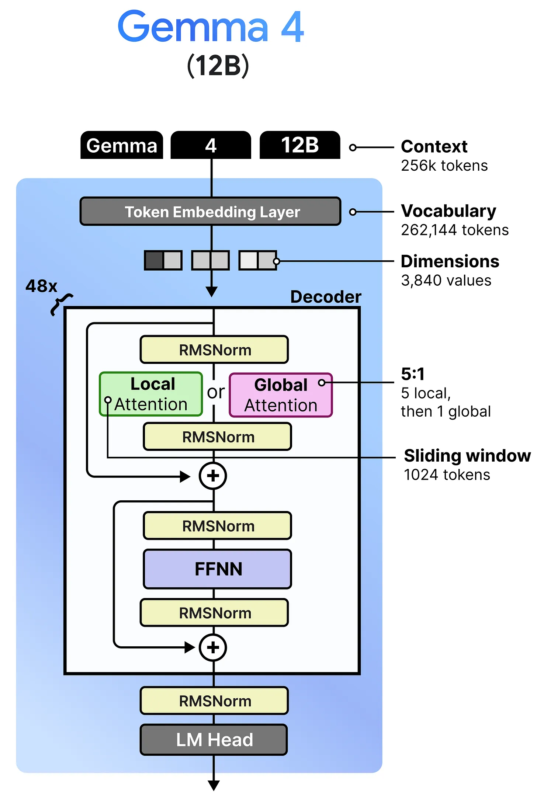
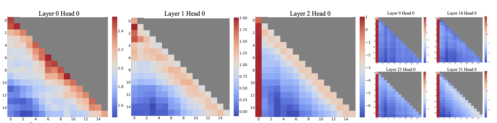
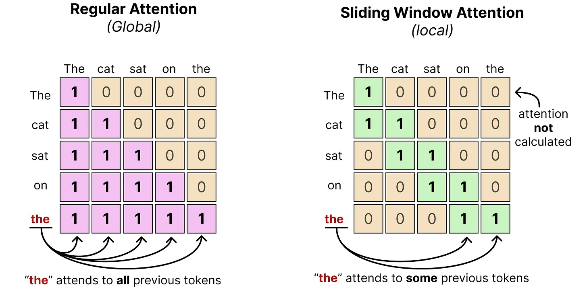
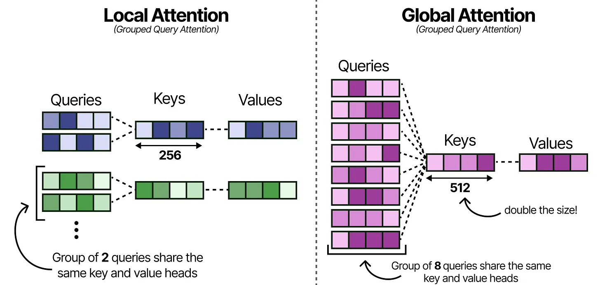
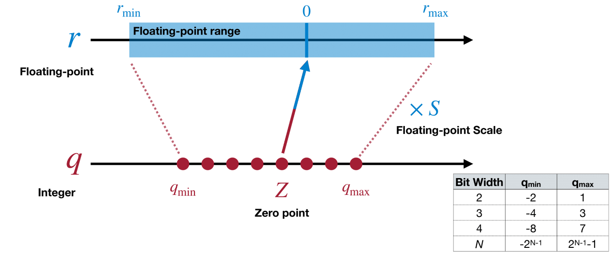
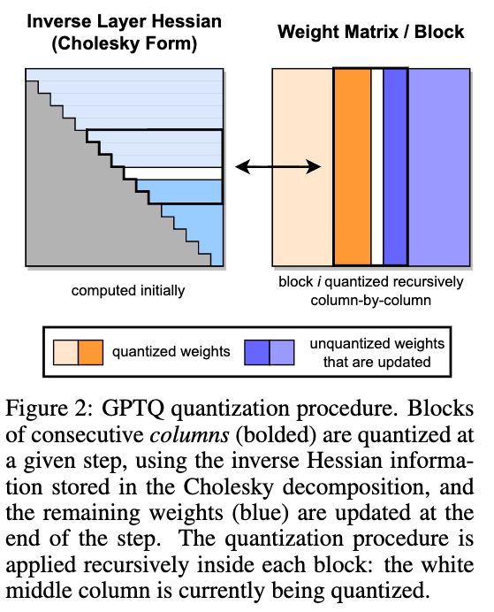
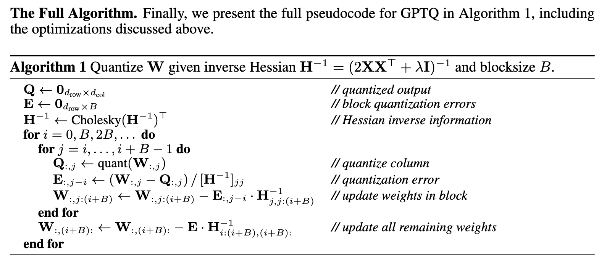
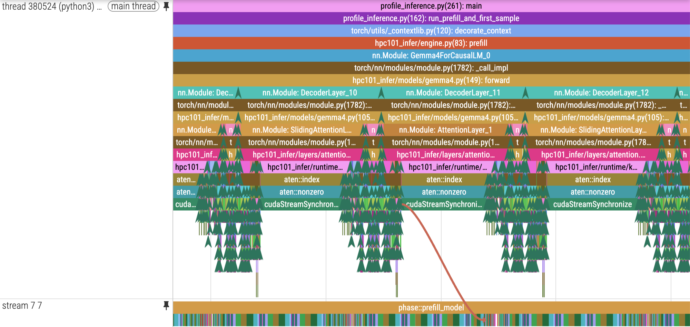

# 实验五：Gemma4 端到端推理优化

!!! info "实验信息"

    负责助教：任朱明，方嘉禾，周冠一


## 实验目的

在真实的 LLM 推理场景中，有限的显存资源往往成为推理吞吐量的提升瓶颈。在本次实验中，你将在 1/7 张 H800（10 GiB 显存）上，基于简化的 LLM 推理框架 `hpc101_infer` 对 Gemma4-12B 模型进行端到端的推理优化，目标是最大化推理的吞吐量。完成本实验后，你应当能够：

- 理解 LLM 推理框架的基本工作流程，包括推理计算、显存管理、请求调度等；

- 掌握模型量化的基本原理，使用 GPTQ 对 LLM 模型进行权重量化；

- 使用 offloading、paged attention 等方法降低显存占用，并结合 continuous batching 等方法提高推理吞吐量；

- 使用 Pytorch Profiler 对 LLM 推理过程进行性能分析，找到热点并进行针对性优化。


## 前置知识

!!! note
    经过短学期课程和 Lab3 的学习，相信你对 LLM 的结构和推理过程已经有了基本的了解，请自查以下知识点：

    - 自回归模式
    - Transformer 的基本结构
    - Attention 机制
    - Prefilling 和 Decoding
    - KV Cache 的作用

    如果你对以上知识点不熟悉，请借助 AI 或查阅相关资料进行学习，可以参考以下资料：

    - [An Introduction to Efficient LLM Inference for ZJUSCT](https://blogs.erix025.me/EfficientAI/sct-llm-talk/sct-llm-talk/)

### Gemma4 模型简介

[Gemma4](https://ai.google.dev/gemma/docs/core) 是 Google DeepMind 开发的新一代开源 LLM 模型，提供了包括 E2B，E4B，12B，31B 等在内的多种参数规模，并且支持多模态输入。本次实验中我们使用的是剥离多模态 tokenizer 后的 Gemma4-12B 模型，其结构如下图所示：


<figure markdown="span">
    
    <figcaption>Gemma4-12B 模型结构。<a href="https://newsletter.maartengrootendorst.com/p/a-visual-guide-to-gemma-4-12b">图源</a>。</figcaption>
</figure>

在基础的 Decoder-only 架构之上，Gemma4-12B 进行了多项改进：

- **滑动窗口注意力（Sliding Window Attention）**：在计算注意力分数时仅考虑固定长度的上下文窗口内的 token

- **混合注意力**：大部分层采用滑动窗口注意力，小部分层采用**全局注意力（Regular Attention）**捕捉长程依赖

- **分组查询注意力（Grouped Query Attention）**：在计算注意力分数时，将查询向量分为若干组，每组共享一个键值向量

- **权重共享**：全局注意力层内 $W_K$ 和 $W_V$ 共享权重

- **p-RoPE**：全局注意力层采用比例旋转位置编码（proportional RoPE）捕捉词序信息，降低对词义信息的干扰

- **SwiGLU 激活函数**：使用 SwiGLU 作为前馈网络的激活函数，增强模型的表达能力

下表简单列出 Gemma4-12B 的主要参数：

| 参数 | 值 | 参数含义 | 简写 |
|------|----|----------|------|
| `num_hidden_layers` | 48 | Decoder Layer 数量 | $N$ |
| `hidden_size` | 3840 | 每层的隐藏层维度 | $D$ |
| `num_attention_heads` | 16 | 注意力头数量 | $H_q$ |
| `num_key_value_heads` | 8 | 滑动窗口注意力层 Key/Value 头数量 | $H_{l,kv}$ |
| `num_global_key_value_heads` | 1 | 全局注意力层 Key/Value 头数量 | $H_{g,kv}$ |
| `head_dim` | 256 | 滑动窗口注意力层每个注意力头的维度 | $D_{l,h}$ |
| `global_head_dim` | 512 | 全局注意力层每个注意力头的维度 | $D_{g,h}$ |
| `sliding_window` | 1024 | 滑动窗口大小 | $w$ |
| `intermediate_size` | 15360 | 前馈网络中间层维度 | $F$ |
| `vocab_size` | 262144 | 词汇表大小 | $V$ |

更多参数可参考模型权重目录下的 `config.json` 文件。

下面我们会对 Gemma4-12B 的部分组件进行讲解，以帮助你理解模型的结构和推理过程。

#### 滑动窗口注意力（Sliding Window Attention）

我们知道，标准的自注意力机制公式为：

$$
\begin{align*}
    O &= \operatorname{softmax} \left(\frac{A + M}{\sqrt{d_k}}\right)V, \\
    A &= Q K^{\mathrm{T}}.
\end{align*}
$$

其中 $M$ 是掩码矩阵，用于屏蔽不需要参与计算的 token，$A$ 被称作注意力分数。在全局注意力层中，$M$ 是一个下三角矩阵，表明计算自注意力时，每个 token 只能看到它之前的 token。然而在实践中，我们发现在诸多情况下，**注意力分数的分布具有局部性**，即在位置 $i$ 的 token 对区间 $[i-w, i]$ 内的 token 的注意力分数大于其他 token 的注意力分数，其中 $w$ 是一个固定的窗口大小：

<figure markdown="span">
    
    <figcaption>注意力分数分布示例。<a href="https://arxiv.org/abs/2309.17453">图源</a>。</figcaption>
</figure>

因此，通过掩码矩阵屏蔽掉窗口外的 token 的注意力分数，对模型的性能影响不会太大。具体地，我们可以使用类似下图右侧的掩码矩阵 $M$ 限制每个 token 的注意力范围：

<figure markdown="span">
    
    <figcaption>全局注意力和滑动窗口注意力示例。<a href="https://newsletter.maartengrootendorst.com/p/a-visual-guide-to-gemma-4">图源</a>。</figcaption>
</figure>

然而，在实际情况下应用滑动窗口注意力仍需注意以下几点：

- “注意力分数的分布具有局部性”这一假设并不总是成立的，尤其是处理长文本时，完全忽略窗口外的 token 可能会对模型性能产生较大负面影响。因此 Gemma4 采用了混合注意力的策略，在部分层保留 Regular Attention，以捕捉长程依赖。

- 在数学上我们可以通过设置掩码矩阵 $M$ 为条带状矩阵来实现 Sliding Window Attention，然而在实际实现中，先计算再加掩码的方式会导致大量无效计算与访存，无法发挥其优势。

#### 分组查询注意力（Grouped Query Attention, GQA）

[GQA](https://arxiv.org/abs/2305.13245) 是一种用于减少 Key Value 数量和 Attention 计算量的优化方法。在 MHA 中，一个 Query Head 对应一个 Key/Value Head，但在 GQA 中，多个 Query Heads 可以共享同一个 Key/Value Head，这样可以显著减少 KV 的数量。

<figure markdown="span">
    
    <figcaption>Gemma4 中的分组查询注意力。<a href="https://newsletter.maartengrootendorst.com/p/a-visual-guide-to-gemma-4">图源</a>。</figcaption>
</figure>

在 Gemma4-12B 中，$H_q=16$，$H_{l,kv}=8$，$H_{g,kv}=1$，因此滑动窗口注意力层中每 2 个 Query Heads 共享 1 个 Key/Value Head，全局注意力层中所有 16 个 Query Heads 共享 1 个 Key/Value Head。

在进行注意力计算时，Query Heads 的数量仍然是 $H_q$，而 Key/Value Heads 的数量是 $H_{l,kv}$ 或 $H_{g,kv}$。因此我们需要通过重复 Key/Value Heads 来匹配 Query Heads 的数量。

#### SwiGLU 激活函数与 FFN

Gemma4 使用了 SwiGLU 激活函数，它结合了 SiLU 和 GLU 的优点，能够更好地捕捉非线性关系。

**SiLU (Sigmoid Linear Unit)** 是 Sigmoid 和 ReLU 的改进版，其公式为：

$$\text{SiLU}(x) = x \cdot \text{Sigmoid}(x)$$

**GLU (Gated Linear Unit)** 是一个门控机制，他的核心思想是通过一个范围在 `[0, 1]` 的门控函数来控制信息的流动。GLU 的公式为：

$$\text{GLU}(x) = \sigma(W_g x) \odot (W_x x)$$

其中 $\sigma$ 是范围为 `[0,1]` 的激活函数，$W_g$ 和 $W_x$ 是可学习的权重矩阵，$\odot$ 表示逐元素乘法。

**SwiGLU** 是 $\sigma = \text{SiLU}$ 的 GLU 变体，其公式为：

$$\text{SwiGLU}(x) = \text{SiLU}(W_g x) \odot (W_x x)$$

标准的前馈神经网络 (FFN) 由两个线性层和一个激活函数组成，可以表示为：

$$
\text{FFN}(x) = W_2 \cdot \sigma(W_1 \cdot x + b_1) + b_2
$$

其中 $W_1$ 和 $W_2$ 是可学习的权重矩阵，$b_1$ 和 $b_2$ 是偏置项，$\sigma$ 是激活函数。

在 Gemma4 中，FFN 采用 SwiGLU 作为激活函数，并使用 $F$ 作为中间层的维度，包含三个线性层：

1. **门控投影 (Gate Projection)**：计算门控值，形状为 $(D, F)$。
2. **上投影 (Up Projection)**：计算上投影值，形状为 $(D, F)$。
3. **下投影 (Down Projection)**：将结果投影回原维度，形状为 $(F, D)$。


### LLM 推理时的显存占用

LLM 推理时占用的显存主要由**模型权重**、**KV Cache**和**激活值**三部分组成：

| 类型 | 说明 | （通常情况下）生命周期 |
| ---- | ---- | ---- |
| **模型权重** | 模型的参数权重 | 推理服务初始化时分配，服务结束时释放 |
| **KV Cache** | 各个 token 对应的 Key/Value 向量 | 在请求处理过程中分配，请求处理完毕后释放 |
| **激活值** | 请求序列在模型各层的中间计算结果 | 临时分配 |

通常情况下，激活值在参与的计算完成之后就会被立即释放，因此其对整体显存占用的影响较小。相比之下，模型权重和 KV Cache 会持久性地占用显存，前者占用的显存大小固定，而后者占用的显存大小随请求序列长度和 batch size 线性增长。下面这个例子展示了根据模型结构和请求估算模型权重和 KV Cache 占用的显存大小的方法：

!!! example
    假设一个 Decoder-only 的模型由 $N$ 个 GQA 全局注意力层组成，隐藏层维度为 $D$，注意力头数量为 $H_q$，Key/Value 头数量为 $H_{kv}$，每个注意力头的维度为 $D_h$，FFN 采用 SwiGLU 激活函数，中间层维度为 $F$，词表大小为 $V$，我们可以先根据各线性层形状估计参数量：

    | 参数 | 形状 | 参数 | 形状 |
    | ---- | ---- | ---- | ---- |
    | $W_q$ | $(H_q, D, D_h)$ | $W_{up}, W_{gate}$ | $(D, F)$ |
    | $W_k, W_v$ | $(H_{kv}, D, D_h)$ | $W_{down}$ | $(F, D)$ |
    | $W_o$ | $(H_q, D_h, D)$ | $W_{embed}$ | $(V, D)$ |

    因此在参数量化精度为 x-bit 时，整个模型的参数占用的显存大约为：

    $$
        M_w = [2 V D + N D(2H_q D_h + 2 H_{kv} D_h + 3 F)] \cdot x / 8 \text{ bytes}
    $$

    需要注意的是上述估算方式忽略了 RMSNorm 等参数规模较小的层，因此实际测量的显存占用可能会略大于估算值。

    ---

    下面估算静态分配策略下的 KV Cache 的显存占用，即为每个请求都按照最大的序列长度分配 KV Cache。假设目前请求的批次数（batch size）为 $B$，请求序列的最大长度为 $S$，激活值量化精度为 y-bit。那么 KV Cache 的显存占用大约为：

    $$
        M_{kv} = 2 B S N H_{kv} D_h \cdot y / 8 \text{ bytes}
    $$


## 任务一：GPTQ 权重量化

根据上文中的思路计算一下 bfloat16 精度下 Gemma4-12B 模型参数的显存占用，我们会发现参数占用的显存已经远超我们的可用显存（10 GiB），因此在全量加载模型原始权重的情况下，我们无法完成端到端的推理。

模型参数量化是在显存受限环境下进行 LLM 推理的常用方法。其原理是将模型权重从高精度（如 FP32 或 BF16）根据一定的量化策略映射到低精度（如 FP8 或 INT4），从而降低模型权重占用的显存。由于高精度到低精度的映射不可逆，量化会导致精度损失，但是大多数情况下由于模型参数中包含大量冗余信息，量化后的模型的性能下降幅度是可以接受的。

目前主流的量化策略均采用线性映射，通过零点 $z$ 和缩放因子 $s$ 即可确定高精度权重 $r$ 与低精度权重 $q$ 的映射关系：

$$
    q = \operatorname{round}\left(\frac{r}{s} + z\right), \enspace r = s \cdot (q - z).
$$



$z$ 和 $s$ 都需要用较高的精度表示，通常为原始权重的精度，并且在量化后需要存储到模型权重文件中，以便推理时对权重进行反量化，因此我们需要让多参数共享同一组 $z$ 和 $s$，共享的策略被称为**量化粒度**。常见的量化粒度有 per-tensor、per-channel、per-group 等，一般粒度越小量化损失越低，但存储量化参数的开销越大。

### 知识讲解：训练后量化与 GPTQ

训练后量化（Post-Training Quantization，PTQ）是指在模型训练完成后，使用少量校准数据确定量化参数，而不再对模型进行训练或微调。在线性映射的归纳偏置下，量化策略的核心问题变为如何选择零点 $z$ 和缩放因子 $s$，以最小化量化误差：

$$
    \underset{z, s}{\operatorname{argmin}} \mathbb{E}_{X} \left[ L(f(W, X), f(Q, X)) \right]
$$

其中 $W$ 是原始权重，$Q$ 是量化后的权重，$X$ 是输入数据，$f(\cdot)$ 是前向函数，$L(\cdot, \cdot)$ 是损失函数。

一种朴素的想法是 **RTN（Round to Nearest）**策略：对于同一个 group 中的权重，统计其最大值 $r_{max}$ 和最小值 $r_{min}$，然后将 $r_{max}$ 映射到量化范围的最大值 $q_{max}$，$r_{min}$ 映射到量化范围的最小值 $q_{min}$，从而确定缩放因子和零点：

$$
    s = \frac{r_{max} - r_{min}}{q_{max} - q_{min}}, \enspace z = q_{min} - \frac{r_{min}}{s}.
$$

随后，每个权重都被独立地舍入到最近的量化值。RTN 的计算开销很低，也不需要校准数据，因此适合作为量化流程的调试基线。但是，RTN 只关心权重本身的数值误差 $\|W-Q\|$，没有考虑不同输入通道在真实推理过程中的重要性，也没有考虑多个权重的量化误差可能在层输出中相互叠加。在 INT8 等较高位宽下，这一问题通常并不明显；当权重被压缩到 INT4 时，舍入误差增大，并可能在经过后续层时进一步累积，导致模型精度明显下降。

实际任务中的输入分布无法被精确求得，因此 PTQ 通常选择一小部分具有代表性的样本作为**校准数据集**，用校准样本上的平均误差近似上述期望。对于一个输入维度为 $d_{in}$、输出维度为 $d_{out}$ 的线性层，设收集到的输入激活为 $X \in \mathbb{R}^{N \times d_{in}}$，权重为 $W \in \mathbb{R}^{d_{out} \times d_{in}}$，则可以使用层输出的重构误差作为优化目标：

$$
    \min_Q \left\|XW^T-XQ^T\right\|_F^2
    = \min_Q \left\|X(W-Q)^T\right\|_F^2.
$$

与直接比较 $W$ 和 $Q$ 相比，这个目标会根据输入激活自动区分不同方向的重要性：如果某个输入通道在校准数据中经常出现较大的激活，那么该通道上的权重误差通常会对层输出产生更大的影响。校准数据不参与参数更新，其作用只是估计模型在真实输入分布下对量化误差的敏感程度。

#### GPTQ 的基本思想

GPTQ 是一种面向大模型的二阶训练后权重量化方法。它仍然使用普通的线性量化器产生 INT4 权重，但不再像 RTN 一样独立地量化所有权重，而是对每个线性层执行**逐列量化与误差补偿**：量化当前列后，立即调整尚未量化的列，使后续列尽可能抵消当前列引入的输出误差。

例如，线性层的输出可以看作各输入通道贡献之和：$w_1x_1+w_2x_2+\cdots$。如果校准数据中的 $x_1$ 和 $x_2$ 经常同时增大或减小，那么它们具有较强的相关性。此时，$w_1$ 被量化后产生的部分误差，可以通过调整尚未量化的 $w_2$ 来补偿。

上述层重构目标关于权重的 Hessian 矩阵只与输入激活有关。忽略不影响算法的常数后，可以写为：

$$
    H = \frac{2}{N}X^TX.
$$

其中 $N$ 是校准数据的 token 数。$H$ 描述了各输入通道在校准数据中的相关性：对角元素反映单个通道的活跃程度，非对角元素则反映不同通道之间的相关性。如果两个输入通道高度相关，那么一个通道上的量化误差就有可能通过修改另一个通道对应的权重得到补偿。因此，GPTQ 使用 $H^{-1}$ 中包含的二阶信息决定误差应当如何传播。

设 $H^{-1}=U^TU$，其中 $U$ 是通过 Cholesky 分解得到的上三角矩阵。按照输入维度从左到右处理权重列，量化第 $i$ 列时，先使用当前 group 的 $s$ 和 $z$ 将修正后的权重列 $w_i$ 映射为可表示的 INT4 值，并反量化得到 $q_i$。随后计算归一化量化误差：

$$
    e_i = \frac{w_i-q_i}{U_{ii}}.
$$

再利用 $U$ 的第 $i$ 行更新尚未量化的权重列：

$$
    W_{:,\,i:} \leftarrow W_{:,\,i:} - e_i U_{i,\,i:}.
$$

这样，当前列被舍入后产生的误差会沿着输入通道之间的相关方向传播到后续列，后续列在补偿后的权重基础上进行量化。重复这一过程直到所有列都被量化，就可以在不进行反向传播和模型训练的情况下，显著降低整个线性层的输出重构误差。

GPTQ 的思路来源于 **OBQ（Optimal Brain Quantization）**。OBQ 会反复寻找当前最适合量化的权重，并在每次量化后更新逆 Hessian，计算开销很高。GPTQ 使用固定的列顺序，让同一输入通道在所有输出通道中同时被处理，并将多次更新组织成分块矩阵运算，从而使这一方法能够应用到大模型。

!!! note "阅读材料"
    想要进一步了解 GPTQ 算法原理的同学可以参考：
    
    - [原论文](https://arxiv.org/abs/2210.17323)
    - [GPTQ 原理以及完整证明](https://declk.github.io/blog/LLMs/GPTQ%20%E5%8E%9F%E7%90%86%E4%BB%A5%E5%8F%8A%E5%AE%8C%E6%95%B4%E8%AF%81%E6%98%8E.html)

#### 数值稳定性与分块计算

实际校准数据中，部分输入通道可能始终为零，或者不同通道高度相关，使 $H$ 不满秩或接近奇异矩阵，无法稳定地求逆。常见做法是先处理对角元素为零的 **dead column**，再向 Hessian 的对角线加入阻尼项：

$$
    H \leftarrow H + \lambda I, \enspace
    \lambda = \alpha \cdot \operatorname{mean}(\operatorname{diag}(H)),
$$

其中 $\alpha$ 是阻尼比例。阻尼可以改善 Cholesky 分解的数值稳定性，但过大的阻尼会削弱校准数据所提供的通道相关性信息，因此需要在稳定性和量化精度之间进行权衡。

对于大模型中的宽矩阵，直接保存逐列更新产生的所有中间结果会带来较高的访存开销。GPTQ 通常以若干连续列为一个 block，先在 block 内逐列量化并传播误差，再将整个 block 累积的误差一次性更新到后续列。

<figure markdown="span">
    
    <figcaption>GPTQ 分块计算示例。<a href="https://arxiv.org/abs/2210.17323">图源</a>。</figcaption>
</figure>

下面是 GPTQ 量化的伪代码，需要注意的是这里的 blocksize $B$ 并不是量化粒度，而是本节所述的分块计算的列数：

<figure markdown="span">
    
    <figcaption>GPTQ 算法流程。<a href="https://arxiv.org/abs/2210.17323">图源</a>。</figcaption>
</figure>

#### 本实验中的量化流程

本实验采用逐层量化的方式处理 Gemma4-12B：

1. 框架首先使用校准样本运行当前 Transformer 层，并通过 hook 收集各个目标 Linear 的输入激活；
2. 根据输入激活构造 Hessian，并通过 dead-column 处理、阻尼和 Cholesky 分解得到稳定的逆 Hessian 因子；
3. 按 group 计算量化参数，按 block 逐列量化权重；
4. 每量化一列，就使用逆 Hessian 信息修正剩余列；
5. 打包 INT4 权重、scale 和 zero point，存储到新的模型权重文件中；
6. 当前层量化完成后，框架会使用反量化后的权重重新计算该层输出，并将结果作为下一层的校准输入，从而让后续层看到前面各层已经产生的量化误差。


与 RTN 相比，GPTQ 需要额外的校准时间和临时显存，但只执行一次离线量化，不需要原始训练数据，也不需要重新训练模型。它将优化目标从“权重数值尽可能接近”转化为“校准数据上的层输出尽可能接近”，因此更适合本实验中的 W4A16 低位宽量化任务。


### 实验任务

#### 任务要求

你的任务是实现 GPTQ 的核心算法，将 Gemma4-12B 的权重从 BF16 量化到 INT4。

- 我们提供的量化框架已经实现了分层量化、校准数据集激活值捕捉、INT4 权重打包等功能，请你阅读框架代码并理解整体工作流程后，基于 `src/quantization/methods/gptq.py` 中的函数接口，完成 GPTQ 的核心算法实现。

- 我们提供了 RTN（Round to Nearest）量化方法的参考实现，你可以阅读相关代码并理解接口设计。

- 我们提供了一份校准数据集 `calibration-256.jsonl`，包含 256 条英文文本，你可以直接使用该数据集，也可以自行准备其他数据集。我们欢迎你尝试不同规模、不同长度、不同语义的校准数据集，并在报告中分析其对量化精度的影响。

- 在实现 GPTQ 算法后，你需要使用量化框架将 Gemma4-12B 的参数量化到 INT4，并将量化后的权重保存到新的模型权重文件中，量化框架入口脚本为 `scripts/quantize.py`。

- 量化后的权重需要在测试集上通过精度评测，确保量化精度损失 $\Delta \mathrm{NLL} < 0.2$。我们提供了公开测试集 `quality_public.jsonl`，你可以使用该数据集自行测试。

!!! note "量化精度损失的评估"
    我们使用 **NLL（Negative Log-Likelihood，负对数似然）**衡量量化前后模型对文本的建模能力。对于 token 序列 $x_1,x_2,\ldots,x_L$，评测器在每个位置向模型提供真实的历史 token，并计算模型为下一个真实 token 分配的概率。序列的平均 NLL 为：

    $$
        \mathrm{NLL}
        = -\frac{1}{L-1}\sum_{t=1}^{L-1}
        \log p(x_{t+1}\mid x_1,\ldots,x_t).
    $$

    NLL 越小，表示模型为真实文本分配的概率越高。我们主要关注测试集上的全局平均 $\mathrm{NLL}$，即

    $$
        \mathrm{NLL}_{\mathrm{avg}}
        = \frac{\sum_{i=1}^{M} S_i \cdot \mathrm{NLL}_i}{\sum_{i=1}^{M} S_i},
    $$

    评测时，我们分别在原始 BF16 模型和量化后的 INT4 模型上运行完全相同的数据集，并计算：

    $$
        \Delta\mathrm{NLL}
        = \mathrm{NLL}_{\mathrm{INT4}}-\mathrm{NLL}_{\mathrm{BF16}}.
    $$

    在框架中，你可以使用以下命令进行量化精度评测：

    ```bash
    python3 scripts/evaluate_quality.py \
        --model <path_to_quantized_model> \
        --dataset <path_to_test_dataset> \
        --output <output_file> \
        --chunk-size 512 \
        --max-sequence-length 2048 \
        --linear-backend int4_reference
    ```

    输出文件中的 `mean_nll` 字段即为全局平均 $\mathrm{NLL}_{\mathrm{INT4}}$。该脚本也会统计不同长度区间的请求的平均 $\mathrm{NLL}$，仅供参考。由于 10GiB 显存下无法直接运行 BF16 精度的推理，我们额外提供公开测试集的精度评测数据 `results/bf16-public-quality.json`，你可以从中获取 $\mathrm{NLL}_{\mathrm{BF16}}$。


#### 输入输出接口

你需要实现的 GPTQ 算法核心函数如下：

```python
def quantize_weight_gptq(
    weight: torch.Tensor,
    activations: torch.Tensor,
    group_size: int,
    *,
    block_size: int = 128,
    damp_percent: float = 0.01,
    symmetric: bool = True,
    scale_dtype: torch.dtype = torch.float16,
) -> tuple[QuantizedWeight, dict[str, float | int]]:
    """
    使用 GPTQ 算法将权重量化为 INT4。

    参数：
        weight: 待量化的权重张量，形状为 (out_features, in_features)。
        activations: 校准数据集的输入激活，形状为 (calibration_tokens, in_features)。
        group_size: 量化粒度，即每个 group 中的列数。
        block_size: 分块计算时每个 block 中的列数。
        damp_percent: 阻尼比例，用于改善 Hessian 的数值稳定性。
        symmetric: 是否使用对称量化。
        scale_dtype: 缩放因子的 dtype。

    返回：
        quantized_weight: 量化后的权重对象，具体详见 QuantizedWeight 类的定义。
        metadatas: 量化过程中的统计信息，不影响评测，用于分析和调试。
    """

    quantized = QuantizedWeight(...)
    metadata: dict[str, float | int] = {
        "activation_tokens": activations.shape[0],
        "block_size": block_size,
        "damp_percent": damp_percent,
        "dead_columns": ...,
        "predicted_loss": ...,
    }
    return quantized, metadata
```

## 任务二：端到端推理性能优化

将 Gemma4-12B 模型量化到 INT4 后，我们终于可以在 10 GiB 显存限制下进行完整的推理了。然而，在使用推理框架加载量化后的模型进行推理时，你可能会发现模型的推理效率不如预期，下面我们将提供一些优化方向供你参考。

### 性能分析方法

在进行性能优化前，我们需要先对推理过程进行性能分析，找出性能瓶颈。在分析像 LLM 推理系统这样的复杂异构应用时，我们一般会采用自顶向下的分析方法，先定位 CPU 端各函数的执行时间和 GPU 端各算子的执行时间，确定性能瓶颈在 CPU 端还是 GPU 端，再进一步分析瓶颈函数或算子内部的性能问题。

你可以继续使用 Nvidia Nsight Systems 对推理系统进行分析，但是对于基于 pytorch 编写的应用，我们更推荐使用 Pytorch Profiler 来进行整体性能分析。Pytorch Profiler 的输出格式是 JSONL 格式的 Chrome Trace 文件，可以用 [perfetto](https://ui.perfetto.dev/) 或 [chrome://tracing](chrome://tracing) 打开进行可视化分析，还支持用 SQL 查询性能分析数据。

使用 Pytorch Profiler 进行性能分析的工作流程如下：

- 在代码中将需要分析的区域用 `with torch.profiler.profile(...)` 包裹起来，指定需要收集的事件类型和输出文件路径；

- 运行程序，生成性能分析文件；

- 使用可视化工具打开性能分析文件，查看 CPU 端函数和 GPU 端算子的执行时间，找出性能瓶颈；

??? example
    

    例如在上面这张 timeline 中，我们可以看到 CPU 大部分时间都在同步等待 GPU 端某个算子执行完成，这通常是由于 CPU 端的控制流或数据依赖于该 GPU 算子的执行结果，导致 CPU 端无法继续发射后续算子。我们可以检查 CPU-GPU 同步触发的原因，并判断该同步是否可以被消除。

### 方向一：显存占用优化

在 LLM 推理中，提高 batch size 可以均摊算子发射的开销和数据搬运的延迟，从而提高吞吐量。然而，提高 batch size 意味着 KV Cache 和激活值占用的显存同比增长。为了让固定的显存资源能支持更大的 batch size，我们需要着重关注以下方向：

- 降低模型权重占用的峰值显存

- 相同请求数下，降低 KV Cache 占用的峰值显存

#### 权重 Offloading

权重 Offloading 的基本思想是只让当前计算所需的模型权重常驻 GPU，其余权重保存在 CPU 内存中，并在执行到对应层之前搬运到 GPU。Gemma4 的 Transformer 层按顺序执行，因此在计算第 $i$ 层时，第 $i+1$ 层之后的权重暂时不会参与计算。我们可以利用这一特点，将若干层的权重放在 CPU 内存中，并使用一块可复用的 GPU 缓冲区逐层加载权重，从而降低模型权重占用的峰值显存。

最简单的实现方式是**同步 Offloading**：在每层计算开始前将该层权重从 CPU 搬运到 GPU，等待搬运完成后执行计算，再复用这部分显存加载下一层权重。这种方法容易保证正确性，但 Host-to-Device 数据搬运与 GPU 计算完全串行，可能使 PCIe 传输成为新的性能瓶颈。

为了隐藏数据搬运开销，可以进一步实现**异步 Offloading**。你可能需要准备两组 GPU 权重缓冲区，并使用独立的 CUDA Stream，在第 $i$ 层执行计算时预取第 $i+1$ 层的权重；计算流在使用下一组权重前，通过 CUDA Event 等待搬运完成。对于 INT4 模型，需要将打包后的权重、scale 和 zero point 作为一个整体进行管理，避免遗漏量化参数或在前向过程中反复创建临时张量。

在实现时你可以控制 Offloading 的粒度，例如根据显存预算选择常驻层与卸载层，或是以多个连续的 DecoderLayer 为粒度进行卸载，并结合 profiler 分析权重搬运是否与计算充分重叠。

!!! tip
    建议先实现同步版本，确认输出与全量加载版本一致，并记录峰值显存和 Host-to-Device 搬运时间；再引入 pinned memory、独立 CUDA Stream、预取和双缓冲，逐步验证异步优化是否真正提高了端到端吞吐量。

#### Ring KV Cache

Gemma4 同时包含全局注意力层和滑动窗口注意力层。对于窗口大小为 $W$ 的滑动窗口注意力层，位置 $t$ 的 token 最多只会访问最近 $W$ 个 token 的 Key 和 Value。更早的 KV 一旦移出窗口，之后就不会再次参与该层的计算，因此没有必要像全局注意力层一样保存完整的历史序列。

Ring KV Cache 使用固定大小为 $W$ 的环形缓冲区保存滑动窗口层的 KV。绝对位置为 $t$ 的 KV 被写入物理槽位 $t \bmod W$；当序列长度超过 $W$ 时，新 KV 会覆盖已经移出注意力窗口的旧 KV。这样，滑动窗口层中每个请求的 KV Cache 占用由 $O(S)$ 降低为 $O(\min(S, W))$，其中 $S$ 为当前序列长度。

若模型包含 $N_g$ 个全局注意力层和 $N_l$ 个滑动窗口注意力层，在忽略不同层 KV 头数差异的情况下，KV Cache 的序列长度因子可以从 $(N_g + N_l)S$ 降低为：

$$
    N_g S + N_l \min(S, W).
$$

在当前框架中，你可以分别为全局注意力层和滑动窗口注意力层设计不同的缓存布局，并在滑动窗口注意力的 KV 写入与读取路径中加入环形索引。该方法不会改变模型的注意力范围，因此在索引和掩码实现正确时，不会引入额外的精度损失。

#### Paged Attention

当前框架会按照 `max_batch_size` 和 `max_sequence_length` 为每个注意力层预先分配连续的 KV Cache。即使实际 batch 较小或请求提前结束，这部分显存也无法被其他请求使用。当不同请求的长度差异较大时，静态连续分配会产生大量未使用的预留空间，并限制系统能够同时处理的请求数。

Paged Attention 将每个请求的 KV Cache 划分为固定大小的 block，并从全局 KV block 池中按需分配物理块。每个请求维护一张 block table，用于记录逻辑 KV block 到物理 KV block 的映射。当请求长度增长到新的 block 时，系统再从空闲列表中分配物理块；当请求结束时，其占用的物理块可以立即回收到空闲列表，供后续请求复用。

假设 block size 为 $P$，Paged Attention 不再为每个请求预留完整的最大序列长度，而是只为已经产生的 token 分配 KV 空间。每个请求在每层最多浪费最后一个 block 中的 $P-1$ 个槽位，因此 block 越小，内部碎片越少；但 block table 更大，分配和寻址开销也更高。你需要根据请求长度分布和注意力算子的实现选择合适的 block size。

在当前基于 PyTorch 的框架中，可以先实现一个功能正确的版本：用 block pool 和 block table 管理 KV，在执行注意力前按照逻辑顺序收集当前请求对应的 K/V block，再复用现有注意力计算。该实现会引入额外的数据整理开销，但能够验证分页分配、扩容和回收逻辑。进一步优化时，可以改写注意力算子，使其根据 block table 直接读取离散的物理块，避免将 KV Cache 重新拼接为连续张量。

!!! note "阅读材料"
    [Paged Attention from First Principles: A View Inside vLLM](https://hamzaelshafie.bearblog.dev/paged-attention-from-first-principles-a-view-inside-vllm/)

### 方向二：算子优化

观察 profiler timeline 时，可以将空闲时间粗略分为两类：

- **算子之间的空隙（外部 bubble）**：通常来自 Python 与算子发射开销、过多的小算子、GPU-CPU 同步或频繁的动态内存分配。它在 timeline 中表现为相邻 GPU kernel 之间存在明显空白。
- **算子内部的停顿（内部 bubble）**：kernel 已经开始执行，但线程块可能在等待 global memory 数据、同步或其他执行单元。对于访存密集型算子，计算单元会因为数据供给不足而空闲。

减少外部 bubble 的常见方法包括消除不必要的同步、复用临时缓冲区、合并小算子，以及在执行形状稳定后使用 CUDA Graph。减少内部 bubble 则需要从 kernel 内部的数据访问和并行划分入手，例如采用分块计算、合并访存、提高数据复用率和减少中间结果的读写。

在修改算子前，应当分别分析 **prefill** 和 **decode**。Prefill 一次处理多个 token，矩阵规模较大，通常更容易利用 GPU 的并行计算能力；decode 每次只处理一个 token，许多矩阵乘法退化为矩阵-向量乘法，更容易受到权重读取和算子发射开销限制。因此，同一个 kernel 在两种阶段的最优分块策略可能不同，也不应只根据单个算子的加速比判断优化效果。

#### 算子融合

算子融合将多个前后相邻的操作放入同一个 kernel，使中间结果尽可能保留在寄存器或片上存储中，避免写回 global memory 后又被下一个算子读入。融合还可以减少 kernel 数量，从而同时缓解外部 bubble 和内部 bubble。

本方向要求你使用 **Triton 或 TileLang 自行编写 kernel**，不得调用 FlashAttention、xFormers、bitsandbytes、cuBLASLt 封装、PyTorch SDPA 等现成算子库。下面给出两个适合在当前框架中实现的融合算子。

##### 反量化-GEMM 融合

当前 `QuantizedLinear.forward` 会先将整块 INT4 权重反量化为 BF16/FP16 张量，再调用 `F.linear`：

$$
    Q_4 \longrightarrow W_{16} \longrightarrow Y.
$$

这种实现逻辑清晰，但每次前向都会创建完整的高精度权重临时张量。反量化结果需要写入 global memory，随后又被 GEMM 读回；在 decode 阶段，同一层每次只处理少量 token，这部分数据搬运可能比实际计算更昂贵。

融合 kernel 不再物化完整的 $W_{\text{fp16}}$。对于输出矩阵的一个 tile，kernel 依次完成：

1. 从 `qweight` 中读取打包的字节，并用位运算提取两个 INT4 权重；
2. 根据输入维度位置计算 group 编号，加载对应的 `scales` 和可选的 `zeros`；
3. 在寄存器或片上存储中将当前权重 tile 反量化为计算精度；
4. 立即与输入 tile 相乘并累加到 FP32 accumulator；
5. 在归约结束后转换到输出精度，并写回结果。

对于非对称量化，反量化关系为

$$
    w_{m,k}=s_{m,g(k)}\left(q_{m,k}-z_{m,g(k)}\right),
    \qquad g(k)=\left\lfloor\frac{k}{G}\right\rfloor,
$$

其中 $G$ 是 group size。实现时需要与框架中的 `uint8_little_nibble` packing 格式保持一致，并正确处理 `padded_in_features`、末尾越界、对称/非对称量化和可选 bias。

你可以分别为两类工作负载选择调度策略：prefill 使用较大的 $M$ 维 tile，提高 Tensor Core 利用率；decode 的 $M$ 很小，应优先减少权重重复读取、线程块数量和发射开销。除了 `BLOCK_M`、`BLOCK_N` 和 `BLOCK_K`，还可以比较 warp 数量、pipeline stage 数量，以及 group size 与 `BLOCK_K` 对齐方式对性能的影响。

!!! warning
    融合 kernel 的持久参数必须仍然是打包 INT4 权重、scale、zero point 和必要的元数据。不得在模型加载时将全部权重永久展开为 BF16/FP16，也不得通过缓存完整反量化权重绕过显存限制。

##### Flash Attention

当前注意力实现会依次构造 `scores`、`mask` 和 `prob`：

$$
    A = QK^T,\qquad P=\operatorname{softmax}(A+M), \qquad O=PV.
$$

对于序列长度 $L$，中间矩阵 $A$ 和 $P$ 的大小均为 $O(L^2)$。它们需要多次写入和读取 global memory，长序列 prefill 时会产生较大的显存占用和带宽开销。Flash Attention 的核心思想是按块读取 $Q$、$K$、$V$，在片上完成分数计算、mask、softmax 更新和对 $V$ 的加权累加，从而不在显存中物化完整的注意力矩阵。

由于一个 query block 会依次遍历多个 key/value block，softmax 需要使用在线归一化算法。设处理完前若干 block 后，某一行已知最大值 $m$、指数和 $l$ 与未归一化输出累加值 $o$；读入新分数块 $A_j$ 后，可按以下方式更新：

$$
\begin{aligned}
    m' &= \max\left(m, \operatorname{rowmax}(A_j)\right), \\
    \alpha &= e^{m-m'}, \\
    P_j &= e^{A_j-m'}, \\
    l' &= \alpha l + \operatorname{rowsum}(P_j), \\
    o' &= \alpha o + P_jV_j.
\end{aligned}
$$

遍历完成后输出 $O=o/l$。实际实现中应使用 FP32 保存 $m$、$l$ 和累加器，避免长序列下的溢出和精度损失。

为适配当前 Gemma4 推理框架，你的 kernel 至少需要正确处理：

- 因果注意力，以及 padding token 对应的无效 query/key；
- 全局注意力层和滑动窗口注意力层；
- GQA 中 query head 与 KV head 的映射，避免先调用 `repeat_kv` 物化重复的 K/V；
- prefill 中 $q_{len}>1$ 与 decode 中 $q_{len}=1$ 的不同形状；
- KV Cache 中已经存在的历史 token，以及最后一个不完整 tile 的越界掩码。

全局注意力中，一个 query block 只遍历满足因果条件的 KV block；滑动窗口注意力还应跳过窗口之外的 block，而不是先计算完整分数再填充 $-\infty$。这样不仅移除了显式 mask 和注意力矩阵，还能避免执行理论上不需要的乘加运算。对于 decode，可以设计单独的窄 query kernel，以减少只有一个 query token 时的空线程和调度开销。

#### 优化与验证流程

推荐按照以下顺序完成算子优化：

1. **建立基线**：固定输入形状、随机种子和量化 checkpoint，记录 prefill、decode、端到端吞吐量以及峰值显存；
2. **验证正确性**：在小尺寸张量上与框架原有 PyTorch 实现比较，并覆盖非整除维度、不同 batch size、不同序列长度和滑动窗口边界；
3. **进行 microbenchmark**：预热后使用 CUDA Event 测量 kernel 时间，分别测试实验评测中具有代表性的 prefill 和 decode 形状；
4. **结合 profiler 调优**：检查 kernel 数量、global memory 吞吐、Tensor Core 利用率和时间占比，再调整 tile、warp 和 pipeline 配置；
5. **回到端到端评测**：确认优化没有被其他开销抵消，并报告 TTFT、TPOT、吞吐量和峰值显存的变化。

算子优化必须保持模型语义不变，你需要保证你编写的 kernel 与参考的 pytorch 实现在相同输入下的输出一致。由于 softmax 的归约顺序和低精度计算会带来合理的浮点误差，可以使用适当的绝对误差和相对误差阈值。

实验报告中应给出“瓶颈现象—优化假设—kernel 设计—性能结果”的完整证据链。除端到端结果外，还应包含关键算子的形状、基线与优化版延迟、加速比、显存变化和正确性误差，并解释为何某些优化只对 prefill 或 decode 有效。

### 方向三：请求调度优化

当前框架下请求处理采用静态调度策略：所有请求被放到队列中，当 InferenceEngine 空闲时，框架会从队列中取出最多 batch size 个请求进行处理，待所有请求都计算完毕后，才会处理队列中的下一个 batch。

#### Continuous Batching

当请求的生成长度差异较大时，较短的请求会提前结束，但它占用的 batch 槽位无法被新请求使用。GPU 只能继续等待同一 batch 中最长的请求完成，导致实际参与计算的请求数不断减少。这个现象通常被称为拖尾效应。

**Continuous Batching（连续批处理）**不再将一个 batch 视为不可拆分的整体，而是在每次推理迭代后重新调整活跃请求集合。一个基本的调度循环可以包含以下步骤：

1. 检查本轮生成的 token，将达到停止条件的请求移出活跃队列，并释放其 KV Cache；
2. 根据最大 batch size 和剩余 KV Cache 容量，从等待队列中接纳新请求；
3. 对新请求执行 prefill，将其加入活跃请求集合；
4. 对处于 decoding 状态的请求各生成一个 token，然后进入下一轮调度。

通过及时补充新请求，Continuous Batching 可以让 decode batch size 长时间保持在较高水平，从而提高 GPU 利用率和系统吞吐量。实现时，每个活跃请求需要拥有稳定的请求 ID、状态和 KV Cache 映射；请求离开后，其 batch 槽位或分页 KV block 必须能够被安全复用。当前框架已经使用 `RequestState` 记录请求的 prefill、decoding 和 completed 状态，你可以在此基础上扩展调度器，并将一次性执行完整 batch 的流程改为可重复调用的调度步。

Prefill 通常处理多个 token，计算量明显大于单步 decode。如果每次有新请求到达都立即执行完整 prefill，可能阻塞正在生成的请求并增大 TPOT。一个易于实现的基础策略是分别执行新请求的 prefill batch 和活跃请求的 decode batch，并限制每轮接纳的新请求数；进一步可以为每轮设置 token budget，将长 prompt 切分为多个 chunk，使 chunked prefill 与 decode 交替执行。

!!! note "阅读材料"
    [Continuous batching](https://huggingface.co/blog/continuous_batching)

### 其他优化手段

我们欢迎你根据 profiler 结果尝试不同的优化策略，例如减少张量布局转换与临时内存分配、尝试 `torch.compile`、调整 batch 组织方式，或针对 prefill 和 decode 设计不同的执行路径。

你需要使用 profiler 自行定位瓶颈，并通过优化前后的数据验证判断。即使你的尝试没有带来加速，甚至造成负优化，也是有价值的实验结果：你可以在报告中记录原始现象、优化假设、实现方法、测试条件和性能变化，并分析负优化来自额外的算子发射、数据搬运、同步、访存模式恶化，还是工作负载与优化策略不匹配。

### 任务要求

你的任务是尽可能降低 Gemma4-12B 在 10 GiB 显存限制下的端到端推理延迟，具体地：

- 你需要使用优化后的推理框架在 1/7 张 H800 上进行推理，推理框架启动入口为 `scripts/run_generation_queue.py`。

- 我们会给出一份公开的性能测试数据集 `performance_public.jsonl`，在测试时我们采用无限并发模式，即在开始推理之间将所有请求压入等待队列，推理过程中不再有新的请求到达。

- 允许修改代码框架的推理逻辑、算子实现、KV Cache 管理和请求调度策略，但不得修改模型结构，修改计时区间或跳过必要步骤。

!!! note "推理框架运行示例"

    你可以使用以下命令运行推理框架，加载指定的模型，并在指定的性能测试数据集上进行推理测试。你还可以额外指定推理引擎的运行时参数，包括最大 batch size，最大序列长度等。
    
    ```bash
    uv run python scripts/run_generation_queue.py \
        --model <path_to_checkpoints> \
        --input requests.jsonl \
        --output outputs.jsonl \
        --batch-size 4 \
        --max-sequence-length 2048
    ```

## 代码框架

实验代码位于仓库根目录下的 `src/lab5/` 目录，文件结构如下：

```
.
├── datasets
│   ├── calibration-256.jsonl          # 参考校准数据集
│   ├── performance_public.jsonl       # 公开性能评测数据集
│   ├── performance_small.jsonl        # 小规模性能测试数据集
│   └── quality_public.jsonl           # 公开精度评测数据集
├── pyproject.toml
├── README.md
├── results
│   └── bf16-public-quality.json       # 公开精度评测数据集的 BF16 精度评测结果
├── scripts
│   ├── evaluate_quality.py            # 量化精度评测脚本
│   ├── quantize.py                    # 量化框架入口
│   └── run_generation_queue.py        # 推理框架入口
└── src
    └── hpc101_infer
        ├── config.py
        ├── data
        ├── engine.py
        ├── evaluation
        ├── __init__.py
        ├── layers
        ├── models
        ├── quantization
        ├── runner.py
        ├── runtime
        ├── sampling.py
        ├── scheduler
        └── types.py
```

我们提供以下工具脚本辅助你完成实验任务：

- `scripts/quantize.py`：量化框架的入口脚本，你可以通过该脚本启动量化流程，并指定量化方法、校准数据集、量化粒度等参数。
- `scripts/eval_quality.py`：精度评测脚本，你可以在量化完成后使用该脚本，对量化后的模型进行精度评测。
- `scripts/run_generation_queue.py`：推理框架的入口脚本，你可以通过该脚本启动端到端推理，并按需指定请求数据集、最大 batch size、最大序列长度等参数。

## 评测方式

!!! danger "提交方式"

    提交入口和测评方式仍在完善，完成后会更新本文档并在群内通知。

!!! warning "TODO：评分公式待定"

    关于任务一和任务二对于总分的占比，以及对应任务的性能评分曲线还在商讨中，请等待😭

## 提交要求

需要提交的内容包括：

- 实验代码压缩包
- 实验报告 PDF
- 公开数据集上的精度评测结果和性能评测结果 JSON 文件

请勿提交下列内容：

- 量化前或量化后的模型权重
- profiler 产物
- 任何中间结果或临时文件

## 思考题

1. 根据 Gemma4-12B 的结构，推导在 W4A16 量化下，全量加载模型权重占用的显存大小，以及 KV Cache 占用的显存大小与 batch_size、max_seq_len 的关系式，与实际测量的显存占用进行对比，分析差异原因。
2. 滑动窗口注意力实质上是一种静态稀疏注意力机制，根据经验设置了注意力掩码的形状。请你思考如果我们不事先设定注意力掩码的形状，可以如何实现稀疏注意力？你的实现相比滑动窗口注意力会对模型的性能和推理效率产生什么影响？
3. 我们的量化框架已经实现了分层量化，请分析分层量化时对权重的管理策略与推理时的 Offloading 策略的异同点。

!!! warning
    思考题可能还会继续补充，请大家保持关注...


## 参考资料

- [A Visual Guide to Gemma 4](https://newsletter.maartengrootendorst.com/p/a-visual-guide-to-gemma-4)

- [GPTQ: Accurate Post-Training Quantization for Generative Pre-trained Transformers](https://arxiv.org/abs/2210.17323)

- [GPTQ 原理以及完整证明](https://declk.github.io/blog/LLMs/GPTQ%20%E5%8E%9F%E7%90%86%E4%BB%A5%E5%8F%8A%E5%AE%8C%E6%95%B4%E8%AF%81%E6%98%8E.html)

- [Paged Attention from First Principles: A View Inside vLLM](https://hamzaelshafie.bearblog.dev/paged-attention-from-first-principles-a-view-inside-vllm/)

- [Continuous batching](https://huggingface.co/blog/continuous_batching)
