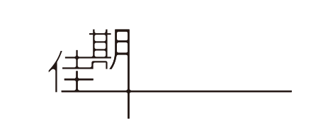

# 支持单位

本课程得到了以下单位的大力支持：

## 佳期投资

[{ .sponsor-logo }](https://www.jqinvestments.com/){ target="_blank" }

佳期投资为本课程提供了硬件支持。

!!! quote "来自佳期投资的一封信"

    各位 HPC 101 的同学：

    你们好！很高兴通过这次课程认识你们。

    这个夏天，佳期有幸支持了浙江大学 HPC 101 超算短学期课程。当得知课程安排的时候，我们能感觉到这两周的分量——从底层原理到动手实践，从理解硬件到完成真正的性能调优，节奏紧凑但每一步都很扎实。这种愿意扎进细节、把问题琢磨透的过程，也是我们在日常工作中很熟悉、很珍惜的一种状态。

    佳期投资是一家管理规模 700 亿 + 人民币的量化对冲基金，十多年来，我们持续通过高性能计算、大规模数据分析和系统化研究驱动量化投资。我们的日常工作，其实和你们在 HPC 101 里做的事情有不少共通之处：打磨算力与存储的效率，追求快速验证、即时反馈，用好的系统能力托举更前沿的研究。这些问题，我们乐于投入时间去钻研。如果你会为把硬件利用率逼近上限而兴奋，会因一次调优让程序快了不止一点点而开心，那这份快乐，和我们在真实市场里追求的东西是相通的。

    希望这个暑假，你们能沉下心、多实践、多探索，也别怕试错。每一次解决问题的过程，都会成为成长最扎实的积累。这些经历，比任何一份报告都更有价值。期待未来与你们在佳期再次相见！

    祝暑期学习顺利！

    —— 佳期投资

## 趋境科技 Approaching.AI

[{ .sponsor-logo }](https://approaching-ai.com/){ target="_blank" }

趋境科技为本课程提供了 `glm-5.2` 模型的 Token 支持。

!!! quote "趋境科技"
    趋境科技成立于 2023 年，源自清华大学高性能计算所，致力于提供高性能专属推理解决方案，助力人工智能产业降本增效。趋境立足系统级原始创新，通过全系统异构协同、以存换算等全球首创技术助力国产算力硬件缩小与国际领先水平的差距，为解决大模型算力难题贡献了重要的“中国方案”。趋境推理优化方案被誉为“AI 时代的操作系统”，被广泛应用于头部企业万卡智算集群，并推动国家与行业标准制定，推动国产 AI 基础设施向高效、自主、可持续方向发展。

## 华为

[{ .sponsor-logo }](https://www.huawei.com/cn/){ target="_blank" }

华为为本课程提供了硬件和部分课程内容支持。

## 浙江大学信息技术中心

[{ .sponsor-logo }](https://itc.zju.edu.cn/){ target="_blank" }

浙江大学信息技术中心为本课程提供了硬件支持。
